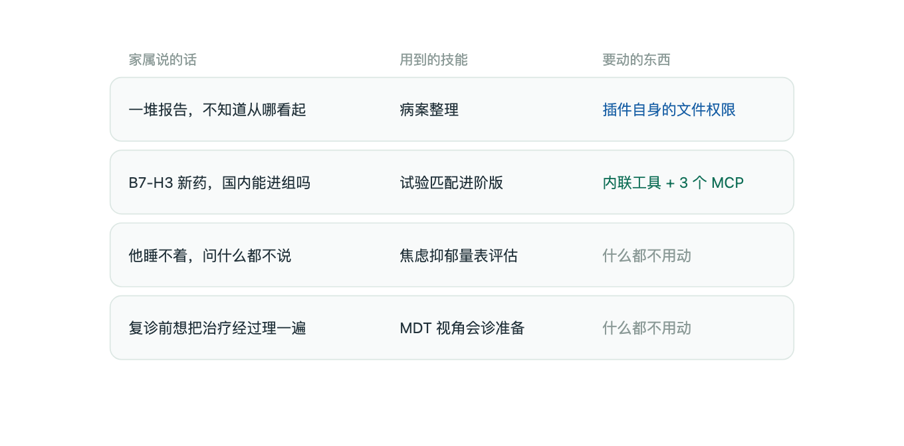
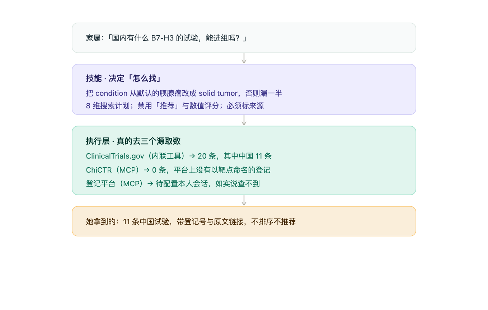

<div align="center">


# 小胰宝

### 面向肿瘤患者及家属的本地优先 AI 桌面工作台

**把病例资料、AI 助手、用药/报告/康复流程，装进一个长期可用的桌面环境。**

本地优先 · 模型自由 · 插件驱动 · macOS / Windows / Linux

<br />

[](https://github.com/vastsa/PI-Desktop/releases/latest)
[](https://github.com/vastsa/PI-Desktop/releases)
[](https://github.com/vastsa/PI-Desktop/stargazers)
[](https://github.com/vastsa/PI-Desktop/actions/workflows/ci.yml)
[](LICENSE)
[](https://www.reddit.com/r/AIUO/)
[](https://qm.qq.com/q/iWP8i0XxIc)

<br />

**[立即下载](https://github.com/vastsa/PI-Desktop/releases/latest)** ·
[使用文档](https://pi-docs.aiuo.net/) ·
[插件开发](docs/plugin-development.md) ·
[扩展开发规范](XYB-EXTENSIONS.md) ·
[界面预览](docs/guide/screenshots.md) ·
[English](README.md)

<br />


<br />

**你的项目留在本地 · 你的模型由你选择 · 你的工作台由你组装**

</div>

---

## 给社区加能力：插件 / 技能 / MCP

**先读 [`XYB-EXTENSIONS.md`](XYB-EXTENSIONS.md)** —— 这是本 fork 的扩展开发规范，可以整份交给你的 AI agent 去执行：通道怎么选、权限红线、开箱即用与安装包体积的规则、提交前必须过的门禁。

| 通道 | 放哪里 | 进安装包吗 |
| --- | --- | --- |
| **技能**（提示层） | `apps/desktop/resources/skills/*.md`，或插件里的 `skills/*.md` | **进** —— 一个技能只有几十 KB |
| **插件** | `apps/desktop/resources/plugins/**`（内置），或插件市场（用户按需安装） | 只进基线能力 |
| **MCP 服务** | 在插件 `manifest.json` 的 `contributes.mcpServers` 里声明 | 只进声明，服务运行时永不进包 |

### 数据源分工（谁负责检索、谁负责详情）

| 角色 | 承担者 | 前置 | 说明 |
| --- | --- | --- | --- |
| 关键词 / 条件检索（**主力**） | **ClinicalTrials.gov API v2** | 无 | 有真正的检索接口，权威、实时、免费 |
| 中文注册库检索 | **ChiCTR**（+ 中国药物临床试验登记平台） | ChiCTR 首次需联网拉包；登记平台需本人浏览器会话 | 中文试验主要登记在这两处 |
| 按标识取详情 / 交叉对照 | **Veeva CTV GraphQL** | 无 | 匿名可用（实测约 1s、37 字段），零前置 |
| 补充字段增强 | Veeva CTV | 无（详情直查） | 提供 CSV 导出里没有的纳排标准、关键词、分组、MeSH |
| 变更监控与提醒 | Veeva CTV watchlist + 本地索引 | 需先建本地库 | 判断"有没有更新"必须有历史状态 |
| 本地子集检索（**仅作补充**） | Veeva 本地索引 | 需先建库，且**必须声明覆盖度** | 结果须带「索引仅覆盖 N 条 / 截至日期」；0 命中不得表述为"没有相关试验" |

上游规范：[`docs/plugin-development.md`](docs/plugin-development.md)（zero-to-one，§6.2 技能、§6.9 MCP）与 [`docs/spec/07-plugins/`](docs/spec/07-plugins/)（契约，建议先看 [`13-plugin-permissions-matrix.md`](docs/spec/07-plugins/13-plugin-permissions-matrix.md)）。本 fork 的实测记录：[`XYB-SKILLHUB.md`](XYB-SKILLHUB.md)、[`XYB-TRIAL-SOURCES.md`](XYB-TRIAL-SOURCES.md)。

## 面向肿瘤患者与家属的 Skills

小胰宝内置了一组围绕患者与家属真实需求设计的技能，而不是通用的 Agent 演示。

<table>
<tr>

<td width="33%" valign="top">

### 我的资料

`xyb.records`

把病理、影像与化验报告归到**本地**文件夹，并整理成一份白话摘要，自己看得懂，也能拿给别人看。

</td>

<td width="33%" valign="top">

### 找试验

`xyb.trials`

按自己的实际情况检索公开临床试验——治疗线数、用过的药、基因标志物——给出登记编号、招募状态和原文链接。

</td>

<td width="33%" valign="top">

### 看进展

`xyb.news`

汇集近期的药物与研究条目。只列标题、来源与日期，每条都能点回原文。

</td>

</tr>
</table>

这些技能都是**一份纯 Markdown 文档**，由助手按需加载，并可选配右侧工作面板里的界面。你可以直接读、改，或换成自己的。

**这些技能不会越过的边界：**

- **本地优先** —— 资料只存在你自己的电脑上，不建账号、不上云
- **发送前脱敏** —— 姓名、电话、医院名在进入模型之前就被隐藏
- **来源可溯** —— 每条试验与进展都带原文链接和获取日期
- **不做医疗判断** —— 不出诊断、不推荐用药、不做医院或医生排名

---

## 能力说明书

上面三块是**开箱可用**的。小胰宝一共装了 **8 个插件、17 个技能、3 个本机数据源服务**，
下面逐条写清「能做什么、什么时候用、需要先准备什么、来自哪里」。

### 一、开箱可用（无需任何配置）

| 面板 | 插件 | 能做什么 | 什么时候用 |
|---|---|---|---|
| 我的资料 | `xyb.records` | 把病理、影像、化验报告归集到本地文件夹，生成白话摘要 | 报告散落各处，想理成一册 |
| 找试验 | `xyb.trials` | 检索 ClinicalTrials.gov，按治疗线数、用过的药、标志物匹配 | 想看看有什么在招的试验 |
| 看进展 | `xyb.news` | 汇集近期药物与研究条目，只列标题、来源、日期 | 想知道最近有什么新东西 |
| 智能助手 | `xyb.assistants` | 9 个患者向助手技能（见下一节） | 见下表 |
| 文件管理器 / 浏览器 | `pi.file-manager` `pi.browser` | 工作台自带的文件与网页工具 | 要看本地文件或查网页 |

### 二、智能助手：9 个患者向技能

| 技能 | 什么时候用 |
|---|---|
| 病历助手 | 拿到病理报告、出院小结，想搞懂上面写了什么 |
| 影像助手 | 看 CT / MRI / PET 报告，想理解描述与结论 |
| 基因解读助手 | 拿到 NGS 报告，想知道突变意味着什么、有没有对应方向 |
| 病理助手 | 看免疫组化、分子病理指标 |
| 决策辅助助手 | 在几个方案之间比，想要一张清晰的权衡表 |
| 营养支持助手 | 吃不下、体重掉，想知道怎么吃 |
| 心理支持助手 | 情绪难熬，想找个人把话理一理 |
| 并发症助手 | 出现疼痛、黄疸、腹水等情况，想了解怎么回事 |
| MDT 视角会诊准备 | 复诊前想按多学科角度把材料理一遍 |

> 这些助手只做**结构化整理与解释**：不诊断、不建议用药、不评价医院或医生。
> 每个技能都是一份 Markdown 文档，你可以直接读、改，或换成自己的。

### 三、中国与区域试验来源（需显式启用）

这个插件要**单独授权**：它声明了 `mcp.server.local`，也就是允许拉起本机进程。
不想要本地进程的可以一直不启用，前面几块不受影响。

| 数据源 | 覆盖 | 场景 | 需要先准备 |
|---|---|---|---|
| ChiCTR 中国临床试验注册中心 | 中国注册试验（含研究者发起的 IIT） | 找只在境内注册、未上 ClinicalTrials.gov 的试验 | 首次联网拉取 npm 包；依赖 Playwright Chromium（约 570MB） |
| Veeva CTV | 全球研究库，可筛 China | 想看跨国药企的全球研究布局 | 本机需已安装 `ctv-mcp-server`，且**必须先建本地索引** |
| 中国药物临床试验登记与信息公示平台 | 中国药物注册试验 | 查 CTR 编号、国内药物注册试验详情 | 需 Python 3（助手可一键准备依赖）；**必须由本人从浏览器提供会话** |

> 站点的验证码与反爬一律不绕过。会话过期就如实说查不到，让人工重新提供。
> 拿不到来源时明说「这一处没查到」，不用别的来源顶上。

### 四、外部接入技能（来自 opencare-skillhub）

这 4 个不是小胰宝自研，装在 `xyb.skillpack` 里。**启用插件即可用**，不需要额外配置。

| 技能 | 能做什么 | 可用程度 |
|---|---|---|
| 试验匹配进阶版 | 8 维搜索计划、双源检索、入排逐条比对、R1–R5 规则、0 匹配替代策略 | 可完整使用 |
| 病案整理 | 六步流程 + 11 类分类体系 + 时间线 + 信息缺口提示 | 方法论层（需本机 OCR / 转写工具） |
| 焦虑抑郁量表评估 | HADS 焦虑与抑郁两维筛查、分级与转介建议、自伤危机处理 | 可完整使用（全程本机） |
| 肿瘤标志物趋势 | CA19-9 / CEA / AFP 等历次数值整理成趋势表与解读边界 | 方法论层（上游需 `xyb` CLI） |

**「可用程度」是诚实标注**：标「方法论层」的，表示它在本机只能提供流程与方法；
需要外接工具的那一步会如实说明暂不具备，**不会假装已经跑完**。

### 五、依赖总览：什么会拦住你

| 依赖 | 影响 | 怎么准备 |
|---|---|---|
| 无 | 我的资料 / 找试验 / 看进展 / 智能助手 / 外部技能 | 开箱可用 |
| 启用 `xyb.trial-sources` | 三个中国数据源 | 在插件页显式启用（即授予本地进程权限） |
| 联网 + Playwright Chromium（约 570MB） | ChiCTR 检索 | 首次使用时拉取 |
| 本机 `ctv-mcp-server` + 本地索引 | Veeva CTV 检索 | 需自行安装并建索引，否则返回 `INDEX_EMPTY`（不是「没有相关研究」） |
| Python 3 | 中国药物临床试验登记平台 | 助手可代劳依赖安装；**Python 本体需自行安装** |
| 本人浏览器会话 | 同上 | 对站内搜索请求「复制为 cURL」交给助手保存；过期需重新提供 |

> 抓取类是**逐条**进行的（每条约 1.5 秒间隔），条数多时是分钟级，不是查缓存。

### 附：这些能力是怎么分层的

看懂下面这个分层，就知道**什么时候什么都不用做，什么时候需要配置**。



四件家属最常做的事里，**三件只用到技能**——不联网、不配置、不授权。
只有真要取外部数据时才动执行层。



上面这张是实测的一次检索（B7-H3，中国在招募）。三层里影响结果质量最大的，
反而是最轻的技能层：把默认病种从胰腺癌改成 `solid tumor`，结果从 6 条变成 20 条。

### 六、原项目与来源

| 部分 | 来源 |
|---|---|
| 上游底座 | [vastsa/PI-Desktop](https://github.com/vastsa/PI-Desktop)（LGPL-3.0） |
| 小胰宝定制 | [PancrePal-xiaoyibao/xyb-pi-agent](https://github.com/PancrePal-xiaoyibao/xyb-pi-agent) |
| ChiCTR MCP 服务 | [chictr-mcp-server](https://www.npmjs.com/package/chictr-mcp-server)（Apache-2.0） |
| 中国药物临床试验登记采集器 | [PancrePal-xiaoyibao/chinadrugtrials-collector](https://github.com/PancrePal-xiaoyibao/chinadrugtrials-collector) |
| 试验匹配进阶版 | [opencare-skillhub/clinical-trial-matching](https://github.com/opencare-skillhub/clinical-trial-matching) |
| 病案整理 | [opencare-skillhub/Medical-Record-Organizer](https://github.com/opencare-skillhub/Medical-Record-Organizer) |
| 焦虑抑郁量表评估 | [opencare-skillhub/skill-HADS-accessment](https://github.com/opencare-skillhub/skill-HADS-accessment) |
| 肿瘤标志物趋势 | [opencare-skillhub/graphify-xiaoyibao](https://github.com/opencare-skillhub/graphify-xiaoyibao)（**AGPL-3.0**） |
| Veeva CTV 服务 | 未发布 npm，需本机自备 |

外部技能的许可以各自仓库为准。其中 `graphify-xiaoyibao` 是 AGPL-3.0（强 copyleft），
小胰宝内是独立改写、未内联其代码；若日后转为公开分发，需按 AGPL 处理。

---

## 为什么是 PI-Desktop？

终端 Agent 擅长执行，IDE Agent 擅长嵌入编辑器。

PI-Desktop 想做得更进一步：

> **给 AI Agent 一个独立、长期、可扩展的桌面工作空间。**

<table>
<tr>

<td width="25%" valign="top">

### 独立工作台

不依附某个 IDE 或 Terminal。

Project、Session、Review、Preview 与 Agent 都有自己的空间。

</td>

<td width="25%" valign="top">

### 插件驱动

插件扩展的不只是 Agent。

面板、视图、Widget、Tool、MCP、主题与后台服务都可以插件化。

</td>

<td width="25%" valign="top">

### Agent 编排

一个 Agent 不够，就拆开做。

Subagent 与 Worker Session 可以承担独立任务并行工作。

</td>

<td width="25%" valign="top">

### 模型自由

云端、本地、自建网关、Compatible API。

模型随时换，工作流不用换。

</td>

</tr>
</table>

<div align="center">

**它不是某个模型的壳，也不是某个 IDE 的插件。**

### 它是承载 Agent 工作流的桌面平台。

</div>

> [!NOTE]
> **PI-Desktop 目前仍处于 Early Preview。** 已可用于真实开发工作流，部分 API、插件接口与桌面能力仍在持续演进。

> **当前发布线：0.16.x（Early Preview）。**

---

## 插件不是附加功能，而是工作台的一部分

PI-Desktop 的 Core 负责提供稳定底座。

**真正属于你的工作流，由插件组合出来。**

<table>
<tr>

<td width="33%" valign="top">

### Agent

扩展 Agent 能力

**Agent Tools**
**Skills**
**Completion**
**pi Extensions**

</td>

<td width="33%" valign="top">

### Workspace

扩展整个桌面

**Commands**
**Panels**
**Work Panel Views**
**Floating Widgets**
**Themes**

</td>

<td width="33%" valign="top">

### Platform

扩展运行平台

**MCP Servers**
**Resident Services**
**Plugin Message Bus**

</td>

</tr>
</table>

插件不必只是“给 Agent 多加一个 Tool”。

它可以是一整个产品：

```text
Voice Agent
├── Floating Widget
├── Speech Service
├── Agent Tool
└── Commands

GitHub Workspace
├── Work Panel
├── MCP Server
├── Agent Tools
└── Background Service

Session Analytics
├── Dashboard
├── Commands
└── Workspace View
```

### 插件能做什么？

| 能力                  | 用途                  |
| ------------------- | ------------------- |
| **Command**         | 向全局命令系统添加操作         |
| **Panel**           | 创建独立插件界面            |
| **Floating Widget** | 创建语音球、状态窗、计时器等悬浮界面  |
| **Work Panel View** | 向右侧工作区加入新视图         |
| **Agent Tool**      | 注册 Agent 可调用工具      |
| **Completion**      | 调用用户已经配置的模型         |
| **Skill**           | 为 Agent 提供可复用能力与工作流 |
| **Theme**           | 修改工作台视觉             |
| **MCP Server**      | 接入本地或远程 MCP         |
| **Service**         | 运行常驻后台任务            |
| **Message Bus**     | 在插件之间传递消息           |

插件可以通过 `.piplug` 分发，也可以从插件市场安装。

<div align="center">

### [开发一个插件 →](docs/plugin-development.md)

</div>

---

## 一个底座，组装不同的工作流

```text
                         PI-Desktop
                             │
          ┌──────────────────┼──────────────────┐
          │                  │                  │
        Agent            Workspace           Platform
          │                  │                  │
     Agent Tools           Panels              MCP
       Skills             Widgets            Services
     Subagents             Views            Message Bus
   pi Extensions          Themes
          │                  │                  │
          └──────────────────┼──────────────────┘
                             │
                       Your Workflow
```

PI-Desktop 可以只是一个 Coding Agent。

也可以被组装成：

**AI 开发工作台 · Voice Agent · DevOps Console · GitHub Workspace · 数据分析助手 · 多 Agent 调度中心 · 自动化平台**

> **Core 提供底座，插件决定它最终长什么样。**

---

## 三种工作方式

<table>
<tr>

<td width="33%" valign="top">

### Agent

**你给任务，它直接做。**

读代码、改文件、跑命令、测试、持续迭代。

适合日常开发。

</td>

<td width="33%" valign="top">

### Plan

**它先给方案，你确认后再执行。**

先研究项目，再生成实施计划。

适合重构与高风险修改。

</td>

<td width="33%" valign="top">

### Goal

**你定义结果，它决定路径。**

锁定目标与验收条件，其余交给 Agent。

适合复杂与长期任务。

</td>

</tr>
</table>

高权限操作始终经过 PI-Desktop 的 Permission Layer。

---

## 一个 Agent 不够，就拆开做

复杂任务不应该全部挤在一个 Context 里。

PI-Desktop 提供两层任务拆分能力。

### Subagents

把独立工作交给后台 Agent：

**代码调查 · 独立实现 · 测试分析 · Research · Review**

每个 Subagent 拥有独立 Context，完成后将结果返回主 Agent。

### Session Orchestrator

需要更完整、更长期的并行任务时，可以继续拆成多个 Worker Session。

```text
Main Session
│
├── Worker A
│   └── Frontend
│
├── Worker B
│   └── Backend
│
├── Worker C
│   └── Tests
│
└── Worker D
    └── Review
```

Worker 是完整的 PI-Desktop Session：

**独立 Context · 独立运行 · 可直接查看 · 可持续接受任务 · 保留完整 Transcript**

<table>
<tr>

<td width="50%">


<p align="center"><sub>一个 Session 编排多个 Worker</sub></p>

</td>

<td width="50%">


<p align="center"><sub>每个 Worker 都是完整、可查看的 Session</sub></p>

</td>

</tr>
</table>

<div align="center">

**从「一个 Agent 帮我写代码」，走向「多个 Agent 分工完成任务」。**

</div>

---

## 为持续工作而设计

PI-Desktop 围绕：

<div align="center">

### Project → Session → Agent → Work

</div>

而不是围绕一次性聊天窗口设计。

支持：

* 多 Project / 多 Session
* Pin / Archive / Branch / Search
* Agent 运行时继续 Queue Prompt
* 使用 `@` 引用项目文件
* Slash Commands
* Diff Review
* Command Output
* Work Panel
* Streaming Checkpoint
* 异常后尽可能恢复任务现场

**Session 可以跨多次启动持续工作。**

---

## 看见 Agent 在做什么

<table>
<tr>

<td width="50%">


<p align="center"><sub>长期 Session，而不是一次性对话</sub></p>

</td>

<td width="50%">


<p align="center"><sub>在 Session 中直接切换模型与推理等级</sub></p>

</td>

</tr>

<tr>

<td width="50%">


<p align="center"><sub>插件市场：扩展 Agent，也扩展整个桌面</sub></p>

</td>

<td width="50%">


<p align="center"><sub>连接 Provider、Gateway 或本地模型</sub></p>

</td>

</tr>
</table>

<div align="center">

**[查看更多界面 →](docs/guide/screenshots.md)**

</div>

---

## 模型可以换，工作流不用换

PI-Desktop 不把 Agent 工作流绑定到某一家模型厂商。

支持：

**OpenAI · Anthropic · OpenAI Compatible API · 自建 Gateway · Ollama · LM Studio · Local Model**

每个模型都可以独立配置：

**Provider · Model ID · Context Window · 最大输出 · Reasoning / Thinking · Temperature · OAuth · API Key · Endpoint**

不同 Session 可以使用不同模型。

同一个 Session 也可以随时切换。

```text
Planning     → Model A
Coding       → Model B
Review       → Model C
Private Task → Local Model
```

> **模型是可以替换的组件，而不是工作流本身。**

---

## 已经在用其他 Coding Agent？

已有工作不需要从零开始。

PI-Desktop 可以导入本地 Session：

**Claude Code · Codex · OpenCode · Pi**

---

## Local-first

PI-Desktop 不要求你把开发环境搬到我们的云端。

| 数据                   | 默认行为               |
| -------------------- | ------------------ |
| Project              | 本地                 |
| Session              | 本地                 |
| Settings             | 本地                 |
| Logs                 | 本地                 |
| API Credentials      | OS Keychain        |
| PI-Desktop Telemetry | 无                  |
| Model Request        | 直接发送到你配置的 Provider |

**无需 PI-Desktop 账号。**

**无需经过 PI-Desktop 云端 Relay。**

使用远程模型时，请求所需 Context 会直接发送给对应 Provider。

---

## 权限属于你

Agent 可以读取文件、修改代码、运行命令、调用 Tool、使用扩展和委派任务。

高权限操作仍然经过 Permission Layer：

```text
Agent
  ↓
Tool Request
  ↓
Permission Layer
  ↓
Allow / Ask / Deny
  ↓
Execution
```

**你决定每个 Session 拥有多少自主权。**

---

## 开始使用

<table>
<tr>

<td width="25%" valign="top">

### 01

**下载**

安装 PI-Desktop

</td>

<td width="25%" valign="top">

### 02

**连接模型**

配置 Provider

</td>

<td width="25%" valign="top">

### 03

**打开项目**

选择本地 Repository

</td>

<td width="25%" valign="top">

### 04

**开始工作**

Agent / Plan / Goal

</td>

</tr>
</table>

<div align="center">

### [下载 PI-Desktop →](https://github.com/vastsa/PI-Desktop/releases/latest)

**macOS · Windows · Linux**

</div>

### 安装包

| Platform | Architecture  | Package                                 |
| -------- | ------------- | --------------------------------------- |
| macOS    | Apple Silicon | `.dmg` / `.zip`                         |
| macOS    | Intel         | `.dmg` / `.zip`                         |
| Windows  | x64           | 安装程序 / `.zip`                       |
| Linux    | x64           | `.AppImage` / `.deb` / `.rpm` / `.asar` |

macOS Release 使用 Developer ID 签名并经过 Apple Notarization。

<details>
<summary><strong>Linux Compatibility</strong></summary>

<br />

Linux x64 需要 **glibc 2.35+**。

常见支持版本：

* Ubuntu 22.04+
* Debian 12+
* Fedora 36+

检查当前版本：

```bash
ldd --version
```

</details>

---

## Built on Pi

PI-Desktop 构建在 [pi](https://github.com/badlogic/pi-mono) 生态之上。

Agent Runtime 使用：

* `pi-ai`
* `pi-agent-core`

> **Pi 提供 Agent Engine，PI-Desktop 在其上构建 Desktop Workspace、Session、权限、插件与 Agent 编排。**

---

## 开发者

PI-Desktop 也可以作为开发者构建 Agent 产品的宿主平台。

你可以开发：

**Plugin · MCP Server · Skill · Agent Tool · pi Extension · Theme · Panel · Floating Widget · Background Service**

### 插件快速开始

内置模板：

* `panel-basic`
* `agent-tool-basic`
* `skill-pack`
* `full-demo`

创建完成后即可作为 Development Plugin 加载。

**[Plugin Development Guide →](docs/plugin-development.md)**

### 从源码运行

<details>
<summary><strong>Development Setup</strong></summary>

<br />

#### Requirements

* Node.js `>=22.19`
* pnpm `>=10`
* Stable Rust Toolchain

#### Start

```bash
git clone https://github.com/vastsa/PI-Desktop.git
cd PI-Desktop

pnpm install

cargo build -p host-core
pnpm build:js

pnpm dev
```

#### Validate

```bash
pnpm typecheck
pnpm lint
pnpm test
```

</details>

### 文档

[Documentation](https://pi-docs.aiuo.net/) ·
[Architecture](docs/spec/02-architecture/01-architecture.md) ·
[Specification](docs/spec/README.md) ·
[Plugin Development](docs/plugin-development.md) ·
[E2E Test Plan](docs/spec/06-delivery/04-e2e-test-plan.md) ·
[Release Runbook](docs/spec/06-delivery/06-release-runbook.md) ·
[AGENTS.md](AGENTS.md)

---

## Contributing

欢迎：

**Issues · Pull Requests · Plugins · Skills · MCP Integrations · Documentation · Translations**

对于相对独立的新能力，优先考虑一个问题：

> **它是否更适合作为一个 Plugin？**

让 Core 保持克制，让生态持续生长。

**[提交 Issue](https://github.com/vastsa/PI-Desktop/issues/new/choose)** ·
[查看 Issues](https://github.com/vastsa/PI-Desktop/issues) ·
[开发插件](docs/plugin-development.md)

---

## 项目趋势

<div align="center">

<a href="https://trendshift.io/repositories/178787?utm_source=repository-badge&amp;utm_medium=badge&amp;utm_campaign=badge-repository-178787">

</a>

</div>

---

## 友情链接

[Linux.Do](https://linux.do/) — 新的理想型社区

---

## Model Acknowledgements

> **Not by a lone genius, but by a token-powered construction crew.**

PI-Desktop 的开发过程中使用了来自多个 Provider 的模型。

累计模型使用量已超过 **27 Billion Tokens**。

感谢参与构建 PI-Desktop 的每一位贡献者，以及陪我们一起写下这些代码的模型。

---

## License

PI-Desktop 使用 **GNU Lesser General Public License v3.0**。

详见 [LICENSE](LICENSE)。

---

<div align="center">


## 小胰宝

### Build your own Agent workspace.

**你的模型 · 你的 Agent · 你的插件 · 你的工作台**

<br />

**[立即下载](https://github.com/vastsa/PI-Desktop/releases/latest)** ·
[Documentation](https://pi-docs.aiuo.net/) ·
[Build a Plugin](docs/plugin-development.md)

<br /><br />

<sub>Local-first · Model-agnostic · Plugin-powered</sub>

</div>
