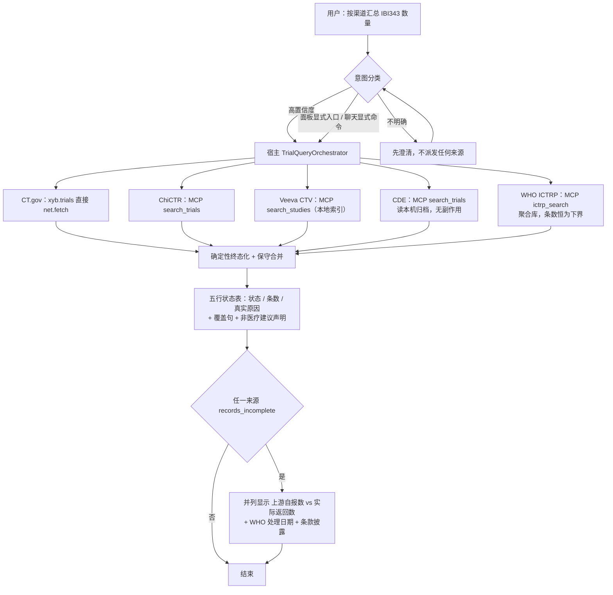
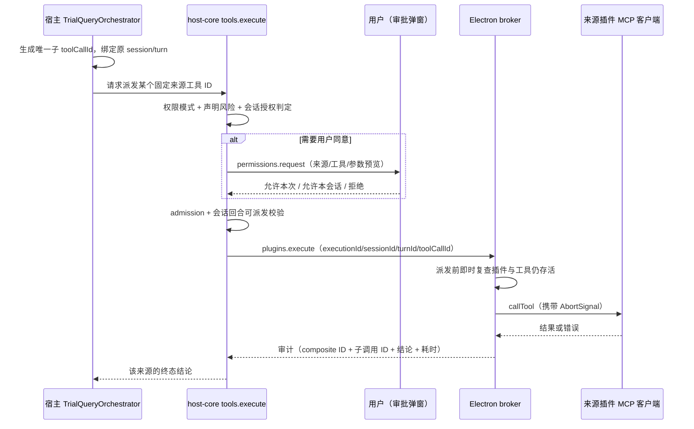
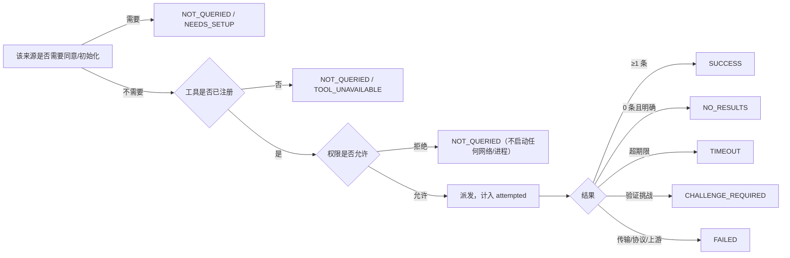

# 统一试验查询：宿主编排实现 SPEC

- 状态：草案，待技术/用户批准；**尚未授权实现**
- 日期：2026-10-04
- 架构依据：ADR 0311（方向已接受）
- 目标分支/工作树：`fix/xyb-records-audit-main`，路径 `/Users/qinxiaoqiang/Downloads/xiaoyibao-pi-desktop-fix-records-audit`

## 1. 目标与非目标

建立一个**由宿主自有**的临床试验查询操作，供聊天与面板显式入口共用。一旦触发，它会按照「权限中介」的宿主路径逐个尝试每个合格来源，为每个合格来源返回结构化结果，隔离局部失败，并让宿主界面准确说明本次到底跑了什么。

自然语言路由本身必然不完备：高置信度可直接路由；意图不明确时必须先澄清；显式查询入口绕开分类。本功能**不承诺**能识别任意说法。

本文是草案。**在用户明确批准本 SPEC 之前，不开始任何宿主实现。** 接受 ADR 只代表同意架构方向，不代表授权改代码。

非目标：重写采集器、对检索列表页做浏览器抓取、绕过验证码或登录、自动执行环境安装/Cookie 获取、给出临床建议、未经授权安装依赖、未经单独授权提交/推送/合并。

## 2. 证据与架构约束

来源为：ClinicalTrials.gov（`xyb.trials`，直接 `net.fetch`）、ChiCTR、Veeva CTV、中国药物临床试验登记平台、WHO ICTRP（后四者是 `xyb.trial-sources` 自有的 MCP 服务器）。

> **修订记录（2026-10-04）：** WHO ICTRP 于 2026-10-04 由用户确定作为第 5 个来源接入，集成方式见 §15。本 SPEC 其余章节中原写为「四来源」的表述，除历史实测证据（§2.1）外，均应理解为「五来源」。

### 2.1 dev app 实测证据（2026-10-03/04，会话 `960381b1`）

同一句请求“查询下ibi343临床试验信息数量，按照渠道-数量输出结果”的两次运行：

- 运行 A（23:16:36–23:17:09）：`Skill` 加载 → 5× `ToolSearch` → CT.gov 成功 880ms → ChiCTR 455ms 失败（`NETWORK_ERROR`：`browserContext.newPage: Target page, context or browser has been closed`）→ Veeva 成功（MCP 254ms / 工具 7318ms）→ `chinadrugtrials_get_collector_status` 成功 → 回合随即结束，状态表写“中国药物临床试验登记平台 NOT_ENABLED — 本工具未在当前上下文就绪；本次未查到”。**`xyb_trials_unify` 从未被调用。**
- 运行 B（23:18:52–23:19:48）：用户追问“这个不是本地有json文件吗”，随后手打 `search_trials`；助手才调用 `get_collector_status`（`ok=true`，305ms）再调用 `search_trials`（`ok=true`，MCP 8606ms / 工具 12060ms），得到 5 条 CTR 记录——这才是正确结果。

由此暴露三个缺陷，各自对应本 SPEC 的改动：

1. **是收尾缺陷，不是取数缺陷。** 所有真正跑过的渠道都返回 `ok=true`；composite 在一个来源 `NOT_ENABLED` 的状态下静默停止，且没有做聚合。用户之所以拿到正确答案，唯一原因是他自己补上了缺失的工具名。§4.1/§5 必须把“所有合格来源都被尝试 + 确定性终态化”变成**宿主操作自身的属性**，而不是指望助手自觉遵守。
2. **`NOT_ENABLED` 与事实不符。** CDE 当时是启用的、可达的，采集器也可用；真实原因是“工具不在当前上下文”（工具发现/目录问题）。因此本 SPEC 要求该类情况必须报 `NOT_QUERIED / TOOL_UNAVAILABLE` 或 `NEEDS_SETUP`，**禁止把“未启用”当作默认标签**。
3. **CDE 并不需要原先担心的交互式准备。** 在用户环境已就绪的前提下，`search_trials` 单次调用即成功（8606ms）。每次检索确实会产生本地归档副作用，但实际操作摩擦远低于“重新登录”。原设计据此把 CDE 排除在静默扇出之外、要求每次同意；**该设计已被用户否定**（见 §4.3 修订记录）：写盘不是破坏性操作，且每次同意会重新制造“用户被迫手打工具名”的失败模式。现行为 **CDE 随包带冷启动数据、读本机归档无副作用、与其他三源同等纳入扇出**（§7）。

其他实测证据：

- ChiCTR 在本机间歇性不稳。2026-10-03/04 期间 `chictr/search_trials` 在成功（6.9–11.3s）与失败（24/48/408/437ms，`browserContext.newPage … has been closed`）之间交替。Playwright 缓存目录（`chromium-1243`、`chromium_headless_shell-1243`）当时存在，并于 10-04 06:15 重新下载。宿主记录的 `errorCode` 是 `TOOL_FAILED`，内层 `code` 为 `NETWORK_ERROR`。跨相邻运行的直接重试确实成功（22:36:06 失败 → 22:44:54 运行 → 22:45:13 成功）。这是 §4.4 有界重试策略的具体依据。
- 宿主日志里 CT.gov 结果数为 5，用户看到的表格也是 5，但 `xyb.trials_search` 的 `pageSize`/上限由调用方给出，且 details 里有 `dropped` 字段；在未报告截断的情况下，条数只能算**下界**。§5.3 要求显式 `truncated` 标志。
- Veeva 的 MCP 调用仅 254ms，但工具调用耗时 7318ms；其 2 条命中（`NCT07066098`、`NCT07483554`）与 CT.gov 结果完全重复。Veeva 是本地索引，增加延迟，且本次没有带来新的登记号；§4.3 保留它，但要求按 §5.2 标注本地索引来源与新鲜度。
- ChiCTR 的 `search_trials` 实际以 `{keyword, max_results}` 调用，而 CT.gov 与 Veeva 用 `{condition, terms}`。**跨来源的参数映射不能交给模型**，应由宿主来源注册表负责（§4.1、§5.1）。

### 2.2 宿主与权限约束

- 插件 SDK **没有**跨插件调用 MCP 的能力。面板自定义 bridge 调用只会转发给来源插件自己的 `onPanelInvoke`。
- `apps/desktop/electron/main/plugin-runtime.ts:3500-3599` 在注册插件 MCP 服务器前，会检查来源插件权限、HTTP 出网白名单、插件自有配置引用与重定向策略；MCP 工具写入宿主 `this.tools` 注册表，`risk: "medium"`，其 execute 闭包使用该插件自己的 MCP 客户端与会话取消登记表。
- **直接调用已注册的 execute 闭包是不够的**：模型的普通调用会经过 host-core `tools.execute`，由它执行权限模式、单次审批、admission、会话/回合可派发校验、取消与审计（`crates/host-core/src/rpc/mod.rs:3410-3900`）。直接回调或直接调 MCP 客户端会绕过其中一部分策略。目前未发现 Electron 主进程同步嵌套调用 `tools.execute` 的通路。
- 插件 MCP 的风险语义：`ask` 下 medium 需审批；`auto` 可自动放行；`accept-edits` **不会**自动放行 medium。已有授权按工具名作用域生效（`crates/host-core/src/permissions.rs:122-135, 245-264`）。**“来源插件已启用”不等于“本次调用已获同意”。**
- CDE 的 `search_trials` 会发起外部请求，并把原始 HTML、JSON、Word 归档到本机。它依赖 Python 与依赖项以及用户自己的浏览器会话 cURL；**不得隐式执行** `setup_environment`、`update_cookie`、`refresh_cookie`。
- 实测延迟：ChiCTR 约 9.9–12.7s，CDE 约 8s。CDE 抓取子进程最长可跑 30 分钟，且缺少请求级 AbortSignal 传播。

## 3. 总体流程

### 3.1 端到端主流程



对应 §4.1（共用宿主操作）、§4.3（来源纳入与否）、§5（契约）、§10「契约、UI 与验证」第 3 条（渲染）、§15（WHO ICTRP）。

> **修订记录（2026-10-04）：** 本图原先画的是 CDE「静默扇出不派发 → 返回 NOT_QUERIED / 需要同意」，并在末尾接一个「CDE 归档是否为空」的补派发分支。该流程已在 §4.3 被否定（用户理由：写盘不是破坏性操作、每次同意会重新制造“用户被迫手打工具名”的失败模式），但本图未同步。本次一并修正为「CDE 与其余来源同等纳入扇出」，并加入第 5 个来源 WHO ICTRP 与不完整性呈现分支。

### 3.2 单个子来源的权限中介派发



禁止路径：`O` 直接调 `RegisteredPluginTool.execute`，或直接调 `McpServerClient.callTool`——都会绕过 `HC` 这一段（§4.2、§10「权限与执行」第 6 条）。

### 3.3 单来源终态判定顺序



**只有 `SUCCESS` 与 `NO_RESULTS` 算“查过”**；其余状态都不能被读者当成“零结果”（§5.2）。

### 3.4 用户可见的必需行为

1. 被识别或被显式发起的试验查询，调用**同一个**宿主操作，而不是四次由模型自行挑选的调用。
2. 该操作会尝试当前启用、已就绪、已获单次授权与同意的**每一个**合格来源；但不承诺每个来源都合格或成功。
3. 每一份终态结果都恰好包含五个按序排列的来源结论。`NO_RESULTS` 表示“查过且为零”，绝不用于未运行、不可用或失败的来源。
4. 聊天与面板呈现**同一套**覆盖/状态契约；宿主渲染的状态为准，助手措辞不得覆盖它。
5. 意图不明确时先澄清，澄清前不派发任何来源；同时提供可见的显式“找临床试验”入口。
6. 不得把对 JavaScript 检索/列表页的通用抓取当作等效证据。在已知登记号后打开具体记录详情页，属于单独标注的补充手段。
7. **composite 必须终态化。** 不允许以一张未完成的状态表结束回合；也**不允许用户为了拿到五个来源中的某一个而手打工具名**（如 `search_trials`）——2026-10-03 实际发生了这件事，属于违反本条。
8. 未能查询的来源，必须用面向用户的语言说明**真实原因**（未启用 / 工具不可用 / 需要初始化 / 需要同意 / 失败 / 超时）。**“未启用”不得用于工具可用性或初始化问题。**
9. 任何展示的条数都要说明它是总数，还是受分页限制的**下界**。

## 4. 架构

### 4.1 共用的宿主操作

新建聚焦的宿主自有 `TrialQueryOrchestrator`，以及一个**封闭**的来源标识注册表。它只接受查询词；模型可控输入**不能**决定来源/插件/服务器/工具、URL、可执行文件、权限模式、来源子集或超时。它有两个调用方：面向聊天的已注册宿主工具，以及由宿主派发的试验面板动作。两者调用同一个编排方法，返回同一个带版本的结果契约。插件 `xyb.trials` **不得**自行调用其他插件的 MCP 工具。

Electron 主进程只做薄编排：来源策略与准入判定必须在 host-core 内生效，**不能用 Electron 端自行仿制一套**。

来源注册表负责跨来源参数映射（如 CT.gov/Veeva 的 `condition`+`terms` 与 ChiCTR 的 `keyword`+`max_results`），并固定各来源的默认页大小与超时，避免模型猜参数。

### 4.2 子调用授权与派发

**禁止**：把直接调用 `RegisteredPluginTool.execute` 当作捷径；直接调用 `McpServerClient.callTool`；把 composite 工具的审批、插件启用状态或工具发现结果**推定**为对子工具的同意。

每个子 MCP 调用都必须走 host-core 常规 `tools.execute` 权限路径，带**唯一的子 toolCallId** 与原始 session/turn 身份。由于当前宿主回调并未提供嵌套的 `tools.execute` 往返，实现必须先补一个**窄口径的 host-core 中介子派发契约**（或证明并测试一条受支持的既有 RPC 通路），使其在以下方面与常规路径语义等价：

- 当前项目生效，且来源插件已启用、已加载；
- 精确的已注册工具身份，以及来源插件自己的 MCP 初始化/权限判定；
- 声明风险 + 持久权限模式 + 已有的按工具会话授权；
- 用户审批请求，以及拒绝/取消；
- 开工前的会话/回合可派发校验；
- 有界准入、会话/回合取消、生命周期校验；
- 子级审计，包含 composite ID 与来源插件/服务器/工具身份。

任何子操作都不得在其自身权限判定允许之前开始运行。用户必须能看清是哪个子来源/工具在请求审批；composite 结果必须保留每一次判定。本条**不允许**用一个外层低风险包装去静默“洗白” medium 风险的 MCP 调用。`auto` 模式只可按产品既有的 medium 语义行事，且仍须经过同样的策略检查；它**不构成**对 CDE 归档的额外同意。

Electron 侧 broker 只能从宿主工具注册表中解析**固定的、经过评审的**来源工具 ID。派发前立刻复查来源插件/工具仍然存活且合格，再把宿主签发的上下文与 AbortSignal 经中介子路径传下去。它必须校验并限制不可信工具输出的体积。**绝不记录密钥、Cookie 或完整归档内容。**

### 4.3 v1 纳入的来源

- **ClinicalTrials.gov**：`xyb.trials` 已启用且其已注册的直接检索能力可用时纳入。保留其 manifest 网络授权。
- **ChiCTR**：仅当 `xyb.trial-sources` 已启用，且既有 `mcp.server.local` 权限与进程启动检查通过、对应 MCP 工具确已注册时纳入。
- **Veeva CTV**：同样的来源插件检查；须区分并标注本地索引的来源与新鲜度，以及 `INDEX_EMPTY`/`NEEDS_SETUP`。它是本地索引，不是实时远端注册库查询。
- **中国药物临床试验登记平台（CDE）**：**与前三个来源同等纳入扇出**。关键前提：CDE 随包带冷启动数据（§7.1），**扇出读的是本机归档，无副作用**。
  - 归档为空时结论报 `NEEDS_SETUP`（附首次同步动作），**绝不**渲染成“未查到”或“未启用”。
  - 只有联网取数（`search_trials` / `sync_incremental`）才涉及写盘与站点抓取，按 §7.5 处理，**不在查询扇出内**。
  - `setup_environment`、`update_cookie`、`refresh_cookie` **永不隐式调用**；会话未就绪只报 `NEEDS_SETUP`。
  - 已实测：环境就绪时 `search_trials` 单次 8.6s 成功、得到 5 条 CTR 记录、无需交互式登录。

- **WHO ICTRP（第 5 个来源）**：`xyb.trial-sources` 已启用、`mcp.server.local` 通过、四级运行时探测（§15.3.5）通过且 `ictrp_search` 确已注册时纳入。
  - 它是**聚合注册库**（`kind: "aggregator_registry"`），且其 CSV 导出**静默不完整**（§15.2）。因此其结果条数**永远是下界**，UI 必须同时呈现上游自报数与实际返回数。
  - 扇出只调用 `ictrp_search` 一个工具，`refresh=false`（复用本机缓存）。其余 6 个本地工具**不进扇出**。
  - 运行时缺失（Python 或依赖）报 `NEEDS_SETUP`（原因码 `PYTHON_RUNTIME_MISSING` / `PYTHON_DEPS_MISSING` / `VENDOR_FILES_MISSING`）；`ictrp_search` 未注册报 `NOT_QUERIED` 并附 `TOOL_UNAVAILABLE`（**不是** `NOT_ENABLED`，见 §5.2）；**绝不**渲染成“未查到”。
  - 与 ChiCTR 来源存在系统性重叠（ICTRP 收录 `source_register = "ChiCTR"` 的记录，每周同步），合并规则见 §15.5。
  - 它是本期唯一**非 Node**依赖（Python 3.10+），开箱即用的边界见 §15.3.5。

因此 `complete` 只在**五个来源都真正查过**（`SUCCESS` 或 `NO_RESULTS`）时才为 true。任一来源因运行时缺失（CDE 归档为空、ICTRP Python/依赖未就绪）落到 `NEEDS_SETUP` 时，`complete` 即为 false。产品**不得**把 `complete=false` 的结果标称为“五来源完整检索”。

> **修订记录（2026-10-04）：** 本节原先把 CDE 排除在静默扇出之外、要求每次同意。该设计已被用户否定，理由是「写盘不是破坏性操作、量级被高估」，且每次同意会重新制造 §2.1 的“用户被迫手打工具名”失败模式。现行设计改为：**冷启动数据 + 有界静默增量更新 + 手动更新**（§7），副作用披露发生在首次启用与设置中，而不是每次运行。

### 4.4 并发、期限、取消与重试

当前 MCP 客户端可以关联并发请求，`McpCallRegistry` 记录信号与会话取消，但**不限制并发**。因此编排器自行把扇出上限设为 **4**，且只并发不同来源。期限：CT.gov 20s、ChiCTR 45s、Veeva 15s、CDE 30s、WHO ICTRP 60s、整体 75s。实现冻结前须对照现有传输/来源契约确认，且不得超过底层更小的超时。

> **修订记录（2026-10-04）：** 本节原为「并发 3、整体 50s」，是面向四来源的取值。第 5 个来源 WHO ICTRP（§15）接入后调整为**并发 4、整体 75s**，并新增 ICTRP 的 60s 单来源期限。论证与「整体期限必须大于单个最长来源期限」的约束见 §15.6。

**ChiCTR 有界重试（对“不重试”的唯一限定例外）。** 实测 ChiCTR 失败都在 24–437ms 内完成，即发生在浏览器启动阶段、尚未触及站点。对这类“瞬时启动失败”重试一次是安全、有界且明显改善结果的。编排器可对某来源最多重试一次，且必须同时满足：失败在 2s 内完成；被归类为启动/传输失败，而非上游响应或验证挑战；来源不是 CDE；重试所用的子权限已由同一次判定授予。该重试是**独立的子调用 ID**，在审计中可见，计入 `attempted`，且不得越过来源期限。其余所有失败路径都保持严格不重试。

在调用方取消、回合已过期/结束、来源插件卸载或整体超时的情况下：经中介宿主路径中止活跃子信号；把未启动的来源终态化为 `NOT_QUERIED` 并附原因；已过期但已启动的调用记为 `TIMEOUT`；已完成的结果保留。迟到的结果**不得**再改写已返回的结果，只能进审计。若某来源无法取消，要如实说明外部工作可能仍在继续，**不得**声称已停止。测试必须覆盖重复/在途策略，以及同一次 composite 不会对同一子调用重复派发。

## 5. 契约

### 5.1 输入

聊天工具 schema 只接受：

- `terms`：必填，去空白，有长度上限的字符串；
- `condition`：可选，有长度上限的字符串。

宿主注入 `compositeId`、来源 session ID、turn ID、toolCallId、来源方（`chat` 或 `panel`）、模式与中止信号；模型不能设置或覆盖这些字段。空值、格式错误、超限输入在派发前即拒绝。来源清单、权限、超时、URL 与初始化动作都**不是**输入字段。

### 5.2 各来源结论（v1 为五来源）

结果包含按序键 `clinicaltrials_gov`、`chictr`、`veeva_ctv`、`chinadrugtrials`、`who_ictrp`。每个结论包含状态、原因码、面向用户的安全说明、`attempted`、耗时、条数、已校验记录，以及来源/新鲜度信息。用户可见输出中不得暴露本地绝对路径、Cookie 字段或敏感的归档内容。

终态定义：

- `SUCCESS`：查询操作成功并产出 ≥1 条有效记录。
- `NO_RESULTS`：查询成功且明确返回 0 条匹配。
- `NOT_ENABLED`：该来源被来源/插件设置**明确**关闭（用户显式禁用；或工具未注册**且**经核实前置条件本身缺失，此时按 §5.2 末段归到 `NEEDS_SETUP`）。
- `NEEDS_SETUP`：来源已启用但缺少前置条件、索引、会话或运行时（含工具未注册但前置条件缺失的情形）。
- `NOT_QUERIED`：未派发，且必须带原因（`TOOL_UNAVAILABLE`、`LIFECYCLE_CHANGED`、`TURN_CANCELLED`、`OVERALL_DEADLINE` 等）。
- `TIMEOUT`：已派发但超过期限。
- `CHALLENGE_REQUIRED`：来源要求人工验证；永不绕过。
- `FAILED`：传输、协议、上游或结果结构失败。

终态化时每个来源恰好有一个终态。只有 `SUCCESS` 与 `NO_RESULTS` 算作“查过”。`attempted=true` 当且仅当派发已经开始。**MCP 工具未注册不等于 `NOT_ENABLED`**，应按经核实的前置证据报 `NOT_QUERIED / TOOL_UNAVAILABLE` 或 `NEEDS_SETUP`。这是实测要求的更正：2026-10-03 那个已启用且可用的 CDE 来源被标成 `NOT_ENABLED`，理由写的是“本工具未在当前上下文就绪”——那属于工具可用性问题，不是用户设置问题；这个误导性标签直接让用户没拿到本可拿到的正确结果。Veeva 的本地零命中应表述为“本地索引中未找到”，而非“没有相关研究”。


供诊断使用、不直接展示给用户的来源级原因码：

- `SOURCE_LAUNCH_FAILED`（ChiCTR 浏览器启动/`browserContext … closed`）；
- `SOURCE_UPSTREAM_ERROR`、`SOURCE_RATE_LIMITED`、`SOURCE_CHALLENGE`；
- `TOOL_UNAVAILABLE`、`COLLECTOR_NOT_READY`、`COOKIE_MISSING_OR_EXPIRED`；
- `PYTHON_RUNTIME_MISSING`、`VENDOR_FILES_MISSING`、`PYTHON_DEPS_MISSING`（WHO ICTRP 运行时探测链，见 §15.3.5）；
- `INDEX_EMPTY`、`TRUNCATED_RESULT_COUNT`。

### 5.3 聚合结果

`TrialQueryResult` 包含 schema 版本、宿主 ID、规范化查询、五个结论、覆盖计数、带来源标记的规范化记录、保守合并候选、开始/耗时/取消字段，以及非医疗建议声明。`complete=true` 仅当五个结论都是 `SUCCESS` 或 `NO_RESULTS`；CDE 有冷启动数据、ICTRP 运行时就绪时可达 true。去重**只**按规范化登记号，遵循既有 F2 契约；没有登记号的记录保持独立；标题相似不足以合并。

实测要求补充的两条契约：

- **截断。** 每个 `SUCCESS` 结论都带 `truncated: boolean` 与请求/返回条数，使受分页限制的结果不会被当成总数呈现。CT.gov、ChiCTR、Veeva、CDE 都接受调用方上限；由编排器选定默认值，并在来源返回满页时明确说明。
- **实测到的跨来源重复。** Veeva 返回的 2 条记录，其登记号（`NCT07066098`、`NCT07483554`）已存在于 CT.gov 集合中，合并结果**不得**重复计数。这作为保守合并的固定回归用例。

## 6. 来源扩展框架（未来接入 A / B / C 渠道）

用户要求：将来接入新渠道（MCP、或技能 + 数据库）时，应当能**按框架接入**，而不是每来一个来源就改一遍编排器。**结论：pi-desktop 已经有这个框架，且已经足够——本 SPEC 不新建插件 SDK 能力，而是把来源声明收敛到既有插件能力的一条聚焦约定上。**

### 6.1 pi-desktop 已有的框架能力（核查结果）

| 已有能力                                                          | 位置                                                                                                 | 对新来源意味着什么                                           |
| ------------------------------------------------------------- | -------------------------------------------------------------------------------------------------- | --------------------------------------------------- |
| 插件 manifest 声明 `mcpServers`（`stdio` 或 `http`）                 | `docs/spec/07-plugins/02-plugin-manifest-schema.md:153`、`packages/plugin-sdk/src/index.ts:547-560` | 新渠道若是 MCP，只需在自己的插件 manifest 里声明一个 server，**不需要改宿主** |
| `contributes.agentTools` + `permissions: agent.tool.register` | `apps/desktop/resources/plugins/xyb.trials/manifest.json`                                          | 新渠道若不是 MCP（如直连 API），用它自己注册 `risk` 明确的工具             |
| `contributes.skills` + `agent.prompt.inject`                  | `xyb.trial-sources`、`xyb.assistants` 等                                                             | 新渠道可自带技能文档与使用说明                                     |
| `contributes.settings`                                        | `xyb.trial-sources` 的 `veevaDataDir`                                                               | 新渠道可自带目录/凭据/开关设置，无需宿主改动                             |
| 权限矩阵 + 出网白名单 + 本地进程权限                                         | `docs/spec/07-plugins/13-plugin-permissions-matrix.md`、`02-plugin-manifest-schema.md:398-427`      | 新来源的授权模型复用既有判定，不新增机制                                |
| 插件打包与市场分发                                                     | `docs/spec/07-plugins/06-plugin-packaging.md`、`07-plugin-marketplace.md`                           | 新渠道可独立安装、独立更新，不必随主包发版                               |

**即：插件的声明式能力就是既有的来源接入框架。** 缺口只有一个——没有任何插件可以告诉宿主“我是试验来源、我的工具叫什么、我的默认参数是什么、我属于哪一类数据”。目前这层映射写死在 `xyb.trial-sources` 里，编排器无从发现新来源。

### 6.2 本 SPEC 的做法：来源描述符 + 封闭注册表

在**宿主侧**（不是插件 SDK）定义一个封闭的来源描述符，由 `TrialQueryOrchestrator` 持有：

```ts
type TrialSourceDescriptor = {
  key: "clinicaltrials_gov" | "chictr" | "veeva_ctv" | "chinadrugtrials" | "who_ictrp" | ...;
  pluginId: string;             // 例如 "xyb.trial-sources"
  toolName: string;             // 已注册工具 ID，必须是评审过的固定值
  argShape: "condition_terms" | "keyword_maxresults" | "keyword_limit_offset" | ...;
  kind: "remote_registry" | "local_index" | "archived_scrape" | "aggregator_registry" | ...;
  sideEffect: "none" | "local_archive" | "local_cache" | ...;
  defaultLimit: number;
  timeoutMs: number;
  freshness: "live" | "build_time";
};
```

要点：

1. **v1 把现有的五个来源登记进这张表**（第五个见 §15），行为与 §4 完全一致——这一步是纯重构，不改变产品行为。
2. **v2 起新来源按同一张表接入**：新增一个 A 渠道，等于「在 A 的插件里声明 MCP server 或 agentTool」+「在宿主注册表加一条描述符」+「过一个按 §10 验收模板写的契约测试」。**不改编排器逻辑，不改状态机，不改 UI 渲染。**
3. **描述符必须由宿主持有，不能让插件自行注册。** 让插件声明“我是合格试验来源”等于让插件自我授权进入扇出，会重新引入 §4.2 明确禁止的推定同意。若将来要开放插件自注册，需要另立 ADR 并单独评审。
4. **`kind` 决定呈现方式，不是装饰字段**：`remote_registry` 说实时远端证据；`local_index` 必须暴露构建时间（§7.2 的 Veeva 要求）；`archived_scrape` 必须走副作用同意闸门（§4.3 的 CDE 模式）。
5. **`sideEffect: "local_archive"` 一律不进静默扇出**，无论来源是第几个渠道。这条规则保证将来接 A 渠道时，不会因为它是“新来源”就绕过了 CDE 已经付出代价才建立的同意闸门。
6. **新来源的 `risk` 不得低于 medium**——MCP 与外部网络抓取在 §2.2 的判定下都属于 medium，沿用既有语义。
7. **不新增插件 SDK 的跨插件 MCP API**（与 §4.1 一致）。框架的价值在于“插件声明能力、宿主持有策略”，而不是让插件互相调用。

### 6.3 临床主题细化原则

pi-desktop 的扩展框架是**通用**的；试验来源需要的额外约束不适合塞进通用 manifest，应由本 SPEC 这一层承担。任何新渠道接入前必须满足：

1. **登记号优先。** 记录能提供规范化登记号（NCT / CTR / ChiCTR / UTN 等）才具备合并资格；无登记号的记录保持独立、不参与去重（§5.3）。
2. **诚实标注证据等级。** 新来源必须声明它是实时注册库、本地索引还是归档抓取，并据此呈现；本地索引不得表现为实时全球检索（§6.2 的 `kind`）。
3. **不做列表页抓取。** JS 渲染的检索页不构成注册库证据（§3.4 第 6 条）；这条对新渠道同样生效，不允许“新来源特例”。
4. **副作用必须前置披露。** 任何抓取、写盘、登录、安装依赖都必须进入同意闸门，不允许静默发生。
5. **参数映射由框架负责。** 新渠道自己的参数名（如 `keyword` 与 `condition`）写在描述符的 `argShape` 里，**不交给模型猜**（§4.1、§5.1）。
6. **失败必须可区分。** 新渠道要复用 §5.2 的状态与原因码，特别是不得把「未注册/未就绪」写成 `NOT_ENABLED`（`NOT_ENABLED` 仅用于用户显式禁用；这是 2026-10-03 实测踩过的坑）。
7. **截断必须自报。** 新渠道必须报告条数是总数还是下界（§5.3 的 `truncated`）。
8. **来源新鲜度可见。** 能报告数据的时点或构建时点，否则界面必须明示「新鲜度未知」。

### 6.4 需要确认的问题（并入 §13）

- ~~未来若来源数量增长到 6 个以上（例如加入 FDA、EMA、WHO ICTRP），并行上限与整体期限如何调整——现在写死 3 个并发是面向四来源的。~~ **已定：第 5 个来源 WHO ICTRP 于 2026-10-04 确定接入，见 §15。并发上限与整体期限的调整方案已在 §15.6 给出，不再是待确认项。**
- 是否需要把来源描述符提升为插件的**只读**声明（插件声明、宿主审核后启用），以减少宿主发版次数。这涉及自我授权风险，必须单独评审，不属于 v1。

### 6.5 第五个来源接入所暴露的框架缺口（2026-10-04 起适用）

WHO ICTRP（§15）是本 SPEC 生效后的**第一个真实新渠道**。它同时是第一次「不新增 MCP server、只新增一条描述符」的接入，因此 §6.2 第 2 条「不改编排器逻辑、不改状态机、不改 UI 渲染」这一承诺**在本节被逐条兑现或证伪**。核查结果：

1. **`kind` 必须新增取值 `aggregator_registry`。** ICTRP 是「注册库的注册库」，其 CSV 导出**静默不完整**（§15.2）。现有三个 `kind` 都无法表达「这是权威聚合库，但它的返回集是下界」这一语义。把它塞进 `remote_registry` 会直接违反 §6.3 第 8 条（新鲜度可见）与 §5.3 的 `truncated` 要求。
2. **`truncated` 不足以描述 ICTRP 的缺失。** §5.3 的 `truncated` 表达的是「宿主主动截断到 limit」，是**自己造成的**、可解释的下界。ICTRP 的缺失是**上游造成的**、不可解释的（`KRAS` 场景实测缺 29.0%，原因未明）。因此 §15.5 新增 `upstream_incomplete` 字段，与 `truncated` **并列而非合并**：两者可以同时为真。
3. **`argShape` 需要新增 `keyword_limit_offset`。** 现有 `keyword_maxresults` 无法表达 `offset` 分页（ICTRP 独有），而 `condition_terms` 更是形状不符（ICTRP 只接受单一 `keyword`）。
4. **一个来源可能对应多个工具，且工具分「有网」与「无网」两类。** ICTRP 的 7 个工具里只有 `ictrp_search` 触网并写缓存；其余 6 个是纯本地读。§6.2 的描述符是「一来源一工具」，这里必须扩展为「一来源一**检索入口**工具 + 若干本地工具」，且**只有检索入口进扇出**。
5. **「本地工具免费」是新的产品能力。** ICTRP 物化一次后，后续筛选/统计/导出不再触网。这是此前四个来源都没有的能力，UI 应能体现（§15.3）。
6. **不新增插件跨插件 MCP API 的约束仍然成立**（§6.2 第 7 条）。ICTRP 作为**宿主级 MCP server**声明，不属于任何现有插件之间的互调，因此不破坏该约束——但这也意味着它的 pluginId 需要一个新归属，见 §15.4。

## 7. 随包分发、冷启动数据与更新（Veeva / CDE）

### 7.1 需求（用户 2026-10-04 明确要求，必须实现）

1. **Veeva 与 CDE 都必须带现有数据进安装包**：安装完成即可查询，不要求用户先配置会话或抓取。
2. **开发者发布新版本时更新这两个数据源**：更新数据集 → 重新打包 → 在发布说明中写明数据集版本与日期。
3. **支持自动 bootstrap**：安装后可在默认提示词下静默完成一次增量更新。
4. **支持手动更新**：用户可自行触发数据库更新。
5. **数据库在安装 App 时即可创建**：不需要用户执行任何初始化命令。

这五条都是 v1 的验收项（§10「随包分发与冷启动数据」第 1–9 条，历史别名 22–28），不是可选项。

### 7.2 责任边界

| 来源 | 数据形态 | 随包分发 | 运行时位置 | 谁写 |
| --- | --- | --- | --- | --- |
| Veeva CTV | 本地 SQLite 索引（约 50M） | **是**，`<插件>/data/ctv.db` 只读种子 | `~/.ctv-mcp/ctv.db` | ctv-mcp-server 读写；`ensureVeevaSeed()` 仅在目标不存在时复制 |
| CDE | 本地归档（结构化 JSON） | **是**，`<插件>/data/chinadrugtrials/` 只读种子 | `~/.xyb-chinadrugtrials/`（可经 `XYB_CHINADRUCTRIALS_DATA_DIR` 覆盖） | 采集器写入；MCP 只读 |

两者的共同规则（与 Veeva 现有实现同构，CDE 照搬）：

- 种子**只读**，运行时永不就地修改，缺失或复制失败**不阻断**插件加载。
- 首次启动把种子复制到用户目录；**目标已存在时不覆盖**（用户数据优先）。
- 复制先写 `<目标>.seed-tmp` 再 `rename`，避免半个库冒充完整索引。
- 种子是**构建产物**，可进 git 并随 dmg/exe 分发；用户运行库是**用户数据**，不进 git、不进包、回滚不删。

> **与当前实现的差异（必须说明）：** 现状是**只有 Veeva 有种子，CDE 完全没有**（`data/` 下只有 `ctv.db`，`git ls-files` 也只跟踪它）。§7.1 第 1、5 条对 CDE 是**新增能力**，需要新写种子构建链路与复制逻辑，不是开关一开就有。实现前须先确认 §7.8 的种子来源与合规问题。

### 7.3 种子生命周期（两条来源统一）

```
安装 → 种子随包落盘 → 首启复制到用户目录（只补不覆盖）
                              ↓
                     运行库/归档存在 → 查询直接可用（无授权、无联网）
                              ↓
              ┌───────────────┴───────────────┐
        自动 bootstrap                    手动更新
   （每 24h 最多一次，增量，失败即停）      （设置中显式触发，用户可随时执行）
              └───────────────┬───────────────┘
                              ↓
                  写入用户副本，种子保持只读不变
```

**查询路径与更新路径必须分离**：扇出只读本机数据（§4.3），因此不需要授权；只有更新才可能联网与写盘。这样「有副作用」不再阻断查询，同时副作用仍然被披露与限流。

### 7.4 种子内容红线（随包种子通用，必须执行）

> **修订记录（2026-10-04）：** 本节原名「脱敏红线」，其依据是把 CDE 数据当作需脱敏的非公开数据。用户已明确：**该数据集为公开合规数据，隐私不作为约束因素**。因此个人信息类限制整体移除；保留的两条（凭据、原始留档）依据分别是**安全**与**体量/结构化**，与隐私无关。
>
> **适用范围修订（2026-10-04 晚）：** 该判定初版只写在「CDE 种子特有」小节里，措辞是单数的「该数据集」。此后 ChiCTR（468 条）与 WHO ICTRP（6262 条）两个种子也随包分发，而原文没有明确它们是否同样豁免 —— 这是一个**范围缺口**：后来者可能以为只有 CDE 被豁免，也可能以为默认豁免。**ChiCTR 种子含联系信息是实测事实**：468/468 条带 `申请注册联系人电子邮件` 与 `研究负责人电子邮件`，另有 417 条含手机号、`伦理委员会联系人邮箱` 133 条。用户已确认同一个判定适用于**全部三个随包种子** —— 它们都是各登记处公开发布页面/导出的一部分，联系人与研究者字段随之公开，**隐私不作为种子筛选条件**。为免歧义，本节标题已从「CDE 种子特有」改为「随包种子通用」。

三处种子的体积与留档现状（实测，均已在跑 `scripts/xyb-sync-trial-json-seeds.mjs` 时核对）：

| 种子 | 结构化（入种子） | 原始留档（不入种子） | 说明 |
|---|---|---|---|
| ChiCTR（468 条） | 3.9M（`records[].fields`，76 个结构化键） | `raw_text` 4.8M + `html/` 66M | 原稿 11.3M 有 42% 是 `raw_text`；剔除后可查询字段一个不少 |
| CDE（139 条） | 7.6M（`json/` 139 个文件） | `raw/` 10M、`word/` **90M** | 留档占归档 **93%** 且不可查询 |
| WHO ICTRP（6262 条） | 10.6M（保留约 32 个字段） | 上游快照原稿 42.4M | 裁剪率 75%；**归因字段一个都不能裁**（`attribution` / `terms_notice` / `provenance.ictrp_export_date` 缺一即视为坏数据，详见 §15.3.8） |

CDE 归档目前包含站点**原始响应留档**：`output/<关键词>/raw/*_detail.html`（单条约 80–110KB）与 `word/*.source.doc`（单条约 363–577KB）。这些**不得**进种子。种子只允许包含结构化 `json/`，且必须满足：

- **不含** Cookie、会话凭据、`config.json` 内容或任何认证材料。（**依据：安全。** 泄露凭据会危及用户本人的站点会话，与数据是否公开无关。）
- **不含**站点原始响应留档（ChiCTR 的 `raw_text` / `html/`、CDE 的 `raw/` 与 `word/*.source.doc`）。（**依据：体量与结构化。** 上表三条种子的留档分别是 42%、93%、75%，且全部不可查询。）
- 需有**自动化测试**扫描种子目录，命中上述任一特征即判不通过、不得发布（§10「随包分发与冷启动数据」第 6 条，历史别名 25）。

**已移除的限制（用户 2026-10-04 判定，适用于全部三个随包种子，不得再作为阻塞项）：** 原先要求「不含患者姓名、研究者联系方式或任何个人信息」。这些数据均为登记处的公开发布内容，**隐私不作为种子筛选条件**；联系人/研究者等字段可正常保留。ChiCTR 种子因此保留 936 个研究者邮箱与 417 个手机号，这是**实测后明确知情**的结果，不是遗漏。

### 7.5 更新路径

**自动 bootstrap**（对应 §7.1 第 3 条）：

- 仅在归档/索引为空或过期时触发；只做 `incremental: true` 的增量更新。
- **频率上限每 24 小时一次**，跨重启持久化记录上次更新时间。
- **失败即停、不重试**——CDE 抓取失败可能使站点对用户会话判挑战页，重试会放大这个风险（这也是 ChiCTR 与 CDE 的区别所在：Veeva 刷新失败只是本地库旧了）。
- 会话未配置时报 `NEEDS_SETUP` 并给出配置动作，**不得**静默跳过（§5.2）。
- 自动更新在后台进行，不阻塞查询返回；本次查询用已有种子数据并如实标注新鲜度。

**手动更新**（对应 §7.1 第 4 条）：

- 设置页提供显式入口触发两库更新，含 Veeva 刷新工具（`sync_sitemap` / `import_csv_export` / `backfill_details` / `reindexFts`）与 CDE `sync_incremental`。
- **不得**静默覆盖用户已有且更完整的数据；更新前提示影响范围。
- Veeva 刷新工具属手动更新范围，**不在**查询扇出与自动 bootstrap 范围内（§10「随包分发与冷启动数据」第 9 条，历史别名 28）。

### 7.6 新鲜度与可见性

- 种子内容由构建时的 commit 决定，用户侧可能落后数周或数月。界面必须能说出「本地索引，构建于 <日期>」，**不得**把种子结果呈现为实时远端注册库检索结果。
- `INDEX_EMPTY`（种子缺失/复制失败）与 `ARCHIVE_EMPTY`（CDE 归档为空）分别表达，都不显示为 `NO_RESULTS`。
- 自动更新成功后应更新界面上的新鲜度信息；自动更新失败不应使查询失败，只影响新鲜度标注。

### 7.7 包体与构建

- `apps/desktop/package.json` 的 `build.extraResources` 已含 `{"from":"resources/plugins","to":"plugins"}`，插件内 `data/` 随包分发，**映射保持不变**。
- 数据集更新流程：刷新数据源 → 瘦身/去留档 → 写入 `<插件>/data/` → commit → 下次打包自动携带。
- 开发者发布新版本时须在**发布说明**中记录数据集版本与日期（§7.1 第 2 条）。
- 体积影响：Veeva 种子约 50M；CDE 种子体量取决于选定的关键词集合，须在实现前确定并评估（见 §7.8）。
- 已知风险：种子进 git 后历史中的大文件不可撤销，多次刷新会持续增大仓库。沿用既有约定。
- 许可与分发风险沿用 `XYB-AUDIT-F5-LICENSE-RISK.md`；本 SPEC **不作**合规结论。

### 7.8 需要确认的问题（并入 §13）

1. **CDE 种子的来源与合规**：选哪一组关键词作为随包数据集（现状 `output/胰腺癌/` 有 108M/712 文件，明显过大）；由谁评审这份快照可以随包分发。
2. **CDE 种子的体量目标**：需要给出上限（例如 ≤20M）并据此裁剪关键词数与字段。
3. **Veeva 种子构建日期能否从 `ctv.db` 自身读出**；若不能，是否需要构建时写入一张小元数据表。
4. **「种子副本」与「用户更新副本」如何区分**，这直接影响 freshness 文案的准确性。
5. **自动 bootstrap 的触发口径**：「过期」如何定义（时间阈值？种子版本比对？），以及首次安装是否立即触发。

### 7.9 发布前数据集新鲜度检查与一键更新

**问题**：数据集更新目前是**纯人工、且与发布解耦**的动作。`scripts/xyb-sync-trial-data.mjs` 的注释原文写着「数据刷新是**按需**的（季度或重要试验更新），与发布次数无关」，默认行为甚至是「只在分发副本不存在时创建」，必须显式加 `--force` 才覆盖。结果是：发布流程里没有任何一步会提醒开发者「数据该更新了」，种子可以静默陈旧好几个月，而界面却会如实标注出一个很旧的构建日期——用户看到的是「本地索引，构建于 6 个月前」。

**目标**：在发布流程中加入一个**检查提示**，把「是否需要更新」变成发布时必然会看到的一个问题；确认需要后，可**一键**把近期数据刷入 `data/` 下的种子，全程不需要手工复制文件。

#### 7.9.1 检查提示（发布门禁）

新增 `scripts/xyb-check-trial-data-freshness.mjs`，作为发布前门禁接入 `scripts/check-release-docs.mjs` 所代表的同一类「发布前检查」序列（不改变其现有版本面检查语义）。

行为：

- 读取 `data/` 下两个种子的**数据集版本与构建日期**（见 §7.8 第 3 条）。
- 输出三态之一：
  - `OK`：两个数据集都在阈值内 → 通过，不阻断。
  - `STALE`：超过阈值（初拟 **90 天**）→ **默认阻断发布**，并打印可执行的修复命令。
  - `UNKNOWN`：读不出构建日期（元数据缺失）→ 也判不通过，因为「无法判断是否陈旧」不能当作「不陈旧」。
- 阈值可经环境变量覆盖（例如 `XYB_TRIAL_DATA_MAX_AGE_DAYS`），便于补发补丁版本时不必强刷数据。
- 这是**提示与闸门**，不是自动联网：检查本身**绝不**联网、绝不写盘。

#### 7.9.2 一键更新（开发者侧）

把 `scripts/xyb-sync-trial-data.mjs` 从 Veeva 专用扩展为**两个数据集统一入口**：

```
node scripts/xyb-sync-trial-data.mjs            # 预演：报告两个数据集的状态与将要发生什么
node scripts/xyb-sync-trial-data.mjs --apply     # 实际更新两个种子
node scripts/xyb-sync-trial-data.mjs --apply --force   # 覆盖已存在的分发副本
```

- **Veeva**：沿用现有链路（`slim-db.mjs` 瘦身 → 校验 → 复制到 `data/ctv.db`），行为不变。
- **CDE**（新增）：从 `~/.xyb-chinadrugtrials/` 挑选关键词子集 → 按 §7.4 剔除原始留档与凭据（只保留结构化 `json/`）→ 裁剪到 §7.1 约定的体量上限 → 写入 `data/chinadrugtrials/`。
- **保留现有安全默认**：仍然只在目标不存在时创建；已存在时必须显式 `--force`，因为种子一旦提交就进入 git 历史、不可撤销。一键更新**不得**默认覆盖。
- 更新后打印**需要提交的文件清单**与建议的发布说明条目（数据集版本 + 日期）。

#### 7.9.3 与自动 bootstrap 的分工

两条路径职责不同，都必须存在：

| | 发布前（本节） | 安装后（§7.5） |
| --- | --- | --- |
| 谁执行 | **开发者**，发布流程内 | **用户**，运行时后台 |
| 更新什么 | 随包种子（进 git、进安装包） | 用户本机副本（不进 git） |
| 触发 | 发布门禁提示 + 手动确认 | 每 24 小时最多一次、增量 |
| 是否联网 | 检查不联网；更新由开发者另行刷新数据源 | 是（增量） |
| 失败后果 | 阻断发布 | 只影响新鲜度标注，查询仍可用 |

**顺序**：发布前把种子刷到最新（本节）→ 用户安装即有较新基线 → 安装后自动 bootstrap 只做小步追赶。这样 §7.5 的增量更新压力最小，也最不容易触发站点挑战页。

#### 7.9.4 验收（并入 §10「随包分发与冷启动数据」第 3、7 条相关项，历史别名 24、26）

- 门禁脚本对 `STALE` 与 `UNKNOWN` 均返回非零退出码，对 `OK` 返回零；检查过程不产生任何网络请求与文件写入（须有测试断言）。
- 阈值可通过环境变量覆盖，且覆盖后判定随之改变。
- 一键更新脚本在未加 `--force` 时**不覆盖**已存在的种子（须有测试），加 `--force` 时才覆盖。
- CDE 种子生成路径的产出必须通过 §7.4 的种子内容扫描测试。
- 更新后脚本输出的提交清单与实际变更文件一致。

## 8. 意图路由与评估

不要新增又一份无边界的手工短语表。现有的技能/工具文案只作为辅助引导。措辞不明确时，先做一次简短澄清，确认前不派发任何来源。面板显式动作与聊天显式命令**不经过**自然语言分类，直接调用 composite。

若存在受支持的宿主意图路由接缝，则用一套带版本的评测集来衡量：至少 40 条正例与 40 条负例/歧义例（中英混排、数量/统计式说法、口语表达、药物/靶点名、追问上下文、否定句、无关临床问题）。初拟阈值：正例召回 ≥95%，负例误触发 ≤5%，并给出混淆矩阵。**这些数字只对该评测集成立**，不代表对任意未来措辞的保证。若不存在受支持的分类接缝，则 v1 采用“澄清 + 显式入口”，不新增未经评审的模型调用，也不宣称高置信度自动化。

## 9. 预期改动范围

最终文件布局只有在 SPEC 获批、且一个窄口径实现切片验证了 RPC 通路之后才确定：

- 新增聚焦的 Electron 主进程 `TrialQueryOrchestrator` 与封闭来源注册表。
- 在 `apps/desktop/electron/main/plugin-runtime.ts` 与既有宿主/面板路由中做**窄**集成；不要把状态机塞进那个 5000+ 行的运行时模块。
- host-core 的 `tools.execute` / 权限 RPC 通路，以及针对子派发的聚焦测试；不要把审批策略只实现在 Electron 侧。
- 仅在跨进程边界时才引入带版本的共享 schema。
- `xyb.trials` 的聊天工具/manifest/技能与面板改为调用并渲染该共享操作；**不为插件 SDK 增加跨插件 MCP API**。
- Electron 与 `crates/host-core` 的聚焦测试，外加 UI 与 dev app 覆盖。
- `docs/spec/06-delivery/04-e2e-test-plan.md` 增补用户可见的聊天与面板场景。
- 宿主来源描述符表与封闭注册表（§6.2）；`TrialQueryOrchestrator` 只依赖描述符，不硬编码来源分支。
- 若批准细节有变，更新 ADR 0311 与 `XYB-TRIAL-UNIFIED-QUERY.md`。

**保留且不要并入**以下工作区未提交改动，直到它们被单独评审确认范围：`apps/desktop/resources/plugins/xyb.trials/lib/unified.js`、`apps/desktop/resources/plugins/xyb.trials/main.js`、`apps/desktop/resources/plugins/xyb.trials/views/trials.html`、`apps/desktop/test/xyb-trials-unified.test.mjs`。不得 reset/discard。

## 10. 验收标准

> **编号约定（2026-10-04 修订）：** 本节按**组**组织，每组**组内从 1 重新编号**（路由 1–4；权限与执行 1–10；契约、UI 与验证 1–7；随包分发与冷启动数据 1–9，含历史别名 22–28 / 24a / 24b；来源扩展框架 1–3，历史别名 29–31）。**跨处引用一律写作「§10「组名」第 N 条」**，例如 §10「契约、UI 与验证」第 2 条。仅写「§10 第 16 条」这类**不带组名的扁平编号是无效的**，因为 16 在多个组中都存在。历史别名（22–40）保留仅为兼容既有文字，新增引用不得使用。
>
> **WHO ICTRP 组的物理位置例外（2026-10-04 修订）：** 「WHO ICTRP」验收组（组内 1–10，历史别名 32–40 仅覆盖其中 1–9）**正文位于 §15.9**，不在本节——本节只登记它的存在与编号约定。引用该组时写作「§15.9「WHO ICTRP」第 N 条」；历史别名写法「ICTRP1」…「ICTRP10」（见 §14 追溯矩阵）等价，其中 `ICTRP10` 无历史扁平别名，只能用组内编号。

### 路由

1. 使用受支持分类器时，带版本的 40+40 评测测试给出召回/误触发指标并满足 §8 阈值；否则每个不确定样例都必须请求澄清且不派发任何来源。
2. 面板显式入口与聊天显式命令绕过分类器，并以相同的查询契约调用同一个 composite 操作。
3. 负例/歧义输入在澄清前不派发任何来源。
4. 不把检索列表页抓取当作注册库证据；详情页补充必须已有登记号，且来源标注独立。

### 权限与执行

1. composite 只暴露 `terms` 与 `condition`；不存在模型可控的插件、服务器/工具、来源清单、URL、初始化动作、权限模式、身份或超时。
2. 不存在直接调用原始 MCP 客户端、或裸调 `RegisteredPluginTool.execute` 的绕过路径。每个子调用都经 host-core 常规 `tools.execute`，或经经评审且语义等价的 host-core 子派发策略。
3. 子权限遵循当前项目、来源插件生命周期、精确注册身份、声明风险、Ask/Auto/Accept-edits 模式与按工具的会话授权。被拒绝即不得启动任何子级网络/进程操作。
4. 子级用户审批展示来源/工具身份与参数预览；每次判定可独立审计，父级 composite 的审批**不能**静默授予全部子调用。
5. 缺失/被禁用/已卸载的来源工具，必须以正确且相互区分的状态与原因上报；派发前即时复查生命周期。
6. 查询扇出**只读本机数据**（唯一例外：WHO ICTRP 的 `ictrp_search` 会写本机缓存，`sideEffect: "local_cache"`，§15.3.3；该写盘只落在用户缓存目录，不触碰用户运行库与归档）；不调用任何联网的采集或写用户数据工具；CDE 的 `search_trials` / `setup_environment` / `update_cookie` / `refresh_cookie` / `sync_incremental` 只出现在 §7.5 的自动 bootstrap 与手动更新路径中，且受 24 小时频率上限与「失败即停」约束。
7. 每一份终态结果对每个合格来源各有一个结论（v1 为五个）。局部失败不影响其他来源记录；只有明确成功的零结果才是 `NO_RESULTS`。
8. 会话/回合取消、单来源与整体期限、并发上限 4（含 WHO ICTRP，§15.6）、插件卸载、迟到响应与重复派发，在受控延迟测试中结果确定。
9. §4.4 的 ChiCTR 有界重试最多发生一次，仅限 2s 内的启动失败，带独立子调用 ID，在审计中可见，且绝不作用于 CDE 或上游/验证类失败。其余路径不自动重试；用户每次重试都是新的可审计请求。
10. 审计包含 composite ID、子调用 ID、来源/插件/服务器/工具、判定、结论、耗时与取消/超时原因；排除凭据、Cookie、私有绝对路径与完整归档/记录正文。

### 契约、UI 与验证

1. 纯函数测试覆盖全部终态、条数与覆盖计数、截断标志、结构失败、本地索引来源标注、仅按登记号保守合并（含实测的 Veeva↔CT.gov 重复用例 `NCT07066098` / `NCT07483554`），以及“无结果 / 未查询 / 未启用”三者的区分。
2. 聊天与面板展示同样的五来源结论与“未完整”状态；助手措辞不能覆盖机器状态。回归用例即 §2.1 的 2026-10-03 运行：把已启用且可用的 CDE 来源标成 `NOT_ENABLED` 即判验收不通过。
3. UI 用文字/无障碍标签区分状态，不单靠颜色，并保留非医疗建议声明。
4. 自动化测试使用假的 MCP 客户端，不联网、不使用用户密钥。
5. 用户 dev app 实测覆盖：正例数量查询、歧义查询、面板显式查询、一个被禁用/未配置的来源、一个工具已注册但暂时失败的来源（ChiCTR 启动失败）、局部失败、审批被拒、取消，以及 CDE 归档为空时的 `NEEDS_SETUP` 路径与自动 bootstrap 的表现。日志不得采集会话凭据（Cookie / `config.json` 内容）；这点依据安全，不是隐私。
6. 每个切片后跑聚焦测试；全部通过后，再跑相关 `node` 插件门禁、host-core 定向测试、架构检查、受影响包的 typecheck/build 与成文 E2E。工具链或依赖缺失属于**环境阻塞**，不是通过。未经单独授权不得安装依赖。
7. 工作保持在 `fix/xyb-records-audit-main`；保留其他工作区改动。未经单独授权不得提交、推送、合并或改动本地 main。

### 随包分发与冷启动数据

> 本组条目同时保留历史扁平别名（22–28），用于兼容既有文字；新增引用请用组内编号。

1.（别名 22）**开箱即有基线**：全新用户首次启动后，Veeva 与 CDE 两库均已在本机可用，**无需**任何浏览器会话 / cURL 配置即可查询并返回记录。这是 v1 必须实现的验收项，不是可选优化。
2.（别名 23）Veeva 与 CDE 结果一律标注为「本地索引 / 本机归档」并给出构建与新鲜度信息；**种子副本**与**用户更新副本**可区分；**不得**呈现为实时远端注册库检索结果。`INDEX_EMPTY`（种子缺失）与 `ARCHIVE_EMPTY`（CDE 归档为空）分别表达，两者都不显示为 `NO_RESULTS`。
3.（别名 24）两库随包分发：`apps/desktop/package.json` 的 `build.extraResources` 中 `resources/plugins → plugins` 映射**保持**即可携带 `data/` 下的文件。种子只读、永不就地修改、缺失不阻断插件加载。
4.（别名 24a）**发布前数据集新鲜度门禁**：新增检查脚本在数据集超过阈值（初拟 90 天）或**读不出构建日期**时返回非零退出码并阻断发布，打印可执行的修复命令；阈值可经环境变量覆盖。检查过程**不联网、不写盘**（须有测试断言）。
5.（别名 24b）**一键更新**：`scripts/xyb-sync-trial-data.mjs` 统一支持 Veeva 与 CDE 两个数据集；未加 `--force` 时**不覆盖**已存在的种子（须有测试）；更新后输出需提交的文件清单与建议发布说明条目（数据集版本 + 日期）。开发者发布新版本时须在发布说明中记录数据集版本与日期。
6.（别名 25）**随包种子内容红线（适用于 ChiCTR / CDE / WHO ICTRP 三处，必须执行，且须有自动化测试）**：种子中**不得**出现 Cookie / 会话凭据、`config.json` 内容或任何认证材料；**不得**含站点原始响应留档（ChiCTR 的 `raw_text` 与 `html/`、CDE 的 `raw/` 与 `word/*.source.doc`）。违反即判不通过，不得发布。

    > **修订（2026-10-04）：** 原条含「不得含患者姓名、研究者联系方式或任何个人信息」，且原本挂在 CDE 名下。用户判定这些数据为公开发布内容，隐私不作为约束，该限制已移除，且适用范围明确为**全部三个随包种子**；保留的两项分别依据安全（凭据）与体量/结构化（原始留档）。范围与实测数据见 §7.4 的适用范围修订。
7.（别名 26）**自动 bootstrap**：安装后自动对与查询最相关的种子关键词做一次**增量**更新（仅 `incremental: true`，且每 24 小时最多一次）；仅在归档/索引为空或过期时触发；失败即停、不重试；会话未配置时报 `NEEDS_SETUP`，**不得**静默跳过。
8.（别名 27）**手动更新可用**：用户可在设置中显式触发两库更新（Veeva 刷新工具、CDE `sync_incremental`）；更新不得静默覆盖用户已有且更完整的数据；更新前后可区分种子与用户副本。
9.（别名 28）启动/加载/查询路径不删除、不覆盖、不 VACUUM、不重建用户运行库与归档；`slim-db.mjs` 只在构建/刷新链路运行。Veeva 刷新工具（`sync_sitemap` / `import_csv_export` / `backfill_details` / `reindexFts`）属本组第 8 条（历史别名 27）「手动更新」范围，**不在**查询扇出范围；查询路径除读本机归档外不产生本地写入。

### 来源扩展框架

> 本组条目同时保留历史扁平别名（29–31）。

1.（别名 29）v1 把五个来源登记进宿主来源描述符表，行为与现有实现一致（纯重构，不改变产品行为）；描述符持有 `key`/`pluginId`/`toolName`/`argShape`/`kind`/`sideEffect`/`defaultLimit`/`timeoutMs`/`freshness`，且**只由宿主持有**，插件无法自行注册来源。
2.（别名 30）新增一个来源时不需要改编排器逻辑、状态机或 UI 渲染：只需该来源插件声明自己的 MCP server 或 agentTool（复用既有 manifest 能力与权限矩阵），并在宿主描述符表增补一条记录，外加一个按 §10 模板写的契约测试。测试须以**假来源**验证这条扩展路径确实成立，而不是只验证五个硬编码来源。
3.（别名 31）新来源一律适用 §6.3 的临床细化原则：登记号优先、诚实标注证据等级（`remote_registry` / `local_index` / `archived_scrape` / `aggregator_registry`）、不做列表页抓取、`sideEffect: "local_archive"` 一律不进静默扇出、参数映射由描述符负责、失败复用 §5.2 状态码、条数自报截断、新鲜度可见；新来源 `risk` 不得低于 medium。

## 11. 高效测试/修复循环

1. 第一个实现切片是**只读/契约测试**，用来证明窄口径的 host-core 子派发设计能重新进入既有审批机制。若做不到，**停下并修改本 SPEC**，不要先写编排器。
2. 之后一次只做一个可独立测试的切片：子授权接缝 → 状态/聚合纯函数模块 → Electron 扇出 broker → 聊天/面板接线 → 渲染与 dev app 验证。
3. 每个切片：先加一个会失败的聚焦测试并运行；实现最小改动；重跑聚焦测试与 `git diff --check`；确认后再继续。
4. 自动化测试中来源调用一律用假实现；日常回归不使用真实站点。
5. 所有定向套件通过后，再跑更广的包与仓库门禁；然后请用户按 §10「契约、UI 与验证」第 5 条在 dev app 中实测。出现问题时，先在失败场景与聚焦测试上修复，再重跑全部门禁。

## 12. 回滚

聊天 composite 与面板入口都应可独立关闭。一旦权限/安全闸门失败，关闭该新操作并恢复既有的助手驱动来源工具。不要移除来源插件或 F2 合并逻辑。卸载 MCP 客户端前先取消活跃子调用。已有的 CDE 归档属于用户数据，回滚**永不**删除。

## 13. SPEC 批准前必须先落实的实现闸门

1. 证明存在受支持的 host-core 中介子派发设计，具备唯一子 toolCallId 与真正的逐子权限；**不要**假设 Electron 的 `host.call` 能同步调用 `tools.execute`。
2. 确认五个来源中究竟哪些可纳入，以及每个 MCP 服务器暴露的就绪状态。ChiCTR/Veeva 的工具目录与响应结构仍待直接核查。
3. 对照现有契约校验超时取值并测试取消；确认 CDE 读本机归档路径确实无副作用、无授权需求（§4.3）。
4. 确认显式聊天命令以何种形式呈现、宿主意图路由如何接入而不引入不受支持的分类器。实测显示用户在 composite 卡住时会退化到手打工具名（`search_trials`），显式入口必须让这件事不再必要。
5. 确认 CDE 冷启动种子的来源、关键词集合与体量上限（§7.4、§7.8 第 1–2 条）；未确认前不得开始种子构建。
6. 确认宿主现有的条数语义（`pageSize` / `dropped`）能否支撑 `truncated` 标志，否则条数必须一律按下界呈现。
7. 确认 Veeva 种子的构建日期/来源能否从 `ctv.db` 自身读出；若不能，是否需要构建时写入一张小元数据表。同时确认「种子副本」与「用户刷新副本」如何区分（§7.3）。
8. 确认来源描述符表的字段是否够用：以一个**假想的 A 渠道**（MCP 型 + 本地索引型各一个）走一遍 §6.2 的接入流程，若仍需修改编排器，说明描述符抽象不成立，须在实现前修正（§6、§10「来源扩展框架」第 1–3 条，历史别名 29–31）。
9. 确认数据集版本与构建日期的**存放位置与格式**（§7.8 第 3 条），因为发布门禁的 `UNKNOWN` 分支与界面 freshness 文案都依赖它；在确定前，`scripts/xyb-check-trial-data-freshness.mjs` 不得先落一个无法读取真实元数据的临时实现。
10. **（WHO ICTRP，§15）确认「开箱即用」的边界。** 三选一：(a) 接受 15.3.5 的折中——依赖缺失时报 `NEEDS_SETUP` 并给用户一行 `pip install` 命令；(b) 走方案 B，随包一份独立 Python 运行时（需评估包体积）；(c) 证明目标用户环境普遍已具备 `mcp`/`httpx`/`pydantic`。**未定前不得开始 vendoring。**
11. **（WHO ICTRP，§15）确认 vendored 源码的版本同步机制**：上游 `ictrp-mcp-service` 版本的权威来源是什么（git tag？`pyproject.toml` 的 `version`？），以及 `scripts/xyb-check-ictrp-vendor.mjs` 如何判定「本地 vendored 副本已过期」。
12. **（WHO ICTRP，§15）实测冷缓存下 `limit=100` 的单次耗时**，确认 60s 来源期限与 75s 整体期限足够。
13. **（WHO ICTRP，§15）确认 WHO ICTRP 数据条款的合规口径**：§15.7 的六条要求在本产品的 UI 形式下如何逐一落地（尤其是「禁止营销、推广或商业用途」与本产品的商业属性是否冲突）。**这一条需要法务或产品决策，不是工程判断。**

## 14. 追溯矩阵

| 证据 / 风险                                                            | SPEC 条目        | 验收         |
| ------------------------------------------------------------------ | -------------- | ---------- |
| 技能漏掉统计式说法                                                          | §8             | 路由1–路由4 |
| 技能已加载但只查了 2/5 个来源                                                  | §4.1、§5        | 路由2、权限7、契约2 |
| 2026-10-03 运行：回合以 CDE `NOT_ENABLED` 结束、未做合并、用户被迫手打 `search_trials` | §2.1、§4.1、§5.2 | 权限7、契约2、契约5 |
| 已启用且可用的 CDE 被误标 `NOT_ENABLED`（“工具未在当前上下文就绪”）                       | §5.2           | 权限5、权限7、契约1–契约2 |
| CDE `search_trials` 单次调用成功（8.6s），无需交互式登录                           | §4.3           | 权限6、契约5 |
| ChiCTR 启动失败 24–437ms，跨运行间歇出现                                       | §4.4           | 权限8–权限9 |
| CT.gov/ChiCTR 分页上限可能低估条数                                           | §5.3           | 契约1 |
| Veeva 与 CT.gov 重复的 `NCT07066098`、`NCT07483554`                     | §5.3           | 契约1 |
| 跨来源参数名不一致（`condition/terms` 与 `keyword/max_results`）               | §4.1、§5.1      | 权限1 |
| 插件无法调用其他插件的 MCP 工具                                                 | §4.1           | 权限1–权限2 |
| 直接回调绕过审批                                                           | §4.2           | 权限2–权限4 |
| 插件已启用 ≠ 子调用已授权                                                     | §4.2           | 权限3–权限5 |
| CDE 抓取写盘与站点挑战风险                                                    | §7.4–7.5       | 权限2、分发7–分发9 |
| ChiCTR/CDE 延迟与取消能力有限                                               | §4.4           | 权限8 |
| 漏查的来源看起来像零结果                                                       | §5.2–5.3       | 权限7、契约1–契约2 |
| Veeva/CDE 均为本地且可能陈旧的索引                                            | §4.3、§5.2、§7.6 | 契约2、分发2 |
| 任意措辞无法保证被识别                                                        | §1、§8          | 路由1–路由3 |
| 回归循环过宽过慢                                                           | §11            | 逐切片聚焦检查 |
| 工作区既有未提交改动                                                         | §9             | 契约7 |
| 两库随包种子可能陈旧，构建时固定                                                 | §7.6           | 契约2、分发2 |
| 用户运行库属用户数据，不得进包/进 git/被回滚删除                                      | §7.2、§12       | 分发9 |
| CDE 种子含原始页面留档即不可分发（体量 93% 且不可查询）                                  | §7.4           | 分发6 |
| CDE 种子含会话凭据即不可分发（危及用户站点会话）                                       | §7.4           | 分发6 |
| 静默抓取可能使会话被判挑战页，故限频且失败即停                                        | §7.5           | 分发7 |
| 数据集更新需开发者重打包并写发布说明                                                | §7.1、§7.7      | 分发3、分发8 |
| 种子可静默陈旧数月而无任何发布期提醒                                               | §7.9.1         | 分发4 |
| 一键更新误覆盖已提交种子（git 历史不可撤销）                                          | §7.9.2         | 分发5 |
| Veeva 刷新工具属手动更新而非查询扇出                                             | §7.5           | 分发8–分发9 |
| 用户可见的应用层差异                                                         | §10            | 契约5 |
| 新渠道接入需改编排器（扩展性）                                                    | §6             | 扩展1–扩展3 |
| ICTRP CSV 导出静默不完整（KRAS 场景缺 29.0%，根因未明）                                    | §15.2、§15.5     | ICTRP4、ICTRP5 |
| ICTRP 为聚合库，与 ChiCTR 来源系统性重叠（每周同步，非实时）                                 | §15.2、§15.5     | ICTRP6 |
| ICTRP 服务为 Python 实现，运行时不在本项目控制范围内                                       | §15.3.5、§15.11  | ICTRP3 |
| ICTRP 有 7 个工具，仅 1 个应进扇出（其余为有副作用的本地工具）                                | §6.5、§15.3.3    | ICTRP8 |
| ICTRP 数据受 WHO 条款约束（须标 WHO 与处理日期、禁商业用途、禁 WHO 徽标）                    | §15.7          | ICTRP9 |
| ICTRP 条数语义为下界，与「宿主截断」是两种不同的下界                                        | §6.5、§15.5      | ICTRP4、ICTRP5 |
| ICTRP 缓存写盘失败不得导致整条来源失败                                                | §15.5、§15.11    | ICTRP7 |
| 第 5 来源使并发上限与整体期限的既有取值失效（原并发 3、整体 50s）                              | §4.4、§15.6      | 权限4、ICTRP1 |
| 宿主默认 `MCP_CALL_TIMEOUT_MS=100s` 超过 ICTRP 60s 期限，会形成「已判 TIMEOUT 但进程未回收」 | §15.3.6.1       | ICTRP10    |
| 宿主不自动定位 `python3`（`NODE_LAUNCHERS` 只覆盖 node/npx/npm），PATH 缺失即失败           | §15.3.6.1       | ICTRP3、ICTRP10 |


> **验收列编号读法：** 为避免扁平编号歧义，本列统一写作「组名+组内序号」：`路由` = §10「路由」，\`权限\` = §10「权限与执行」，\`契约\` = §10「契约、UI 与验证」，\`分发\` = §10「随包分发与冷启动数据」（历史别名 22→1、23→2、24→3、24a→4、24b→5、25→6、26→7、27→8、28→9），\`扩展\` = §10「来源扩展框架」（29–31 → 1–3），\`ICTRP\` = **§15.9**「WHO ICTRP」（组内 1–10；历史别名 32–40 仅覆盖 1–9，`ICTRP10` 无历史别名）。


## 15. 第 5 个来源：WHO ICTRP（2026-10-04 确定接入）

> **状态：待批准，尚未授权实现。** 本节把用户 2026-10-04 明确要求的「把 `ictrp-mcp-service` 作为第 5 个临床查询通道集成入本项目，开箱即用」落成可实现的规格。它是 §6.5 所核查的「第一个真实新渠道」，也是 §6.2 第 2 条承诺的首次兑现。

### 15.1 需求与非目标

**需求（用户 2026-10-04 明确要求，必须实现）：**

1. WHO ICTRP 成为与现有四来源**并列**的第 5 个来源，参与同一次扇出、同一次合并、同一份 UI 呈现。
2. **开箱即用**：用户无需手工安装 Python 包、无需手工写 MCP 注册项、无需手工指定路径。启用 `xyb.trial-sources` 即可用。
3. 在本 SPEC 中**明确写出集成方式**（即本节）。

**非目标（本期不做）：**

- 不把 ICTRP 的 6 个本地工具（筛选/统计/去重/导出）放进查询扇出。它们只在用户显式要求时使用。
- 不做 ICTRP 数据集的随包冷启动种子。ICTRP 是实时远端注册库，缓存是**运行时产物**而非构建产物（与 §7 的 Veeva/CDE 语义不同）。
- 不改动 §9 冻结的四个 `xyb.trials` 文件。

### 15.2 来源性质：为什么 ICTRP 必须单独成节

ICTRP 与本项目已接入的任何一个来源都不同，其差异**直接决定契约形状**，因此必须在描述符、状态机与 UI 三处同时体现。

**ICTRP 是「注册库的注册库」。** 它聚合 ChiCTR、ClinicalTrials.gov、JPRN、CTIS、EU-CTR 等多个原始注册库。这意味着：

- **与 ChiCTR 来源存在系统性重叠。** 中国试验在 ICTRP 中 `source_register = "ChiCTR"`。同一条 ChiCTR 试验会通过第 2 来源（ChiCTR 直连）和第 5 来源（ICTRP，注册库字段为 ChiCTR）**两次**进入结果集。§5.3 的合并必须能处理这一情形。
- **ICTRP 的 ChiCTR 数据不是 ChiCTR 的实时数据。** ICTRP 每周更新一次。因此合并时若两者的登记状态冲突，**ChiCTR 直连来源优先**，且 UI 必须按「ChiCTR via WHO ICTRP」标注 ICTRP 侧记录来源，不得让用户误以为这是实时 ChiCTR 数据。

**核心事实：ICTRP 的 CSV 导出静默不完整。** 这是 WHO 门户的既有行为，已实测确认：

| 关键词 | 门户自报匹配数 | CSV 实得行数 | 缺失比例 |
| --- | --- | --- | --- |
| `ChiCTR` | 14197 | 14147 | 0.4% |
| `pancreatic` | 10354 | 9273 | 10.4% |
| `pancreatic cancer` | 6952 | 6262 | 9.9% |
| `KRAS` | 1243 | 882 | **29.0%** |

对 `KRAS` 逐页抓取 HTML 得到 108 个不同登记号，其中 8 个**不在** CSV 导出中（`JPRN-jRCT2021260021`、`NCT07468071`、`CTIS2025-523684-38-00`、`JPRN-jRCT2031260120`、`NCT07554339`、`JPRN-jRCT2031260238`、`NCT07431827`、`JPRN-jRCT2030260075`）。已排除重复记录、固定行数上限、分页限制三个假设；**根因未明**。

由此得出三条对编排器有强制约束力的后果：

1. **ICTRP 的条数是下界，不是总数。** 且**不是**宿主截断造成的下界（§5.3 的 `truncated`），而是上游造成的。
2. **某试验不在 ICTRP 结果中，不构成「不存在」的证据。** 尤其不得据此否定另一个来源给出的阳性结果。
3. **失败绝不返回 0 条。** 服务在失败时 raise 而非返回空集，编排器必须把异常归类为 `FAILED`（附原因码），**绝不**渲染成 `NO_RESULTS`。

### 15.3 集成方式（本节为权威定义）

采用 §6.2 形态 B 的**第三子类型：插件自带 MCP 服务器**，但归属为**宿主级**声明。

#### 15.3.1 服务形态判定

| 判定项 | 结论 |
| --- | --- |
| 形态 | B（声明 MCP 服务器），**不是** A（宿主直连 HTTP），**不是** C（插件自注册工具） |
| 子类型 | 插件自带服务，但**跨插件共享**（见 15.4 的归属处理） |
| 传输 | stdio，行分隔 JSON-RPC 2.0 |
| 实现语言 | Python 3.10+（**本项目唯一的非 Node 服务**） |
| 依赖 | `mcp>=1.5.0`、`httpx>=0.28.0`、`pydantic>=2.10.0` |
| 网络 | 需要出网到 `https://trialsearch.who.int/` |
| 浏览器 | **不需要**。纯 HTTP 三跳 postback 链，无 Chromium、无 Playwright |
| 许可 | 代码 MIT；**数据受 WHO ICTRP 条款约束**（见 15.7） |

**为什么不选形态 A（宿主直连 HTTP）：** ICTRP 需要三跳 ASP.NET WebForms postback 链（GET `Default.aspx` 取 `__EVENTVALIDATION` 与表单态 → POST 检索 → POST 导出 CSV），每跳都要携带前跳 cookie 与更新后的 `__EVENTVALIDATION`。把这套状态机塞进宿主等于在宿主里重写一个已有且已测试的实现。形态 A 的收益（少一个进程）远小于其代价。

**为什么不选形态 C（插件自注册工具）：** 形态 C 要求 `agent.tool.register` 权限，且会把 7 个工具全暴露给模型去猜参数名——这正是 §8 反面案例第 6 条（参数名不统一）与第 4 条（让用户手打工具名）的成因。形态 B 的描述符映射能消除这一失败模式。

#### 15.3.2 分发与「开箱即用」的实现路径

「开箱即用」是本节的硬验收项，因此必须写清 Python 运行时的取得方式。**关键约束：`ictrp-mcp-service` 未发布到 PyPI**，不能写 `pip install ictrp-mcp-service`。

选定方案：**随包 vendoring（方案 V）**。

- 把 `/Users/qinxiaoqiang/Downloads/ictrp-mcp-service/` 的 `src/ictrp_mcp/` 源码树整体复制进
  `apps/desktop/resources/plugins/xyb.trial-sources/mcp/ictrp/`（**只复制 `src/` 下的包，不复制 `tests/`、`fixtures/`、`docs/`、`.venv`**）。
- 启动命令不依赖 `pip install`，直接以模块方式运行：
  `"command": "python3", "args": ["-m", "ictrp_mcp.server"]`，并用 `env.PYTHONPATH` 指向随包目录。
- **零第三方依赖的硬要求**：`mcp` / `httpx` / `pydantic` 三个依赖**不能**假定用户机器已装。因此 §15.3.5 给出探测与降级路径。

> **勘误（2026-10-04 实现轮）：** 本节原写「同时随包一份 `pyproject.toml` 与 `ATTRIBUTION.md`」。实现时未复制这两个文件，**且不打算复制**：`pyproject.toml` 是构建元数据，以 `-m ictrp_mcp.server` 方式运行不需要它；WHO 条款与归因的载体改为**种子文件自带的 `attribution` / `terms_notice` 字段**（见 15.7），因为那份数据才是条款约束的对象，而源码不是。此前「随包 ATTRIBUTION.md」的设想是把归属放在错误的位置。

**被否方案及理由（记录以备复核）：**

- **方案 P（要求用户 `pip install -e .`）**：违反「开箱即用」，且在打包后的 app 里用户没有终端可操作。否决。
- **方案 X（发布到 PyPI 后 `npx`-式拉取）**：需要额外的发布流程与版本治理，本期不可行；且 Python 生态没有 `npx` 的等价物，仍需本机 Python。否决。
- **方案 B（随包一个独立 Python 运行时）**：包体积增加数十至上百 MB，且需为三大平台各打一份。收益不抵成本。否决，但**记为未来若 Python 依赖成为普遍问题的升级路径**。

> **新增备选方案 N（上游 npm 包形态，2026-10-04 实现轮补充，当前未采用）：** 上游在此期间新增了 npm 包 `ictrp-mcp-server`（Node MCP server 包装 Python sidecar，`sidecar/vendor/` 内含同一份 Python 源码，自举时从 tarball 本地构建 wheel、不依赖 PyPI）。它**完全满足形态 B 第二子类型（公开 npm 包）**，且额外提供 `ICTRP_HOME` 可写目录重定向（解决 asar 只读安装）。**但截至本 SPEC 修订时该包尚未发布到 npm registry**（`registry.npmjs.org/ictrp-mcp-server` 返回 `latest: {}`、`versions: []`），依赖它会使「开箱即用」系于一个尚未存在的发布物。故**本期仍用方案 V**；待其发布后可作为 V 的替代实现，切换成本仅限 manifest 的 `command`/`args`/`env` 三项。注意两者**不可同时声明**：同一个 `id` 只能有一个声明，且同时跑两份 Python 核心没有意义。

#### 15.3.3 来源描述符（宿主侧注册表新增条目）

严格按 §6.2 的结构，**新增两个 §6.5 已识别的字段取值**：

```ts
{
  key: "who_ictrp",
  pluginId: "xyb.trial-sources",       // 归属见 15.4
  toolName: "ictrp_search",            // 唯一进扇出的工具
  argShape: "keyword_limit_offset",    // §6.5 第 3 条新增取值
  kind: "aggregator_registry",         // §6.5 第 1 条新增取值
  sideEffect: "local_cache",           // §6.5 第 4 条新增取值（非破坏性写缓存）
  defaultLimit: 100,                   // 远低于服务上限 1000，见 15.6 期限论证
  timeoutMs: 60000,                    // 见 15.6
  freshness: "live",
  // §15.5 新增字段
  upstreamIncomplete: true,            // 该来源的返回集是下界
  overlapWith: ["chictr", "clinicaltrials_gov"],  // 见 15.5 合并规则 1、2
  // 第 5 位起为本地工具，**不进扇出**（§6.5 第 4 条）。工具数 9 而非 7，见下方勘误。
  localTools: ["ictrp_filter", "ictrp_field_query", "ictrp_registry_summary",
               "ictrp_find_duplicates", "ictrp_export", "ictrp_cache_status",
               "ictrp_snapshot", "ictrp_bundle_status"],
}
```

> **勘误（2026-10-04 实现轮）：工具数是 9 而非 7。** 上游在此基础上新增了两个**纯本地**工具：`ictrp_snapshot`（把已物化的结果集写成 canonical JSON 快照，「for shipping inside a packaged application」）与 `ictrp_bundle_status`（报告哪个本地快照会服务某关键词，不触网）。这些新增**不改变扇出设计**——`ictrp_search` 仍是唯一进扇出的联网工具，其余 8 个都只在用户或助手显式需要时才调用。
>
> **二次勘误（同一实现轮，反向）：本节一度写成「10 个工具」，并列入 `ictrp_check_environment`，这是错的。**
> 三处代码源同时证伪——`apps/desktop/resources/plugins/xyb.trial-sources/mcp/ictrp/ictrp_mcp/server.py`
> 的 `Tool(name=...)` 只有 9 个：`ictrp_search / ictrp_filter / ictrp_field_query /
> ictrp_registry_summary / ictrp_find_duplicates / ictrp_export / ictrp_cache_status /
> ictrp_snapshot / ictrp_bundle_status`；在本仓库 vendored 副本与上游
> `/Users/qinxiaoqiang/Downloads/ictrp-mcp-service/src/ictrp_mcp/server.py` 上
> `grep 'name="ictrp_'` 的结果逐字一致；`grep -rn check_environment` 在本仓库 vendored 树上**零命中**。
> `ictrp_check_environment` 只出现在上游的**部署文档**
> `/Users/qinxiaoqiang/Downloads/ictrp-mcp-service/docs/deployment/XYB_PI_DESKTOP_INTEGRATION.md:316`
> （「本项目已注册第 10 个 MCP 工具 `ictrp_check_environment`」），即**文档宣布了一个当时尚未交付的工具**。
> 教训：SPEC 的工具清单只能从**注册代码**取，不能从文档转抄——文档描述意图，注册代码描述事实。
> **后果（必须落到实现）：** §15.3.5 的四级探测因此**没有服务级权威入口**，插件仍需自己拼环境判定
> （Python 是否存在、依赖是否齐全），不得依赖一个不存在的工具并因此静默降级。

**`sideEffect` 新取值的论证：** ICTRP 的 `ictrp_search` 会**写本机缓存**（物化结果集到 `ICTRP_CACHE_DIR`）。它不写用户数据、不抓取站点以外的资源、不需要登录，因此**不是** `local_archive`（后者按 §6.2 第 5 条一律不进静默扇出）。但它是写盘的，不能标 `none`。故新增 `local_cache`：**允许进静默扇出，但必须在审计中记录写盘事实**，且缓存目录必须位于用户数据区、不得随包、不得进 git。

**排序位置：** `who_ictrp` 在 `clinicaltrials_gov` / `chictr` / `veeva_ctv` / `chinadrugtrials` 之后，为第 5 位。**理由**：ICTRP 是聚合库，其结果多数可被前四个来源覆盖；排在最后既符合「先查一手来源、再查聚合库补充」的语义，也让最长的一次调用不阻塞早期结果渲染。

#### 15.3.4 参数映射（描述符负责，模型不猜）

§4.1 与 §6.3 第 5 条要求参数映射由框架负责。ICTRP 的映射表：

| 宿主输入 | ICTRP 实参 | 备注 |
| --- | --- | --- |
| `terms` | `keyword` | **必填**。ICTRP 只接受单一关键字，不接受 `condition`/`terms` 分离 |
| — | `limit` | 固定用描述符的 `defaultLimit`（100），不由模型设置 |
| — | `offset` | 扇出时恒为 0；分页只在用户显式要求时使用 |
| — | `fields` | 留空，用服务端 `DEFAULT_FIELDS` |
| — | `refresh` | 恒为 `false`，**改用缓存**。避免同一次会话内重复抓取同一关键词 |
| `condition` | — | **丢弃**。ICTRP 无独立 condition 维度；若 `condition` 与 `terms` 都有值，只传 `terms`，并在 UI 注明「ICTRP 仅按 `terms` 检索」 |

**注意 `matched_rows_returned` 不是 `rows_returned`。** 返回体键名必须按 15.5 精确读取。

#### 15.3.5 运行时探测与降级（「开箱即用」的诚实边界）

「开箱即用」**不能**承诺「在任何机器上都能跑」，因为 Python 运行时与三个第三方库不在本项目控制范围内。因此定义**四级探测**，全部失败时报 `NEEDS_SETUP` 并给出可执行指引，**绝不**渲染成「未查到」或「未启用」：

1. **Python 可执行文件存在**：探测 `python3 --version`，要求 ≥ 3.10。失败 → `NEEDS_SETUP`，原因码 `PYTHON_RUNTIME_MISSING`，提示安装 Python 3.10+。
2. **服务模块可导入**：`python3 -c "import ictrp_mcp.server"`（`PYTHONPATH` 指向随包目录）。失败 → `NEEDS_SETUP`，原因码 `VENDOR_FILES_MISSING`，说明随包文件缺失或损坏（**这属于打包事故，必须报错而非降级**）。
3. **依赖可导入**：`python3 -c "import mcp, httpx, pydantic"`。失败 → `NEEDS_SETUP`，原因码 `PYTHON_DEPS_MISSING`，给出用户侧可执行的修复命令 `python3 -m pip install --user mcp httpx pydantic`，并在 UI 中作为**可复制的一行命令**呈现。
4. **服务可握手**：MCP `initialize` 成功且 `tools/list` 含 `ictrp_search`。失败 → `NOT_QUERIED`（服务已声明但进程起不来），原因码 `SOURCE_LAUNCH_FAILED`。

**原因码命名约定（唯一权威）：** 第 1 步用 `PYTHON_RUNTIME_MISSING`（Python 缺失或版本过低），第 2 步用 `VENDOR_FILES_MISSING`（随包模块缺失/损坏），第 3 步用 `PYTHON_DEPS_MISSING`（第三方依赖缺失），第 4 步用 `SOURCE_LAUNCH_FAILED`（进程起不来）。`COLLECTOR_NOT_READY` **不用于** ICTRP 探测链，它保留给「采集器已安装但本地归档尚未就绪」这类 CDE 场景（见 §5.2 原因码表）。

**第 1、2、3 步的探测结果必须缓存**（按进程生命周期），不得每次扇出都 fork 一个 Python 去 `--version`。

**探测归属与结果传递（宿主 ↔ 插件接缝，2026-10-04 补充）：** 四级探测的**执行**在插件侧（`xyb.trial-sources/main.js`），但**扇出编排与终态化在宿主侧**（§4.1 的 `TrialQueryOrchestrator`）。两者之间必须有明确通道，否则宿主无法得知该报 `NEEDS_SETUP` 还是 `NOT_QUERIED`：

- 插件在 `activate()` 时执行第 1–3 步探测（纯本地、不触网），把结果写入**插件自持的状态**，并通过既有插件生命周期钩子暴露给宿主；宿主**不**直接读插件文件、**不**执行 `python3`。
- 宿主在构造扇出计划时，先查该来源的**宿主侧描述符**再查**插件侧探测结论**：插件已禁用 → `NOT_ENABLED`；插件启用但探测未通过 → `NEEDS_SETUP` + 对应原因码；插件启用、探测通过、但 `tools/list` 无 `ictrp_search` → `NOT_QUERIED` + `TOOL_UNAVAILABLE`；握手失败 → `NOT_QUERIED` + `SOURCE_LAUNCH_FAILED`（第 4 步由宿主经 `mcp.server.local` 完成）。
- 该通道**不得**新增跨插件 MCP 调用，也不得让插件回调宿主的编排器——沿用既有 `manifest` 声明 + 宿主注册表模型（§6.2 第 2 条）。
- 具体载体（既有生命周期钩子字段，或新增一个只读的 `probeStatus` 声明）由 §11 第一刀的契约测试确定；**在此之前不得开始实现**。

**若第 3 步普遍失败**（即用户体验不达「开箱即用」），升级路径是方案 B（随包独立运行时），需另立 ADR 评估包体积。

#### 15.3.6 manifest 声明

在 `apps/desktop/resources/plugins/xyb.trial-sources/manifest.json` 的 `contributes.mcpServers` 新增（**已实现的形态**）：

```json
{
  "id": "who-ictrp",
  "label": "WHO ICTRP（全球多注册库汇总）",
  "transport": "stdio",
  "command": "python3",
  "args": ["-m", "ictrp_mcp.server"],
  "env": {
    "PYTHONPATH": "./mcp/ictrp",
    "ICTRP_BUNDLE_PATH": "./data/ictrp/pancreatic-cancer.json"
  }
}
```

> **勘误（2026-10-04 实现轮）：声明形态与本节初稿有三处不同。**
> 1. 用**数组**结构（与既有 `chictr` / `veeva-ctv` / `chinadrugtrials` 三项一致，含 `id` 与 `label`），不是对象键 `"ictrp"` 映射。既有清单里没有对象映射的先例，保持一致比照搬一段示意代码重要。
> 2. `id` 定为 **`who-ictrp`**（与 §15.3.3 描述符的 `key: "who_ictrp"` 对应，但清单侧惯用连字符，与 `veeva-ctv` 一致）。
> 3. **新增 `ICTRP_BUNDLE_PATH`**，指向随包的冷启动快照（见 §15.3.8）。

**不新增权限声明。** `xyb.trial-sources` 已有的 `mcp.server.local` 覆盖本服务；ICTRP 不需要 `net.fetch`（出网由 MCP 进程自己用 `httpx` 完成，不经宿主网络中介）、不需要 `agent.tool.register`、不需要 `fs.*`。

**新增一个 setting**：`ictrpSeedDir`（可选，默认空 → 使用随包快照）。理由：快照是只读构建产物，默认直接用随包位置（用户不需要、也不应该复制一份）；只有用户想换成自建快照（换关键词、或刷新过期的快照）时才需要指向另一个目录。**注意**：这与 §15.3.6 初稿设想的 `ictrpCacheDir` 不是同一件事——`ICTRP_CACHE_DIR`（运行时结果集缓存）留给服务自己的默认值，不暴露为 setting，因为用户没有理由关心它，而误设它会让「本地工具免费」的缓存失效。

#### 15.3.6.1 宿主启动链路的三个既有限制（实现前必读）

上面这段声明在真实启动链路下有三个约束，均来自宿主现有代码，**不是本 SPEC 自创**：

1. **`env.PYTHONPATH` 的相对路径基准是插件根目录，不是宿主页 cwd。** `apps/desktop/electron/main/plugin-mcp.ts:173` 的 stdio spawn 用 `cwd: options.rootPath`，`rootPath` 即插件目录。因此 `"./mcp/ictrp"` 相对于 `apps/desktop/resources/plugins/xyb.trial-sources/` 解析，书写正确；但实现时**不得**假设它相对于用户工作目录或 Electron 主进程 cwd。
2. **`"command": "python3"` 不会被宿主自动定位。** `apps/desktop/electron/main/mcp-stdio-launch.ts:440-462` 的 `NODE_LAUNCHERS` 只对 `node` / `npx` / `npm` 做可执行文件发现与 shim 定位，**`python3` 不在其中**，完全依赖宿主进程继承的 `PATH`。同时 `plugin-mcp.ts:131` 规定 `command` 不含路径分隔符时**原样返回**，不经 `confined` 策略的目录约束（`plugin-mcp.ts:694` 默认 `commandPolicy: "confined"`，`user-mcp.ts:428` 才用 `"trusted"`）。**这两点合起来意味着「Python 不在 PATH 上」是本来源最可能的失败模式**，对应 §15.3.5 第 1 步。
3. **必须显式传 `callTimeoutMs`，不能用默认值。** `plugin-mcp.ts:15,17` 的默认值是 `MCP_CONNECT_TIMEOUT_MS = 10_000` 与 `MCP_CALL_TIMEOUT_MS = 100_000`，可在 client 侧覆盖（`plugin-mcp.ts:529-530`、`:609`、`:637`）。默认值 100s **超过** §15.6 定下的 ICTRP 60s 来源期限与服务侧 `ICTRP_TIMEOUT`，若不覆盖，编排器会先判定超时而 MCP client 仍在等待，形成「已判 TIMEOUT 但进程未回收」。故描述符的 `timeoutMs: 60000` 必须**同时**下发为 `callTimeoutMs`。

   **附带结论：§15.3.5 第 4 步的 MCP 握手受 10s 连接超时约束。** Python 冷启动 + `import mcp, httpx, pydantic` 可能超过 10s。实现时须把握手单独放宽，或先完成第 1–3 步的进程级探测再发起连接，否则会把「慢但可用」误判为 `SOURCE_LAUNCH_FAILED`。

#### 15.3.7 技能文档

在 `apps/desktop/resources/plugins/xyb.trial-sources/skills/` 新增 `who-ictrp.md`，内容必须包含：

1. **先 ToolSearch 激活、下一轮才能调用**（§8 反面案例的既有教训，插件工具按需激活）。
2. **三条禁令原样搬运**：不得因某试验未出现在结果中就说它「不存在」；不得把本服务的条数当作「存在的试验总数」；当两个数字（`matched_rows_returned` 与 `upstream_reported_total`）不同时必须**同时呈现并解释原因**。
3. **本地工具要先物化**：`ictrp_filter` / `ictrp_export` 等需要 `set_id`，而 `set_id` 来自一次 `ictrp_search`。禁止让用户手打 `set_id`。
4. **不得让 ICTRP 的单次结果否定其他来源的阳性发现**（15.2 第 2 条后果）。
5. **WHO 条款披露**：呈现 ICTRP 数据时必须标注 WHO ICTRP 与 WHO 处理日期（§15.7）。
6. **China 试验的来源标注**：ICTRP 侧的 ChiCTR 记录必须显示为「ChiCTR via WHO ICTRP」，不得显示为「ChiCTR」。

### 15.4 pluginId 归属的处理

ICTRP 服务在语义上属于「试验来源」能力，故 `pluginId` 登记为 `xyb.trial-sources`。但实现上它是**宿主级**资源：vendored 源码放在该插件的 `mcp/` 目录下，由宿主启动。

**这带来一个必须显式处理的后果：** 若用户禁用了 `xyb.trial-sources`，ICTRP 服务随之消失——这符合「来源清单由插件声明」的既有模型，**是正确行为**，且此时宿主**能够**区分这是「用户显式禁用」而非「工具缺失」，故报 `NOT_ENABLED`（§5.2：这是唯一允许使用 `NOT_ENABLED` 的情形）。反之，插件仍启用但 `ictrp_search` 未注册，则**不得**报 `NOT_ENABLED`，应按 §5.2 报 `NOT_QUERIED / TOOL_UNAVAILABLE` 或 `NEEDS_SETUP`。但 vendored 的 Python 源码会随着插件目录被原地保留，不会自动清理——**这不构成问题**，因为源码只读、体积小（不含依赖）。

**明确不做的事：** 不把 ICTRP 提升为独立插件 `xyb.ictrp`。理由：会新增一个需要用户单独启用的开关，直接违反「开箱即用」。

**vendoring 时的排除项：** 复制 `src/ictrp_mcp/` 时**必须排除** `__pycache__/`（该目录存在于源码仓库），并排除 `tests/`、`fixtures/`、`docs/`、`.venv/`。源码树含 `__init__.py`，可直接以 `-m ictrp_mcp.server` 运行。已执行的复制：17 个 `.py` 文件、156K。

#### 15.3.8 冷启动快照（2026-10-04 实现轮新增，用户决策）

**这不是初稿设计的，是实现轮发现上游已提供该机制后补上的。** 用户明确要求随包分发，故在此固定下来。

**机制（上游 `offline.py` 提供，本项目只使用）：** 服务在联网检索前先查本地快照，解析顺序为 `ICTRP_BUNDLE_PATH`（显式文件，若是目录则拼 `<slug>.json`）→ `ICTRP_BUNDLE_DIR/<slug>.json`。`snapshot_slug()` 把关键词规范化为 `[a-z0-9-]`（`pancreatic cancer` → `pancreatic-cancer`）。**关键词不匹配则返回 `None` 并回落到网络**——这条很重要，它保证一份固定快照**不会静默回答无关检索**。

**快照绝不静默。** 命中快照时响应的 `provenance` 必带 `offline_snapshot: true`、`snapshot_path`、`snapshot_created_at`、`snapshot_age_days`、`snapshot_stale`。超过 `ICTRP_BUNDLE_MAX_AGE_DAYS`（默认 **28 天**，依据：WHO 每周更新，四周已远超应重建的时点）时 `snapshot_stale: true` 并附警告。**这份种子因此有保质期，发布前必须重跑**（见 §15.10）。

**随包内容：** `xyb.trial-sources/data/ictrp/pancreatic-cancer.json`，关键词 `pancreatic cancer`，实测 **6262 条实得 / 6952 条上游自报**（缺失 9.9%，与既有实测表一致）。原始快照 42.4MB，打包裁剪至 **10.6MB**。

**裁剪规则（与 ChiCTR/CDE 种子不同）：** 只保留编排器实际消费的字段——身份（`trial_id` / `source_register`）、标题、`condition`、干预、状态（含 `recruitment_status_normalized`）、分期、日期、样本量、国家、来源注册库、申办方。剔除入选/排除标准（单项占 12.8MB）、终点指标重复变体、结果数据、伦理联系人、桥接标志。**归因字段一个都不能裁**：`snapshot.attribution`、`snapshot.terms_notice`、`provenance.ictrp_export_date`、`provenance.upstream_reported_total` 全部原样保留，这是 WHO 条款第 4.b 条的许可前提（§15.7）。

**为什么不复制到用户目录：** 与 Veeva/ChiCTR/CDE 三个种子不同，ICTRP 快照**不复制**——它是只读构建产物，用户不会修改它，复制 10.6MB 只是浪费。服务通过 `ICTRP_BUNDLE_PATH` 直接读随包位置。用户若要用自建快照，改 `ictrpSeedDir` setting，以 `ICTRP_BUNDLE_DIR` 生效。

**契约不变性（必须成立，已实测）：** 命中快照时 `matched_rows_returned`（6262）与 `upstream_reported_total`（6952）**仍然分开返回**，`records_incomplete: true` 仍在。快照**不**把下界变成上界，也**不**产生新的成功语义——它是「同一份数据，预先算好」。

### 15.5 契约扩展

§5.2 / §5.3 的契约新增以下内容。**这些字段是新增而非替换，现有四来源的字段与行为不变**——ICTRP 未接入或未就绪时，这些字段一律缺省，不产生任何 UI 分支。

**新增终态原因码：**

| 原因码 | 含义 |
| --- | --- |
| `UPSTREAM_RESULT_INCOMPLETE` | 上游 CSV 导出静默遗漏记录（`records_incomplete = true`）。**这不是失败**，是降级成功 |
| `CACHE_WRITE_FAILED` | `sideEffect: "local_cache"` 的写盘失败。**降级为仍返回结果**，但必须标注缓存未落盘 |
| `PYTHON_RUNTIME_MISSING` | 15.3.5 第 1 步失败（Python 缺失或 < 3.10） |
| `VENDOR_FILES_MISSING` | 15.3.5 第 2 步失败（随包模块缺失/损坏，属打包事故） |
| `PYTHON_DEPS_MISSING` | 15.3.5 第 3 步失败（附可复制修复命令） |
| `AGGREGATOR_OVERLAP` | 与另一来源（`chictr`）存在重叠记录，已合并。**不是错误**，是审计用信息 |

**§5.3 聚合结果新增字段：**

```ts
type SourceResultV2 = {
  // ... 现有字段不变 ...
  upstreamReportedTotal?: number;   // ICTRP 独有：上游自报匹配数
  matchedRowsReturned?: number;     // ICTRP 独有：实际返回行数
  upstreamIncomplete?: boolean;     // upstreamReportedTotal > matchedRowsReturned
  countsAreOfRetrievedRowsNotOfMatchingTrials?: true;  // ICTRP 原样透传
  overlapWith?: string[];           // 与哪些来源发生了重叠合并
};
```

**合并规则（§5.3 的补充，仅对 ICTRP 生效）：**

1. ICTRP 记录与 ChiCTR 记录命中同一登记号时，**保留 ChiCTR 直连版本**（更新的、实时的），ICTRP 版本进 `perSource` 但标注「via WHO ICTRP」。
2. ICTRP 记录与 ClinicalTrials.gov 记录命中同一 NCT 号时，**保留 ClinicalTrials.gov 版本**（同一理由：ICTRP 每周同步）。
3. ICTRP 记录**不得**因为「其他来源没有它」而被丢弃——它可能正是其他来源缺失的那条。
4. 三层数字必须同时可见：本机返回的条数、ICTRP 自报的匹配数、宿主截断前的总候选数。**禁止把任何两个数字合并成一个**。

> **实现轮补充（2026-10-04）：合并优先级必须是显式的「来源权威序」，不能是字典序。**
> `apps/desktop/resources/plugins/xyb.trials/lib/unified.js` 的 `mergeGroup()` 原按 `a.source.localeCompare(b.source)` 取首条为主记录。就本例而言 `chictr` 与 `clinicaltrials_gov` 恰好都排在 `who_ictrp` 之前，**结果看起来是对的**——但那是巧合：任何新增来源的字母序都可能翻转结论（一个名为 `aaa_*` 的聚合库会赢过 `chictr`）。现已改为显式 `SOURCE_AUTHORITY` 表（一手注册库 0 / 本地索引 10 / 聚合库 20，未登记来源回落至 100 并按字典序），合并记录新增 `primarySource` 字段指明主记录来源。
> **本 SPEC 的教训（适用于所有未来来源）：** 只要规则的正确性依赖某个未写下的排序假设，就必须把它写成数据，而不是留给巧合。规则 1、2 现在是 `SOURCE_AUTHORITY` 表中的一个数字，而不是对来源名字的幸运排序。

### 15.6 并发、期限与截断的调整（回答 §6.4 原待确认项）

§4.4 写死并发 3，是面向四来源的。加入第 5 个来源后：

- **并发上限由 3 提升到 4。** 理由：ICTRP 单次调用最长（见下），若并发保持 3，在最坏情况下 ICTRP 会被排到最后一批，把整体耗时拉长接近一倍。提升到 4 使 ICTRP 能与前三个来源同时起跑，而吞吐压力仍受控（4 个来源中只有 1 个会写缓存）。
- **ICTRP 单独期限 60s**，理由：ICTRP 的 `ictrp_search` 是三跳 postback，且要物化**整个**结果集（`limit=1000` 时可能上千行）后才返回，比 CT.gov 的单次 API 调用慢一个量级。
   > **勘误（2026-10-04 实现轮）：不存在 `ICTRP_TIMEOUT`。** 本节原写「服务侧 `ICTRP_TIMEOUT` 默认 60，编排器不得超过它」——实测 `grep timeout apps/desktop/resources/plugins/xyb.trial-sources/mcp/ictrp/` **零命中**，该环境变量在本版 Python 源码中不存在。真实约束是 `ictrp/session.py` 的 `IctrpSession.create(cls, *, timeout: float = 60.0)` 默认值，而 `tools.py` 调 `IctrpSession.create()` **不传 timeout** —— 也就是说 **60s 是硬编码默认，服务层没有暴露超时旋钮**。实测这台机器上 WHO 门户可达（`curl https://trialsearch.who.int/Default.aspx` → 200 / 1.44s），但同一机器上一次关键词检索仍在 60s 处 `httpx.ReadTimeout` 失败（`IctrpError: Search request failed:`），把 timeout 提到 240s 后同一检索 3.8s 完成。**结论：60s 偏紧，命中冷缓存或门户抖动时会把可用服务判成失败。** 缓解手段是不在首次扇出时依赖实时链路，而是靠 §15.3.8 的随包快照兜底（这条现在是硬要求，不是优化）。`timeoutMs: 60000` 保持不变——放宽编排器期限只会让用户等更久，而快照已经解决了首次体验。
- **整体期限由 50s 提升到 75s**，且**整体期限必须大于单个最长来源期限**，否则 ICTRP 永远被整体期限先杀掉。75 = 60（ICTRP 期限）+ 15s 余量。
- **不重试**：§4.4 明确「来源不是 CDE」才允许有界重试，但 ICTRP 的失败主要是上游响应类（postback 链中某一跳失败、导出被 302 到 `/NoAccess.aspx`），**不属于** §4.4 允许重试的「2s 内启动类失败」，故 ICTRP **不进入重试例外**。
- **`refresh=false` 本身就是一种截断控制**：同一关键词复用缓存，避免重复的三跳抓取。
- **`defaultLimit` 取 100 而非服务上限 1000**，理由：ICTRP 实测缺失比例随结果集增大而增大（`KRAS` 1243 条时缺 29.0%）。把 limit 压到 100 让单次响应更快、缓存更小，且不改变「这是下界」的事实。用户显式要求更多时应走本地工具（`ictrp_filter`）+ 分页，而非放大 `defaultLimit`。

### 15.7 许可、归属与 WHO 条款（必须执行）

**这是本来源独有的法务红线，与 §7.4 的种子内容红线并列。**

**用户已裁决（2026-10-04）：随包分发，接受 WHO 条款风险。** 该裁决只免除「是否分发」的犹豫，**不**免除下列义务——条款原文明确「These Terms and Conditions apply to all data obtained from the WHO ICTRP, independent of format and method of acquisition.」，随包快照与新检索取得的数据受同一约束。

- 代码为 MIT，可随包分发；vendored 树的 `LICENSE` 随包。
  > **勘误（2026-10-04 实现轮）：不随包 `ATTRIBUTION.md`。** 本节原写「**必须**随包保留 `ATTRIBUTION.md`」。该设想已废弃：归因的载体是**数据文件本身**（`snapshot.attribution` + `snapshot.terms_notice` + `provenance.ictrp_export_date`），因为条款约束的对象是从 ICTRP 取得的数据，而不是取得它的代码。只放一份独立的 `ATTRIBUTION.md` 反而更容易与实际数据脱钩——种子被单独拷走时归因就丢了。打包脚本对这一点有硬校验：`attribution` 或 `terms_notice` 缺失即中止（`scripts/xyb-sync-trial-json-seeds.mjs` 的 ICTRP 分支）。
- **数据受 WHO ICTRP 条款约束**，以下六条为强制：
  1. 必须标注数据来自 **WHO ICTRP**（条款 4.b(1)）；
  2. 必须**显著显示 WHO 处理日期**（条款 4.b(3)；字段用 `provenance.ictrp_export_date`，实测值 `"10/04/2026 15:26:10"`。注意**不是**本节原写的 `last_refreshed_display`——那是逐条记录的字段，属于 WHO 的刷新时间，不等于 WHO 处理这份数据集的日期）；
  3. ICTRP **每周更新**，不得暗示实时性（条款 4.b(2) 的「update the data such that they are current at all times」在此体现为**快照保质期 28 天 + staleness 上报**，见 §15.3.8）；
  4. **不得主张对数据的专有权**（条款 4.c）；
  5. **不得使用 WHO 名称或徽标**（条款 4.e；不得暗示 WHO 背书）；
  6. **禁止营销、推广或商业用途**（条款 4.d）。
- 条款末尾规定「in effect as long as the user retains any of the data」——**卸载本应用不终止条款义务**，用户自行留存的快照仍受约束。这必须在条款披露入口中说明。
- 必须声明与 WHO **无隶属关系**。
- 中国试验在 ICTRP 中 `source_register = "ChiCTR"`，呈现时**必须**标注为 **「ChiCTR via WHO ICTRP」**，不得标注为「ChiCTR」——后者会让用户误以为这是第 2 来源的实时 ChiCTR 数据。
- UI 的 ICTRP 结果区必须包含一个**条款披露入口**（可折叠），内容即上述六条，并附 WHO 官方条款链接 `https://www.who.int/tools/clinical-trials-registry-platform/network/who-data-set/downloading-records-from-the-ictrp-database` 的**逐字摘录**（不要转述，转述会丢失「independent of format and method of acquisition」这类关键措辞）。

### 15.8 字段陷阱（实现时必须处理）

| 字段 | 陷阱 | 处理 |
| --- | --- | --- |
| `matched_rows_returned` | **键名不是 `rows_returned`** | 精确读取，勿凭直觉写 |
| `upstream_reported_total` | 与上者**永不合并** | 两个数字分别呈现 |
| `phase_code` | 可为 `PHASE1..4`/`PHASE0`/`PHASEI/II`/`NA`/`OTHER`/`null`；**`NA` 与 `OTHER` 不等于缺失** | 原样透传，UI 不得把 `NA` 渲染成「未知」以外的含义 |
| `recruitment_status` | 上游大小写不一致（`'Not Recruiting'` 与 `'Not recruiting'` 并存） | **必须**用 `recruitment_status_normalized` 过滤 |
| `target_size_total` | 上游多态：`'200'` 或 `'Drug A:49;Drug B:49;'` | 须查 `target_size_is_arm_split` 决定如何呈现 |
| `countries` | 是英文国名，**不是** ISO 码 | 不得当 ISO 码用 |
| `registration_date` | 由 `Date registration3` 派生 | 已双向核对零矛盾，可直接用 |
| ChiCTR 记录的 `results *` 列 | 约 **0%** 填充 | 不得据此判断「无结果」 |
| `Acronym` / `Secondary Sponsor` | **全空** | UI 不得为它们留空槽位 |

### 15.9 验收标准（§10 登记的第 6 个验收组：「WHO ICTRP」）

> 本组**正文在此**（不在 §10，§10 只登记编号约定）。组内 1–10；条目 1–9 保留历史扁平别名（32–40）用于兼容既有文字，条目 10 无历史别名。新增引用请用组内编号，并写作「§15.9「WHO ICTRP」第 N 条」。这些条目属于**独立的 WHO ICTRP 组**，不隶属于「来源扩展框架」组（后者仅 1–3 / 别名 29–31）。

1.（别名 32）启用 `xyb.trial-sources` 后，`who_ictrp` 出现在扇出中，且**无需**用户手工安装或注册。
2.（别名 33）第 5 来源的工具未注册时，终态为 `NOT_QUERIED`（附原因码 `TOOL_UNAVAILABLE`），**不是** `NOT_ENABLED`（后者仅用于用户显式禁用该来源/插件），**也不是** `NO_RESULTS`；若未注册的根因是前置条件缺失（如 Python 运行时），则报 `NEEDS_SETUP`（见 §5.2、§15.3.5）。
3.（别名 34）Python 缺失 / 依赖缺失时，终态为 `NEEDS_SETUP`（分别附 `PYTHON_RUNTIME_MISSING` / `PYTHON_DEPS_MISSING`），且 UI 给出**可复制**的一行修复命令。
4.（别名 35）`upstreamIncomplete = true` 时，结果照常呈现，同时**必须**显示上游自报数与实际返回数（契约字段 `upstreamReportedTotal` / `matchedRowsReturned`）及差异说明；附 `UPSTREAM_RESULT_INCOMPLETE` 原因码。
   > **命名层次约定：** 验收与契约层一律用 camelCase 契约字段名（§15.5）；snake_case 名称（`records_incomplete`、`upstream_reported_total`、`matched_rows_returned`）**仅**出现于引用服务原始出参的上下文（§15.8 字段陷阱），两者不可混写在同一份接口描述里。
5.（别名 36）任一来源无结果时，**不得**推断某试验不存在；ICTRP 缺席**不得**否定其他来源的阳性记录（需有回归测试覆盖此场景）。
6.（别名 37）ICTRP 与 ChiCTR 命中同一登记号时，合并保留 ChiCTR 直连版本，ICTRP 版本标注「via WHO ICTRP」（需有回归测试）。
7.（别名 38）缓存写盘失败时**仍返回结果**，只标注未落盘；不得整条来源失败。
8.（别名 39）未显式要求时，`ictrp_filter` / `ictrp_export` / `ictrp_cache_status` 等本地工具**不得**出现在扇出路径中。
9.（别名 40）ICTRP 结果区包含 WHO 条款披露入口，且 China 试验标注为「ChiCTR via WHO ICTRP」（需有 UI 契约测试）。
10. **宿主启动链路的三个限制已被显式处理**（§15.3.6.1，须有测试断言）：`ictrp_search` 的调用**显式**携带 `callTimeoutMs = 60000`（不得回落默认 100s）；`python3` 不在 PATH 上时落到 §15.9 第 3 条的 `PYTHON_RUNTIME_MISSING` 而非 `SOURCE_LAUNCH_FAILED`；握手阶段**不**因 10s 连接超时把「慢但可用」的 Python 服务误判为启动失败。

### 15.10 预期改动范围（§9 补充）

**新增文件（截至 2026-10-04 实现轮的实际状态）：**

- `apps/desktop/resources/plugins/xyb.trial-sources/mcp/ictrp/`（vendored `ictrp_mcp` 包，17 个 `.py`，156K）— **已建**
  > 勘误：不随包 `pyproject.toml` / `ATTRIBUTION.md`，理由见 §15.3.2 与 §15.7。
- `apps/desktop/resources/plugins/xyb.trial-sources/data/ictrp/pancreatic-cancer.json`（冷启动快照，6262 条，10.6MB）— **已建**
- `apps/desktop/resources/plugins/xyb.trial-sources/data/chictr/`（468 条，3.9MB）— **已建**，用户 m00796 要求
- `apps/desktop/resources/plugins/xyb.trial-sources/data/chinadrugtrials/`（139 条，7.6MB）— **已建**，用户 m00796 要求
- `scripts/xyb-sync-trial-json-seeds.mjs` — **已建**，三个种子的生成与校验入口
- `apps/desktop/resources/plugins/xyb.trial-sources/skills/who-ictrp.md` — **已建**（SPEC §15.3.7 要求的六项内容全部落地：ToolSearch 先激活、三条禁令原样搬运、`set_id` 必须来自一次 `ictrp_search` 且禁止用户手打、不得否定他源阳性发现、WHO 条款披露含 `provenance.ictrp_export_date`、ChiCTR 记录必须标注「ChiCTR via WHO ICTRP」）。写入时按实测把工具数从部署文档宣称的 10 纠正为**实际注册的 9**，`ictrp_check_environment` 不存在（详见 §15.3.3 二次勘误）。已在 `manifest.json` 的 `contributes.skills` 注册，`README.md` 同步。
- `apps/desktop/test/xyb-trials-ictrp.test.mjs` — **已建**，13 条 ICTRP 专属契约测试（下界契约、聚合库不否定直连来源、重叠合并优先级、写盘失败仍返回、本地工具不进扇出、未知状态降级、`NEEDS_SETUP` 不混作无结果）
- `apps/desktop/test/xyb-trials-unified.test.mjs`（既有文件，**本轮从 4 来源修正为 5 来源**）— **已改**：`statuses.length` 4→5、`sourcesUnavailable` 3→4、覆盖率断言 4→5、`missingSources` 补 `who_ictrp`。**该文件此前 8 条测试全部失败**，因为 `unified.js` 已加第 5 来源而测试仍按四来源断言；这正是「冻结清单」文件未被同步更新的后果（见 §9 冻结清单——它冻结的是「不要为迁就实现而改测试」，不是「加了来源也不要改」）。
- `scripts/xyb-check-ictrp-vendor.mjs` — **已建**：校验 vendored 树的必需模块齐全、无 `__pycache__/`、`*.pyc` 全部可读，并可与上游逐字节比对（`--upstream <repo>` 或 `ICTRP_UPSTREAM`）。已接入 `package.json` 的 `check:ictrp-vendor`。
  **校验的严格性是有意的：** 与上游的漂移用 `fail`（退出码 1）而非 `warn`。差异只有两种可能——(a) 有人就地改了随包副本（重跑 vendoring 就会丢），(b) 上游变了而本仓库没跟上。两者都需要人来裁决，用警告会被滑过去。**注意**：本地默认不指定上游，因此 CI 若不设 `ICTRP_UPSTREAM` 只做第 1–3 项；要在这台开发机上跑完整比对用 `--upstream /Users/qinxiaoqiang/Downloads/ictrp-mcp-service`。
  **已知坑（本脚本自身的教训）：** 初版把「文件为空」一律判为损坏，误报了 3 个 `__init__.py`——它们在 Python 里**惯例就是空文件**。已改为对 `__init__.py` 豁免空检查，其余文件仍严格。

**修改文件（实际）：**

- `apps/desktop/resources/plugins/xyb.trial-sources/manifest.json` — **已改**：新增 `mcpServers` 内的 `who-ictrp`（数组第 4 项）与 `ictrpSeedDir` setting（**不是**原设想的 `ictrpCacheDir`，见 §15.3.6）
- `apps/desktop/resources/plugins/xyb.trial-sources/main.js` — **已改**：`SEED_ICTRP` / `ICTRP_SEED_KEYWORD` / `readIctrpSeedMeta()` / `ictrpSeedStatus()` / `defaultIctrpDir()`，并在 `onLoad` 与 `panelPayload()` 接线
- `apps/desktop/resources/plugins/xyb.trials/manifest.json` — **已改**：`version` 0.2.1→0.3.0，description「四个来源」→「五个来源」，`xyb_trials_unify` 的 description 与 schema 加入 `who_ictrp` 键、两个下界字段（`upstreamReportedTotal` / `matchedRowsReturned`）与 `coverage.sentence` / `completeness.sentence` 的原样呈现要求。**这条不是文案润色**： manifest 的工具描述是模型实际读到的契约，漏掉 `who_ictrp` 键等于告诉模型这一处不存在。
- `apps/desktop/resources/plugins/xyb.trials/main.js` — **已改**：`xyb_trials_unify` 的 `registerTool` 描述与 schema 同步为五来源（与 manifest 两处一致），注释「四来源统一查询」→「五来源统一查询」，并补 WHO ICTRP 的下界契约说明。
- `apps/desktop/resources/plugins/xyb.trials/views/trials.html` — **已改**：面板按钮 title「四个来源」→「五个来源」。
- `apps/desktop/resources/plugins/xyb.trials/lib/unified.js` — **已改**（仅注释）：`coverageSentence` 的用例注释不再写死「四渠道」。
- `apps/desktop/resources/plugins/xyb.trial-sources/skills/china-trials.md` — **已改**：来源总览表「四处来源」→「五处来源」并新增 WHO ICTRP 行，frontmatter description 补一句聚合库说明，正文加一段解释它为何不能顶替一手来源。
- `apps/desktop/resources/plugins/xyb.trial-sources/README.md` — **已改**：MCP 服务列表补 `who-ictrp`、技能列表补 `skills/who-ictrp.md`、章节标题「三个来源」→「四处来源」，并新增 WHO ICTRP 小节（形态、前置、9 工具只 1 个联网、只认英文、下界双数字、28 天快照、WHO 条款、禁止商业用途）。
- `package.json` — **已改**：新增 `check:ictrp-vendor` 脚本。
- 宿主侧 `TrialSourceDescriptor` 注册表（新增 `who_ictrp` 条目与三个新字段取值）— **未改**
- 宿主侧状态机与聚合器（`UPSTREAM_RESULT_INCOMPLETE`、`overlapWith`、15.5 合并规则）— **未改**
- UI 渲染（ICTRP 结果区、双数字呈现、条款披露、「via WHO ICTRP」标注）— **未改**
- `docs/guide/临床新能力接入规范指导.md`（补充 Python 服务的 vendoring 形态）— **未改**

**§15.9 验收标准中，条目 1（来源进扇出）、2–3（探测降级）、4（双数字）、10（启动链路三限制）依赖宿主侧改动，均在未完成之列。**

**不得修改（§9 冻结清单）：**

- `apps/desktop/resources/plugins/xyb.trials/lib/unified.js`
- `apps/desktop/resources/plugins/xyb.trials/main.js`
- `apps/desktop/resources/plugins/xyb.trials/views/trials.html`
- `apps/desktop/test/xyb-trials-unified.test.mjs`

### 15.11 回滚（§12 补充）

- 删除描述符中的 `who_ictrp` 条目即完成功能回滚，**其余四来源行为不变**（这是 §6.2 第 2 条承诺的直接收益）。因 §15.5 的新字段一律缺省，回滚**不需要**改动 `SourceResultV2` 的类型定义或 UI 渲染分支。
- 若需连源码一并移除：删 `mcp/ictrp/` 目录 + `manifest.json` 的 `ictrp` 项 + `skills/who-ictrp.md`。
- **用户缓存目录 `~/.cache/ictrp-mcp-service` 属用户数据，回滚时不删**（与 §7.2 对用户运行库的处理一致）。

### 15.12 待确认（并入 §13）

- **Python 依赖是本节最大的「开箱即用」风险。** 若目标用户机器普遍没有 `mcp`/`httpx`/`pydantic`，则 15.3.5 第 3 步会经常失败，用户在第一次使用时才会看到安装提示——这**不算**开箱即用。需在实现前明确：是接受此折中，还是走方案 B（随包独立 Python 运行时）。
  > **实现轮补充实测：** 开发机（macOS，Python 3.10.11）**三个依赖全部已有**（`httpx 0.28.1` / `pydantic 2.10.6`），`python3 --version` 可用。这只证明了一个数据点，不构成「目标用户机器普遍如此」的结论。**但风险等级下降**：这三个包是 Python 数据栈的常见依赖（`mcp` 稍冷门，但它是本服务唯一的非通用依赖）。
- vendored 源码的**版本同步机制**：`ictrp-mcp-service` 上游更新后，如何发现并同步？（建议 `scripts/xyb-check-ictrp-vendor.mjs` 记录上游版本号并做校验，但需要定一个上游版本的权威来源。）
  > **实现轮补充：** 已用 `diff -rq` 验证三方一致——上游 `src/ictrp_mcp/`、上游 npm 包的 `sidecar/vendor/ictrp_mcp`、本仓库 vendored 的 `mcp/ictrp/ictrp_mcp` **逐文件相同**（仅 `__pycache__` 有差异）。故校验脚本的比较基准可以取三者中任一，**建议以 npm 包内 `sidecar/vendor/` 为准**（它有版本号与之同行，而裸源码树没有）。
- ICTRP 的 60s 超时与服务侧默认是否在目标网络环境下足够（首次冷缓存下 `limit=100` 的实测耗时需补测）。
  > **已由 §15.6 勘误回应：** `ICTRP_TIMEOUT` 不存在，60s 是 `IctrpSession.create()` 的硬编码默认；实测同机同 URL 先超时后 3.8s 成功，说明 60s 偏紧。**随包快照（§15.3.8）是这条风险的正式缓解手段**，不再是待确认项。冷缓存耗时仍待补测。
- **已定：`overlapWith` 同时含 `chictr` 与 `clinicaltrials_gov`。** 15.5 合并规则 1、2 已分别规定这两种重叠的保留方向，描述符据此填写，不再待确认。剩余待定的是「重叠合并是否需要单独的 UI 可见性提示」，不阻塞实现。
- **用户手工配置的 MCP 与内置来源并存时的重复计数风险 —— 已裁决（2026-10-04），规则如下，不再是待确认项。**
  **用户原话：** 「写进 spec：不进扇出，检测到重叠就提示」。
  **规则（三条，均为强制）：**
  1. **用户手工配置的 MCP 服务器一律不进试验扇出。** 依据是既有的 §6.2 第 3 条：描述符注册表由宿主持有，`mcp_<serverId>_<toolName>` 来源不进扇出、不进状态表、不参与去重。**这条不因为某个手工服务器看起来「像一个试验来源」而放宽**——宿主无法知道它的参数形状、返回契约或条数语义，把它并入扇出就等于让编排器对一个未知契约做终态化，而内置通道的强制契约（§5.2「失败永不返回 0 条」）对它不成立。
  2. **必须检测重叠并提示。** 检测依据是手工 MCP 的 `serverId`/工具名与内置来源 `key` 的**规范化比对**（大小写、`-`/`_` 归一）。命中时 UI 显式提示，措辞须点明后果：**「你手工配置的 X 与内置的 Y 指向同一数据源，两条通道的结果未去重，合并计数会偏高。」**
  3. **提示不得静默。** 不得只在设置页角落显示；用户在该来源产生结果时必须能看到。
  **理由（保留以备复核）：** 重复计数的后果不是「多显示几条」，而是把 §15.9 第 5 条承诺的**「条数是下界」变成上界**——用户据此判断「只有 3 个试验」时可能是错的。内置通道的设计前提是「编排器知道每个来源的契约」，手工通道没有这个前提，因此二者必须在数字层面就分开，而不是靠用户自己记住。
  **不在本节范围内：** 是否给手工 MCP 也做「来源」抽象（即让用户手工通道获得与内置同等的契约保证）。那是一个独立的产品决策，需要先定义「用户手工声明的来源描述符」规范，本 SPEC 不做。
