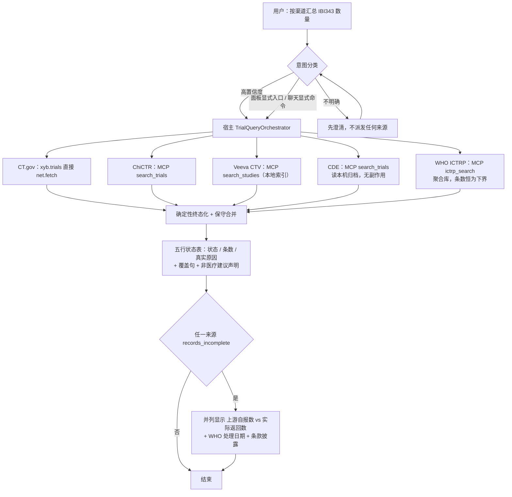
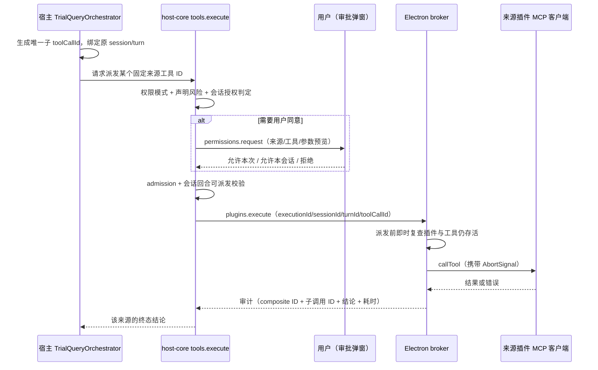
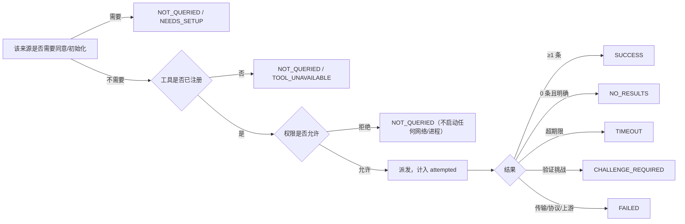

# 统一试验查询：宿主编排实现 SPEC

- 状态：草案，待技术/用户批准；**尚未授权实现**
- 日期：2026-10-04
- 架构依据：ADR 0311（方向已接受）
- 目标分支/工作树：`fix/xyb-records-audit-main`，路径 `/Users/qinxiaoqiang/Downloads/xiaoyibao-pi-desktop-fix-records-audit`
- 语言与位置：**本文件以中文撰写，且是唯一权威版本。** `docs/README.md` 规定 `spec/` 存放英文源、`zh-CN/` 逐路径镜像；本文件是经批准的例外——它自 2026-10-04 首次提交起就是中文，此前放在 `docs/spec/` 只是位置错误，与语言无关。此处仅记录位置，不影响本节以下取值的权威性。

## 1. 目标与非目标

建立一个**由宿主自有**的临床试验查询操作，供聊天与面板显式入口共用。一旦触发，它会按照「权限中介」的宿主路径逐个尝试每个合格来源，为每个合格来源返回结构化结果，隔离局部失败，并让宿主界面准确说明本次到底跑了什么。

自然语言路由本身必然不完备：高置信度可直接路由；意图不明确时必须先澄清；显式查询入口绕开分类。本功能**不承诺**能识别任意说法。

本文是草案。**在用户明确批准本 SPEC 之前，不开始任何宿主实现。** 接受 ADR 只代表同意架构方向，不代表授权改代码。

非目标：重写采集器、对检索列表页做浏览器抓取、绕过验证码或登录、自动执行环境安装/Cookie 获取、给出临床建议、未经授权安装依赖、未经单独授权提交/推送/合并。

## 2. 证据与架构约束

来源为：ClinicalTrials.gov（`xyb.trials`，直接 `net.fetch`）、ChiCTR、Veeva CTV、中国药物临床试验登记平台、WHO ICTRP（后四者是 `xyb.trial-sources` 自有的 MCP 服务器）。

> **修订记录（2026-10-04）：** WHO ICTRP 于 2026-10-04 由用户确定作为第 5 个来源接入，集成方式见 §15。本 SPEC 其余章节中原写为「四来源」的表述，除历史实测证据（§2.1）外，均应理解为「五来源」。

### 2.1 dev app 实测证据（2026-10-03/04，会话 `960381b1`）

同一句请求“查询下ibi343临床试验信息数量，按照渠道-数量输出结果”的两次运行：

- 运行 A（23:16:36–23:17:09）：`Skill` 加载 → 5× `ToolSearch` → CT.gov 成功 880ms → ChiCTR 455ms 失败（`NETWORK_ERROR`：`browserContext.newPage: Target page, context or browser has been closed`）→ Veeva 成功（MCP 254ms / 工具 7318ms）→ `chinadrugtrials_get_collector_status` 成功 → 回合随即结束，状态表写“中国药物临床试验登记平台 NOT_ENABLED — 本工具未在当前上下文就绪；本次未查到”。**`xyb_trials_unify` 从未被调用。**
- 运行 B（23:18:52–23:19:48）：用户追问“这个不是本地有json文件吗”，随后手打 `search_trials`；助手才调用 `get_collector_status`（`ok=true`，305ms）再调用 `search_trials`（`ok=true`，MCP 8606ms / 工具 12060ms），得到 5 条 CTR 记录——这才是正确结果。

由此暴露三个缺陷，各自对应本 SPEC 的改动：

1. **是收尾缺陷，不是取数缺陷。** 所有真正跑过的渠道都返回 `ok=true`；composite 在一个来源 `NOT_ENABLED` 的状态下静默停止，且没有做聚合。用户之所以拿到正确答案，唯一原因是他自己补上了缺失的工具名。§4.1/§5 必须把“所有合格来源都被尝试 + 确定性终态化”变成**宿主操作自身的属性**，而不是指望助手自觉遵守。
2. **`NOT_ENABLED` 与事实不符。** CDE 当时是启用的、可达的，采集器也可用；真实原因是“工具不在当前上下文”（工具发现/目录问题）。因此本 SPEC 要求该类情况必须报 `NOT_QUERIED / TOOL_UNAVAILABLE` 或 `NEEDS_SETUP`，**禁止把“未启用”当作默认标签**。
3. **CDE 并不需要原先担心的交互式准备。** 在用户环境已就绪的前提下，`search_trials` 单次调用即成功（8606ms）。每次检索确实会产生本地归档副作用，但实际操作摩擦远低于“重新登录”。原设计据此把 CDE 排除在静默扇出之外、要求每次同意；**该设计已被用户否定**（见 §4.3 修订记录）：写盘不是破坏性操作，且每次同意会重新制造“用户被迫手打工具名”的失败模式。现行为 **CDE 随包带冷启动数据、读本机归档无副作用、与其他三源同等纳入扇出**（§7）。

其他实测证据：

- ChiCTR 在本机间歇性不稳。2026-10-03/04 期间 `chictr/search_trials` 在成功（6.9–11.3s）与失败（24/48/408/437ms，`browserContext.newPage … has been closed`）之间交替。Playwright 缓存目录（`chromium-1243`、`chromium_headless_shell-1243`）当时存在，并于 10-04 06:15 重新下载。宿主记录的 `errorCode` 是 `TOOL_FAILED`，内层 `code` 为 `NETWORK_ERROR`。跨相邻运行的直接重试确实成功（22:36:06 失败 → 22:44:54 运行 → 22:45:13 成功）。这是 §4.4 有界重试策略的具体依据。
- 宿主日志里 CT.gov 结果数为 5，用户看到的表格也是 5，但 `xyb.trials_search` 的 `pageSize`/上限由调用方给出，且 details 里有 `dropped` 字段；在未报告截断的情况下，条数只能算**下界**。§5.3 要求显式 `truncated` 标志。
- Veeva 的 MCP 调用仅 254ms，但工具调用耗时 7318ms；其 2 条命中（`NCT07066098`、`NCT07483554`）与 CT.gov 结果完全重复。Veeva 是本地索引，增加延迟，且本次没有带来新的登记号；§4.3 保留它，但要求按 §5.2 标注本地索引来源与新鲜度。
- ChiCTR 的 `search_trials` 实际以 `{keyword, max_results}` 调用，而 CT.gov 与 Veeva 用 `{condition, terms}`。**跨来源的参数映射不能交给模型**，应由宿主来源注册表负责（§4.1、§5.1）。

### 2.2 宿主与权限约束

- 插件 SDK **没有**跨插件调用 MCP 的能力。面板自定义 bridge 调用只会转发给来源插件自己的 `onPanelInvoke`。
- `apps/desktop/electron/main/plugin-runtime.ts:3500-3599` 在注册插件 MCP 服务器前，会检查来源插件权限、HTTP 出网白名单、插件自有配置引用与重定向策略；MCP 工具写入宿主 `this.tools` 注册表，`risk: "medium"`，其 execute 闭包使用该插件自己的 MCP 客户端与会话取消登记表。
- **直接调用已注册的 execute 闭包是不够的**：模型的普通调用会经过 host-core `tools.execute`，由它执行权限模式、单次审批、admission、会话/回合可派发校验、取消与审计（`crates/host-core/src/rpc/mod.rs:3410-3900`）。直接回调或直接调 MCP 客户端会绕过其中一部分策略。目前未发现 Electron 主进程同步嵌套调用 `tools.execute` 的通路。
- 插件 MCP 的风险语义：`ask` 下 medium 需审批；`auto` 可自动放行；`accept-edits` **不会**自动放行 medium。已有授权按工具名作用域生效（`crates/host-core/src/permissions.rs:122-135, 245-264`）。**“来源插件已启用”不等于“本次调用已获同意”。**
- CDE 的 `search_trials` 会发起外部请求，并把原始 HTML、JSON、Word 归档到本机。它依赖 Python 与依赖项以及用户自己的浏览器会话 cURL；**不得隐式执行** `setup_environment`、`update_cookie`、`refresh_cookie`。
- 实测延迟：ChiCTR 约 9.9–12.7s，CDE 约 8s。CDE 抓取子进程最长可跑 30 分钟，且缺少请求级 AbortSignal 传播。

## 3. 总体流程

### 3.1 端到端主流程



对应 §4.1（共用宿主操作）、§4.3（来源纳入与否）、§5（契约）、§10「契约、UI 与验证」第 3 条（渲染）、§15（WHO ICTRP）。

> **修订记录（2026-10-04）：** 本图原先画的是 CDE「静默扇出不派发 → 返回 NOT_QUERIED / 需要同意」，并在末尾接一个「CDE 归档是否为空」的补派发分支。该流程已在 §4.3 被否定（用户理由：写盘不是破坏性操作、每次同意会重新制造“用户被迫手打工具名”的失败模式），但本图未同步。本次一并修正为「CDE 与其余来源同等纳入扇出」，并加入第 5 个来源 WHO ICTRP 与不完整性呈现分支。

### 3.2 单个子来源的权限中介派发



禁止路径：`O` 直接调 `RegisteredPluginTool.execute`，或直接调 `McpServerClient.callTool`——都会绕过 `HC` 这一段（§4.2、§10「权限与执行」第 6 条）。

### 3.3 单来源终态判定顺序



**只有 `SUCCESS` 与 `NO_RESULTS` 算“查过”**；其余状态都不能被读者当成“零结果”（§5.2）。

### 3.4 用户可见的必需行为

1. 被识别或被显式发起的试验查询，调用**同一个**宿主操作，而不是四次由模型自行挑选的调用。
2. 该操作会尝试当前启用、已就绪、已获单次授权与同意的**每一个**合格来源；但不承诺每个来源都合格或成功。
3. 每一份终态结果都恰好包含五个按序排列的来源结论。`NO_RESULTS` 表示“查过且为零”，绝不用于未运行、不可用或失败的来源。
4. 聊天与面板呈现**同一套**覆盖/状态契约；宿主渲染的状态为准，助手措辞不得覆盖它。
5. 意图不明确时先澄清，澄清前不派发任何来源；同时提供可见的显式“找临床试验”入口。
6. 不得把对 JavaScript 检索/列表页的通用抓取当作等效证据。在已知登记号后打开具体记录详情页，属于单独标注的补充手段。
7. **composite 必须终态化。** 不允许以一张未完成的状态表结束回合；也**不允许用户为了拿到五个来源中的某一个而手打工具名**（如 `search_trials`）——2026-10-03 实际发生了这件事，属于违反本条。
8. 未能查询的来源，必须用面向用户的语言说明**真实原因**（未启用 / 工具不可用 / 需要初始化 / 需要同意 / 失败 / 超时）。**“未启用”不得用于工具可用性或初始化问题。**
9. 任何展示的条数都要说明它是总数，还是受分页限制的**下界**。

## 4. 架构

### 4.1 共用的宿主操作

新建聚焦的宿主自有 `TrialQueryOrchestrator`，以及一个**封闭**的来源标识注册表。它只接受查询词；模型可控输入**不能**决定来源/插件/服务器/工具、URL、可执行文件、权限模式、来源子集或超时。它有两个调用方：面向聊天的已注册宿主工具，以及由宿主派发的试验面板动作。两者调用同一个编排方法，返回同一个带版本的结果契约。插件 `xyb.trials` **不得**自行调用其他插件的 MCP 工具。

Electron 主进程只做薄编排：来源策略与准入判定必须在 host-core 内生效，**不能用 Electron 端自行仿制一套**。

来源注册表负责跨来源参数映射（如 CT.gov/Veeva 的 `condition`+`terms` 与 ChiCTR 的 `keyword`+`max_results`），并固定各来源的默认页大小与超时，避免模型猜参数。

### 4.2 子调用授权与派发

**禁止**：把直接调用 `RegisteredPluginTool.execute` 当作捷径；直接调用 `McpServerClient.callTool`；把 composite 工具的审批、插件启用状态或工具发现结果**推定**为对子工具的同意。

每个子 MCP 调用都必须走 host-core 常规 `tools.execute` 权限路径，带**唯一的子 toolCallId** 与原始 session/turn 身份。由于当前宿主回调并未提供嵌套的 `tools.execute` 往返，实现必须先补一个**窄口径的 host-core 中介子派发契约**（或证明并测试一条受支持的既有 RPC 通路），使其在以下方面与常规路径语义等价：

- 当前项目生效，且来源插件已启用、已加载；
- 精确的已注册工具身份，以及来源插件自己的 MCP 初始化/权限判定；
- 声明风险 + 持久权限模式 + 已有的按工具会话授权；
- 用户审批请求，以及拒绝/取消；
- 开工前的会话/回合可派发校验；
- 有界准入、会话/回合取消、生命周期校验；
- 子级审计，包含 composite ID 与来源插件/服务器/工具身份。

任何子操作都不得在其自身权限判定允许之前开始运行。用户必须能看清是哪个子来源/工具在请求审批；composite 结果必须保留每一次判定。本条**不允许**用一个外层低风险包装去静默“洗白” medium 风险的 MCP 调用。`auto` 模式只可按产品既有的 medium 语义行事，且仍须经过同样的策略检查；它**不构成**对 CDE 归档的额外同意。

Electron 侧 broker 只能从宿主工具注册表中解析**固定的、经过评审的**来源工具 ID。派发前立刻复查来源插件/工具仍然存活且合格，再把宿主签发的上下文与 AbortSignal 经中介子路径传下去。它必须校验并限制不可信工具输出的体积。**绝不记录密钥、Cookie 或完整归档内容。**

### 4.3 v1 纳入的来源

- **ClinicalTrials.gov**：`xyb.trials` 已启用且其已注册的直接检索能力可用时纳入。保留其 manifest 网络授权。
- **ChiCTR**：仅当 `xyb.trial-sources` 已启用，且既有 `mcp.server.local` 权限与进程启动检查通过、对应 MCP 工具确已注册时纳入。
- **Veeva CTV**：同样的来源插件检查；须区分并标注本地索引的来源与新鲜度，以及 `INDEX_EMPTY`/`NEEDS_SETUP`。它是本地索引，不是实时远端注册库查询。
- **中国药物临床试验登记平台（CDE）**：**与前三个来源同等纳入扇出**。关键前提：CDE 随包带冷启动数据（§7.1），**扇出读的是本机归档，无副作用**。
  - 归档为空时结论报 `NEEDS_SETUP`（附首次同步动作），**绝不**渲染成“未查到”或“未启用”。
  - 只有联网取数（`search_trials` / `sync_incremental`）才涉及写盘与站点抓取，按 §7.5 处理，**不在查询扇出内**。
  - `setup_environment`、`update_cookie`、`refresh_cookie` **永不隐式调用**；会话未就绪只报 `NEEDS_SETUP`。
  - 已实测：环境就绪时 `search_trials` 单次 8.6s 成功、得到 5 条 CTR 记录、无需交互式登录。

- **WHO ICTRP（第 5 个来源）**：`xyb.trial-sources` 已启用、`mcp.server.local` 通过、四级运行时探测（§15.3.5）通过且 `ictrp_search` 确已注册时纳入。
  - 它是**聚合注册库**（`kind: "aggregator_registry"`），且其 CSV 导出**静默不完整**（§15.2）。因此其结果条数**永远是下界**，UI 必须同时呈现上游自报数与实际返回数。
  - 扇出只调用 `ictrp_search` 一个工具，`refresh=false`（复用本机缓存）。其余 6 个本地工具**不进扇出**。
  - 运行时缺失（Python 或依赖）报 `NEEDS_SETUP`（原因码 `PYTHON_RUNTIME_MISSING` / `PYTHON_DEPS_MISSING` / `VENDOR_FILES_MISSING`）；`ictrp_search` 未注册报 `NOT_QUERIED` 并附 `TOOL_UNAVAILABLE`（**不是** `NOT_ENABLED`，见 §5.2）；**绝不**渲染成“未查到”。
  - 与 ChiCTR 来源存在系统性重叠（ICTRP 收录 `source_register = "ChiCTR"` 的记录，每周同步），合并规则见 §15.5。
  - 它是本期唯一**非 Node**依赖（Python 3.10+），开箱即用的边界见 §15.3.5。

因此 `complete` 只在**五个来源都真正查过**（`SUCCESS` 或 `NO_RESULTS`）时才为 true。任一来源因运行时缺失（CDE 归档为空、ICTRP Python/依赖未就绪）落到 `NEEDS_SETUP` 时，`complete` 即为 false。产品**不得**把 `complete=false` 的结果标称为“五来源完整检索”。

> **修订记录（2026-10-04）：** 本节原先把 CDE 排除在静默扇出之外、要求每次同意。该设计已被用户否定，理由是「写盘不是破坏性操作、量级被高估」，且每次同意会重新制造 §2.1 的“用户被迫手打工具名”失败模式。现行设计改为：**冷启动数据 + 有界静默增量更新 + 手动更新**（§7），副作用披露发生在首次启用与设置中，而不是每次运行。

### 4.4 并发、期限、取消与重试

当前 MCP 客户端可以关联并发请求，`McpCallRegistry` 记录信号与会话取消，但**不限制并发**。因此编排器自行把扇出上限设为 **4**，且只并发不同来源。期限：CT.gov 20s、ChiCTR 45s、Veeva 15s、CDE 30s、WHO ICTRP 60s、整体 75s。实现冻结前须对照现有传输/来源契约确认，且不得超过底层更小的超时。

> **修订记录（2026-10-04）：** 本节原为「并发 3、整体 50s」，是面向四来源的取值。第 5 个来源 WHO ICTRP（§15）接入后调整为**并发 4、整体 75s**，并新增 ICTRP 的 60s 单来源期限。论证与「整体期限必须大于单个最长来源期限」的约束见 §15.6。

**ChiCTR 有界重试（对“不重试”的唯一限定例外）。** 实测 ChiCTR 失败都在 24–437ms 内完成，即发生在浏览器启动阶段、尚未触及站点。对这类“瞬时启动失败”重试一次是安全、有界且明显改善结果的。编排器可对某来源最多重试一次，且必须同时满足：失败在 2s 内完成；被归类为启动/传输失败，而非上游响应或验证挑战；来源不是 CDE；重试所用的子权限已由同一次判定授予。该重试是**独立的子调用 ID**，在审计中可见，计入 `attempted`，且不得越过来源期限。其余所有失败路径都保持严格不重试。

在调用方取消、回合已过期/结束、来源插件卸载或整体超时的情况下：经中介宿主路径中止活跃子信号；把未启动的来源终态化为 `NOT_QUERIED` 并附原因；已过期但已启动的调用记为 `TIMEOUT`；已完成的结果保留。迟到的结果**不得**再改写已返回的结果，只能进审计。若某来源无法取消，要如实说明外部工作可能仍在继续，**不得**声称已停止。测试必须覆盖重复/在途策略，以及同一次 composite 不会对同一子调用重复派发。

## 5. 契约

### 5.1 输入

聊天工具 schema 只接受：

- `terms`：必填，去空白，有长度上限的字符串；
- `condition`：可选，有长度上限的字符串。

宿主注入 `compositeId`、来源 session ID、turn ID、toolCallId、来源方（`chat` 或 `panel`）、模式与中止信号；模型不能设置或覆盖这些字段。空值、格式错误、超限输入在派发前即拒绝。来源清单、权限、超时、URL 与初始化动作都**不是**输入字段。

### 5.2 各来源结论（v1 为五来源）

结果包含按序键 `clinicaltrials_gov`、`chictr`、`veeva_ctv`、`chinadrugtrials`、`who_ictrp`。每个结论包含状态、原因码、面向用户的安全说明、`attempted`、耗时、条数、已校验记录，以及来源/新鲜度信息。用户可见输出中不得暴露本地绝对路径、Cookie 字段或敏感的归档内容。

终态定义：

- `SUCCESS`：查询操作成功并产出 ≥1 条有效记录。
- `NO_RESULTS`：查询成功且明确返回 0 条匹配。
- `NOT_ENABLED`：该来源被来源/插件设置**明确**关闭（用户显式禁用；或工具未注册**且**经核实前置条件本身缺失，此时按 §5.2 末段归到 `NEEDS_SETUP`）。
- `NEEDS_SETUP`：来源已启用但缺少前置条件、索引、会话或运行时（含工具未注册但前置条件缺失的情形）。
- `NOT_QUERIED`：未派发，且必须带原因（`TOOL_UNAVAILABLE`、`LIFECYCLE_CHANGED`、`TURN_CANCELLED`、`OVERALL_DEADLINE` 等）。
- `TIMEOUT`：已派发但超过期限。
- `CHALLENGE_REQUIRED`：来源要求人工验证；永不绕过。
- `FAILED`：传输、协议、上游或结果结构失败。

终态化时每个来源恰好有一个终态。只有 `SUCCESS` 与 `NO_RESULTS` 算作“查过”。`attempted` 回答的**只有**「这次派发有没有开始」这一个问题：`false` 恰好对应 `{NOT_QUERIED, NOT_ENABLED, NEEDS_SETUP}`（没问 / 用户关了 / 环境没就绪），`true` 对应其余五个状态——**包括 `TIMEOUT`/`CHALLENGE_REQUIRED`/`FAILED` 这三个失败态**。它既不是 `state !== "NOT_QUERIED"`，也不是 `isQueried` 的同义词（`isQueried` 蕴含它，反之不成立）；完整配对见 §15.34。**MCP 工具未注册不等于 `NOT_ENABLED`**，应按经核实的前置证据报 `NOT_QUERIED / TOOL_UNAVAILABLE` 或 `NEEDS_SETUP`。这是实测要求的更正：2026-10-03 那个已启用且可用的 CDE 来源被标成 `NOT_ENABLED`，理由写的是“本工具未在当前上下文就绪”——那属于工具可用性问题，不是用户设置问题；这个误导性标签直接让用户没拿到本可拿到的正确结果。Veeva 的本地零命中应表述为“本地索引中未找到”，而非“没有相关研究”。


供诊断使用、不直接展示给用户的来源级原因码：

- `SOURCE_LAUNCH_FAILED`（ChiCTR 浏览器启动/`browserContext … closed`）；
- `SOURCE_UPSTREAM_ERROR`、`SOURCE_RATE_LIMITED`、`SOURCE_CHALLENGE`；
- `TOOL_UNAVAILABLE`、`COLLECTOR_NOT_READY`、`COOKIE_MISSING_OR_EXPIRED`；
- `PYTHON_RUNTIME_MISSING`、`VENDOR_FILES_MISSING`、`PYTHON_DEPS_MISSING`（WHO ICTRP 运行时探测链，见 §15.3.5）；
- `INDEX_EMPTY`、`TRUNCATED_RESULT_COUNT`。

### 5.3 聚合结果

`TrialQueryResult` 包含 schema 版本、宿主 ID、规范化查询、五个结论、覆盖计数、带来源标记的规范化记录、保守合并候选、开始/耗时/取消字段，以及非医疗建议声明。`complete=true` 仅当五个结论都是 `SUCCESS` 或 `NO_RESULTS`；CDE 有冷启动数据、ICTRP 运行时就绪时可达 true。去重**只**按规范化登记号，遵循既有 F2 契约；没有登记号的记录保持独立；标题相似不足以合并。

实测要求补充的两条契约：

- **截断。** 每个 `SUCCESS` 结论都带 `truncated: boolean` 与请求/返回条数，使受分页限制的结果不会被当成总数呈现。CT.gov、ChiCTR、Veeva、CDE 都接受调用方上限；由编排器选定默认值，并在来源返回满页时明确说明。
- **实测到的跨来源重复。** Veeva 返回的 2 条记录，其登记号（`NCT07066098`、`NCT07483554`）已存在于 CT.gov 集合中，合并结果**不得**重复计数。这作为保守合并的固定回归用例。

## 6. 来源扩展框架（未来接入 A / B / C 渠道）

用户要求：将来接入新渠道（MCP、或技能 + 数据库）时，应当能**按框架接入**，而不是每来一个来源就改一遍编排器。**结论：pi-desktop 已经有这个框架，且已经足够——本 SPEC 不新建插件 SDK 能力，而是把来源声明收敛到既有插件能力的一条聚焦约定上。**

### 6.1 pi-desktop 已有的框架能力（核查结果）

| 已有能力                                                          | 位置                                                                                                 | 对新来源意味着什么                                           |
| ------------------------------------------------------------- | -------------------------------------------------------------------------------------------------- | --------------------------------------------------- |
| 插件 manifest 声明 `mcpServers`（`stdio` 或 `http`）                 | `docs/spec/07-plugins/02-plugin-manifest-schema.md:153`、`packages/plugin-sdk/src/index.ts:547-560` | 新渠道若是 MCP，只需在自己的插件 manifest 里声明一个 server，**不需要改宿主** |
| `contributes.agentTools` + `permissions: agent.tool.register` | `apps/desktop/resources/plugins/xyb.trials/manifest.json`                                          | 新渠道若不是 MCP（如直连 API），用它自己注册 `risk` 明确的工具             |
| `contributes.skills` + `agent.prompt.inject`                  | `xyb.trial-sources`、`xyb.assistants` 等                                                             | 新渠道可自带技能文档与使用说明                                     |
| `contributes.settings`                                        | `xyb.trial-sources` 的 `veevaDataDir`                                                               | 新渠道可自带目录/凭据/开关设置，无需宿主改动                             |
| 权限矩阵 + 出网白名单 + 本地进程权限                                         | `docs/spec/07-plugins/13-plugin-permissions-matrix.md`、`02-plugin-manifest-schema.md:398-427`      | 新来源的授权模型复用既有判定，不新增机制                                |
| 插件打包与市场分发                                                     | `docs/spec/07-plugins/06-plugin-packaging.md`、`07-plugin-marketplace.md`                           | 新渠道可独立安装、独立更新，不必随主包发版                               |

**即：插件的声明式能力就是既有的来源接入框架。** 缺口只有一个——没有任何插件可以告诉宿主“我是试验来源、我的工具叫什么、我的默认参数是什么、我属于哪一类数据”。目前这层映射写死在 `xyb.trial-sources` 里，编排器无从发现新来源。

### 6.2 本 SPEC 的做法：来源描述符 + 封闭注册表

在**宿主侧**（不是插件 SDK）定义一个封闭的来源描述符，由 `TrialQueryOrchestrator` 持有：

```ts
type TrialSourceDescriptor = {
  key: "clinicaltrials_gov" | "chictr" | "veeva_ctv" | "chinadrugtrials" | "who_ictrp" | ...;
  pluginId: string;             // 例如 "xyb.trial-sources"
  toolName: string;             // 已注册工具 ID，必须是评审过的固定值
  argShape: "condition_terms" | "keyword_maxresults" | "keyword_limit_offset" | ...;
  kind: "remote_registry" | "local_index" | "archived_scrape" | "aggregator_registry" | ...;
  sideEffect: "none" | "local_archive" | "local_cache" | ...;
  defaultLimit: number;
  timeoutMs: number;
  freshness: "live" | "build_time";
};
```

要点：

1. **v1 把现有的五个来源登记进这张表**（第五个见 §15），行为与 §4 完全一致——这一步是纯重构，不改变产品行为。
2. **v2 起新来源按同一张表接入**：新增一个 A 渠道，等于「在 A 的插件里声明 MCP server 或 agentTool」+「在宿主注册表加一条描述符」+「过一个按 §10 验收模板写的契约测试」。**不改编排器逻辑，不改状态机，不改 UI 渲染。**
3. **描述符必须由宿主持有，不能让插件自行注册。** 让插件声明“我是合格试验来源”等于让插件自我授权进入扇出，会重新引入 §4.2 明确禁止的推定同意。若将来要开放插件自注册，需要另立 ADR 并单独评审。
4. **`kind` 决定呈现方式，不是装饰字段**：`remote_registry` 说实时远端证据；`local_index` 必须暴露构建时间（§7.2 的 Veeva 要求）；`archived_scrape` 必须走副作用同意闸门（§4.3 的 CDE 模式）。
5. **`sideEffect: "local_archive"` 一律不进静默扇出**，无论来源是第几个渠道。这条规则保证将来接 A 渠道时，不会因为它是“新来源”就绕过了 CDE 已经付出代价才建立的同意闸门。
6. **新来源的 `risk` 不得低于 medium**——MCP 与外部网络抓取在 §2.2 的判定下都属于 medium，沿用既有语义。
7. **不新增插件 SDK 的跨插件 MCP API**（与 §4.1 一致）。框架的价值在于“插件声明能力、宿主持有策略”，而不是让插件互相调用。

### 6.3 临床主题细化原则

pi-desktop 的扩展框架是**通用**的；试验来源需要的额外约束不适合塞进通用 manifest，应由本 SPEC 这一层承担。任何新渠道接入前必须满足：

1. **登记号优先。** 记录能提供规范化登记号（NCT / CTR / ChiCTR / UTN 等）才具备合并资格；无登记号的记录保持独立、不参与去重（§5.3）。
2. **诚实标注证据等级。** 新来源必须声明它是实时注册库、本地索引还是归档抓取，并据此呈现；本地索引不得表现为实时全球检索（§6.2 的 `kind`）。
3. **不做列表页抓取。** JS 渲染的检索页不构成注册库证据（§3.4 第 6 条）；这条对新渠道同样生效，不允许“新来源特例”。
4. **副作用必须前置披露。** 任何抓取、写盘、登录、安装依赖都必须进入同意闸门，不允许静默发生。
5. **参数映射由框架负责。** 新渠道自己的参数名（如 `keyword` 与 `condition`）写在描述符的 `argShape` 里，**不交给模型猜**（§4.1、§5.1）。
6. **失败必须可区分。** 新渠道要复用 §5.2 的状态与原因码，特别是不得把「未注册/未就绪」写成 `NOT_ENABLED`（`NOT_ENABLED` 仅用于用户显式禁用；这是 2026-10-03 实测踩过的坑）。
7. **截断必须自报。** 新渠道必须报告条数是总数还是下界（§5.3 的 `truncated`）。
8. **来源新鲜度可见。** 能报告数据的时点或构建时点，否则界面必须明示「新鲜度未知」。

### 6.4 需要确认的问题（并入 §13）

- ~~未来若来源数量增长到 6 个以上（例如加入 FDA、EMA、WHO ICTRP），并行上限与整体期限如何调整——现在写死 3 个并发是面向四来源的。~~ **已定：第 5 个来源 WHO ICTRP 于 2026-10-04 确定接入，见 §15。并发上限与整体期限的调整方案已在 §15.6 给出，不再是待确认项。**
- 是否需要把来源描述符提升为插件的**只读**声明（插件声明、宿主审核后启用），以减少宿主发版次数。这涉及自我授权风险，必须单独评审，不属于 v1。

### 6.5 第五个来源接入所暴露的框架缺口（2026-10-04 起适用）

WHO ICTRP（§15）是本 SPEC 生效后的**第一个真实新渠道**。它同时是第一次「不新增 MCP server、只新增一条描述符」的接入，因此 §6.2 第 2 条「不改编排器逻辑、不改状态机、不改 UI 渲染」这一承诺**在本节被逐条兑现或证伪**。核查结果：

1. **`kind` 必须新增取值 `aggregator_registry`。** ICTRP 是「注册库的注册库」，其 CSV 导出**静默不完整**（§15.2）。现有三个 `kind` 都无法表达「这是权威聚合库，但它的返回集是下界」这一语义。把它塞进 `remote_registry` 会直接违反 §6.3 第 8 条（新鲜度可见）与 §5.3 的 `truncated` 要求。
2. **`truncated` 不足以描述 ICTRP 的缺失。** §5.3 的 `truncated` 表达的是「宿主主动截断到 limit」，是**自己造成的**、可解释的下界。ICTRP 的缺失是**上游造成的**、不可解释的（`KRAS` 场景实测缺 29.0%，原因未明）。因此 §15.5 新增 `upstream_incomplete` 字段，与 `truncated` **并列而非合并**：两者可以同时为真。
3. **`argShape` 需要新增 `keyword_limit_offset`。** 现有 `keyword_maxresults` 无法表达 `offset` 分页（ICTRP 独有），而 `condition_terms` 更是形状不符（ICTRP 只接受单一 `keyword`）。
4. **一个来源可能对应多个工具，且工具分「有网」与「无网」两类。** ICTRP 的 7 个工具里只有 `ictrp_search` 触网并写缓存；其余 6 个是纯本地读。§6.2 的描述符是「一来源一工具」，这里必须扩展为「一来源一**检索入口**工具 + 若干本地工具」，且**只有检索入口进扇出**。
5. **「本地工具免费」是新的产品能力。** ICTRP 物化一次后，后续筛选/统计/导出不再触网。这是此前四个来源都没有的能力，UI 应能体现（§15.3）。
6. **不新增插件跨插件 MCP API 的约束仍然成立**（§6.2 第 7 条）。ICTRP 作为**宿主级 MCP server**声明，不属于任何现有插件之间的互调，因此不破坏该约束——但这也意味着它的 pluginId 需要一个新归属，见 §15.4。

## 7. 随包分发、冷启动数据与更新（Veeva / CDE）

### 7.1 需求（用户 2026-10-04 明确要求，必须实现）

1. **Veeva 与 CDE 都必须带现有数据进安装包**：安装完成即可查询，不要求用户先配置会话或抓取。
2. **开发者发布新版本时更新这两个数据源**：更新数据集 → 重新打包 → 在发布说明中写明数据集版本与日期。
3. **支持自动 bootstrap**：安装后可在默认提示词下静默完成一次增量更新。
4. **支持手动更新**：用户可自行触发数据库更新。
5. **数据库在安装 App 时即可创建**：不需要用户执行任何初始化命令。

这五条都是 v1 的验收项（§10「随包分发与冷启动数据」第 1–9 条，历史别名 22–28），不是可选项。

### 7.2 责任边界

| 来源 | 数据形态 | 随包分发 | 运行时位置 | 谁写 |
| --- | --- | --- | --- | --- |
| Veeva CTV | 本地 SQLite 索引（约 50M） | **是**，`<插件>/data/ctv.db` 只读种子 | `~/.ctv-mcp/ctv.db` | ctv-mcp-server 读写；`ensureVeevaSeed()` 仅在目标不存在时复制 |
| CDE | 本地归档（结构化 JSON） | **是**，`<插件>/data/chinadrugtrials/` 只读种子 | `~/.xyb-chinadrugtrials/`（可经 `XYB_CHINADRUCTRIALS_DATA_DIR` 覆盖） | 采集器写入；MCP 只读 |

两者的共同规则（与 Veeva 现有实现同构，CDE 照搬）：

- 种子**只读**，运行时永不就地修改，缺失或复制失败**不阻断**插件加载。
- 首次启动把种子复制到用户目录；**目标已存在时不覆盖**（用户数据优先）。
- 复制先写 `<目标>.seed-tmp` 再 `rename`，避免半个库冒充完整索引。
- 种子是**构建产物**，可进 git 并随 dmg/exe 分发；用户运行库是**用户数据**，不进 git、不进包、回滚不删。

> **与当前实现的差异（必须说明）：** 现状是**只有 Veeva 有种子，CDE 完全没有**（`data/` 下只有 `ctv.db`，`git ls-files` 也只跟踪它）。§7.1 第 1、5 条对 CDE 是**新增能力**，需要新写种子构建链路与复制逻辑，不是开关一开就有。实现前须先确认 §7.8 的种子来源与合规问题。

### 7.3 种子生命周期（两条来源统一）

```
安装 → 种子随包落盘 → 首启复制到用户目录（只补不覆盖）
                              ↓
                     运行库/归档存在 → 查询直接可用（无授权、无联网）
                              ↓
              ┌───────────────┴───────────────┐
        自动 bootstrap                    手动更新
   （每 24h 最多一次，增量，失败即停）      （设置中显式触发，用户可随时执行）
              └───────────────┬───────────────┘
                              ↓
                  写入用户副本，种子保持只读不变
```

**查询路径与更新路径必须分离**：扇出只读本机数据（§4.3），因此不需要授权；只有更新才可能联网与写盘。这样「有副作用」不再阻断查询，同时副作用仍然被披露与限流。

### 7.4 种子内容红线（随包种子通用，必须执行）

> **修订记录（2026-10-04）：** 本节原名「脱敏红线」，其依据是把 CDE 数据当作需脱敏的非公开数据。用户已明确：**该数据集为公开合规数据，隐私不作为约束因素**。因此个人信息类限制整体移除；保留的两条（凭据、原始留档）依据分别是**安全**与**体量/结构化**，与隐私无关。
>
> **适用范围修订（2026-10-04 晚）：** 该判定初版只写在「CDE 种子特有」小节里，措辞是单数的「该数据集」。此后 ChiCTR（468 条）与 WHO ICTRP（6262 条）两个种子也随包分发，而原文没有明确它们是否同样豁免 —— 这是一个**范围缺口**：后来者可能以为只有 CDE 被豁免，也可能以为默认豁免。**ChiCTR 种子含联系信息是实测事实**：468/468 条带 `申请注册联系人电子邮件` 与 `研究负责人电子邮件`，另有 417 条含手机号、`伦理委员会联系人邮箱` 133 条。用户已确认同一个判定适用于**全部三个随包种子** —— 它们都是各登记处公开发布页面/导出的一部分，联系人与研究者字段随之公开，**隐私不作为种子筛选条件**。为免歧义，本节标题已从「CDE 种子特有」改为「随包种子通用」。

三处种子的体积与留档现状（实测，均已在跑 `scripts/xyb-sync-trial-json-seeds.mjs` 时核对）：

| 种子 | 结构化（入种子） | 原始留档（不入种子） | 说明 |
|---|---|---|---|
| ChiCTR（468 条） | 3.9M（`records[].fields`，76 个结构化键） | `raw_text` 4.8M + `html/` 66M | 原稿 11.3M 有 42% 是 `raw_text`；剔除后可查询字段一个不少 |
| CDE（139 条） | 7.6M（`json/` 139 个文件） | `raw/` 10M、`word/` **90M** | 留档占归档 **93%** 且不可查询 |
| WHO ICTRP（6262 条） | 10.6M（保留约 32 个字段） | 上游快照原稿 42.4M | 裁剪率 75%；**归因字段一个都不能裁**（`attribution` / `terms_notice` / `provenance.ictrp_export_date` 缺一即视为坏数据，详见 §15.3.8） |

CDE 归档目前包含站点**原始响应留档**：`output/<关键词>/raw/*_detail.html`（单条约 80–110KB）与 `word/*.source.doc`（单条约 363–577KB）。这些**不得**进种子。种子只允许包含结构化 `json/`，且必须满足：

- **不含** Cookie、会话凭据、`config.json` 内容或任何认证材料。（**依据：安全。** 泄露凭据会危及用户本人的站点会话，与数据是否公开无关。）
- **不含**站点原始响应留档（ChiCTR 的 `raw_text` / `html/`、CDE 的 `raw/` 与 `word/*.source.doc`）。（**依据：体量与结构化。** 上表三条种子的留档分别是 42%、93%、75%，且全部不可查询。）
- 需有**自动化测试**扫描种子目录，命中上述任一特征即判不通过、不得发布（§10「随包分发与冷启动数据」第 6 条，历史别名 25）。

**已移除的限制（用户 2026-10-04 判定，适用于全部三个随包种子，不得再作为阻塞项）：** 原先要求「不含患者姓名、研究者联系方式或任何个人信息」。这些数据均为登记处的公开发布内容，**隐私不作为种子筛选条件**；联系人/研究者等字段可正常保留。ChiCTR 种子因此保留 936 个研究者邮箱与 417 个手机号，这是**实测后明确知情**的结果，不是遗漏。

### 7.5 更新路径

**自动 bootstrap**（对应 §7.1 第 3 条）：

- 仅在归档/索引为空或过期时触发；只做 `incremental: true` 的增量更新。
- **频率上限每 24 小时一次**，跨重启持久化记录上次更新时间。
- **失败即停、不重试**——CDE 抓取失败可能使站点对用户会话判挑战页，重试会放大这个风险（这也是 ChiCTR 与 CDE 的区别所在：Veeva 刷新失败只是本地库旧了）。
- 会话未配置时报 `NEEDS_SETUP` 并给出配置动作，**不得**静默跳过（§5.2）。
- 自动更新在后台进行，不阻塞查询返回；本次查询用已有种子数据并如实标注新鲜度。

**手动更新**（对应 §7.1 第 4 条）：

- 设置页提供显式入口触发两库更新，含 Veeva 刷新工具（`sync_sitemap` / `import_csv_export` / `backfill_details` / `reindexFts`）与 CDE `sync_incremental`。
- **不得**静默覆盖用户已有且更完整的数据；更新前提示影响范围。
- Veeva 刷新工具属手动更新范围，**不在**查询扇出与自动 bootstrap 范围内（§10「随包分发与冷启动数据」第 9 条，历史别名 28）。

### 7.6 新鲜度与可见性

- 种子内容由构建时的 commit 决定，用户侧可能落后数周或数月。界面必须能说出「本地索引，构建于 <日期>」，**不得**把种子结果呈现为实时远端注册库检索结果。
- `INDEX_EMPTY`（种子缺失/复制失败）与 `ARCHIVE_EMPTY`（CDE 归档为空）分别表达，都不显示为 `NO_RESULTS`。
- 自动更新成功后应更新界面上的新鲜度信息；自动更新失败不应使查询失败，只影响新鲜度标注。

### 7.7 包体与构建

- `apps/desktop/package.json` 的 `build.extraResources` 已含 `{"from":"resources/plugins","to":"plugins"}`，插件内 `data/` 随包分发，**映射保持不变**。
- 数据集更新流程：刷新数据源 → 瘦身/去留档 → 写入 `<插件>/data/` → commit → 下次打包自动携带。
- 开发者发布新版本时须在**发布说明**中记录数据集版本与日期（§7.1 第 2 条）。
- 体积影响：Veeva 种子约 50M；CDE 种子体量取决于选定的关键词集合，须在实现前确定并评估（见 §7.8）。
- 已知风险：种子进 git 后历史中的大文件不可撤销，多次刷新会持续增大仓库。沿用既有约定。
- 许可与分发风险沿用 `XYB-AUDIT-F5-LICENSE-RISK.md`；本 SPEC **不作**合规结论。

### 7.8 需要确认的问题（并入 §13）

1. **CDE 种子的来源与合规**：选哪一组关键词作为随包数据集（现状 `output/胰腺癌/` 有 108M/712 文件，明显过大）；由谁评审这份快照可以随包分发。
2. **CDE 种子的体量目标**：需要给出上限（例如 ≤20M）并据此裁剪关键词数与字段。
3. **Veeva 种子构建日期能否从 `ctv.db` 自身读出**；若不能，是否需要构建时写入一张小元数据表。
4. **「种子副本」与「用户更新副本」如何区分**，这直接影响 freshness 文案的准确性。
5. **自动 bootstrap 的触发口径**：「过期」如何定义（时间阈值？种子版本比对？），以及首次安装是否立即触发。

### 7.9 发布前数据集新鲜度检查与一键更新

**问题**：数据集更新目前是**纯人工、且与发布解耦**的动作。`scripts/xyb-sync-trial-data.mjs` 的注释原文写着「数据刷新是**按需**的（季度或重要试验更新），与发布次数无关」，默认行为甚至是「只在分发副本不存在时创建」，必须显式加 `--force` 才覆盖。结果是：发布流程里没有任何一步会提醒开发者「数据该更新了」，种子可以静默陈旧好几个月，而界面却会如实标注出一个很旧的构建日期——用户看到的是「本地索引，构建于 6 个月前」。

**目标**：在发布流程中加入一个**检查提示**，把「是否需要更新」变成发布时必然会看到的一个问题；确认需要后，可**一键**把近期数据刷入 `data/` 下的种子，全程不需要手工复制文件。

#### 7.9.1 检查提示（发布门禁）

新增 `scripts/xyb-check-trial-data-freshness.mjs`，作为发布前门禁接入 `scripts/check-release-docs.mjs` 所代表的同一类「发布前检查」序列（不改变其现有版本面检查语义）。

行为：

- 读取 `data/` 下两个种子的**数据集版本与构建日期**（见 §7.8 第 3 条）。
- 输出三态之一：
  - `OK`：两个数据集都在阈值内 → 通过，不阻断。
  - `STALE`：超过阈值（初拟 **90 天**）→ **默认阻断发布**，并打印可执行的修复命令。
  - `UNKNOWN`：读不出构建日期（元数据缺失）→ 也判不通过，因为「无法判断是否陈旧」不能当作「不陈旧」。
- 阈值可经环境变量覆盖（例如 `XYB_TRIAL_DATA_MAX_AGE_DAYS`），便于补发补丁版本时不必强刷数据。
- 这是**提示与闸门**，不是自动联网：检查本身**绝不**联网、绝不写盘。

#### 7.9.2 一键更新（开发者侧）

把 `scripts/xyb-sync-trial-data.mjs` 从 Veeva 专用扩展为**两个数据集统一入口**：

```
node scripts/xyb-sync-trial-data.mjs            # 预演：报告两个数据集的状态与将要发生什么
node scripts/xyb-sync-trial-data.mjs --apply     # 实际更新两个种子
node scripts/xyb-sync-trial-data.mjs --apply --force   # 覆盖已存在的分发副本
```

- **Veeva**：沿用现有链路（`slim-db.mjs` 瘦身 → 校验 → 复制到 `data/ctv.db`），行为不变。
- **CDE**（新增）：从 `~/.xyb-chinadrugtrials/` 挑选关键词子集 → 按 §7.4 剔除原始留档与凭据（只保留结构化 `json/`）→ 裁剪到 §7.1 约定的体量上限 → 写入 `data/chinadrugtrials/`。
- **保留现有安全默认**：仍然只在目标不存在时创建；已存在时必须显式 `--force`，因为种子一旦提交就进入 git 历史、不可撤销。一键更新**不得**默认覆盖。
- 更新后打印**需要提交的文件清单**与建议的发布说明条目（数据集版本 + 日期）。

#### 7.9.3 与自动 bootstrap 的分工

两条路径职责不同，都必须存在：

| | 发布前（本节） | 安装后（§7.5） |
| --- | --- | --- |
| 谁执行 | **开发者**，发布流程内 | **用户**，运行时后台 |
| 更新什么 | 随包种子（进 git、进安装包） | 用户本机副本（不进 git） |
| 触发 | 发布门禁提示 + 手动确认 | 每 24 小时最多一次、增量 |
| 是否联网 | 检查不联网；更新由开发者另行刷新数据源 | 是（增量） |
| 失败后果 | 阻断发布 | 只影响新鲜度标注，查询仍可用 |

**顺序**：发布前把种子刷到最新（本节）→ 用户安装即有较新基线 → 安装后自动 bootstrap 只做小步追赶。这样 §7.5 的增量更新压力最小，也最不容易触发站点挑战页。

#### 7.9.4 验收（并入 §10「随包分发与冷启动数据」第 3、7 条相关项，历史别名 24、26）

- 门禁脚本对 `STALE` 与 `UNKNOWN` 均返回非零退出码，对 `OK` 返回零；检查过程不产生任何网络请求与文件写入（须有测试断言）。
- 阈值可通过环境变量覆盖，且覆盖后判定随之改变。
- 一键更新脚本在未加 `--force` 时**不覆盖**已存在的种子（须有测试），加 `--force` 时才覆盖。
- CDE 种子生成路径的产出必须通过 §7.4 的种子内容扫描测试。
- 更新后脚本输出的提交清单与实际变更文件一致。

## 8. 意图路由与评估

不要新增又一份无边界的手工短语表。现有的技能/工具文案只作为辅助引导。措辞不明确时，先做一次简短澄清，确认前不派发任何来源。面板显式动作与聊天显式命令**不经过**自然语言分类，直接调用 composite。

若存在受支持的宿主意图路由接缝，则用一套带版本的评测集来衡量：至少 40 条正例与 40 条负例/歧义例（中英混排、数量/统计式说法、口语表达、药物/靶点名、追问上下文、否定句、无关临床问题）。初拟阈值：正例召回 ≥95%，负例误触发 ≤5%，并给出混淆矩阵。**这些数字只对该评测集成立**，不代表对任意未来措辞的保证。若不存在受支持的分类接缝，则 v1 采用“澄清 + 显式入口”，不新增未经评审的模型调用，也不宣称高置信度自动化。

## 9. 预期改动范围

最终文件布局只有在 SPEC 获批、且一个窄口径实现切片验证了 RPC 通路之后才确定：

- 新增聚焦的 Electron 主进程 `TrialQueryOrchestrator` 与封闭来源注册表。
- 在 `apps/desktop/electron/main/plugin-runtime.ts` 与既有宿主/面板路由中做**窄**集成；不要把状态机塞进那个 5000+ 行的运行时模块。
- host-core 的 `tools.execute` / 权限 RPC 通路，以及针对子派发的聚焦测试；不要把审批策略只实现在 Electron 侧。
- 仅在跨进程边界时才引入带版本的共享 schema。
- `xyb.trials` 的聊天工具/manifest/技能与面板改为调用并渲染该共享操作；**不为插件 SDK 增加跨插件 MCP API**。
- Electron 与 `crates/host-core` 的聚焦测试，外加 UI 与 dev app 覆盖。
- `docs/spec/06-delivery/04-e2e-test-plan.md` 增补用户可见的聊天与面板场景。
- 宿主来源描述符表与封闭注册表（§6.2）；`TrialQueryOrchestrator` 只依赖描述符，不硬编码来源分支。
- 若批准细节有变，更新 ADR 0311 与 `XYB-TRIAL-UNIFIED-QUERY.md`。

**保留且不要并入**以下工作区未提交改动，直到它们被单独评审确认范围：`apps/desktop/resources/plugins/xyb.trials/lib/unified.js`、`apps/desktop/resources/plugins/xyb.trials/main.js`、`apps/desktop/resources/plugins/xyb.trials/views/trials.html`、`apps/desktop/test/xyb-trials-unified.test.mjs`。不得 reset/discard。

## 10. 验收标准

> **编号约定（2026-10-04 修订）：** 本节按**组**组织，每组**组内从 1 重新编号**（路由 1–4；权限与执行 1–10；契约、UI 与验证 1–7；随包分发与冷启动数据 1–9，含历史别名 22–28 / 24a / 24b；来源扩展框架 1–3，历史别名 29–31）。**跨处引用一律写作「§10「组名」第 N 条」**，例如 §10「契约、UI 与验证」第 2 条。仅写「§10 第 16 条」这类**不带组名的扁平编号是无效的**，因为 16 在多个组中都存在。历史别名（22–40）保留仅为兼容既有文字，新增引用不得使用。
>
> **WHO ICTRP 组的物理位置例外（2026-10-04 修订）：** 「WHO ICTRP」验收组（组内 1–10，历史别名 32–40 仅覆盖其中 1–9）**正文位于 §15.9**，不在本节——本节只登记它的存在与编号约定。引用该组时写作「§15.9「WHO ICTRP」第 N 条」；历史别名写法「ICTRP1」…「ICTRP10」（见 §14 追溯矩阵）等价，其中 `ICTRP10` 无历史扁平别名，只能用组内编号。

### 路由

1. 使用受支持分类器时，带版本的 40+40 评测测试给出召回/误触发指标并满足 §8 阈值；否则每个不确定样例都必须请求澄清且不派发任何来源。
2. 面板显式入口与聊天显式命令绕过分类器，并以相同的查询契约调用同一个 composite 操作。
3. 负例/歧义输入在澄清前不派发任何来源。
4. 不把检索列表页抓取当作注册库证据；详情页补充必须已有登记号，且来源标注独立。

### 权限与执行

1. composite 只暴露 `terms` 与 `condition`；不存在模型可控的插件、服务器/工具、来源清单、URL、初始化动作、权限模式、身份或超时。
2. 不存在直接调用原始 MCP 客户端、或裸调 `RegisteredPluginTool.execute` 的绕过路径。每个子调用都经 host-core 常规 `tools.execute`，或经经评审且语义等价的 host-core 子派发策略。
3. 子权限遵循当前项目、来源插件生命周期、精确注册身份、声明风险、Ask/Auto/Accept-edits 模式与按工具的会话授权。被拒绝即不得启动任何子级网络/进程操作。
4. 子级用户审批展示来源/工具身份与参数预览；每次判定可独立审计，父级 composite 的审批**不能**静默授予全部子调用。
5. 缺失/被禁用/已卸载的来源工具，必须以正确且相互区分的状态与原因上报；派发前即时复查生命周期。
6. 查询扇出**只读本机数据**（唯一例外：WHO ICTRP 的 `ictrp_search` 会写本机缓存，`sideEffect: "local_cache"`，§15.3.3；该写盘只落在用户缓存目录，不触碰用户运行库与归档）；不调用任何联网的采集或写用户数据工具；CDE 的 `search_trials` / `setup_environment` / `update_cookie` / `refresh_cookie` / `sync_incremental` 只出现在 §7.5 的自动 bootstrap 与手动更新路径中，且受 24 小时频率上限与「失败即停」约束。
7. 每一份终态结果对每个合格来源各有一个结论（v1 为五个）。局部失败不影响其他来源记录；只有明确成功的零结果才是 `NO_RESULTS`。
8. 会话/回合取消、单来源与整体期限、并发上限 4（含 WHO ICTRP，§15.6）、插件卸载、迟到响应与重复派发，在受控延迟测试中结果确定。
9. §4.4 的 ChiCTR 有界重试最多发生一次，仅限 2s 内的启动失败，带独立子调用 ID，在审计中可见，且绝不作用于 CDE 或上游/验证类失败。其余路径不自动重试；用户每次重试都是新的可审计请求。
10. 审计包含 composite ID、子调用 ID、来源/插件/服务器/工具、判定、结论、耗时与取消/超时原因；排除凭据、Cookie、私有绝对路径与完整归档/记录正文。

### 契约、UI 与验证

1. 纯函数测试覆盖全部终态、条数与覆盖计数、截断标志、结构失败、本地索引来源标注、仅按登记号保守合并（含实测的 Veeva↔CT.gov 重复用例 `NCT07066098` / `NCT07483554`），以及“无结果 / 未查询 / 未启用”三者的区分。
2. 聊天与面板展示同样的五来源结论与“未完整”状态；助手措辞不能覆盖机器状态。回归用例即 §2.1 的 2026-10-03 运行：把已启用且可用的 CDE 来源标成 `NOT_ENABLED` 即判验收不通过。
3. UI 用文字/无障碍标签区分状态，不单靠颜色，并保留非医疗建议声明。
4. 自动化测试使用假的 MCP 客户端，不联网、不使用用户密钥。
5. 用户 dev app 实测覆盖：正例数量查询、歧义查询、面板显式查询、一个被禁用/未配置的来源、一个工具已注册但暂时失败的来源（ChiCTR 启动失败）、局部失败、审批被拒、取消，以及 CDE 归档为空时的 `NEEDS_SETUP` 路径与自动 bootstrap 的表现。日志不得采集会话凭据（Cookie / `config.json` 内容）；这点依据安全，不是隐私。
6. 每个切片后跑聚焦测试；全部通过后，再跑相关 `node` 插件门禁、host-core 定向测试、架构检查、受影响包的 typecheck/build 与成文 E2E。工具链或依赖缺失属于**环境阻塞**，不是通过。未经单独授权不得安装依赖。
7. 工作保持在 `fix/xyb-records-audit-main`；保留其他工作区改动。未经单独授权不得提交、推送、合并或改动本地 main。

### 随包分发与冷启动数据

> 本组条目同时保留历史扁平别名（22–28），用于兼容既有文字；新增引用请用组内编号。

1.（别名 22）**开箱即有基线**：全新用户首次启动后，Veeva 与 CDE 两库均已在本机可用，**无需**任何浏览器会话 / cURL 配置即可查询并返回记录。这是 v1 必须实现的验收项，不是可选优化。
2.（别名 23）Veeva 与 CDE 结果一律标注为「本地索引 / 本机归档」并给出构建与新鲜度信息；**种子副本**与**用户更新副本**可区分；**不得**呈现为实时远端注册库检索结果。`INDEX_EMPTY`（种子缺失）与 `ARCHIVE_EMPTY`（CDE 归档为空）分别表达，两者都不显示为 `NO_RESULTS`。
3.（别名 24）两库随包分发：`apps/desktop/package.json` 的 `build.extraResources` 中 `resources/plugins → plugins` 映射**保持**即可携带 `data/` 下的文件。种子只读、永不就地修改、缺失不阻断插件加载。
4.（别名 24a）**发布前数据集新鲜度门禁**：新增检查脚本在数据集超过阈值（初拟 90 天）或**读不出构建日期**时返回非零退出码并阻断发布，打印可执行的修复命令；阈值可经环境变量覆盖。检查过程**不联网、不写盘**（须有测试断言）。
5.（别名 24b）**一键更新**：`scripts/xyb-sync-trial-data.mjs` 统一支持 Veeva 与 CDE 两个数据集；未加 `--force` 时**不覆盖**已存在的种子（须有测试）；更新后输出需提交的文件清单与建议发布说明条目（数据集版本 + 日期）。开发者发布新版本时须在发布说明中记录数据集版本与日期。
6.（别名 25）**随包种子内容红线（适用于 ChiCTR / CDE / WHO ICTRP 三处，必须执行，且须有自动化测试）**：种子中**不得**出现 Cookie / 会话凭据、`config.json` 内容或任何认证材料；**不得**含站点原始响应留档（ChiCTR 的 `raw_text` 与 `html/`、CDE 的 `raw/` 与 `word/*.source.doc`）。违反即判不通过，不得发布。

    > **修订（2026-10-04）：** 原条含「不得含患者姓名、研究者联系方式或任何个人信息」，且原本挂在 CDE 名下。用户判定这些数据为公开发布内容，隐私不作为约束，该限制已移除，且适用范围明确为**全部三个随包种子**；保留的两项分别依据安全（凭据）与体量/结构化（原始留档）。范围与实测数据见 §7.4 的适用范围修订。
7.（别名 26）**自动 bootstrap**：安装后自动对与查询最相关的种子关键词做一次**增量**更新（仅 `incremental: true`，且每 24 小时最多一次）；仅在归档/索引为空或过期时触发；失败即停、不重试；会话未配置时报 `NEEDS_SETUP`，**不得**静默跳过。
8.（别名 27）**手动更新可用**：用户可在设置中显式触发两库更新（Veeva 刷新工具、CDE `sync_incremental`）；更新不得静默覆盖用户已有且更完整的数据；更新前后可区分种子与用户副本。
9.（别名 28）启动/加载/查询路径不删除、不覆盖、不 VACUUM、不重建用户运行库与归档；`slim-db.mjs` 只在构建/刷新链路运行。Veeva 刷新工具（`sync_sitemap` / `import_csv_export` / `backfill_details` / `reindexFts`）属本组第 8 条（历史别名 27）「手动更新」范围，**不在**查询扇出范围；查询路径除读本机归档外不产生本地写入。

### 来源扩展框架

> 本组条目同时保留历史扁平别名（29–31）。

1.（别名 29）v1 把五个来源登记进宿主来源描述符表，行为与现有实现一致（纯重构，不改变产品行为）；描述符持有 `key`/`pluginId`/`toolName`/`argShape`/`kind`/`sideEffect`/`defaultLimit`/`timeoutMs`/`freshness`，且**只由宿主持有**，插件无法自行注册来源。
2.（别名 30）新增一个来源时不需要改编排器逻辑、状态机或 UI 渲染：只需该来源插件声明自己的 MCP server 或 agentTool（复用既有 manifest 能力与权限矩阵），并在宿主描述符表增补一条记录，外加一个按 §10 模板写的契约测试。测试须以**假来源**验证这条扩展路径确实成立，而不是只验证五个硬编码来源。
3.（别名 31）新来源一律适用 §6.3 的临床细化原则：登记号优先、诚实标注证据等级（`remote_registry` / `local_index` / `archived_scrape` / `aggregator_registry`）、不做列表页抓取、`sideEffect: "local_archive"` 一律不进静默扇出、参数映射由描述符负责、失败复用 §5.2 状态码、条数自报截断、新鲜度可见；新来源 `risk` 不得低于 medium。

## 11. 高效测试/修复循环

1. 第一个实现切片是**只读/契约测试**，用来证明窄口径的 host-core 子派发设计能重新进入既有审批机制。若做不到，**停下并修改本 SPEC**，不要先写编排器。
2. 之后一次只做一个可独立测试的切片：子授权接缝 → 状态/聚合纯函数模块 → Electron 扇出 broker → 聊天/面板接线 → 渲染与 dev app 验证。
3. 每个切片：先加一个会失败的聚焦测试并运行；实现最小改动；重跑聚焦测试与 `git diff --check`；确认后再继续。
4. 自动化测试中来源调用一律用假实现；日常回归不使用真实站点。
5. 所有定向套件通过后，再跑更广的包与仓库门禁；然后请用户按 §10「契约、UI 与验证」第 5 条在 dev app 中实测。出现问题时，先在失败场景与聚焦测试上修复，再重跑全部门禁。

## 12. 回滚

聊天 composite 与面板入口都应可独立关闭。一旦权限/安全闸门失败，关闭该新操作并恢复既有的助手驱动来源工具。不要移除来源插件或 F2 合并逻辑。卸载 MCP 客户端前先取消活跃子调用。已有的 CDE 归档属于用户数据，回滚**永不**删除。

## 13. SPEC 批准前必须先落实的实现闸门

1. 证明存在受支持的 host-core 中介子派发设计，具备唯一子 toolCallId 与真正的逐子权限；**不要**假设 Electron 的 `host.call` 能同步调用 `tools.execute`。
2. 确认五个来源中究竟哪些可纳入，以及每个 MCP 服务器暴露的就绪状态。ChiCTR/Veeva 的工具目录与响应结构仍待直接核查。
3. 对照现有契约校验超时取值并测试取消；确认 CDE 读本机归档路径确实无副作用、无授权需求（§4.3）。
4. 确认显式聊天命令以何种形式呈现、宿主意图路由如何接入而不引入不受支持的分类器。实测显示用户在 composite 卡住时会退化到手打工具名（`search_trials`），显式入口必须让这件事不再必要。
5. 确认 CDE 冷启动种子的来源、关键词集合与体量上限（§7.4、§7.8 第 1–2 条）；未确认前不得开始种子构建。
6. 确认宿主现有的条数语义（`pageSize` / `dropped`）能否支撑 `truncated` 标志，否则条数必须一律按下界呈现。
7. 确认 Veeva 种子的构建日期/来源能否从 `ctv.db` 自身读出；若不能，是否需要构建时写入一张小元数据表。同时确认「种子副本」与「用户刷新副本」如何区分（§7.3）。
8. 确认来源描述符表的字段是否够用：以一个**假想的 A 渠道**（MCP 型 + 本地索引型各一个）走一遍 §6.2 的接入流程，若仍需修改编排器，说明描述符抽象不成立，须在实现前修正（§6、§10「来源扩展框架」第 1–3 条，历史别名 29–31）。
9. 确认数据集版本与构建日期的**存放位置与格式**（§7.8 第 3 条），因为发布门禁的 `UNKNOWN` 分支与界面 freshness 文案都依赖它；在确定前，`scripts/xyb-check-trial-data-freshness.mjs` 不得先落一个无法读取真实元数据的临时实现。
10. **（WHO ICTRP，§15）确认「开箱即用」的边界。** 三选一：(a) 接受 15.3.5 的折中——依赖缺失时报 `NEEDS_SETUP` 并给用户一行 `pip install` 命令；(b) 走方案 B，随包一份独立 Python 运行时（需评估包体积）；(c) 证明目标用户环境普遍已具备 `mcp`/`httpx`/`pydantic`。**未定前不得开始 vendoring。**
11. **（WHO ICTRP，§15）确认 vendored 源码的版本同步机制**：上游 `ictrp-mcp-service` 版本的权威来源是什么（git tag？`pyproject.toml` 的 `version`？），以及 `scripts/xyb-check-ictrp-vendor.mjs` 如何判定「本地 vendored 副本已过期」。
12. **（WHO ICTRP，§15）实测冷缓存下 `limit=100` 的单次耗时**，确认 60s 来源期限与 75s 整体期限足够。
13. **（WHO ICTRP，§15）确认 WHO ICTRP 数据条款的合规口径**：§15.7 的六条要求在本产品的 UI 形式下如何逐一落地（尤其是「禁止营销、推广或商业用途」与本产品的商业属性是否冲突）。**这一条需要法务或产品决策，不是工程判断。**

## 14. 追溯矩阵

| 证据 / 风险                                                            | SPEC 条目        | 验收         |
| ------------------------------------------------------------------ | -------------- | ---------- |
| 技能漏掉统计式说法                                                          | §8             | 路由1–路由4 |
| 技能已加载但只查了 2/5 个来源                                                  | §4.1、§5        | 路由2、权限7、契约2 |
| 2026-10-03 运行：回合以 CDE `NOT_ENABLED` 结束、未做合并、用户被迫手打 `search_trials` | §2.1、§4.1、§5.2 | 权限7、契约2、契约5 |
| 已启用且可用的 CDE 被误标 `NOT_ENABLED`（“工具未在当前上下文就绪”）                       | §5.2           | 权限5、权限7、契约1–契约2 |
| CDE `search_trials` 单次调用成功（8.6s），无需交互式登录                           | §4.3           | 权限6、契约5 |
| ChiCTR 启动失败 24–437ms，跨运行间歇出现                                       | §4.4           | 权限8–权限9 |
| CT.gov/ChiCTR 分页上限可能低估条数                                           | §5.3           | 契约1 |
| Veeva 与 CT.gov 重复的 `NCT07066098`、`NCT07483554`                     | §5.3           | 契约1 |
| 跨来源参数名不一致（`condition/terms` 与 `keyword/max_results`）               | §4.1、§5.1      | 权限1 |
| 插件无法调用其他插件的 MCP 工具                                                 | §4.1           | 权限1–权限2 |
| 直接回调绕过审批                                                           | §4.2           | 权限2–权限4 |
| 插件已启用 ≠ 子调用已授权                                                     | §4.2           | 权限3–权限5 |
| CDE 抓取写盘与站点挑战风险                                                    | §7.4–7.5       | 权限2、分发7–分发9 |
| ChiCTR/CDE 延迟与取消能力有限                                               | §4.4           | 权限8 |
| 漏查的来源看起来像零结果                                                       | §5.2–5.3       | 权限7、契约1–契约2 |
| Veeva/CDE 均为本地且可能陈旧的索引                                            | §4.3、§5.2、§7.6 | 契约2、分发2 |
| 任意措辞无法保证被识别                                                        | §1、§8          | 路由1–路由3 |
| 回归循环过宽过慢                                                           | §11            | 逐切片聚焦检查 |
| 工作区既有未提交改动                                                         | §9             | 契约7 |
| 两库随包种子可能陈旧，构建时固定                                                 | §7.6           | 契约2、分发2 |
| 用户运行库属用户数据，不得进包/进 git/被回滚删除                                      | §7.2、§12       | 分发9 |
| CDE 种子含原始页面留档即不可分发（体量 93% 且不可查询）                                  | §7.4           | 分发6 |
| CDE 种子含会话凭据即不可分发（危及用户站点会话）                                       | §7.4           | 分发6 |
| 静默抓取可能使会话被判挑战页，故限频且失败即停                                        | §7.5           | 分发7 |
| 数据集更新需开发者重打包并写发布说明                                                | §7.1、§7.7      | 分发3、分发8 |
| 种子可静默陈旧数月而无任何发布期提醒                                               | §7.9.1         | 分发4 |
| 一键更新误覆盖已提交种子（git 历史不可撤销）                                          | §7.9.2         | 分发5 |
| Veeva 刷新工具属手动更新而非查询扇出                                             | §7.5           | 分发8–分发9 |
| 用户可见的应用层差异                                                         | §10            | 契约5 |
| 新渠道接入需改编排器（扩展性）                                                    | §6             | 扩展1–扩展3 |
| ICTRP CSV 导出静默不完整（KRAS 场景缺 29.0%，根因未明）                                    | §15.2、§15.5     | ICTRP4、ICTRP5 |
| ICTRP 为聚合库，与 ChiCTR 来源系统性重叠（每周同步，非实时）                                 | §15.2、§15.5     | ICTRP6 |
| ICTRP 服务为 Python 实现，运行时不在本项目控制范围内                                       | §15.3.5、§15.11  | ICTRP3 |
| ICTRP 有 7 个工具，仅 1 个应进扇出（其余为有副作用的本地工具）                                | §6.5、§15.3.3    | ICTRP8 |
| ICTRP 数据受 WHO 条款约束（须标 WHO 与处理日期、禁商业用途、禁 WHO 徽标）                    | §15.7          | ICTRP9 |
| ICTRP 条数语义为下界，与「宿主截断」是两种不同的下界                                        | §6.5、§15.5      | ICTRP4、ICTRP5 |
| ICTRP 缓存写盘失败不得导致整条来源失败                                                | §15.5、§15.11    | ICTRP7 |
| 第 5 来源使并发上限与整体期限的既有取值失效（原并发 3、整体 50s）                              | §4.4、§15.6      | 权限4、ICTRP1 |
| 宿主默认 `MCP_CALL_TIMEOUT_MS=100s` 超过 ICTRP 60s 期限，会形成「已判 TIMEOUT 但进程未回收」 | §15.3.6.1       | ICTRP10    |
| 宿主不自动定位 `python3`（`NODE_LAUNCHERS` 只覆盖 node/npx/npm），PATH 缺失即失败           | §15.3.6.1       | ICTRP3、ICTRP10 |


> **验收列编号读法：** 为避免扁平编号歧义，本列统一写作「组名+组内序号」：`路由` = §10「路由」，\`权限\` = §10「权限与执行」，\`契约\` = §10「契约、UI 与验证」，\`分发\` = §10「随包分发与冷启动数据」（历史别名 22→1、23→2、24→3、24a→4、24b→5、25→6、26→7、27→8、28→9），\`扩展\` = §10「来源扩展框架」（29–31 → 1–3），\`ICTRP\` = **§15.9**「WHO ICTRP」（组内 1–10；历史别名 32–40 仅覆盖 1–9，`ICTRP10` 无历史别名）。


## 15. 第 5 个来源：WHO ICTRP（2026-10-04 确定接入）

> **状态：待批准，尚未授权实现。** 本节把用户 2026-10-04 明确要求的「把 `ictrp-mcp-service` 作为第 5 个临床查询通道集成入本项目，开箱即用」落成可实现的规格。它是 §6.5 所核查的「第一个真实新渠道」，也是 §6.2 第 2 条承诺的首次兑现。

### 15.1 需求与非目标

**需求（用户 2026-10-04 明确要求，必须实现）：**

1. WHO ICTRP 成为与现有四来源**并列**的第 5 个来源，参与同一次扇出、同一次合并、同一份 UI 呈现。
2. **开箱即用**：用户无需手工安装 Python 包、无需手工写 MCP 注册项、无需手工指定路径。启用 `xyb.trial-sources` 即可用。
3. 在本 SPEC 中**明确写出集成方式**（即本节）。

**非目标（本期不做）：**

- 不把 ICTRP 的 6 个本地工具（筛选/统计/去重/导出）放进查询扇出。它们只在用户显式要求时使用。
- 不做 ICTRP 数据集的随包冷启动种子。ICTRP 是实时远端注册库，缓存是**运行时产物**而非构建产物（与 §7 的 Veeva/CDE 语义不同）。
- 不改动 §9 冻结的四个 `xyb.trials` 文件。

### 15.2 来源性质：为什么 ICTRP 必须单独成节

ICTRP 与本项目已接入的任何一个来源都不同，其差异**直接决定契约形状**，因此必须在描述符、状态机与 UI 三处同时体现。

**ICTRP 是「注册库的注册库」。** 它聚合 ChiCTR、ClinicalTrials.gov、JPRN、CTIS、EU-CTR 等多个原始注册库。这意味着：

- **与 ChiCTR 来源存在系统性重叠。** 中国试验在 ICTRP 中 `source_register = "ChiCTR"`。同一条 ChiCTR 试验会通过第 2 来源（ChiCTR 直连）和第 5 来源（ICTRP，注册库字段为 ChiCTR）**两次**进入结果集。§5.3 的合并必须能处理这一情形。
- **ICTRP 的 ChiCTR 数据不是 ChiCTR 的实时数据。** ICTRP 每周更新一次。因此合并时若两者的登记状态冲突，**ChiCTR 直连来源优先**，且 UI 必须按「ChiCTR via WHO ICTRP」标注 ICTRP 侧记录来源，不得让用户误以为这是实时 ChiCTR 数据。

**核心事实：ICTRP 的 CSV 导出静默不完整。** 这是 WHO 门户的既有行为，已实测确认：

| 关键词 | 门户自报匹配数 | CSV 实得行数 | 缺失比例 |
| --- | --- | --- | --- |
| `ChiCTR` | 14197 | 14147 | 0.4% |
| `pancreatic` | 10354 | 9273 | 10.4% |
| `pancreatic cancer` | 6952 | 6262 | 9.9% |
| `KRAS` | 1243 | 882 | **29.0%** |

对 `KRAS` 逐页抓取 HTML 得到 108 个不同登记号，其中 8 个**不在** CSV 导出中（`JPRN-jRCT2021260021`、`NCT07468071`、`CTIS2025-523684-38-00`、`JPRN-jRCT2031260120`、`NCT07554339`、`JPRN-jRCT2031260238`、`NCT07431827`、`JPRN-jRCT2030260075`）。已排除重复记录、固定行数上限、分页限制三个假设；**根因未明**。

由此得出三条对编排器有强制约束力的后果：

1. **ICTRP 的条数是下界，不是总数。** 且**不是**宿主截断造成的下界（§5.3 的 `truncated`），而是上游造成的。
2. **某试验不在 ICTRP 结果中，不构成「不存在」的证据。** 尤其不得据此否定另一个来源给出的阳性结果。
3. **失败绝不返回 0 条。** 服务在失败时 raise 而非返回空集，编排器必须把异常归类为 `FAILED`（附原因码），**绝不**渲染成 `NO_RESULTS`。

### 15.3 集成方式（本节为权威定义）

采用 §6.2 形态 B 的**第三子类型：插件自带 MCP 服务器**，但归属为**宿主级**声明。

#### 15.3.1 服务形态判定

| 判定项 | 结论 |
| --- | --- |
| 形态 | B（声明 MCP 服务器），**不是** A（宿主直连 HTTP），**不是** C（插件自注册工具） |
| 子类型 | 插件自带服务，但**跨插件共享**（见 15.4 的归属处理） |
| 传输 | stdio，行分隔 JSON-RPC 2.0 |
| 实现语言 | Python 3.10+（**本项目唯一的非 Node 服务**） |
| 依赖 | `mcp>=1.5.0`、`httpx>=0.28.0`、`pydantic>=2.10.0` |
| 网络 | 需要出网到 `https://trialsearch.who.int/` |
| 浏览器 | **不需要**。纯 HTTP 三跳 postback 链，无 Chromium、无 Playwright |
| 许可 | 代码 MIT；**数据受 WHO ICTRP 条款约束**（见 15.7） |

**为什么不选形态 A（宿主直连 HTTP）：** ICTRP 需要三跳 ASP.NET WebForms postback 链（GET `Default.aspx` 取 `__EVENTVALIDATION` 与表单态 → POST 检索 → POST 导出 CSV），每跳都要携带前跳 cookie 与更新后的 `__EVENTVALIDATION`。把这套状态机塞进宿主等于在宿主里重写一个已有且已测试的实现。形态 A 的收益（少一个进程）远小于其代价。

**为什么不选形态 C（插件自注册工具）：** 形态 C 要求 `agent.tool.register` 权限，且会把 7 个工具全暴露给模型去猜参数名——这正是 §8 反面案例第 6 条（参数名不统一）与第 4 条（让用户手打工具名）的成因。形态 B 的描述符映射能消除这一失败模式。

#### 15.3.2 分发与「开箱即用」的实现路径

「开箱即用」是本节的硬验收项，因此必须写清 Python 运行时的取得方式。**关键约束：`ictrp-mcp-service` 未发布到 PyPI**，不能写 `pip install ictrp-mcp-service`。

选定方案：**随包 vendoring（方案 V）**。

- 把 `/Users/qinxiaoqiang/Downloads/ictrp-mcp-service/` 的 `src/ictrp_mcp/` 源码树整体复制进
  `apps/desktop/resources/plugins/xyb.trial-sources/mcp/ictrp/`（**只复制 `src/` 下的包，不复制 `tests/`、`fixtures/`、`docs/`、`.venv`**）。
- 启动命令不依赖 `pip install`，直接以模块方式运行：
  `"command": "python3", "args": ["-m", "ictrp_mcp.server"]`，并用 `env.PYTHONPATH` 指向随包目录。
- **零第三方依赖的硬要求**：`mcp` / `httpx` / `pydantic` 三个依赖**不能**假定用户机器已装。因此 §15.3.5 给出探测与降级路径。

> **勘误（2026-10-04 实现轮）：** 本节原写「同时随包一份 `pyproject.toml` 与 `ATTRIBUTION.md`」。实现时未复制这两个文件，**且不打算复制**：`pyproject.toml` 是构建元数据，以 `-m ictrp_mcp.server` 方式运行不需要它；WHO 条款与归因的载体改为**种子文件自带的 `attribution` / `terms_notice` 字段**（见 15.7），因为那份数据才是条款约束的对象，而源码不是。此前「随包 ATTRIBUTION.md」的设想是把归属放在错误的位置。

**被否方案及理由（记录以备复核）：**

- **方案 P（要求用户 `pip install -e .`）**：违反「开箱即用」，且在打包后的 app 里用户没有终端可操作。否决。
- **方案 X（发布到 PyPI 后 `npx`-式拉取）**：需要额外的发布流程与版本治理，本期不可行；且 Python 生态没有 `npx` 的等价物，仍需本机 Python。否决。
- **方案 B（随包一个独立 Python 运行时）**：包体积增加数十至上百 MB，且需为三大平台各打一份。收益不抵成本。否决，但**记为未来若 Python 依赖成为普遍问题的升级路径**。

> **新增备选方案 N（上游 npm 包形态，2026-10-04 实现轮补充，当前未采用）：** 上游在此期间新增了 npm 包 `ictrp-mcp-server`（Node MCP server 包装 Python sidecar，`sidecar/vendor/` 内含同一份 Python 源码，自举时从 tarball 本地构建 wheel、不依赖 PyPI）。它**完全满足形态 B 第二子类型（公开 npm 包）**，且额外提供 `ICTRP_HOME` 可写目录重定向（解决 asar 只读安装）。**但截至本 SPEC 修订时该包尚未发布到 npm registry**（`registry.npmjs.org/ictrp-mcp-server` 返回 `latest: {}`、`versions: []`），依赖它会使「开箱即用」系于一个尚未存在的发布物。故**本期仍用方案 V**；待其发布后可作为 V 的替代实现，切换成本仅限 manifest 的 `command`/`args`/`env` 三项。注意两者**不可同时声明**：同一个 `id` 只能有一个声明，且同时跑两份 Python 核心没有意义。

#### 15.3.3 来源描述符（宿主侧注册表新增条目）

严格按 §6.2 的结构，**新增两个 §6.5 已识别的字段取值**：

```ts
{
  key: "who_ictrp",
  pluginId: "xyb.trial-sources",       // 归属见 15.4
  toolName: "ictrp_search",            // 唯一进扇出的工具
  argShape: "keyword_limit_offset",    // §6.5 第 3 条新增取值
  kind: "aggregator_registry",         // §6.5 第 1 条新增取值
  sideEffect: "local_cache",           // §6.5 第 4 条新增取值（非破坏性写缓存）
  defaultLimit: 100,                   // 远低于服务上限 1000，见 15.6 期限论证
  timeoutMs: 60000,                    // 见 15.6
  freshness: "live",
  // §15.5 新增字段
  upstreamIncomplete: true,            // 该来源的返回集是下界
  overlapWith: ["chictr", "clinicaltrials_gov"],  // 见 15.5 合并规则 1、2
  // 第 5 位起为本地工具，**不进扇出**（§6.5 第 4 条）。工具数 9 而非 7，见下方勘误。
  localTools: ["ictrp_filter", "ictrp_field_query", "ictrp_registry_summary",
               "ictrp_find_duplicates", "ictrp_export", "ictrp_cache_status",
               "ictrp_snapshot", "ictrp_bundle_status"],
}
```

> **勘误（2026-10-04 实现轮）：工具数是 9 而非 7。** 上游在此基础上新增了两个**纯本地**工具：`ictrp_snapshot`（把已物化的结果集写成 canonical JSON 快照，「for shipping inside a packaged application」）与 `ictrp_bundle_status`（报告哪个本地快照会服务某关键词，不触网）。这些新增**不改变扇出设计**——`ictrp_search` 仍是唯一进扇出的联网工具，其余 8 个都只在用户或助手显式需要时才调用。
>
> **二次勘误（同一实现轮，反向）：本节一度写成「10 个工具」，并列入 `ictrp_check_environment`，这是错的。**
> 三处代码源同时证伪——`apps/desktop/resources/plugins/xyb.trial-sources/mcp/ictrp/ictrp_mcp/server.py`
> 的 `Tool(name=...)` 只有 9 个：`ictrp_search / ictrp_filter / ictrp_field_query /
> ictrp_registry_summary / ictrp_find_duplicates / ictrp_export / ictrp_cache_status /
> ictrp_snapshot / ictrp_bundle_status`；在本仓库 vendored 副本与上游
> `/Users/qinxiaoqiang/Downloads/ictrp-mcp-service/src/ictrp_mcp/server.py` 上
> `grep 'name="ictrp_'` 的结果逐字一致；`grep -rn check_environment` 在本仓库 vendored 树上**零命中**。
> `ictrp_check_environment` 只出现在上游的**部署文档**
> `/Users/qinxiaoqiang/Downloads/ictrp-mcp-service/docs/deployment/XYB_PI_DESKTOP_INTEGRATION.md:316`
> （「本项目已注册第 10 个 MCP 工具 `ictrp_check_environment`」），即**文档宣布了一个当时尚未交付的工具**。
> 教训：SPEC 的工具清单只能从**注册代码**取，不能从文档转抄——文档描述意图，注册代码描述事实。
> **后果（必须落到实现）：** §15.3.5 的四级探测因此**没有服务级权威入口**，插件仍需自己拼环境判定
> （Python 是否存在、依赖是否齐全），不得依赖一个不存在的工具并因此静默降级。

**`sideEffect` 新取值的论证：** ICTRP 的 `ictrp_search` 会**写本机缓存**（物化结果集到 `ICTRP_CACHE_DIR`）。它不写用户数据、不抓取站点以外的资源、不需要登录，因此**不是** `local_archive`（后者按 §6.2 第 5 条一律不进静默扇出）。但它是写盘的，不能标 `none`。故新增 `local_cache`：**允许进静默扇出，但必须在审计中记录写盘事实**，且缓存目录必须位于用户数据区、不得随包、不得进 git。

**排序位置：** `who_ictrp` 在 `clinicaltrials_gov` / `chictr` / `veeva_ctv` / `chinadrugtrials` 之后，为第 5 位。**理由**：ICTRP 是聚合库，其结果多数可被前四个来源覆盖；排在最后既符合「先查一手来源、再查聚合库补充」的语义，也让最长的一次调用不阻塞早期结果渲染。

#### 15.3.4 参数映射（描述符负责，模型不猜）

§4.1 与 §6.3 第 5 条要求参数映射由框架负责。ICTRP 的映射表：

| 宿主输入 | ICTRP 实参 | 备注 |
| --- | --- | --- |
| `terms` | `keyword` | **必填**。ICTRP 只接受单一关键字，不接受 `condition`/`terms` 分离 |
| — | `limit` | 固定用描述符的 `defaultLimit`（100），不由模型设置 |
| — | `offset` | 扇出时恒为 0；分页只在用户显式要求时使用 |
| — | `fields` | 留空，用服务端 `DEFAULT_FIELDS` |
| — | `refresh` | 恒为 `false`，**改用缓存**。避免同一次会话内重复抓取同一关键词 |
| `condition` | — | **丢弃**。ICTRP 无独立 condition 维度；若 `condition` 与 `terms` 都有值，只传 `terms`，并在 UI 注明「ICTRP 仅按 `terms` 检索」 |

**注意 `matched_rows_returned` 不是 `rows_returned`。** 返回体键名必须按 15.5 精确读取。

#### 15.3.5 运行时探测与降级（「开箱即用」的诚实边界）

「开箱即用」**不能**承诺「在任何机器上都能跑」，因为 Python 运行时与三个第三方库不在本项目控制范围内。因此定义**四级探测**，全部失败时报 `NEEDS_SETUP` 并给出可执行指引，**绝不**渲染成「未查到」或「未启用」：

1. **Python 可执行文件存在**：探测 `python3 --version`，要求 ≥ 3.10。失败 → `NEEDS_SETUP`，原因码 `PYTHON_RUNTIME_MISSING`，提示安装 Python 3.10+。
2. **服务模块可导入**：`python3 -c "import ictrp_mcp.server"`（`PYTHONPATH` 指向随包目录）。失败 → `NEEDS_SETUP`，原因码 `VENDOR_FILES_MISSING`，说明随包文件缺失或损坏（**这属于打包事故，必须报错而非降级**）。
3. **依赖可导入**：`python3 -c "import mcp, httpx, pydantic"`。失败 → `NEEDS_SETUP`，原因码 `PYTHON_DEPS_MISSING`，给出用户侧可执行的修复命令 `python3 -m pip install --user mcp httpx pydantic`，并在 UI 中作为**可复制的一行命令**呈现。
4. **服务可握手**：MCP `initialize` 成功且 `tools/list` 含 `ictrp_search`。失败 → `NOT_QUERIED`（服务已声明但进程起不来），原因码 `SOURCE_LAUNCH_FAILED`。

**原因码命名约定（唯一权威）：** 第 1 步用 `PYTHON_RUNTIME_MISSING`（Python 缺失或版本过低），第 2 步用 `VENDOR_FILES_MISSING`（随包模块缺失/损坏），第 3 步用 `PYTHON_DEPS_MISSING`（第三方依赖缺失），第 4 步用 `SOURCE_LAUNCH_FAILED`（进程起不来）。`COLLECTOR_NOT_READY` **不用于** ICTRP 探测链，它保留给「采集器已安装但本地归档尚未就绪」这类 CDE 场景（见 §5.2 原因码表）。

**第 1、2、3 步的探测结果必须缓存**（按进程生命周期），不得每次扇出都 fork 一个 Python 去 `--version`。

**探测归属与结果传递（宿主 ↔ 插件接缝，2026-10-04 补充）：** 四级探测的**执行**在插件侧（`xyb.trial-sources/main.js`），但**扇出编排与终态化在宿主侧**（§4.1 的 `TrialQueryOrchestrator`）。两者之间必须有明确通道，否则宿主无法得知该报 `NEEDS_SETUP` 还是 `NOT_QUERIED`：

- 插件在 `activate()` 时执行第 1–3 步探测（纯本地、不触网），把结果写入**插件自持的状态**，并通过既有插件生命周期钩子暴露给宿主；宿主**不**直接读插件文件、**不**执行 `python3`。
- 宿主在构造扇出计划时，先查该来源的**宿主侧描述符**再查**插件侧探测结论**：插件已禁用 → `NOT_ENABLED`；插件启用但探测未通过 → `NEEDS_SETUP` + 对应原因码；插件启用、探测通过、但 `tools/list` 无 `ictrp_search` → `NOT_QUERIED` + `TOOL_UNAVAILABLE`；握手失败 → `NOT_QUERIED` + `SOURCE_LAUNCH_FAILED`（第 4 步由宿主经 `mcp.server.local` 完成）。
- 该通道**不得**新增跨插件 MCP 调用，也不得让插件回调宿主的编排器——沿用既有 `manifest` 声明 + 宿主注册表模型（§6.2 第 2 条）。
- 具体载体（既有生命周期钩子字段，或新增一个只读的 `probeStatus` 声明）由 §11 第一刀的契约测试确定；**在此之前不得开始实现**。

**若第 3 步普遍失败**（即用户体验不达「开箱即用」），升级路径是方案 B（随包独立运行时），需另立 ADR 评估包体积。

#### 15.3.6 manifest 声明

在 `apps/desktop/resources/plugins/xyb.trial-sources/manifest.json` 的 `contributes.mcpServers` 新增（**已实现的形态**）：

```json
{
  "id": "who-ictrp",
  "label": "WHO ICTRP（全球多注册库汇总）",
  "transport": "stdio",
  "command": "python3",
  "args": ["-m", "ictrp_mcp.server"],
  "env": {
    "PYTHONPATH": "./mcp/ictrp",
    "ICTRP_BUNDLE_PATH": "./data/ictrp/pancreatic-cancer.json"
  }
}
```

> **勘误（2026-10-04 实现轮）：声明形态与本节初稿有三处不同。**
> 1. 用**数组**结构（与既有 `chictr` / `veeva-ctv` / `chinadrugtrials` 三项一致，含 `id` 与 `label`），不是对象键 `"ictrp"` 映射。既有清单里没有对象映射的先例，保持一致比照搬一段示意代码重要。
> 2. `id` 定为 **`who-ictrp`**（与 §15.3.3 描述符的 `key: "who_ictrp"` 对应，但清单侧惯用连字符，与 `veeva-ctv` 一致）。
> 3. **新增 `ICTRP_BUNDLE_PATH`**，指向随包的冷启动快照（见 §15.3.8）。

**不新增权限声明。** `xyb.trial-sources` 已有的 `mcp.server.local` 覆盖本服务；ICTRP 不需要 `net.fetch`（出网由 MCP 进程自己用 `httpx` 完成，不经宿主网络中介）、不需要 `agent.tool.register`、不需要 `fs.*`。

**新增一个 setting**：`ictrpSeedDir`（可选，默认空 → 使用随包快照）。理由：快照是只读构建产物，默认直接用随包位置（用户不需要、也不应该复制一份）；只有用户想换成自建快照（换关键词、或刷新过期的快照）时才需要指向另一个目录。**注意**：这与 §15.3.6 初稿设想的 `ictrpCacheDir` 不是同一件事——`ICTRP_CACHE_DIR`（运行时结果集缓存）留给服务自己的默认值，不暴露为 setting，因为用户没有理由关心它，而误设它会让「本地工具免费」的缓存失效。

#### 15.3.6.1 宿主启动链路的三个既有限制（实现前必读）

上面这段声明在真实启动链路下有三个约束，均来自宿主现有代码，**不是本 SPEC 自创**：

1. **`env.PYTHONPATH` 的相对路径基准是插件根目录，不是宿主页 cwd。** `apps/desktop/electron/main/plugin-mcp.ts:173` 的 stdio spawn 用 `cwd: options.rootPath`，`rootPath` 即插件目录。因此 `"./mcp/ictrp"` 相对于 `apps/desktop/resources/plugins/xyb.trial-sources/` 解析，书写正确；但实现时**不得**假设它相对于用户工作目录或 Electron 主进程 cwd。
2. **`"command": "python3"` 不会被宿主自动定位。** `apps/desktop/electron/main/mcp-stdio-launch.ts:440-462` 的 `NODE_LAUNCHERS` 只对 `node` / `npx` / `npm` 做可执行文件发现与 shim 定位，**`python3` 不在其中**，完全依赖宿主进程继承的 `PATH`。同时 `plugin-mcp.ts:131` 规定 `command` 不含路径分隔符时**原样返回**，不经 `confined` 策略的目录约束（`plugin-mcp.ts:694` 默认 `commandPolicy: "confined"`，`user-mcp.ts:428` 才用 `"trusted"`）。**这两点合起来意味着「Python 不在 PATH 上」是本来源最可能的失败模式**，对应 §15.3.5 第 1 步。

   > **勘误（Windows）：** Windows 上 PATH 里的 `python3` 通常是 `%LOCALAPPDATA%\Microsoft\WindowsApps` 下的微软商店占位别名——不报 ENOENT，只打印安装提示并以 **9009** 退出；python.org / winget 装的解释器只叫 `python.exe`（或只经 `py` 启动器可达）。因此宿主在 Windows 上对裸命令 `python3` / `python` 做解析（`mcp-stdio-launch.ts` 的 `discoverWindowsPython`）：先在 WindowsApps 之外的 PATH 上找 `python3` / `python`，再找 `py -3`，都没有才保留占位别名（装了商店版 Python 时它就是真解释器）。§15.3.5 的探测经同一解析执行，探到 9009 记为 `PYTHON_RUNTIME_MISSING`，修复命令按解析结果写成 `python` 或 `py -3`，不再给 Windows 用户一条会落到占位别名的 `python3 …`。macOS / Linux 行为不变。
3. **必须显式传 `callTimeoutMs`，不能用默认值。** `plugin-mcp.ts:15,17` 的默认值是 `MCP_CONNECT_TIMEOUT_MS = 10_000` 与 `MCP_CALL_TIMEOUT_MS = 100_000`，可在 client 侧覆盖（`plugin-mcp.ts:529-530`、`:609`、`:637`）。默认值 100s **超过** §15.6 定下的 ICTRP 60s 来源期限与服务侧 `ICTRP_TIMEOUT`，若不覆盖，编排器会先判定超时而 MCP client 仍在等待，形成「已判 TIMEOUT 但进程未回收」。故描述符的 `timeoutMs: 60000` 必须**同时**下发为 `callTimeoutMs`。

   **附带结论：§15.3.5 第 4 步的 MCP 握手受 10s 连接超时约束。** Python 冷启动 + `import mcp, httpx, pydantic` 可能超过 10s。实现时须把握手单独放宽，或先完成第 1–3 步的进程级探测再发起连接，否则会把「慢但可用」误判为 `SOURCE_LAUNCH_FAILED`。

#### 15.3.7 技能文档

在 `apps/desktop/resources/plugins/xyb.trial-sources/skills/` 新增 `who-ictrp.md`，内容必须包含：

1. **先 ToolSearch 激活、下一轮才能调用**（§8 反面案例的既有教训，插件工具按需激活）。
2. **三条禁令原样搬运**：不得因某试验未出现在结果中就说它「不存在」；不得把本服务的条数当作「存在的试验总数」；当两个数字（`matched_rows_returned` 与 `upstream_reported_total`）不同时必须**同时呈现并解释原因**。
3. **本地工具要先物化**：`ictrp_filter` / `ictrp_export` 等需要 `set_id`，而 `set_id` 来自一次 `ictrp_search`。禁止让用户手打 `set_id`。
4. **不得让 ICTRP 的单次结果否定其他来源的阳性发现**（15.2 第 2 条后果）。
5. **WHO 条款披露**：呈现 ICTRP 数据时必须标注 WHO ICTRP 与 WHO 处理日期（§15.7）。
6. **China 试验的来源标注**：ICTRP 侧的 ChiCTR 记录必须显示为「ChiCTR via WHO ICTRP」，不得显示为「ChiCTR」。

### 15.4 pluginId 归属的处理

ICTRP 服务在语义上属于「试验来源」能力，故 `pluginId` 登记为 `xyb.trial-sources`。但实现上它是**宿主级**资源：vendored 源码放在该插件的 `mcp/` 目录下，由宿主启动。

**这带来一个必须显式处理的后果：** 若用户禁用了 `xyb.trial-sources`，ICTRP 服务随之消失——这符合「来源清单由插件声明」的既有模型，**是正确行为**，且此时宿主**能够**区分这是「用户显式禁用」而非「工具缺失」，故报 `NOT_ENABLED`（§5.2：这是唯一允许使用 `NOT_ENABLED` 的情形）。反之，插件仍启用但 `ictrp_search` 未注册，则**不得**报 `NOT_ENABLED`，应按 §5.2 报 `NOT_QUERIED / TOOL_UNAVAILABLE` 或 `NEEDS_SETUP`。但 vendored 的 Python 源码会随着插件目录被原地保留，不会自动清理——**这不构成问题**，因为源码只读、体积小（不含依赖）。

**明确不做的事：** 不把 ICTRP 提升为独立插件 `xyb.ictrp`。理由：会新增一个需要用户单独启用的开关，直接违反「开箱即用」。

**vendoring 时的排除项：** 复制 `src/ictrp_mcp/` 时**必须排除** `__pycache__/`（该目录存在于源码仓库），并排除 `tests/`、`fixtures/`、`docs/`、`.venv/`。源码树含 `__init__.py`，可直接以 `-m ictrp_mcp.server` 运行。已执行的复制：17 个 `.py` 文件、156K。

#### 15.3.8 冷启动快照（2026-10-04 实现轮新增，用户决策）

**这不是初稿设计的，是实现轮发现上游已提供该机制后补上的。** 用户明确要求随包分发，故在此固定下来。

**机制（上游 `offline.py` 提供，本项目只使用）：** 服务在联网检索前先查本地快照，解析顺序为 `ICTRP_BUNDLE_PATH`（显式文件，若是目录则拼 `<slug>.json`）→ `ICTRP_BUNDLE_DIR/<slug>.json`。`snapshot_slug()` 把关键词规范化为 `[a-z0-9-]`（`pancreatic cancer` → `pancreatic-cancer`）。**关键词不匹配则返回 `None` 并回落到网络**——这条很重要，它保证一份固定快照**不会静默回答无关检索**。

**快照绝不静默。** 命中快照时响应的 `provenance` 必带 `offline_snapshot: true`、`snapshot_path`、`snapshot_created_at`、`snapshot_age_days`、`snapshot_stale`。超过 `ICTRP_BUNDLE_MAX_AGE_DAYS`（默认 **28 天**，依据：WHO 每周更新，四周已远超应重建的时点）时 `snapshot_stale: true` 并附警告。**这份种子因此有保质期，发布前必须重跑**（见 §15.10）。

**随包内容：** `xyb.trial-sources/data/ictrp/pancreatic-cancer.json`，关键词 `pancreatic cancer`，实测 **6262 条实得 / 6952 条上游自报**（缺失 9.9%，与既有实测表一致）。原始快照 42.4MB，打包裁剪至 **10.6MB**。

**裁剪规则（与 ChiCTR/CDE 种子不同）：** 只保留编排器实际消费的字段——身份（`trial_id` / `source_register`）、标题、`condition`、干预、状态（含 `recruitment_status_normalized`）、分期、日期、样本量、国家、来源注册库、申办方。剔除入选/排除标准（单项占 12.8MB）、终点指标重复变体、结果数据、伦理联系人、桥接标志。**归因字段一个都不能裁**：`snapshot.attribution`、`snapshot.terms_notice`、`provenance.ictrp_export_date`、`provenance.upstream_reported_total` 全部原样保留，这是 WHO 条款第 4.b 条的许可前提（§15.7）。

**为什么不复制到用户目录：** 与 Veeva/ChiCTR/CDE 三个种子不同，ICTRP 快照**不复制**——它是只读构建产物，用户不会修改它，复制 10.6MB 只是浪费。服务通过 `ICTRP_BUNDLE_PATH` 直接读随包位置。用户若要用自建快照，改 `ictrpSeedDir` setting，以 `ICTRP_BUNDLE_DIR` 生效。

**契约不变性（必须成立，已实测）：** 命中快照时 `matched_rows_returned`（6262）与 `upstream_reported_total`（6952）**仍然分开返回**，`records_incomplete: true` 仍在。快照**不**把下界变成上界，也**不**产生新的成功语义——它是「同一份数据，预先算好」。

### 15.5 契约扩展

§5.2 / §5.3 的契约新增以下内容。**这些字段是新增而非替换，现有四来源的字段与行为不变**——ICTRP 未接入或未就绪时，这些字段一律缺省，不产生任何 UI 分支。

**新增终态原因码：**

| 原因码 | 含义 |
| --- | --- |
| `UPSTREAM_RESULT_INCOMPLETE` | 上游 CSV 导出静默遗漏记录（`records_incomplete = true`）。**这不是失败**，是降级成功 |
| `CACHE_WRITE_FAILED` | `sideEffect: "local_cache"` 的写盘失败。**降级为仍返回结果**，但必须标注缓存未落盘 |
| `PYTHON_RUNTIME_MISSING` | 15.3.5 第 1 步失败（Python 缺失或 < 3.10） |
| `VENDOR_FILES_MISSING` | 15.3.5 第 2 步失败（随包模块缺失/损坏，属打包事故） |
| `PYTHON_DEPS_MISSING` | 15.3.5 第 3 步失败（附可复制修复命令） |
| `AGGREGATOR_OVERLAP` | 与另一来源（`chictr`）存在重叠记录，已合并。**不是错误**，是审计用信息 |

**§5.3 聚合结果新增字段：**

```ts
type SourceResultV2 = {
  // ... 现有字段不变 ...
  upstreamReportedTotal?: number;   // ICTRP 独有：上游自报匹配数
  matchedRowsReturned?: number;     // ICTRP 独有：实际返回行数
  upstreamIncomplete?: boolean;     // upstreamReportedTotal > matchedRowsReturned
  countsAreOfRetrievedRowsNotOfMatchingTrials?: true;  // ICTRP 原样透传
  overlapWith?: string[];           // 与哪些来源发生了重叠合并
};
```

**合并规则（§5.3 的补充，仅对 ICTRP 生效）：**

1. ICTRP 记录与 ChiCTR 记录命中同一登记号时，**保留 ChiCTR 直连版本**（更新的、实时的），ICTRP 版本进 `perSource` 但标注「via WHO ICTRP」。
2. ICTRP 记录与 ClinicalTrials.gov 记录命中同一 NCT 号时，**保留 ClinicalTrials.gov 版本**（同一理由：ICTRP 每周同步）。
3. ICTRP 记录**不得**因为「其他来源没有它」而被丢弃——它可能正是其他来源缺失的那条。
4. 三层数字必须同时可见：本机返回的条数、ICTRP 自报的匹配数、宿主截断前的总候选数。**禁止把任何两个数字合并成一个**。

> **实现轮补充（2026-10-04）：合并优先级必须是显式的「来源权威序」，不能是字典序。**
> `apps/desktop/resources/plugins/xyb.trials/lib/unified.js` 的 `mergeGroup()` 原按 `a.source.localeCompare(b.source)` 取首条为主记录。就本例而言 `chictr` 与 `clinicaltrials_gov` 恰好都排在 `who_ictrp` 之前，**结果看起来是对的**——但那是巧合：任何新增来源的字母序都可能翻转结论（一个名为 `aaa_*` 的聚合库会赢过 `chictr`）。现已改为显式 `SOURCE_AUTHORITY` 表（一手注册库 0 / 本地索引 10 / 聚合库 20，未登记来源回落至 100 并按字典序），合并记录新增 `primarySource` 字段指明主记录来源。
> **本 SPEC 的教训（适用于所有未来来源）：** 只要规则的正确性依赖某个未写下的排序假设，就必须把它写成数据，而不是留给巧合。规则 1、2 现在是 `SOURCE_AUTHORITY` 表中的一个数字，而不是对来源名字的幸运排序。

### 15.6 并发、期限与截断的调整（回答 §6.4 原待确认项）

§4.4 写死并发 3，是面向四来源的。加入第 5 个来源后：


- **并发上限由 3 提升到 4。** 理由：加入第 5 个来源后并发 3 会让其中一个来源必须排在第二批次，吞吐压力仍是可控的（5 个来源中只有 1 个会写缓存）。
  > **勘误与订正（2026-10-04 实现轮，用户裁决）：本节原写的理由是错的。** 原文称「若并发保持 3，ICTRP 会被排到最后一批，把整体耗时拉长接近一倍；提升到 4 使 ICTRP 能与前三个来源同时起跑」。**该论证不成立**：按 LPT（最长处理时间优先）排程，并发 3 时 ICTRP 同样在 t=0 起跑——并发 3 的排程为 t=0 ICTRP(60)+ChiCTR(45)+CDE(30) → t=30 换 CT.gov(20) → t=45 换 Veeva(15)，总墙钟仍是 **60s**，与并发无关。真正的临界路径是 ICTRP 自身 60s；**决定整体耗时的唯一变量是「ICTRP 是否在 t=0 出发」，而不是并发度**。
  >
  > **用户裁决（2026-10-04）：按 LPT 排程，把 ICTRP 放第一个。** 这推翻了此前「ICTRP 排最后（维持 §15.3.3 现状）」的裁决，理由是后者只在「并发上限 6」的前提下才零代价；一旦并发回落，ICTRP 排最后会使其在 t=15 出发、t=75 结束，**正好贴住整体期限、零余量**。实现上派发顺序不再依赖注册表顺序，而是由 `timeoutMs` 降序派生（`dispatchOrder()`，`apps/desktop/electron/main/trial-sources.ts`），并有测试同时钉住「ICTRP 第一」与「非递增期限」两条性质——这样新增来源时顺序不会悄悄退化成非 LPT。见 §15.13。

- **ICTRP 单独期限 60s**，理由：ICTRP 的 `ictrp_search` 是三跳 postback，且要物化**整个**结果集（`limit=1000` 时可能上千行）后才返回，比 CT.gov 的单次 API 调用慢一个量级。
   > **二次勘误（2026-10-05 实现轮，覆盖前一条）：`ICTRP_TIMEOUT` 现在存在，默认 120s，且链路已具备重试。**
> 上一条勘误写于重新 vendoring 之前，当时随包副本确实没有该旋钮；`scripts/xyb-check-ictrp-vendor.mjs` 随后抓到 `ictrp/session.py` 与上游不一致，重新 vendoring 后事实变了：
> - `session.py:65` `DEFAULT_TIMEOUT_SECONDS = 120.0`、`:66` `ENV_TIMEOUT = "ICTRP_TIMEOUT"`，经 `timeout_seconds()` 读取；`IctrpSession.create()` 走该函数，所以 **60s 硬编码默认已不存在，现为 120s 且可覆盖**。
> - `session.py:71` `DEFAULT_ATTEMPTS = 3`、`:72` `ENV_ATTEMPTS = "ICTRP_ATTEMPTS"`；`retry()` 对 `UPSTREAM_ERROR`/`SESSION_FAILED` 做指数退避+抖动重试，`RETRYABLE_CODES` **刻意排除** `UPSTREAM_BLOCKED`（重试一个正在拒绝的端点只会加重封禁并掩盖诊断）。
> - `_describe()` 修掉了 `httpx.ReadTimeout` 空消息导致「`Search request failed: ` 后面什么都没有」的问题。
> 因此 §15.6 的原始判断（「编排器不得超过服务侧默认」）**重新成立**：服务侧 120s > 编排器 60s，编排器仍是更紧的一方，`timeoutMs: 60000` 保持不变仍然正确。快照（§15.3.8）依旧保留，但它现在是「门户不可达时的兜底」而非「60s 太紧的补救」。
>
> **教训**：这条勘误证明 SPEC 里的「不存在某旋钮」这类否定性断言**必须绑定到 vendoring 的具体版本**，否则上游一次提交就会让它变成假的。`xyb-check-ictrp-vendor.mjs` 正是为此存在——它抓到的不只是文件差异，还有一条已经写进 SPEC 的错误结论。
>
> 以下是重新 vendoring 之前的原勘误，保留以备对照：
>
> **勘误（2026-10-04 实现轮）：不存在 `ICTRP_TIMEOUT`。** 本节原写「服务侧 `ICTRP_TIMEOUT` 默认 60，编排器不得超过它」——实测 `grep timeout apps/desktop/resources/plugins/xyb.trial-sources/mcp/ictrp/` **零命中**，该环境变量在本版 Python 源码中不存在。真实约束是 `ictrp/session.py` 的 `IctrpSession.create(cls, *, timeout: float = 60.0)` 默认值，而 `tools.py` 调 `IctrpSession.create()` **不传 timeout** —— 也就是说 **60s 是硬编码默认，服务层没有暴露超时旋钮**。实测这台机器上 WHO 门户可达（`curl https://trialsearch.who.int/Default.aspx` → 200 / 1.44s），但同一机器上一次关键词检索仍在 60s 处 `httpx.ReadTimeout` 失败（`IctrpError: Search request failed:`），把 timeout 提到 240s 后同一检索 3.8s 完成。**结论：60s 偏紧，命中冷缓存或门户抖动时会把可用服务判成失败。** 缓解手段是不在首次扇出时依赖实时链路，而是靠 §15.3.8 的随包快照兜底（这条现在是硬要求，不是优化）。`timeoutMs: 60000` 保持不变——放宽编排器期限只会让用户等更久，而快照已经解决了首次体验。
- **整体期限由 50s 提升到 75s**，且**整体期限必须大于单个最长来源期限**，否则 ICTRP 永远被整体期限先杀掉。75 = 60（ICTRP 期限）+ 15s 余量。
- **不重试**：§4.4 明确「来源不是 CDE」才允许有界重试，但 ICTRP 的失败主要是上游响应类（postback 链中某一跳失败、导出被 302 到 `/NoAccess.aspx`），**不属于** §4.4 允许重试的「2s 内启动类失败」，故 ICTRP **不进入重试例外**。
- **`refresh=false` 本身就是一种截断控制**：同一关键词复用缓存，避免重复的三跳抓取。
- **`defaultLimit` 取 100 而非服务上限 1000**，理由：ICTRP 实测缺失比例随结果集增大而增大（`KRAS` 1243 条时缺 29.0%）。把 limit 压到 100 让单次响应更快、缓存更小，且不改变「这是下界」的事实。用户显式要求更多时应走本地工具（`ictrp_filter`）+ 分页，而非放大 `defaultLimit`。

### 15.7 许可、归属与 WHO 条款（必须执行）

**这是本来源独有的法务红线，与 §7.4 的种子内容红线并列。**

**用户已裁决（2026-10-04）：随包分发，接受 WHO 条款风险。** 该裁决只免除「是否分发」的犹豫，**不**免除下列义务——条款原文明确「These Terms and Conditions apply to all data obtained from the WHO ICTRP, independent of format and method of acquisition.」，随包快照与新检索取得的数据受同一约束。

- 代码为 MIT，可随包分发；vendored 树的 `LICENSE` 随包。
  > **勘误（2026-10-04 实现轮）：不随包 `ATTRIBUTION.md`。** 本节原写「**必须**随包保留 `ATTRIBUTION.md`」。该设想已废弃：归因的载体是**数据文件本身**（`snapshot.attribution` + `snapshot.terms_notice` + `provenance.ictrp_export_date`），因为条款约束的对象是从 ICTRP 取得的数据，而不是取得它的代码。只放一份独立的 `ATTRIBUTION.md` 反而更容易与实际数据脱钩——种子被单独拷走时归因就丢了。打包脚本对这一点有硬校验：`attribution` 或 `terms_notice` 缺失即中止（`scripts/xyb-sync-trial-json-seeds.mjs` 的 ICTRP 分支）。
- **数据受 WHO ICTRP 条款约束**，以下六条为强制：
  1. 必须标注数据来自 **WHO ICTRP**（条款 4.b(1)）；
  2. 必须**显著显示 WHO 处理日期**（条款 4.b(3)；字段用 `provenance.ictrp_export_date`，实测值 `"10/04/2026 15:26:10"`。注意**不是**本节原写的 `last_refreshed_display`——那是逐条记录的字段，属于 WHO 的刷新时间，不等于 WHO 处理这份数据集的日期）；
  3. ICTRP **每周更新**，不得暗示实时性（条款 4.b(2) 的「update the data such that they are current at all times」在此体现为**快照保质期 28 天 + staleness 上报**，见 §15.3.8）；
  4. **不得主张对数据的专有权**（条款 4.c）；
  5. **不得使用 WHO 名称或徽标**（条款 4.e；不得暗示 WHO 背书）；
  6. **禁止营销、推广或商业用途**（条款 4.d）。
- 条款末尾规定「in effect as long as the user retains any of the data」——**卸载本应用不终止条款义务**，用户自行留存的快照仍受约束。这必须在条款披露入口中说明。
- 必须声明与 WHO **无隶属关系**。
- 中国试验在 ICTRP 中 `source_register = "ChiCTR"`，呈现时**必须**标注为 **「ChiCTR via WHO ICTRP」**，不得标注为「ChiCTR」——后者会让用户误以为这是第 2 来源的实时 ChiCTR 数据。
- UI 的 ICTRP 结果区必须包含一个**条款披露入口**（可折叠），内容即上述六条，并附 WHO 官方条款链接 `https://www.who.int/tools/clinical-trials-registry-platform/network/who-data-set/downloading-records-from-the-ictrp-database` 的**逐字摘录**（不要转述，转述会丢失「independent of format and method of acquisition」这类关键措辞）。

### 15.8 字段陷阱（实现时必须处理）

| 字段 | 陷阱 | 处理 |
| --- | --- | --- |
| `matched_rows_returned` | **键名不是 `rows_returned`** | 精确读取，勿凭直觉写 |
| `upstream_reported_total` | 与上者**永不合并** | 两个数字分别呈现 |
| `phase_code` | 可为 `PHASE1..4`/`PHASE0`/`PHASEI/II`/`NA`/`OTHER`/`null`；**`NA` 与 `OTHER` 不等于缺失** | 原样透传，UI 不得把 `NA` 渲染成「未知」以外的含义 |
| `recruitment_status` | 上游大小写不一致（`'Not Recruiting'` 与 `'Not recruiting'` 并存） | **必须**用 `recruitment_status_normalized` 过滤 |
| `target_size_total` | 上游多态：`'200'` 或 `'Drug A:49;Drug B:49;'` | 须查 `target_size_is_arm_split` 决定如何呈现 |
| `countries` | 是英文国名，**不是** ISO 码 | 不得当 ISO 码用 |
| `registration_date` | 由 `Date registration3` 派生 | 已双向核对零矛盾，可直接用 |
| ChiCTR 记录的 `results *` 列 | 约 **0%** 填充 | 不得据此判断「无结果」 |
| `Acronym` / `Secondary Sponsor` | **全空** | UI 不得为它们留空槽位 |

### 15.9 验收标准（§10 登记的第 6 个验收组：「WHO ICTRP」）

> 本组**正文在此**（不在 §10，§10 只登记编号约定）。组内 1–10；条目 1–9 保留历史扁平别名（32–40）用于兼容既有文字，条目 10 无历史别名。新增引用请用组内编号，并写作「§15.9「WHO ICTRP」第 N 条」。这些条目属于**独立的 WHO ICTRP 组**，不隶属于「来源扩展框架」组（后者仅 1–3 / 别名 29–31）。

1.（别名 32）启用 `xyb.trial-sources` 后，`who_ictrp` 出现在扇出中，且**无需**用户手工安装或注册。
2.（别名 33）第 5 来源的工具未注册时，终态为 `NOT_QUERIED`（附原因码 `TOOL_UNAVAILABLE`），**不是** `NOT_ENABLED`（后者仅用于用户显式禁用该来源/插件），**也不是** `NO_RESULTS`；若未注册的根因是前置条件缺失（如 Python 运行时），则报 `NEEDS_SETUP`（见 §5.2、§15.3.5）。
3.（别名 34）Python 缺失 / 依赖缺失时，终态为 `NEEDS_SETUP`（分别附 `PYTHON_RUNTIME_MISSING` / `PYTHON_DEPS_MISSING`），且 UI 给出**可复制**的一行修复命令。
4.（别名 35）`upstreamIncomplete = true` 时，结果照常呈现，同时**必须**显示上游自报数与实际返回数（契约字段 `upstreamReportedTotal` / `matchedRowsReturned`）及差异说明；附 `UPSTREAM_RESULT_INCOMPLETE` 原因码。
   > **命名层次约定：** 验收与契约层一律用 camelCase 契约字段名（§15.5）；snake_case 名称（`records_incomplete`、`upstream_reported_total`、`matched_rows_returned`）**仅**出现于引用服务原始出参的上下文（§15.8 字段陷阱），两者不可混写在同一份接口描述里。
5.（别名 36）任一来源无结果时，**不得**推断某试验不存在；ICTRP 缺席**不得**否定其他来源的阳性记录（需有回归测试覆盖此场景）。
6.（别名 37）ICTRP 与 ChiCTR 命中同一登记号时，合并保留 ChiCTR 直连版本，ICTRP 版本标注「via WHO ICTRP」（需有回归测试）。
7.（别名 38）缓存写盘失败时**仍返回结果**，只标注未落盘；不得整条来源失败。
8.（别名 39）未显式要求时，`ictrp_filter` / `ictrp_export` / `ictrp_cache_status` 等本地工具**不得**出现在扇出路径中。
9.（别名 40）ICTRP 结果区包含 WHO 条款披露入口，且 China 试验标注为「ChiCTR via WHO ICTRP」（需有 UI 契约测试）。
10. **宿主启动链路的三个限制已被显式处理**（§15.3.6.1，须有测试断言）：`ictrp_search` 的调用**显式**携带 `callTimeoutMs = 60000`（不得回落默认 100s）；`python3` 不在 PATH 上时落到 §15.9 第 3 条的 `PYTHON_RUNTIME_MISSING` 而非 `SOURCE_LAUNCH_FAILED`；握手阶段**不**因 10s 连接超时把「慢但可用」的 Python 服务误判为启动失败。
    > **三款各自的断言状态（2026-10-05）**：第一款由 `apps/desktop/test/xyb-trials-ictrp-timeout.test.mjs` 断言 manifest 声明值与描述符一致（且该值不等于共享默认，确保声明是承重的）；第二款由 `trial-runtime` 的运行时探测断言落到 `PYTHON_RUNTIME_MISSING`；第三款**原先无断言**（`connectTimeoutMs` 不是 manifest 键，没有声明面可断言），现改为**测量真实链路**并留下回归断言——真实客户端连真实随包服务，冷启动三次 **1.27s / 1.28s / 1.33s** 对 10s 默认界约 **7 倍余量**，断言在**不放宽**该界的条件下完成握手、目录为 9 个工具、含 `ictrp_search`。**由测量成立的条款，要留下断言而不是记忆**，否则「测过一次」会被当成「不会变」。

### 15.10 预期改动范围（§9 补充）

**新增文件（截至 2026-10-04 实现轮的实际状态）：**

- `apps/desktop/resources/plugins/xyb.trial-sources/mcp/ictrp/`（vendored `ictrp_mcp` 包，17 个 `.py`，156K）— **已建**
  > 勘误：不随包 `pyproject.toml` / `ATTRIBUTION.md`，理由见 §15.3.2 与 §15.7。
- `apps/desktop/resources/plugins/xyb.trial-sources/data/ictrp/pancreatic-cancer.json`（冷启动快照，6262 条，10.6MB）— **已建**
- `apps/desktop/resources/plugins/xyb.trial-sources/data/chictr/`（468 条，3.9MB）— **已建**，用户 m00796 要求
- `apps/desktop/resources/plugins/xyb.trial-sources/data/chinadrugtrials/`（139 条，7.6MB）— **已建**，用户 m00796 要求
- `scripts/xyb-sync-trial-json-seeds.mjs` — **已建**，三个种子的生成与校验入口
- `apps/desktop/resources/plugins/xyb.trial-sources/skills/who-ictrp.md` — **已建**（SPEC §15.3.7 要求的六项内容全部落地：ToolSearch 先激活、三条禁令原样搬运、`set_id` 必须来自一次 `ictrp_search` 且禁止用户手打、不得否定他源阳性发现、WHO 条款披露含 `provenance.ictrp_export_date`、ChiCTR 记录必须标注「ChiCTR via WHO ICTRP」）。写入时按实测把工具数从部署文档宣称的 10 纠正为**实际注册的 9**，`ictrp_check_environment` 不存在（详见 §15.3.3 二次勘误）。已在 `manifest.json` 的 `contributes.skills` 注册，`README.md` 同步。
- `apps/desktop/test/xyb-trials-ictrp.test.mjs` — **已建**，13 条 ICTRP 专属契约测试（下界契约、聚合库不否定直连来源、重叠合并优先级、写盘失败仍返回、本地工具不进扇出、未知状态降级、`NEEDS_SETUP` 不混作无结果）
- `apps/desktop/test/xyb-trials-unified.test.mjs`（既有文件，**本轮从 4 来源修正为 5 来源**）— **已改**：`statuses.length` 4→5、`sourcesUnavailable` 3→4、覆盖率断言 4→5、`missingSources` 补 `who_ictrp`。**该文件此前 8 条测试全部失败**，因为 `unified.js` 已加第 5 来源而测试仍按四来源断言；这正是「冻结清单」文件未被同步更新的后果（见 §9 冻结清单——它冻结的是「不要为迁就实现而改测试」，不是「加了来源也不要改」）。
- `scripts/xyb-check-ictrp-vendor.mjs` — **已建**：校验 vendored 树的必需模块齐全、无 `__pycache__/`、`*.pyc` 全部可读，并可与上游逐字节比对（`--upstream <repo>` 或 `ICTRP_UPSTREAM`）。已接入 `package.json` 的 `check:ictrp-vendor`。
  **校验的严格性是有意的：** 与上游的漂移用 `fail`（退出码 1）而非 `warn`。差异只有两种可能——(a) 有人就地改了随包副本（重跑 vendoring 就会丢），(b) 上游变了而本仓库没跟上。两者都需要人来裁决，用警告会被滑过去。**注意**：本地默认不指定上游，因此 CI 若不设 `ICTRP_UPSTREAM` 只做第 1–3 项；要在这台开发机上跑完整比对用 `--upstream /Users/qinxiaoqiang/Downloads/ictrp-mcp-service`。
  **已知坑（本脚本自身的教训）：** 初版把「文件为空」一律判为损坏，误报了 3 个 `__init__.py`——它们在 Python 里**惯例就是空文件**。已改为对 `__init__.py` 豁免空检查，其余文件仍严格。

**修改文件（实际）：**

- `apps/desktop/resources/plugins/xyb.trial-sources/manifest.json` — **已改**：新增 `mcpServers` 内的 `who-ictrp`（数组第 4 项）与 `ictrpSeedDir` setting（**不是**原设想的 `ictrpCacheDir`，见 §15.3.6）
- `apps/desktop/resources/plugins/xyb.trial-sources/main.js` — **已改**：`SEED_ICTRP` / `ICTRP_SEED_KEYWORD` / `readIctrpSeedMeta()` / `ictrpSeedStatus()` / `defaultIctrpDir()`，并在 `onLoad` 与 `panelPayload()` 接线
- `apps/desktop/resources/plugins/xyb.trials/manifest.json` — **已改**：`version` 0.2.1→0.3.0，description「四个来源」→「五个来源」，`xyb_trials_unify` 的 description 与 schema 加入 `who_ictrp` 键、两个下界字段（`upstreamReportedTotal` / `matchedRowsReturned`）与 `coverage.sentence` / `completeness.sentence` 的原样呈现要求。**这条不是文案润色**： manifest 的工具描述是模型实际读到的契约，漏掉 `who_ictrp` 键等于告诉模型这一处不存在。
- `apps/desktop/resources/plugins/xyb.trials/main.js` — **已改**：`xyb_trials_unify` 的 `registerTool` 描述与 schema 同步为五来源（与 manifest 两处一致），注释「四来源统一查询」→「五来源统一查询」，并补 WHO ICTRP 的下界契约说明。
- `apps/desktop/resources/plugins/xyb.trials/views/trials.html` — **已改**：面板按钮 title「四个来源」→「五个来源」。
- `apps/desktop/resources/plugins/xyb.trials/lib/unified.js` — **已改**（仅注释）：`coverageSentence` 的用例注释不再写死「四渠道」。
- `apps/desktop/resources/plugins/xyb.trial-sources/skills/china-trials.md` — **已改**：来源总览表「四处来源」→「五处来源」并新增 WHO ICTRP 行，frontmatter description 补一句聚合库说明，正文加一段解释它为何不能顶替一手来源。
- `apps/desktop/resources/plugins/xyb.trial-sources/README.md` — **已改**：MCP 服务列表补 `who-ictrp`、技能列表补 `skills/who-ictrp.md`、章节标题「三个来源」→「四处来源」，并新增 WHO ICTRP 小节（形态、前置、9 工具只 1 个联网、只认英文、下界双数字、28 天快照、WHO 条款、禁止商业用途）。
- `package.json` — **已改**：新增 `check:ictrp-vendor` 脚本。
- 宿主侧 `TrialSourceDescriptor` 注册表（新增 `who_ictrp` 条目与三个新字段取值）— **已建**（`apps/desktop/electron/main/trial-sources.ts`，见 §15.13）
- 宿主侧状态机与聚合器（`UPSTREAM_RESULT_INCOMPLETE`、`overlapWith`、15.5 合并规则）— **已建**（`apps/desktop/electron/main/trial-orchestrator.ts`，见 §15.13）。
  **勘误一**：`UPSTREAM_RESULT_INCOMPLETE` 此前只登记在此而未真正产出（`terminalise` 一律给 `"OK"`），2026-10-05 由对抗审计发现后补齐，见 §15.21。
  **勘误二（2026-10-05）**：`overlapWith` 与 §15.5 的合并规则此前**同样只是登记，不是实现**——`aggregate()` 只做 `flatMap`，零去重，同一试验经 ChiCTR 与 ICTRP 两条通道到达时会**计两条**。现已实现，见 §15.24。**本条此前写着「已建」是虚报**，与本 SPEC 反复出现的「登记了但没接上」是同一类错误。
- UI 渲染（ICTRP 结果区、双数字呈现、条款披露、「via WHO ICTRP」标注）— **已建**（`apps/desktop/resources/plugins/xyb.trials/views/trials.html` 覆盖面板，见 §15.14）
- `crates/host-core/src/tool_budget.rs` — **已改**：`MAX_IN_FLIGHT_PLUGINS` 与 `MAX_IN_FLIGHT_PER_SESSION` 4→6（见 §15.13）
- 手工 MCP 重叠检测（`detectManualOverlaps`）— **已建**（见 §15.14），`runtime/host.ts` 用 `userMcp.listRecords()` 喂入
- `docs/guide/临床新能力接入规范指导.md`（补充 Python 服务的 vendoring 形态）— **已改**（见下）

**未建项（据实登记，不虚报完成）：**

> 已销账：§10 第 6 条要求的随包种子红线**自动化**测试已由 `apps/desktop/test/xyb-trial-seeds-redline.test.mjs` 落地（见上）。
>
> 已销账：`docs/guide/临床新能力接入规范指导.md` 的 Python vendoring 一节已补（见下）。
>
> 已销账（2026-10-05）：§15.9 第 10 条第一项所需的宿主能力缺口已修——`PluginMcpServerContrib` 新增 `callTimeoutMs`，`who-ictrp` 声明 `60000`（见 §15.17）。
>
> 已销账（2026-10-05）：§15.9 第 2/3 条的边界已由运行时探测实现——`PYTHON_RUNTIME_MISSING` / `PYTHON_DEPS_MISSING` 从此有生产代码发出（见 §15.17）。
>
> 已销账（2026-10-05）：§15.9 第 6/9 条的「ChiCTR via WHO ICTRP」标注此前只存在于注释里，现由 `sourceAttributionLabel` 与 `sourceLabels` 产出并由面板渲染（见 §15.18）。
>
> 已销账（2026-10-05）：§15.7 / §15.9 第 9 条要求的 **WHO 条款披露入口**此前不存在（面板只有一行归因 + 外链，六条义务仅写在 model-facing 的技能文档里）。现已在 `views/trials.html` 内建可折叠 `<details class="terms">`，含六条义务、两处**逐字**引文（含「in effect as long as the user retains any of the data」→ 卸载不终止义务）与无隶属声明，并有 UI 契约测试守护（见 §15.23）。
> 已销账（2026-10-05，第二轮复核）：英文权威版此前**缺失 §15.23 整节**——只有上面这行销账引用了「见 §15.23」，正文里没有该节（中文镜像里有，而英文是唯一权威版本）。已按中文本回写英文正文，并补记这条勘误。同轮修掉四处编号簿记缺陷（重号、方言不一致、§15.36 标题错位），编号统一为首次记录顺序的连续序号（§15.15 = 第 3 处 … §15.36 = 第 19 处），两侧逐节一致。**教训：一份自己编号的文档需要一句能检查编号的规则**（见 §15.36 末尾）。
>
> 已销账（2026-10-05）：§15.16 的记录级归属此前在**宿主扇出路径上从未发生**——`aggregate()` 只做 `flatMap`，不打标签，而原始行没有 `source` 字段；「ChiCTR via WHO ICTRP」是空谈。现由 `tagRecords()` 逐条打 `source`/`sourceLabel`，实测 300 条中 209 条正确标注（见 §15.22）。
>
> 已销账（2026-10-05）：`runFanout` 对「永不返回的子调用」没有截止时间——等待循环是一句
> 没有定时器的 `Promise.race`，占满在飞名额的挂死子调用会把它永远停住（见 §15.35）。
> 现由 `FANOUT_WAKEUP_POLL_MS` 轮询定时器并入 race 唤醒，在飞子调用按 `TIMEOUT` 收尾。

> 已销账（2026-10-05）：**无门禁覆盖中英镜像一致性**——中文镜像此前靠人工同步，条文数量、章节编号与「已销账」标记都可能单侧漂移而没有任何构建步骤会发现。现由 `scripts/check-spec-mirror-parity.mjs`（`pnpm check:spec-mirror`）守护四条结构不变量（镜像独有小节、编号唯一性与缺口序数、英文权威版交叉引用可解析、围栏配平），12 条测试 + 六份反向自证夹具（见 §15.37）。它**刻意不比较译文质量**：没有机器能判断中文段是否仍在说英文段的意思，声称能做的门禁比没有门禁更糟。

- `apps/desktop/test/xyb-trial-seeds-redline.test.mjs` — **已建**（2026-10-05）：§10 第 6 条要求的**自动化**种子红线测试，6 条。
  **它与 `scripts/xyb-sync-trial-json-seeds.mjs` 里的扫描不重复**：那个脚本扫的是**它自己刚要写下的内容**，只在有人重跑生成时生效。种子一旦提交进仓库，就可能被别的路径改动（手工修补一个 JSON、从别处拷一份覆盖、新脚本直接写文件），这些都不经过生成器。本测试扫的是**仓库里实际随包分发的那些文件**，也就是用户装到机器上的那一份。
  覆盖：每个种子存在且非空壳；三类红线（原始留档、凭据、`raw_text` 键）零命中；**红线规则自证**（每条规则必须命中其自证样本、且不得误报正常内容——一条永远不命中的检查与没有检查是同一件事）；ICTRP 归属与 `ictrp_export_date` 齐备且**处理日期不等于抓取时间**；四个种子全部声明癌种范围并说明「其余须联网」。
  **写入时抓到的两处事实**：①ChiCTR 种子的实际文件名是 `pancreatic_trials.json`（下划线），不是想当然的连字符；②CDE 目录里除 139 个 `CTR*.json` 外还有一个 **`index.json` 清单**（288 字节，记 `record_count: 139` / `keyword: 胰腺癌` / `built_at` / `coverage_note`），它适用体量下限会误报，故用 `dataPrefix` 把元数据与数据分开——但**清单同样要过红线扫描**，清单里出现凭据与数据文件里出现是一样的事故。
- `docs/guide/临床新能力接入规范指导.md` — **已改**（2026-10-05，426 → 547 行）：新增 **§3.5「形态 D：随包 vendoring 一个 Python MCP 服务」**，共六个小节——`3.5.1` 为什么需要这一节（形态 B/D 在 manifest 上只差一行 `command`，但**维护责任完全不同**：B 的代码在 npm 上，D 的代码是仓库里的副本，副本落后上游不会报错，只在运行时以「某个工具神秘消失」或「某个字段恒为空」暴露，所以必须把沉默的运行期故障前移成构建期失败）；`3.5.2` vendoring 目录树约定（上游模块名原样保留、排除 `__pycache__`/`tests`/`fixtures`/`docs`/`.venv`、**与上游逐字节一致不做本地修改**、`ATTRIBUTION.md` + 许可证随包）；`3.5.3` 门禁脚本三件事（必需模块清单、无 `__pycache__`/`*.pyc`/`*.pyo`、可选逐字节比对）与**漂移必须 `fail` 不能用 `warn`** 的理由，并要求反向自证（注入一行注释应 `exit=1`）；`3.5.4` 两次真实漂移的处置表与固定四步流程；`3.5.5` **「字段存在但恒为空」比「字段不存在」更危险**（`line_of_therapy_hint` 全 `None` 的完整因果链与三步处置）；`3.5.6` 形态 D 检查清单。同时：`§0` 指向新增小节；`§7.1` 增「按 §3.5.6 自查」一条；`§7.3` 门禁命令补 `xyb-check-ictrp-vendor.mjs`；`§8` 反面案例增第 8、9 条（静默漂移、字段恒空）。
- `docs/zh-CN/spec/xyb-unified-trial-host-orchestration.md` 中文镜像 — **已补**（2026-10-05，204 → 244 行）：新增 **§15.13**（描述符表、LPT 派发顺序及其排程论证、工具预算 4→6 的理由）、**§15.14**（broker/调度保证、子调用必须重入 `tools.execute` 的四项理由、归因、`runFanout` 派发序 vs `aggregate` 注册表序的契约分界、`aggregate` 的完整性、手工 MCP 重叠检测、UI 三件呈现、**面板的诚实边界**）、**§15.15**（第三个真缺口的完整因果链、为什么组件测试没抓到、两层处置、第四条教训）。同时修正两处陈旧陈述：§15.6 的派发顺序改为 LPT（取代早先「ICTRP 最后」的草案）、§15.12 原「未决：手工 MCP 重复计数」标记**已销账**（由 `detectManualOverlaps` 处理）。§15.5–§15.12 仍为提纲；中英镜像一致性已由 `scripts/check-spec-mirror-parity.mjs` 守护（见 §15.37），但该门禁只查结构、不查译文语义。

**§15.9 验收标准中，条目 1（来源进扇出）、2–3（探测降级）、4（双数字）、10（启动链路三限制）现均已由宿主侧改动覆盖**（`trial-sources.ts` / `trial-orchestrator.ts` / `trial-fanout.ts` / `trials.html`）；与其对应的测试见 §15.13 与 §15.14。

**不得修改（§9 冻结清单）：**

- `apps/desktop/resources/plugins/xyb.trials/lib/unified.js`
- `apps/desktop/resources/plugins/xyb.trials/main.js`
- `apps/desktop/resources/plugins/xyb.trials/views/trials.html`
- `apps/desktop/test/xyb-trials-unified.test.mjs`

### 15.11 回滚（§12 补充）

- 删除描述符中的 `who_ictrp` 条目即完成功能回滚，**其余四来源行为不变**（这是 §6.2 第 2 条承诺的直接收益）。因 §15.5 的新字段一律缺省，回滚**不需要**改动 `SourceResultV2` 的类型定义或 UI 渲染分支。
- 若需连源码一并移除：删 `mcp/ictrp/` 目录 + `manifest.json` 的 `ictrp` 项 + `skills/who-ictrp.md`。
- **用户缓存目录 `~/.cache/ictrp-mcp-service` 属用户数据，回滚时不删**（与 §7.2 对用户运行库的处理一致）。

### 15.12 待确认（并入 §13）

- **Python 依赖是本节最大的「开箱即用」风险。** 若目标用户机器普遍没有 `mcp`/`httpx`/`pydantic`，则 15.3.5 第 3 步会经常失败，用户在第一次使用时才会看到安装提示——这**不算**开箱即用。需在实现前明确：是接受此折中，还是走方案 B（随包独立 Python 运行时）。
  > **实现轮补充实测：** 开发机（macOS，Python 3.10.11）**三个依赖全部已有**（`httpx 0.28.1` / `pydantic 2.10.6`），`python3 --version` 可用。这只证明了一个数据点，不构成「目标用户机器普遍如此」的结论。**但风险等级下降**：这三个包是 Python 数据栈的常见依赖（`mcp` 稍冷门，但它是本服务唯一的非通用依赖）。
- vendored 源码的**版本同步机制**：`ictrp-mcp-service` 上游更新后，如何发现并同步？（建议 `scripts/xyb-check-ictrp-vendor.mjs` 记录上游版本号并做校验，但需要定一个上游版本的权威来源。）
  > **实现轮补充：** 已用 `diff -rq` 验证三方一致——上游 `src/ictrp_mcp/`、上游 npm 包的 `sidecar/vendor/ictrp_mcp`、本仓库 vendored 的 `mcp/ictrp/ictrp_mcp` **逐文件相同**（仅 `__pycache__` 有差异）。故校验脚本的比较基准可以取三者中任一，**建议以 npm 包内 `sidecar/vendor/` 为准**（它有版本号与之同行，而裸源码树没有）。
- ICTRP 的 60s 超时与服务侧默认是否在目标网络环境下足够（首次冷缓存下 `limit=100` 的实测耗时需补测）。
  > **已由 §15.6 二次勘误回应：** `ICTRP_TIMEOUT` 现已存在（默认 120s），重试与空消息修复随重新 vendoring 一并对齐；服务侧 120s 仍大于编排器 60s，原始判断成立。**随包快照（§15.3.8）仍是门户不可达时的正式兜底**，不再是待确认项。冷缓存耗时仍待补测。
- **已定：`overlapWith` 同时含 `chictr` 与 `clinicaltrials_gov`。** 15.5 合并规则 1、2 已分别规定这两种重叠的保留方向，描述符据此填写，不再待确认。剩余待定的是「重叠合并是否需要单独的 UI 可见性提示」，不阻塞实现。
- **用户手工配置的 MCP 与内置来源并存时的重复计数风险 —— 已裁决（2026-10-04），规则如下，不再是待确认项。**
  **用户原话：** 「写进 spec：不进扇出，检测到重叠就提示」。
  **规则（三条，均为强制）：**
  1. **用户手工配置的 MCP 服务器一律不进试验扇出。** 依据是既有的 §6.2 第 3 条：描述符注册表由宿主持有，`mcp_<serverId>_<toolName>` 来源不进扇出、不进状态表、不参与去重。**这条不因为某个手工服务器看起来「像一个试验来源」而放宽**——宿主无法知道它的参数形状、返回契约或条数语义，把它并入扇出就等于让编排器对一个未知契约做终态化，而内置通道的强制契约（§5.2「失败永不返回 0 条」）对它不成立。
  2. **必须检测重叠并提示。** 检测依据是手工 MCP 的 `serverId`/工具名与内置来源 `key` 的**规范化比对**（大小写、`-`/`_` 归一）。命中时 UI 显式提示，措辞须点明后果：**「你手工配置的 X 与内置的 Y 指向同一数据源，两条通道的结果未去重，合并计数会偏高。」**
  3. **提示不得静默。** 不得只在设置页角落显示；用户在该来源产生结果时必须能看到。
  **理由（保留以备复核）：** 重复计数的后果不是「多显示几条」，而是把 §15.9 第 5 条承诺的**「条数是下界」变成上界**——用户据此判断「只有 3 个试验」时可能是错的。内置通道的设计前提是「编排器知道每个来源的契约」，手工通道没有这个前提，因此二者必须在数字层面就分开，而不是靠用户自己记住。
  **不在本节范围内：** 是否给手工 MCP 也做「来源」抽象（即让用户手工通道获得与内置同等的契约保证）。那是一个独立的产品决策，需要先定义「用户手工声明的来源描述符」规范，本 SPEC 不做。

### 15.13 宿主侧扇出实现（2026-10-04 实现轮，切片 1–2）

本节记录 §4.1/§4.2/§6.2 落地为代码时的**已实现形态与实测事实**，与 §15.10 的「预期改动范围」互为补充：那一节写意图，本节写事实。

**新建 `apps/desktop/electron/main/trial-sources.ts`（来源描述符注册表）**

- 五个描述符，键序与 §5.2 的按序键一致：`clinicaltrials_gov / chictr / veeva_ctv / chinadrugtrials / who_ictrp`。
- **每个 `toolName` 都从真实工具读出，不是照抄文档。** 实测结论（本轮逐一核对工具自身的 `inputSchema`）：
  | 来源 | pluginId | serverId | 工具 | 真实参数 |
  | --- | --- | --- | --- | --- |
  | clinicaltrials_gov | `xyb.trials` | —（agentTool） | `xyb_trials_search` | `{ condition, terms }` |
  | chictr | `xyb.trial-sources` | `chictr` | `search_trials` | `{ keyword, max_results }` |
  | veeva_ctv | `xyb.trial-sources` | `veeva-ctv` | `search_studies` | `{ keyword, limit, offset }` |
  | chinadrugtrials | `xyb.trial-sources` | `chinadrugtrials` | `search_trials` | `{ keywords, max_pages }` |
  | who_ictrp | `xyb.trial-sources` | `who-ictrp` | `ictrp_search` | `{ keyword, limit, offset }` |
- **CDE 的参数形状是本轮抓到的第一个真错误。** 初版按直觉把 CDE 也写成 `keyword_limit_offset`，实际它的工具收的是 `keywords`（复数、逗号分隔）与 `max_pages`（页数，每页约 10 条），**没有** `keyword`/`limit`/`offset`。因此 `argShape` 新增取值 `keywords_pages`，且 `max_pages` 由 `ceil(defaultLimit / 10)` 派生以免低于 `defaultLimit`。测试 `never emits a parameter the target tool does not declare` 把五组真实 schema 写成白名单，专门拦这一类「形状名复用导致参数名错位」的 bug。
- `childToolName()` 产出子派发的完整工具标识，规则与 `pluginToolName`/`pluginMcpToolKey` 一致（`packages/plugin-sdk/src/index.ts:2040-2049`）：MCP 型为 `plugin_<pluginId>_<serverId>_<toolName>`，agentTool 型为 `plugin_<pluginId>_<toolName>`。
- **`sideEffect` 全为 `none`。** CDE 虽是 `archived_scrape`，扇出内只读随包归档；它的写盘路径（`sync_incremental`）在本注册表里**不可达**，符合 §4.3。
- `dispatchOrder()` **由 `timeoutMs` 降序派生 LPT 顺序**（见 §15.6 订正），而非沿用注册表顺序。测试同时断言「ICTRP 第一」与「期限非递增」，并用有界并发调度模拟断言墙钟 `== 60s <= 75s`。

**新建 `apps/desktop/electron/main/trial-orchestrator.ts`（终态判定与聚合，纯函数）**

- `terminalise(source, outcome)` 把一次派发结果压成 §5.2 的九个终态之一。判定优先级：`userDisabled` → `needsSetup` → `toolRegistered === false` → `denied` → `overallDeadline` → `cancelled` → `timedOut` → `challenge` → `error` → 空结果 `NO_RESULTS` / 有结果 `SUCCESS`。
- **`toolRegistered === false` 必须显式比较，不能写 `!outcome.toolRegistered`。** 这是实现时踩到的真 bug：写成 `!x` 会把「broker 没上报该字段」也当成「工具缺失」，于是所有后续分支永远不可达，`{timedOut:true}` 会被报成 `TOOL_UNAVAILABLE`。修复后 23 条契约测试全绿。**教训与 §15.10 的工具数勘误同源：默认「未上报」不等于「上报为否」。**
- **`attempted` 的语义**：派发一开始即为 true，与结果无关。未派发（工具缺失 / 被拒 / 整体期限先到 / 被取消）一律 false。
  **它是单向的，不要当成 `state !== "NOT_QUERIED"` 的同义词。** 实测全部终态的交叉关系：

  | `attempted` | 状态 | 含义 |
  | --- | --- | --- |
  | `false` | `SUCCESS` / `NO_RESULTS` | **真的问到了答案**（强于「没问」） |
  | `false` | `NOT_QUERIED` / `NOT_ENABLED` / `NEEDS_SETUP` | 没有派发：我们没问 / 用户关了 / 环境没就绪 |
  | `true` | `TIMEOUT` / `CHALLENGE_REQUIRED` / `FAILED` | 派发了但没拿到答案 |

  因此把 `false` 读成「没问」在 `NEEDS_SETUP` 与 `NOT_ENABLED` 上偏离原意，
  把 `true` 读成「有数据」在三个失败态上偏离原意。**`attempted` 回答的是
  「这次派发有没有开始」，它既不回答「用户会不会拿到数据」，也不回答「我们有没有问过」。**
- **结果形状刻意与既有 F2 契约对齐**（`resources/plugins/xyb.trials/lib/unified.js` 的 `statuses`/`coverage`/`completeness`/`totalRecords`），而不是另起一套字段名。同一事实两种拼写正是「UI 与测试互相矛盾」的来源。三层语义保持分离：`coverage` 说**查了哪几处**，`completeness` 说**拿到的数字是什么性质**。
- `NO_RESULTS` 的措辞按 `kind` 分叉：`local_index` 说「本地索引中未找到；不等同于没有相关研究」，`archived_scrape` 说「随包归档中未找到；归档只覆盖已抓取的病种与时间范围」。这正是 §5.2 末段对 Veeva 的要求，在此统一实现。

**扇出容量（回答「为什么 §15.6 的并发 4 兑现不了」）**

`crates/host-core/src/tool_budget.rs` 的准入是四把信号量（total + class + session + 会话内 mutation）。复合工具自身是 `plugin_*` → `Plugin` 类，**在整段扇出期间持有自己的 1 个 session 许可与 1 个 plugin 类许可**。原常量 `MAX_IN_FLIGHT_PLUGINS = 4`、`MAX_IN_FLIGHT_PER_SESSION = 4` 意味着剩下只够 **3** 个子调用真并发；第 4、5 个子调用会进入排队，等满 `TOOL_QUEUE_WAIT_MS = 30_000` 后以 `AdmissionError::QueueWaitTimeout`（`code = "HOST_OVERLOADED"`，message「host tool capacity did not become available in time」）失败。**这会掩盖真实的单来源超时原因**，违反 §3.4 第 8 条「必须说明真实原因」。

**用户裁决（2026-10-04）：保留 Electron 薄 broker，把这两个常量抬高到 6**（父 1 + 子 5）。已改：`MAX_IN_FLIGHT_PLUGINS: 4 → 6`、`MAX_IN_FLIGHT_PER_SESSION: 4 → 6`，注释写明是为试验扇出定尺。新增回归测试 `admits_a_parent_plugin_call_and_its_five_fanout_children` 断言父调用 + 5 个子调用全部拿到许可、`snapshot.queued == 0`。同时 `apps/desktop/test/xyb-trials-registry.test.mjs` 会**从 Rust 源码里解析这两个常量**并断言 `>= FANOUT_CHILD_COUNT + 1`——两侧被钉在一起，抬高常量不会再被忘记。

**已验证**：`cargo test -p host-core` → 672 passed / 0 failed；`node --test test/xyb-trials-registry.test.mjs` → 15/15；`node --test test/xyb-trials-orchestrator.test.mjs` → 23/23。

### 15.14 宿主侧扇出实现（切片 3：broker、适配器、UI 与重叠提示）

**新建 `apps/desktop/electron/main/trial-fanout.ts`（薄 broker + 复合工具适配器）**

broker 必须**薄**：它不决定有哪些来源、叫什么、参数是什么——那些全属注册表。这样被污染或被误导的调用方无法拓宽扇出。

- **必须走 `tools.execute`，不能直调 `RegisteredPluginTool.execute` / `McpServerClient.callTool`。** 后者会跳过四件事：权限门、会话授权、准入预算、审计记录。这是 §4.2 存在的全部理由。
- `interpretDispatchResult(source, result)` —— **核心发现：host-core 的权限拒绝与准入拒绝都是正常 result 里的 `ok:false` + `errorCode` + `denied`，不是 JSON-RPC error**（`crates/host-core/src/rpc/mod.rs:3740-3768` 的 denied_result、`:3780-3805` 的 admission 拒绝分支）。**只用 `try/catch` 包住派发的调用方会看到五个「成功」，并把拒绝渲染成空结果集**——即 2026-10-03 误标的翻版。映射表：`denied===true` 或 `TOOL_DENIED` → `{denied:true}`；`TOOL_ABORTED`/`TOOL_TURN_CANCELLED` → `{cancelled:true}`；`TOOL_TIMEOUT` → `{timedOut:true}`；`TOOL_NOT_FOUND` → `{toolRegistered:false}`；`HOST_OVERLOADED` → 保留真实文本（不得改写成超时）；`PLUGIN_DISABLED_IN_PLAN` → `{denied:true}`；未知码 → `{error, reasonCode:code}`；缺 result 对象 → **失败而非空成功**。
- `detectChallenge(content)` —— 挑战页是 HTTP 200，无法用状态码识别；§5.2 明写 `CHALLENGE_REQUIRED` **永不绕过**。识别 `challenge===true` / `challengeRequired===true` / `code|errorCode === "CHALLENGE_REQUIRED"|"SOURCE_CHALLENGE"`。
- `extractRecords(content)` —— 读 `records|trials|studies|results|items|data` 任一数组；`total|count|totalCount === 0` 是真零；**其余形状一律 throw**。把「我不懂这个响应」变成「没有结果」是危险的默认值。
- `runFanout({sources,dispatch,deadlineMs,concurrency,now,isCancelled})` 四条保证：①同一复合内来源绝不派发两次；②整体期限只阻止**开始新工作**（已开始的报 `TIMEOUT`，从未开始的报 `NOT_QUERIED` + `OVERALL_DEADLINE`）；③迟到结果绝不重写已返回的结论；④每个注册来源恰好一个终态。`concurrency` 取自注册表而非调用方。
- `createFanoutBroker({resolveTool,dispatchChild,enabledInProject,isCancelled,now})`：`resolveTool` 从**实时**目录回答（§4.2 要求派发前重查存活），缺则 `{toolRegistered:false}`；`enabledInProject(pluginId)` 为 false 则 `needsSetup:true` + `reasonCode:"PLUGIN_NOT_ENABLED"`（**不是** `NOT_ENABLED`——前者是「没配好」，后者是「用户关掉了」，混用会让用户以为是自己关的）；子 `toolCallId` = `${turnId ?? sessionId}:trial:${source.key}`（唯一）。
- `runTrialComposite({...})` 是 Electron `plugins.execute` handler 的适配器。放在本模块而非内联在 handler，是为了让「目录检查 → 归因 → 派发 → 聚合」整条路径**无需 host 进程即可测试**，handler 只留传输职责。导出 `TRIAL_COMPOSITE_TOOL = pluginToolName(TRIAL_PLUGIN_ID, "xyb_trials_fanout")` 与 `isTrialCompositeTool(fullName)`。**必须用 `pluginToolName()` 推导，不得手写字符串**（§15.20）。
- `normalizeQuery(args)` 同时接受 `keywords`/`keyword`/`q` 与 CT.gov 的 `condition`/`terms` 对——模型会自然复用它在某个来源见过的形状。**空查询直接拒绝**：五次空查询就是五次浪费的网络调用加五行误导性「0 条」。

**归因（用户必须看清是哪个子来源在请求审批）**

子调用带唯一子 `toolCallId`，并在派发**之前**调 `onChild(source, childToolCallId)` 预注册 `parentToolCallId`/`agentName`。测试断言首个 `dispatch` 之前的顺序里已有 `attribute`，且 attribute 与 release 各 5 次（保证 map 不泄漏）。依据：`apps/desktop/electron/main/index.ts:633` 的 `activeToolCalls` 与 ADR 0062。

**手工 MCP 重叠检测（用户 m00796 裁决：「写进 spec：不进扇出，检测到重叠就提示」）**

- **一律不进扇出**（依据 §6.2 第 3 条）：参数形状、返回契约、条数语义未知，无法终态化；内置契约「失败永不返回 0 条」对外来服务不成立。
- 但**重叠必须被检测并显示**——两条链路彼此不去重，合并计数会悄悄从下界变成上界。**静默才是失败模式，不是重复。**
- `trial-sources.ts` 新增 `normalizeServerId(value)`（小写 + 去掉所有非 `[a-z0-9]`，使 `Veeva-CTV`/`veeva_ctv`/`veeva ctv`/`veevaCtv` 全部命中）、`BUILTIN_SERVER_IDS`、`detectManualOverlaps(manualTools)`。**同 serverId 是强信号；工具名撞上某内置来源自己的 `toolName` 是弱信号但仍上报**（跨不同 server 名时，模型会把它读成同一能力）。命中即 `break`，只报一次。
- 贯穿到结果：`aggregate({..., manualOverlaps})` 的返回值新增 `overlaps`；`runTrialComposite` 新增 `manualTools` 选项；`apps/desktop/electron/main/runtime/host.ts:265-271` 用 `userMcp.listRecords()` 喂入（`listRecords()` 是唯一能拿到「用户配置了哪些 server id」的入口，而重叠正是关于**已配置**的 server id）。
- 提示文案不得静默、不得折叠进覆盖率句子里。

**UI 覆盖面板（`apps/desktop/resources/plugins/xyb.trials/views/trials.html`，256 → 450 行）**

§5.2 要求同时呈现四件事，缺一件用户就会把「查了 3 处」读成「一共就这么多」：①coverage 句；②completeness 句；③WHO ICTRP 双数字（实得行数与上游自报总数分开显示，绝不合并）；④WHO 归因与处理日期（条款 4.b(1)/4.b(3)）。

- `coverage-go` 按钮此前**没有任何 handler**（纯装饰）——已接线到新增的 `doCoverage()`。
- `doCoverage()` 调 `bridge.invoke("xyb.trials.unify", { query:{keywords,condition:"pancreatic cancer"}, sourceResults:{} })`。**面板本身只能直连 CT.gov**，其余来源由助手按序调用各自渠道工具，所以这里如实报出四源 `NOT_ENABLED`，而不是假装查完了五处。
- `doSearch()` 开头调 `clearCoverage()`，防止上一次的覆盖面板被读成这次检索的覆盖。
- WHO ICTRP 块：只要该源 `SUCCESS`/`NO_RESULTS` 就展示两个数，当 `upstream > matched` 时补一句「相差 N 条，未取到的部分不代表不存在」；归因块附 WHO 官方条款链接。
- **发现两个 UI 引用了不存在的字段并补齐**：①`ictrp.processedAt` —— 实际字段是 provenance 的 `ictrp_export_date`，已在 `lib/unified.js:237` 的 `sourceStatus()` 里新增 `processedAt` 原样透传，**缺失留空、不编造、也不用抓取时间顶替**（那是「我们何时取的」，不是「WHO 何时处理的」）；②`res.overlaps` —— 由上述重叠检测提供。
- 新增 CSS `.lower-bound`（下界披露块的醒目样式）、`.attribution`、`.overlap-warning` 与 markup `#overlap`；渲染函数 `STATE_ZH`/`SOURCE_ZH`/`sourceName`/`stateName`/`clearCoverage`/`renderCoverage`/`renderOverlap`。

**测试（新增 4 个文件，共 21 + 23 + 33 + 13 = 90 条）**

`xyb-trials-registry.test.mjs`（21）、`xyb-trials-orchestrator.test.mjs`（23）、`xyb-trials-fanout.test.mjs`（33，含 4 条 `runTrialComposite` 端到端「接缝」测试）、`xyb-trials-ictrp.test.mjs`（13）。+4 条 integration 覆盖的是接缝而非零件：按解析出的目录名派发全部五个子调用、归因在派发之前注册且之后释放、`keyword` 与 `condition`/`terms` 两种形状都收且拒绝空查询、目录里消失的工具不派发。

**门禁（本轮实测全绿）**：`node --test test/*.test.mjs` → 3360/3360（59.4s，exit 0）；`cargo test -p host-core` → 672 passed / 0 failed；`xyb-check-plugins.mjs` 6/6；`xyb-check-plugin-api.mjs` 13 API 完好；`xyb-check-plugin-contract.mjs` 6/6；`check-architecture.mjs` passed（New TS/TSX files checked: 14）；`npx tsc --noEmit -p tsconfig.json` 无输出。

**`runFanout` 的返回顺序是一处刻意的契约分界**：调度器按**派发顺序（LPT）** 返回，`aggregate` 负责恢复注册表序。分开才能让排程变化不影响用户可见的结果形状。（实现时曾把两者混为一谈，测试按注册表序断言 `runFanout` 而失败。）

**vendoring 漂移的第二次实测（2026-10-05）**

本轮 `xyb-check-ictrp-vendor.mjs --upstream` 又抓到两处漂移：`data/normalize.py` 与 `tools.py`。上游新增了 `line_of_therapy_hint`（从自由文本「纳入/排除标准」派生治疗线提示，`normalize.py` 的 `_LINE_PATTERNS` 同时匹配中英文标记）与扩充后的 `DEFAULT_FIELDS`（补 `scientific_title`/`primary_sponsor`/`secondary_sponsor`/`contact_*`/`inclusion_age_*`/`inclusion_gender` 等）。上游 `npm/sidecar/vendor/` 与 `src/` 两份副本 sha256 一致，故照旧以 npm 副本为准重新 vendoring，门禁转绿，工具数仍为 **9**（`server.py` 未变）。

**这次漂移暴露了一个随包瘦身与派生字段之间的真陷阱，值得单独记下来：**

- 随包种子（§15.3.8）按 `ICTRP_KEEP_FIELDS` 瘦身，裁掉的正是自由文本标准列（`inclusion_criteria`/`exclusion_criteria` 等，原稿里它们占 12.80MB + 2.11MB）。而 `line_of_therapy_hint` **恰好**是从那些文本派生的。
- 更关键的是：离线路径 `cache/store.py:191 adopt()` 是**原样采纳 `snapshot.trials`**，**不做** `data/normalize.py` 的 `to_trial()` 归一化（实时路径在 `cache/store.py:156` 与 `:278` 才调 `to_trial`）。所以离线查询 `fields=["line_of_therapy_hint"]` 会返回 **`None`**，而**不是**字段缺失。
- 上游 docstring 对 `None` 的定义是明确的：「it means "not stated in the criteria we hold", which must not be read as "first-line" -- the export is incomplete and the column does not exist.」**但一个名为 `line_of_therapy_hint` 的字段在所有 6262 条记录上整齐地为 `None`，极易被模型读成「这些都是一线/未经治疗」**——这会从「数据缺失」直接推出「临床结论」，而且方向恰好是错的（真实分布里相当一部分是经治患者）。
- **处理**：①`snapshot.field_note` 明确写出自由文本列未随包、`line_of_therapy_hint` 与 `carries_results_data` 因此缺席或为 `None`、且**不得反推**为 first-line/treatment-naive；②生成器 `scripts/xyb-sync-trial-json-seeds.mjs` 同步写入该说明，重跑不会把它擦掉；③测试 `apps/desktop/test/xyb-trial-seeds-redline.test.mjs` 新增一条断言把「说明必须存在」与「数据里确实一条都没带该字段」钉在一起。
- **教训（与本 SPEC 已有的两条同源）**：「默认未上报 ≠ 上报为否」（§15.13 的 `toolRegistered === false` bug）、「不存在的旋钮要绑定 vendoring 版本」（§15.6 二次勘误），现在是第三条——**「字段存在但恒为空」是一种比「字段不存在」更危险的形状，因为空值看起来像一个答案。** 派生字段与喂给它的原始列必须同进同出，否则就该显式声明该字段不可用。

**仍未实现（据实登记）**

- ~~`apps/desktop/test` 中「随包种子缺文件即红线」的**自动化**扫描测试（§10 第 6 条）。~~ **已销账 2026-10-05**：`apps/desktop/test/xyb-trial-seeds-redline.test.mjs`（6 条）。
- ~~`docs/guide/临床新能力接入规范指导.md` 的 Python vendoring 一节。~~ **已销账 2026-10-05**：新增 §3.5（六个小节），并同步 `§0` / `§7.1` / `§7.3` / `§8`。
- ~~`docs/zh-CN/spec/xyb-unified-trial-host-orchestration.md` 中文镜像仍只到 §15.4。~~ **已补 2026-10-05**（204 → 260 行）：新增 **§15.13**（描述符表、LPT 派发顺序与排程论证、工具预算 4→6 的理由）、**§15.14**（broker/调度保证、子调用必须重入 `tools.execute` 的四项理由、归因、`runFanout` 派发序 vs `aggregate` 注册表序的契约分界、完整性、手工 MCP 重叠检测、UI 三件呈现、面板的诚实边界）、**§15.15**（第三个真缺口）、**§15.17**（运行时探测与 `callTimeoutMs`）、**§15.18**（`via WHO ICTRP` 标注）。同时修正两处陈旧陈述（§15.6 派发顺序改为 LPT；§15.12 手工 MCP 重复计数标记已销账）。
  **仍然欠债**：§15.5–§15.12 在中文侧仍是提纲。**中英镜像一致性**已不再欠债——`scripts/check-spec-mirror-parity.mjs` 自 2026-10-05 起守护四条结构不变量（见 §15.37），但它只查结构、不查译文是否仍表达同一意思，故「提纲仍不完整」这件事仍只能靠人工发现。

### 15.15 第三个真缺口：字段在两端都「有」，中间没有翻译层

**症状**：UI 的双数字（`upstreamReportedTotal` / `matchedRowsReturned`）与 WHO 处理日期（`processedAt`，条款 4.b(3) 要求显示）**在真实链路上恒为 `undefined`**，无论 ICTRP 服务实际报告了什么。

**为什么三方都「看起来」没问题**：每段代码单独读都是对的——

- `apps/desktop/resources/plugins/xyb.trial-sources/mcp/ictrp/ictrp_mcp/tools.py:200-207` 的 `search()` 确实返回 `upstream_reported_total` / `matched_rows_returned` / `provenance`；
- `apps/desktop/electron/main/trial-orchestrator.ts:177-182` 的 `terminalise()` 确实搬运 `outcome.upstreamReportedTotal` 与 `outcome.matchedRowsReturned`；
- `apps/desktop/resources/plugins/xyb.trials/lib/unified.js:237` 确实透传 `processedAt`，且注释写明「缺失时留空——不编造，也不用抓取时间顶替」；
- `apps/desktop/resources/plugins/xyb.trials/views/trials.html:310-355` 确实渲染这三个值。

**缺口在中间**：`apps/desktop/electron/main/trial-fanout.ts` 的 `interpretDispatchResult()` 从子调用载荷里只读了 `truncated`，**从未读过服务真实发出的 snake_case 键**（`upstream_reported_total` / `matched_rows_returned` / `provenance.ictrp_export_date`），也**从未把 WHO 处理日期写进 `SourceOutcome`**（该类型此前根本没有 `processedAt` 字段）。于是：

```
服务说 upstream_reported_total=6952
  → interpretDispatchResult 只取 truncated
  → outcome.upstreamReportedTotal === undefined
  → terminalise 搬运 undefined
  → UI Math 渲染 "未报告"
```

**为什么既有测试没抓到**：`xyb-trials-ictrp.test.mjs:48-49` 与 `xyb-trials-orchestrator.test.mjs:126` 都是**把 camelCase 字段直接注入 outcome**（`ok([...], { upstreamReportedTotal: 6952 })`）。它们验证了 `terminalise` 的算术，却把「谁生产这些字段」整段跳过了——测试与实现共享了同一个未经验证的假设。

**第二个更隐蔽的层**：即便补上 snake_case 翻译，仍会在生产环境失效。`plugin-mcp.ts:586` 的 `callTool()` 返回**原始协议结果** `{content:[{type:"text",text:"<json>"}], isError}`，而插件自注册工具（如 `xyb_trials_search`）返回结构化对象。两者走同一条 broker 入口。原有 `extractRecords()` 只认 `records`/`trials`/… 这些**顶层**键，对 MCP 包装层会抛 `unrecognised envelope`——一个健康的渠道会长着一张空结果的脸。

**处置**（`apps/desktop/electron/main/trial-fanout.ts`）：

1. 新增 `unwrapToolContent(content)`——剥掉 MCP `TextContent` 包装（单块与多块均可，多块按 `describeMcpContent` 的方式换行连接后解析）。**刻意浅且非破坏性**：已是结构化的载荷原样通过；解析不出 JSON 的纯文本**原样保留**，不自作主张变成 `{}`（把解析失败洗成空结果，等于把「读不懂」伪装成「没有」）。
2. `lowerBoundEvidence(source, content)` 把 snake_case 翻成 camelCase。三条刻意的性质：
   - **只对声明的下界来源生效**（`isUpstreamIncomplete`）。行集并非系统性短缺的来源，其计数就只是计数；把它显示成下界会**低估一个完整答案**。
   - **缺数字留 `undefined`，绝不写 0**。「没有这个数字」与「数字是 0」是两个断言（§5）。
   - **WHO 日期原样取自 `provenance`，绝不回退到 `Date.now()`**——那是「我们何时取的」，不是条款 4.b(3) 要求用户看到的事实，且它会显得权威而其实是错的。
3. `SourceOutcome` 与 `SourceConclusion` 各增 `processedAt?: string`；`terminalise()` 在 `isUpstreamIncomplete` 分支内搬运它。
4. `extractRecords()` 也先过 `unwrapToolContent()`。

**测试**（净增 10 条，全绿；`apps/desktop` 3377/3377）：

- `apps/desktop/test/xyb-trials-fanout.test.mjs`（41 条）：真实 snake_case 载荷下两个数字存活、WHO 日期取自 `provenance` 而非抓取时间、缺日期留 `undefined` 且不影响两个数字、**非聚合来源不得沾上这两个键**、记录能从 MCP `TextContent` 块里取到、两个数字与日期能穿过 `TextContent` 包装、**纯文本答案必须抛错而不是被静默清空**、结构化插件结果原样通过。
- `apps/desktop/test/xyb-trials-orchestrator.test.mjs`（25 条）：端到端——真实 ICTRP 子调用结果经 `interpretDispatchResult` → `terminalise` → `aggregate`，断言三个值都活着到达 `statuses[]`，且 `completeness.countsAreLowerBounds === true`；另一条断言缺日期时两个数字仍照常上报。

**教训（第四条，与前三同源）**：「默认未上报 ≠ 上报为否」（§15.13）、「不存在的旋钮要绑定 vendoring 版本」（§15.6 二次勘误）、「字段存在但恒为空」（§15.14）、现在是——**「两端都有这个字段」不等于「它们说的是同一个字段」。契约的断裂点常在中间那层没人测试的翻译代码里；而组件测试若与被测代码共享同一个未验证假设（把 camelCase 直接注入 outcome），它验证的只是下半截。**

**推论（给未来的接入者）**：新增一个跨进程/跨语言的来源时，必须有一条测试**从服务真实发出的字节开始**（真实的键名、真实的包装层），而不是从内部类型开始。`unified.js` 的透传注释与 `tools.py` 的返回键都「正确」，正因为各自都正确，缺口才无人看见——**正确的一半 + 正确的另一半 ≠ 正确的整体**。

### 15.16 归属必须落在记录上，不能只落在汇总行

**发现的缺口**：`trials.html` 的 `render()` 渲染每条试验卡片时只显示编号、状态、分期、地点与更新时间——**从不显示该记录来自哪个来源**。`normalizeRecord()` 明明输出了 `source` 与 `sourceUrl`，面板把两者都丢掉了。同时卡片只读 `it.url`，而归一化后的记录用的是 `sourceUrl`，于是「查看原始登记信息」链接对每条归一化记录都是静默消失的。

**为什么这是缺陷而不是美观问题**：WHO ICTRP 条款 4.b(1) 要求 *"attribute the source of the data as WHO ICTRP"*——这是一项**必须执行**的义务（§15.7）。在一份合并清单里，一条经聚合库来的试验与一条从一手登记库直接取来的试验长得一模一样时，归属就只在汇总区出现，而用户看的是记录。**归属声明必须附着在被归属的对象上。**

**处置**：`render()` 的卡片新增来源行（`it.source` → `sourceName()`，中文前缀「来源：」，样式 `.meta.source` 用 `--ink` 以示它比其它 meta 更重）；链接读取改为 `it.sourceUrl || it.url`，两个字段名都认。

**顺带抓到的一处**：新写的 `.meta.source` 一开始用了 `var(--fg)`，而该变量在本面板**根本不存在**（真实变量是 `--ink` / `--body` / `--muted` 等）。CSS 自定义属性没有声明即静默失效，颜色会退化成继承值——**又是一个「不报错但不对」的形状**，与 §15.15 同源。因此新增一条测试枚举面板用到的所有 `var(--…)` 并断言每一个都有定义（`--pi-plugin-titlebar-height` 由宿主注入，显式豁免），并做了反向自证：注入一个 `--nonexistent` 应使该测试失败。

**测试**（`apps/desktop/test/xyb-trials-ui-vocabulary.test.mjs`，7 条）：面板翻译了宿主编排器能发出的每一个状态；面板翻译了插件聚合器能发出的每一个状态；`NOT_QUERIED` 与 `FAILED` 的中文名必须不同（「没问」不是「坏了」）；两个后端在共享状态上拼写一致；记录卡片必须用 `sourceName()` 标出来源；卡片链接必须兼容 `sourceUrl` 与 `url`；面板用到的每个 CSS 变量都必须有定义。

### 15.17 运行时探测：把「没问到」和「没法问」分开

**缺口（§15.9 第 2 与第 3 条的边界）**：`PYTHON_RUNTIME_MISSING` / `PYTHON_DEPS_MISSING` 这两个原因码此前**只存在于本合同与测试文本里**，没有任何生产代码会发出它们。真实链路是：`python3` 不存在 → MCP 服务器起不来 → **它的工具从未注册** → 子调用命中 `NOT_FOUND` → `toolRegistered: false` → `NOT_QUERIED` + `TOOL_UNAVAILABLE`。

这个答案**是真的，但没用**。它说「这个工具在目录里不存在」，而用户需要听到的是「Python 不在，请运行这一行」。§15.9 把二者明确分成第 2 条与第 3 条，正是因为**修复动作不同**。

**为什么必须重新探测而不是读失败信息**：到派发失败的那一刻，原因已经消失了。服务器没有留下任何痕迹说明它为什么没启动，只有一个空目录。所以「目录里没有」与「本可以注册但环境不满足」在观测上**完全同形**，只能重新推导。

**处置**：
1. 新增 `apps/desktop/electron/main/trial-runtime.ts`，按 §15.3.5 的顺序探测：`python3 --version` ≥ 3.10 → `python3 -c "import mcp, httpx"`。**在第一个 `missing` 处停止**——一台没有 Python 的机器上，后续探测也会失败，继续跑只会报到最后一个失败上，把用户送去为一个他根本没有的解释器装 pip 包。
2. 描述符新增 `requiresRuntime: "python3"`（目前只有 `who_ictrp`）；broker 新增可注入的 `probeRuntime`，**只在该来源的工具缺席时**调用。工具在场时不探测：一次探测要起一个进程，而它只在「缺工具」这条路径上有意义。
3. `SourceOutcome` / `SourceConclusion` 新增 `fixCommand`，经 `terminalise` 搬运，供 UI 直接给出一行可复制命令（第 3 条要求）。

**三条刻意性质**：
- **`unknown` 绝不提升为 `missing`**。探测超时、输出不像 Python、解释器不可用导致依赖无法检测——这些都返回 `unknown`，然后**照旧报 `NOT_QUERIED`**。让人去安装他已经装好的东西，比什么都不说更糟，而且会掩盖真正的病因。反向自证：把 `probe.status === "missing"` 改成 `probe.status !== "ok"`，「无法判定」那条测试立刻失败。
- **`ok` 不等于「注册失败与运行环境无关」**，它只表示「前置条件满足，因此工具缺席另有原因」。
- **`VENDOR_FILES_MISSING` / `SOURCE_LAUNCH_FAILED` 保持保留状态**：`RUNTIME_REASON_CODES` 声明了它们以便消费方共享同一拼写，但本模块不做随包树校验与进程启动，因此**不发出**它们——发出一个没做过对应检查的诊断就是在编造病因。

**测试**：`apps/desktop/test/xyb-trials-runtime.test.mjs`（14 条，注入 `CommandRunner`，不启动真实进程）覆盖版本解析与拒绝猜测、版本下限的等于/低于/跨主版本、`ENOENT` → `PYTHON_RUNTIME_MISSING` 且修复命令可运行、版本过低与完全缺失的说明文案必须不同、超时是 `unknown` 而非 `missing`、依赖探测不因解释器缺失而改口归咎依赖、探测链在第一步停止（断言只调用了一次）、链路完整与两种失败路径；`xyb-trials-fanout.test.mjs` 新增 6 条覆盖 broker 侧：缺工具才探测、只有声明 `requiresRuntime` 的来源被探测、`unknown` 保持 `NOT_QUERIED`（且不编造 `fixCommand`）、`ok` 仍是 `NOT_QUERIED`、工具在场不探测、`fixCommand` 能穿过 `aggregate`。

**顺带修好的宿主能力缺口（§15.9 第 10 条第一项）**：`ictrp_search` 要求显式携带 `callTimeoutMs = 60000`，但 `packages/plugin-sdk` 的 `PluginMcpServerContrib` **根本没有这个字段**——即清单想声明也声明不了，调用会回落到共享默认 `MCP_CALL_TIMEOUT_MS = 100_000`（`apps/desktop/electron/main/plugin-mcp.ts:17`，与合同所述一致）。处置：SDK 类型新增 `callTimeoutMs?: number`、`validateMcpServer` 拒绝非正整数（`0`/负数/小数/`NaN`/字符串/`null`/对象），`plugin-runtime.ts` 仅在声明存在时覆盖共享默认，`xyb.trial-sources/manifest.json` 的 `who-ictrp` 声明 `callTimeoutMs: 60000`。**只有 who-ictrp 声明**：给 npx 启动的聚合器也放宽到一分钟，只会让一个挂住的 npm 进程多占一个扇出槽位。测试 `apps/desktop/test/xyb-trials-ictrp-timeout.test.mjs`（7 条）另断言声明值与描述符里的 `timeoutMs` **相同**（两处编码同一个数字，漂移会让编排器按一个客户端并不遵守的超时算总期限），以及它与共享默认**不同**（若相等，这条声明就什么都没改变，测试也就没在守护任何东西）。

**修 SDK 类型后必须重建 `packages/plugin-sdk/dist`**（`cd packages/plugin-sdk && ../../node_modules/.bin/tsc -p tsconfig.json`），否则 `apps/desktop` 的 `tsc` 会报 `TS2339: Property 'callTimeoutMs' does not exist on type 'PluginMcpServerContrib'`——消费方读的是 `dist/*.d.ts`，不是 `src`。`dist/` 未被 git 跟踪。

### 15.18 来源标注要写出「经谁收录」，而不只是「是哪个来源」

**缺口（§15.9 第 6 与第 9 条）**：`mergeGroup()` 早已输出 `primarySource` 与 `mergedFrom`，权威序也早已让 ChiCTR 直连版保留为主记录——但「ICTRP 版本标注为『ChiCTR via WHO ICTRP』」这句要求**只存在于注释里**，没有任何代码产出这段文案。用户看到的合并记录只有「来源：WHO ICTRP」，而这既丢失了「同一试验另有一手来源」这一事实，又会让人以为这条试验是 WHO 自己登记的。

**为什么 `mergedFrom` 不够**：它记录的是**哪些**来源贡献了记录，但没说这些来源之间**是什么关系**。决定「该去哪个门户核对更新」需要的是后者：`ChiCTR` 与 `ChiCTR via WHO ICTRP` 指向同一登记号但权威性不同，而 `WHO ICTRP` 单独出现则意味着这条只存在于聚合库里、没有直连版本。

**处置**：新增 `sourceAttributionLabel(primarySource, source)` 与合并记录上的 `sourceLabels: [{source, label}]`，三条规则：
- 主记录（一手来源）→ 只写自己的名字，**不加 `via`**。给直连版标注 `via` 会把合并规则要保留的关系颠倒过来。
- 聚合库收录**另一手来源**的登记号 → `「<一手来源> via <聚合库>」`，且**一手来源的名字取自 `SOURCE_OVERLAPS` 而非硬编码**。WHO ICTRP 同时收录 ChiCTR 与 ClinicalTrials.gov，写死 `ChiCTR` 会把每一条 NCT 记录都标错。
- 与在场一手来源无重叠关系的来源 → 不加 `via`（`SOURCE_OVERLAPS` 未声明的关系不得凭空发明）。
- 未知 key 回退为原始 key，**不返回空串**——空白标签会让记录看起来没有来源。

面板侧 `render()` 优先渲染 `sourceLabels`，仅在缺失时才回退到 `sourceName(it.source)`。

**测试**：`apps/desktop/test/xyb-trials-ictrp.test.mjs` 新增 6 条（聚合库版标注、直连版不加 `via`、实际一手来源取自数据而非硬编码、无重叠关系不加 `via`、未知 key 回退、合并记录为每个来源都给出标签且 `primarySource` 仍为 `chictr`），`xyb-trials-ui-vocabulary.test.mjs` 新增 1 条断言面板渲染的是 `sourceLabels` 而非裸 key。反向自证：把 `via` 分支短路后，三条测试如期失败（16、18、22），还原后 22/22。

**一处测试自身的错误（值得记下）**：我最初断言 `sourceAttributionLabel("clinicaltrials_gov", "who_ictrp")` 应为 `"WHO ICTRP"`，测试失败了——**是断言错了，不是代码错了**。`SOURCE_OVERLAPS.who_ictrp` 确实包含 `clinicaltrials_gov`，所以 `"ClinicalTrials.gov via WHO ICTRP"` 才是正确结果。教训：测试写出的期望值也是断言，它同样可能把「我以为的规则」当成「代码里的规则」；失败时先读代码确认哪一侧错了，不要为了让测试变绿而改代码。

### 15.19 第四个真缺口：单条记录的夹具让「解信封」与「不解信封」无法区分

**症状**：`apps/desktop/electron/main/trial-fanout.ts` 的 `extractRecords()` 第一行是

```js
if (Array.isArray(content)) return content;
```

而 MCP 工具的返回值**本身就是数组**——`plugin-mcp.ts` 的 `callTool()` 交回原始协议结果
`{content: [{type: "text", text: "<真正的载荷 JSON>"}], isError}`。于是对**每一个** MCP 来源，
`extractRecords()` 都在解信封之前就把那个长度恒为 1 的包装数组当成了记录列表返回。

后果：`chictr` / `veeva_ctv` / `chinadrugtrials` / `who_ictrp` 四个 MCP 来源
**无论实际返回多少条，都只上报 1 条记录**。这不是一个来源失败，而是四个来源同时
把「多少条」这个问题答成了 1——一个看起来完全正常、且小到不会被怀疑的数字。

**为什么 3422 条测试一条都没抓到**：`xyb-trials-fanout.test.mjs` 的 `ictrpPayload()` 夹具里
`trials` **只有一条记录**。当包装数组的长度恰好等于正确记录数时，
「返回包装数组」与「返回信封里的记录」**结果相同**——测试因此对实现里的顺序错误完全免疫。
它断言的 `assert.deepEqual(outcome.records, [{trial_id: "..."}])` 两种实现都能通过。

这与 §15.15 是同一个形状的第三次出现，但更隐蔽：**夹具的取值让两条不同的代码路径产生了相同的输出**。
§15.15 的教训是「组件测试与被测代码共享同一个未验证假设」；这一条是
「**夹具的规模让错误实现与正确实现无法区分**」。

**处置**：
1. `extractRecords()` 改为**先解包、再判数组**：`unwrapToolContent()` 之后的数组才是真正的裸记录列表；
   并在代码里写明理由（否则下一个人会为了「更早返回」把这一行挪回去）。
2. 夹具的 `trials` 从 1 条改为 **3 条**，并在注释里写明为什么必须是多条。
3. 断言从「包含某条」改为 `assert.equal(outcome.records.length, 3, "必须解出信封里的三条记录，而不是信封本身")`
   ——**断言数量，而不只是断言成员**。
4. 反向自证：把 `if (Array.isArray(content)) return content;` 挪回第一行 →
   `xyb-trials-fanout.test.mjs` 如期失败；还原后 47/47。

**第五条教训**：**只断言「里面有对的元素」，永远抓不到「里面只剩那个元素」。
凡是被断言的集合，都要同时断言它的规模；而夹具的记录数必须大于 1，
否则「长度」这个维度在测试里根本不存在。**

### 15.20 第五个真缺口：宿主拦截的是一个「不存在的工具名」

**发现方式**：对抗审计指出「宿主拦截的复合工具与插件自注册工具契约不相容」，
我按用户要求先查两者的来源与用途，查证时发现真实情况比报告更严重——
它们**根本不在一个名字上**。

**事实**：

```text
pluginToolName("xyb.trials", "xyb_trials_unify")
  → "plugin_xyb_trials_xyb_trials_unify"     # 插件 id 里的点被换成下划线
TRIAL_COMPOSITE_TOOL（原值，手写字符串）
  → "plugin_xyb.trials_xyb_trials_unify"     # 点还在
```

`plugins.getTools()` 用 `pluginToolName()`（`packages/plugin-sdk/src/index.ts:2052`）
生成目录全名，它把**所有非 `[a-zA-Z0-9_]` 字符替换成下划线**，所以 `xyb.trials`
里的点在目录里是下划线。`host.ts:255` 却拿手写字符串去比 `q.toolName`。

**后果**：`isTrialCompositeTool()` **在生产环境永远返回 false**。整个宿主扇出——
状态机、LPT 派发、双数字下界、WHO 条款归因、手工 MCP 重叠检测——
是一整套**只有测试在跑、生产一次都没执行过**的代码。

**为什么 3400 多条测试全绿**：所有测试都直接调 `runTrialComposite(...)`，
没有一条问过「宿主到底拿哪个字符串去比对」。**测试验证了函数正确，
却没有验证函数被调用**——而被调用与否恰恰由那个字符串决定。
这与 §15.15「契约的断裂点常在中间那层没人测试的翻译代码里」同源：
这里没有翻译层，断点就是一个字面量。

**处置**（用户裁决：「拆成两个工具名，各归其位」）：

1. `trial-fanout.ts` 新增 `TRIAL_PLUGIN_ID = "xyb.trials"`，
   `TRIAL_COMPOSITE_TOOL = pluginToolName(TRIAL_PLUGIN_ID, "xyb_trials_fanout")`，
   并导出 `TRIAL_MERGE_TOOL = pluginToolName(TRIAL_PLUGIN_ID, "xyb_trials_unify")`。
   **用同一个函数推导，手写字符串这一类 bug 从此不可能重现。**
2. 插件 `main.js` 新注册 `xyb_trials_fanout`（扇出入口），
   `xyb_trials_unify` 保持「只合并」不变。两个名字各管一件事：
   - `xyb_trials_fanout`：调用方给一个关键词，宿主并行查五处；
   - `xyb_trials_unify`：调用方已自行取数，只做合并去重。
   宿主**只拦截前者**。
3. `xyb_trials_fanout` 的 `execute` 直接抛错（并写明「说明宿主拦截未生效」）：
   它永远不会被调用，但留一个**响亮的失败**远好过一个安静的空清单。
4. `normalizeQuery` 同时接受 `keywords`/`keyword`/`q` 与 `condition`/`terms`
   （新增 `firstString()` 辅助）。原实现只认单数 `keyword`，
   而两个工具 schema 都写 `keywords`——**按 schema 调用会直接抛错**，
   而抛错在检索工具里看起来和「没有结果」一模一样。
5. manifest、两份 skill 文档（`skills/unified-trial-query.md`、`skills/who-ictrp.md`）、
   两份 SPEC 与面板注释同步为两名制；skill 新增「先选路径」表，默认走扇出。

**新增测试**（`xyb-trials-registry.test.mjs` 23 → 27，`xyb-trials-orchestrator.test.mjs` 26 → 28）：
常量等于 `pluginToolName()` 的产出、等于下划线形、**不含点**、
`isTrialCompositeTool` 对旧的点形返回 false、两个名字不相等且合并名不被拦截、
manifest 两个名字都在、`normalizeQuery` 六种输入（含空白串与其他形状拒绝）、
下界原因码能穿过 `terminalise`→`aggregate`、完整来源仍是 `OK`。
反向自证：把常量改回手写的点形 → `not ok 24 - the intercepted tool name is derived…` 如期失败；
还原后 27/27。

**第六条教训**：**「名字」也是契约的一部分，而且是最容易被手写绕过的那一部分。
凡是必须与另一处推导结果一致的字面量，都应该由那处的函数算出来，而不是抄一遍。
抄一遍不会报错，只会让比对永远为假——而「永远为假」在测试里表现为一切正常。**

### 15.21 对抗审计的另外四项发现（本轮处置）

1. **`UPSTREAM_RESULT_INCOMPLETE` 无产出**（§15.9 第 4 条只有散文、没有实现）：
   `terminalise` 对一切带记录的 `SUCCESS` 都给 `reasonCode:"OK"`。已修——该分支
   （`isUpstreamIncomplete(source.key)`）现在改写成 `UPSTREAM_RESULT_INCOMPLETE`。
   **这不是失败**，是「降级成功」，所以状态仍是 `SUCCESS`，只是多了一个可分支的原因码，
   让消费方不必靠「自己比较两个数字」才知道这是下界。
   新增两条端到端断言：原因码能穿过 `terminalise`→`aggregate`；完整来源仍是 `OK`。
2. **`apps/desktop/test/xyb-trials-ictrp.test.mjs:223` 是空洞测试**（§15.9 第 7 条）：
   它把 `explanation: "…（CACHE_WRITE_FAILED）"` 当夹具传入，再断言同一子串。
   任何 `explanation` 都能通过，而 `CACHE_WRITE_FAILED` 全仓库只此一处、无代码产出。
   已替换为两条**真正属于本层**的测试：上游附带（与缓存无关的）说明不得被升级成失败；
   来源自报 `FAILED` 时不得靠说明洗成成功。反向自证：让状态由说明关键词推导 →
   原测试全绿，新测试如期 `not ok`。**教训同上：断言自己的输入等于什么都没断言。**
3. **第 10 条第三款（10s 握手界）——已建（2026-10-05），以测量而非配置守护**：
   先前的困难是真的：`connectTimeoutMs` 是**运行时选项**而**不是 manifest 键**
   （`packages/plugin-sdk/src/mcp-config.ts:78-86` 只校验 `callTimeoutMs`，
   `apps/desktop/electron/main/plugin-runtime.ts:393-397` 把它列为注入项），
   所以「把它写进 manifest」这条路走不通，也就没有可断言的声明面。
   **改为测量真实链路**：用真实客户端连真实随包服务，冷启动三次分别
   **1.27s / 1.28s / 1.33s**，对 10s 默认界有约 **7 倍余量**。结论是该款
   **由测量成立**，需要守护的是这个余量不要悄悄消失。
   新增断言（`apps/desktop/test/xyb-trials-ictrp-timeout.test.mjs` 第 4 条）：
   用 `MCP_CONNECT_TIMEOUT_MS` **原值**（不额外放宽）完成一次真实握手，断言
   成功、目录为 9 个工具、含 `ictrp_search`、且耗时小于该界；解释器缺失时
   以 skip 报告（环境事实），其余错误照常失败。
   **反向自证**：把 `MCP_CONNECT_TIMEOUT_MS` 临时改为 1 → `not ok 4`；
   `cp` 还原后逐字节一致、8/8 通过。
   **这同时更正了上一版「0.36s」的口径**：那是单次 `initialize` 回复时间，
   不是整条握手（`initialize` + `notifications/initialized` + `tools/list`）。
   **把「测过一次」当成「不会变」是另一种把观测放大成结论**——所以这次留的是断言，不是记忆。
4. **面板路径永不填充双数字块与 WHO 条款块**：面板走 `onPanelInvoke`，只能直连 CT.gov，
   如实报四源未查询。**这不是缺陷而是诚实边界**（§15.14 已写明），
   真扇出发生在助手回合。已在面板注释中写清，避免下一个人误以为那段渲染是死代码。

**vendoring 漂移的第三次实测（2026-10-05，`data/normalize.py`）**

门禁再次报出 `data/normalize.py` 与上游不一致。按四步流程处置：

1. **门禁报差异**：`✗ 内容漂移：data/normalize.py（vendored 副本与上游不一致）`。
2. **读上游 diff 判断是修复还是重构**：上游改动两处——①`derive_line_of_therapy_hint()`
   新增第三个参数 `scientific_title`，因为治疗线数**常常只写在科学标题里**
   （如「…Received >=2 Prior Lines of Therapy」）而不在标准正文里；
   ②新增 `_LINE_NUMBER` / `_WORD_NUMBER` 两个正则解析数字式线数
   （`>=2`、`2-line`、`二线`），判定为 `later-line` 而非某个具体线数
   （**因为 N 是下限：`>=2` 意味着二线或更晚，绝不是一线**）。属真修复，不是回归。
3. **从规范副本覆盖**：`cp .../npm/sidecar/vendor/ictrp_mcp/data/normalize.py`。
4. **重跑门禁**：`结果：通过（0 项提示）`。

**这次漂移牵出一个必须同步更新的说明**：随包快照按 `ICTRP_KEEP_FIELDS` 裁掉的
是 `inclusion_criteria` / `exclusion_criteria`，而新代码**还把 `scientific_title`
作为派生依据**——该字段**在随包快照里**（6262 条中 6221 条有值）。因此
`snapshot.field_note` 原先那句「派生字段一律缺席」已不精确：正确的说法是
「**criteria 文本不在随包里，所以即使试验真的写了也可能缺失；scientific_title 在，
所以标题里明写线数的仍可离线派生**」。生成脚本与种子文件已同步改写，
红线测试新增两条断言：说明必须提到 `scientific_title` 与 `carries_results_data`，
且「声称 scientific_title 随包」必须与实际数据一致（`withTitle > 0`）。

**第七条教训**：**上游新增一个派生依据时，要重新检查「我们随包带了哪些列」这个问题的答案。
上一轮写下的那句「派生字段一律缺席」在当时是真的，在上游改了之后就成了半个谎话——
而它偏偏是防止模型把「空」读成「一线」的唯一防线。说明文字和门禁一样，
会随上游漂移而过期。**

### 15.22 第六个真缺口：记录级归属在宿主路径上从未发生

**症状**：`views/trials.html` 的记录卡片写好了三级来源标注（`sourceLabel` →
`sourceLabels` → `source`），`lib/unified.js` 也实现了
`sourceAttributionLabel("chictr","who_ictrp")` = 「ChiCTR（…） via WHO ICTRP」
并有测试覆盖——但**走宿主扇出路径时两个都拿不到值**：卡片会渲染成
「来源：undefined」。

**因果链**（与前四个缺口同源，都是「两端都有，中间没有」）：

1. 面板的 `it.source` / `it.sourceUrl` 取自归一化记录，而宿主的
   `aggregate()` 只做了一件事：`statuses.flatMap((s) => s.records)`。
   **既不合并，也不打标签。**
2. 各后端的原始行**根本没有 `source` 字段**。对真实 ICTRP 载荷的核对：
   它用 `trial_id` 作主键（如 `ACTRN12605000026628`），
   `'source' in trial` 为 **false**。所以 `it.source` 恒为 `undefined`，
   §15.16 修好的记录级归属在真正会跑的路径上一次都没显示过。
3. `sourceLabels` 由 `lib/unified.js` 的合并器产出，而它只在
   `xyb_trials_unify`（只合并、不取数）路径上运行；扇出路径
   (`xyb_trials_fanout`) 直接拿后端的原始行，从不经过合并器。
4. 于是「ChiCTR via WHO ICTRP」（§15.9 第 6 条、WHO 条款 4.b(1)）也是空的：
   标签逻辑正确、测试通过、函数从未被喂过数据。

**为什么组件测试没抓到**：`xyb-trials-ictrp.test.mjs` 直接调
`unified.sourceAttributionLabel(...)`，验证的是这个**纯函数**；
`xyb-trials-orchestrator.test.mjs` 的聚合断言只看 `statuses` 的终态，
不看 `records` 的形状。两边都绿，中间那段「谁给记录打标签」没有任何断言——
而它恰好是唯一必须存在的那一段。

**处置**（`electron/main/trial-orchestrator.ts`）：

1. 新增 `tagRecords(status)`，在 `aggregate()` 里逐条打标签：
   `source`（真正投递该行的渠道）、`sourceLabel`（已处理 via 关系）、
   命中一手来源时另加 `sourceViaAggregator` / `sourceFirstHand`。
   原始字段保留不被覆盖。
2. 新增 `SOURCE_OVERLAPS`（宿主侧副本，镜像 `unified.js` 的同名表）与
   `firstHandKey()` / `normalizeRegistryName()`。寄存器字段按候选顺序取
   `source_register` / `sourceRegister` / `registry` / `source_registry`——
   真实 ICTRP 用的是 **`source_register`**（实测分布：ClinicalTrials.gov 3819、
   JPRN 994、**ChiCTR 579**、EU CT 278、NL-OMON 124…）。
   名字折叠成只留字母数字再比对，否则 `"ClinicalTrials.gov"` 永远匹配不上
   键 `clinicaltrials_gov`——**四个来源里会静默地一个都不匹配**。
3. **未建模的寄存器必须保持安静**：真实快照横跨 JPRN、EU CTIS、ANZCTR 等
   十几个库，我们只有三个。给 JPRN 行编一个「JPRN via WHO ICTRP」会凭空
   暗示一条本应用并不具备的一手通道，所以不认识的登记库一律沿用聚合库
   自己的标签。已有测试钉住这条（`veeva_ctv` 不得出现「via」）。
4. 宿主副本与插件副本**必然可能漂移**（Electron 主进程不得 import 插件的
   私有模块），所以加了一条把两者对照的测试：漂移会失败一个测试，
   而不是静默标错记录。

**端到端验证（用真实服务的真实信封）**：按 `tools.py:193-206` 逐字构造
`ictrp_search` 返回体（顶层 `trials` / `matched_rows_returned` /
`upstream_reported_total` / `provenance`），喂入
`interpretDispatchResult` → `terminalise` → `aggregate`，实测：
状态 `SUCCESS`、原因码 `UPSTREAM_RESULT_INCOMPLETE`、两个数字分开
（300 vs 6952）、WHO 处理日期 `"10/04/2026 15:26:10"` 原样存活、
300 条记录中 **209 条标注「ChiCTR（中国临床试验注册中心） via WHO ICTRP」**、
**91 条标注「WHO ICTRP」**。

**第八条教训**：**一个正确的纯函数不等于一个被正确接线的功能。**
这一轮修的三处（`sourceLabel`、`sourceAttributionLabel`、双数字）全都是
「函数对、测试绿、数据没进来」。判别方法是问一句
**「谁在运行时给它喂数据，那个调用点有没有测试」**——
如果答案只是「有个测试直接调它」，那么被验证的是算得对，不是接得上。

### 15.23 WHO 条款披露入口（本轮补建）

SPEC §15.7 要求 UI 的 ICTRP 结果区含一个**可折叠的条款披露入口**，内容是六条义务本身，并附条款原文的**逐字摘录**（转述会丢「independent of format and method of acquisition」这类关键措辞）。核对发现此前**不存在**：面板只渲染一行归因 + 一个外链，六条义务仅写在 model-facing 的 `skills/unified-trial-query.md:87-89`。

已在 `views/trials.html` 的 `ictrp.state === "SUCCESS"` 分支内新增 `<details class="terms">`：标题「使用条款与义务（WHO ICTRP）」，逐字引用上述措辞与「in effect as long as the user retains any of the data」（**卸载不终止义务**，用户自行留存的数据仍受约束），六条按条款号（4.b(1) / 4.b(3) / 4.b(2) / 4.c / 4.e / 4.d）逐条列出，并声明与 WHO 无隶属关系。新增 CSS 只使用本面板真实声明过的变量（`--mint/--ink/--body/--soft/--line/--bg/--muted`，见 `trials.html:8-16`，深色模式覆盖在 `:19-27`）——CSS 自定义属性未声明不会报错，只会静默失效（§15.16 的教训）。

UI 契约测试（`apps/desktop/test/xyb-trials-ui-vocabulary.test.mjs` 第 10 条）断言：必须用 `<details>`、必须逐字引用两处原文、六条条款号齐备、每个新 CSS 类都有规则。**反向自证**：把逐字引文换成中文转述 → `not ok 10`「必须逐字引用条款原文」；byte-identical 还原后 10/10。

**勘误（2026-10-05，编号簿记）**：本节在中文镜像里存在，而英文权威版里此前**只有 §15.10 的销账行引用了「见 §15.23」、没有该节本身**——插入 §15.24 时把标题弄丢了。**中文有、英文没有，而英文是唯一权威版本**：两者冲突时规则要求以英文为准，可读者去英文找这一节会找不到。已按中文本回写英文正文（本节即回写结果），两侧结构现在逐节一致。

### 15.24 第七个真缺口：宿主聚合器零去重，同一试验被计两次

**症状**：§15.5 合并规则 1–2 与 §5.3 的 `overlapWith` **只登记在 SPEC 里**。
`electron/main/trial-orchestrator.ts` 的 `aggregate()` 对记录只做了一件事：
`statuses.flatMap((status) => tagRecords(status))`——**没有任何去重**。
`grep -c "overlapWith\|AGGREGATOR_OVERLAP\|dedupe\|mergeGroup" trial-orchestrator.ts`
在此轮之前为 **0**。

**实测后果**：同一条 ChiCTR 试验经「ChiCTR 直连」与「ICTRP（`source_register =
"ChiCTR"`）」两条通道到达时，返回**两条记录**、`totalRecords: 2`：

```
records: [
  'ChiCTR（中国临床试验注册中心） | Gemcitabine trial',
  'ChiCTR（中国临床试验注册中心） via WHO ICTRP | Gemcitabine trial'
]
```

**这不是美观问题。** §5.3 第 4 条明确禁止把任何两个数字合并成一个，而重复计数正是
那条禁令所针对的坍缩——只不过方向相反：它**虚增**。用户在「新辅助治疗有多少条
ChiCTR 试验」这类问题上会得到一个偏高的数字，而偏高的数字看起来比偏低更权威、
更不容易被怀疑。§15.7 记录的 ICTRP 与 ChiCTR 的**系统性重叠**（中国试验在 ICTRP
里 `source_register = "ChiCTR"`）让这条路径**必然**被走到，不是偶发。

**为什么测试没抓到**：`xyb-trials-ictrp.test.mjs` 的重叠合并测试测的是
`unified.js` 里的插件合并器（`mergeGroup` / `SOURCE_AUTHORITY`），它**确实**
实现了合并；宿主聚合器是另一份实现，**从没写过合并**。两个模块同名同责、
一份有一份无，而测试只覆盖了有的那份。这与 §15.22 是同一个形状：
**纯函数正确 ≠ 那条路径被接上**。

**处置**（`trial-orchestrator.ts`）：

1. 新增 `SOURCE_AUTHORITY`（宿主侧副本，镜像 `unified.js`）与
   `compareSourceAuthority()`。§15.5 规则 1–2 的「一手注册库胜过聚合库」
   现在是一张表里的数字，而不是 `localeCompare` 的巧合。
2. 新增 `normalizeRegistryId()`：**只做大小写与分隔符折叠，绝不模糊匹配**。
   因为把两个不同试验合并成一个、再让用户据此做临床判断，比让同一条试验
   出现两次要糟得多。
3. 新增 `registryIdOf()`，字段候选顺序含 **`trial_id`**——那是 WHO ICTRP 的
   主键（真实载荷：`{trial_id: "ACTRN12605000026628", source_register: "ANZCTR"}`）。
   漏掉它会让**每一条** ICTRP 记录都因「无登记号」而不参与合并，静默地
   把刚修好的重复计数又装回去。
4. 新增 `mergeRecords()` / `mergeGroup()`：同登记号分组，按权威序取主记录，
   `merged` / `mergedFrom` / `overlapWith` / `sourceLabels` / `perSource` 全部保留。
   **落选的版本不丢弃**——用户问「为什么这条写 ChiCTR 而 ICTRP 也有」时，
   两份都要看得到。缺登记号的记录一律不合并（§5.3：身份需要登记号，
   标题相似只是提示，不是身份）。

**端到端实测（真实种子）**：取真实的 ChiCTR 种子前 40 条 + 真实 ICTRP 快照前
300 条（其中 209 条的 `source_register` 为 ChiCTR）同时喂入聚合并集：

```
raw arrivals: 40 + 300 = 340
totalRecords after merge: 304  → 去重 36 条
merged records: 36
countsAreLowerBounds: true     （合并不影响下界地位）
```

**第九条教训**：**同名同责的两个模块，测了一个不等于测了另一个。**
插件里有一份合并器、宿主里有另一份聚合器，职责重叠、名字相近，
而它们**不共享代码**（Electron 主进程不得 import 插件的私有模块）。
只要出现这种「两份实现」，就必须问：**这两份的实现程度一样吗？**
本例中一份完整、一份为零，而门禁全绿——因为测试认的是那份完整的。

### 15.25 第八个真缺口：记录上的链接与日期，一列都没被认出来

**症状**：面板的记录卡片有「查看原始登记信息」链接与「信息更新于 …」两行，但走宿主扇出路径时**恒为空**。实测真实种子（ChiCTR 前 20 条 + ICTRP 前 20 条，共 40 条记录）：
`openable link: 0 / 40`、`fetchedAt: 0 / 40`。

**因果链**（与第二、五、六个缺口同形——**名字对不上，而且没人问过真实载荷里叫什么**）：

1. 面板读 `it.sourceUrl || it.url` 与 `it.fetchedAt`；
2. 插件 `unified.js` 的 `normalizeRecord()` 找 `sourceUrl` / `url` / `link`；
3. 而真实载荷用的是**各来源自己的字段名**：
   - WHO ICTRP 快照：**`web_address`**，**6262/6262** 行都有；
   - 随包 ChiCTR 归档：**`detail_url`**，**468/468** 行都有；
   - 日期：ICTRP 用 `last_refreshed_date`（逐条记录的 WHO 刷新日），ChiCTR 用 `updated_at`。
4. 三个名字一个都不在候选表里，于是全部为 `undefined`。

**为什么这是缺陷而不是美观问题**：条款 4.b(1) 要求「attribute the source of the data as WHO ICTRP」。归因的前提是**用户能找到被归因的那份数据**；给出一条打不开的「原始登记信息」，等于把核对的责任交还给用户却又不给路。**无法核验的引用不是引用。**

**处置**（`electron/main/trial-orchestrator.ts` 的 `tagRecords()`）：

1. 新增 `RECORD_URL_CANDIDATES`（`sourceUrl` / `source_url` / `url` / `link` /
   `web_address` / `detail_url` / `detailUrl` / `registry_url`）与
   `RECORD_DATE_CANDIDATES`（`fetchedAt` / `fetched_at` / `updated_at` /
   `updatedAt` / `last_refreshed_date` / `registration_date`），在宿主侧把
   各来源的字段名折到面板读的那两个名字上。放在宿主而不是面板，是因为**让面板
   学会五套 schema 就是把同一个问题复制五份**。
2. **已有值不被别名覆盖**：显式 `sourceUrl` 优先，别名只是回落（有测试钉住）。
3. **日期绝不回落到今天**。在一条试验旁边打印今天的日期，等于断言它今天刷新过——
   一个没人做过的声明。这与 §15.15 拒绝用 `Date.now()` 顶替 WHO 处理日期是同一条
   理由：**缺失要显示为缺失**。

**实测修正**：`openable link: 0/40 → 40/40`、`fetchedAt: 0/40 → 40/40`；
样本 `{source: "who_ictrp", sourceUrl: "https://anzctr.org.au/ACTRN12605000026628.aspx",
fetchedAt: "2020-01-13"}`——注意日期是 **2020-01-13**，即这份记录真实的最后
刷新日，而不是 2026-10-05。若按「看起来合理」回落成今天，用户会以为这条试验
刚更新过。

**第十条教训**：**在写字段解析代码之前，先打印一行真实载荷的键名。**
这一轮与上一轮的四个缺口全部是同一件事的变体——两端都「有这个概念」，
中间那层猜错了字段名，而**猜错不会报错，只会静默变成 `undefined`**。
一条 `console.log(Object.keys(row))` 的成本，低于之后四轮排查。

**门禁排障的一则附带教训**（记录以免重犯）：一次复合命令里 `cd ..` 与
`(cd apps/desktop && …)` 混用，使后续门禁在错误的工作目录下运行并整体报
`FAIL`；从仓库根逐个复跑，六个门禁**全部 exit 0**。**门禁报红时先确认它是在
哪个目录、哪个 shell 状态下跑的，再考虑是不是代码坏了。**

### 15.26 第九个真缺口：给一个没试过的来源编造超时原因

**症状**（探针发现，非用户报告）：`aggregate()` 对所有登记来源建表，未出现在
`conclusions` 里的来源会被填上一个兜底结论。原实现是：

```ts
return provided ?? terminalise(source, { toolRegistered: true, overallDeadline: true });
```

于是这些来源的 `reasonCode` 是 `OVERALL_DEADLINE`、`explanation` 是
「整体检索时间已到，{来源} 还没开始，本次没有查询。」——**对一个根本没人尝试派发的
来源，断言了一个具体的、从未被观察到的原因。**

**为什么生产环境不会触发，而这仍然是缺陷**：`fanout()` 在结束时对每个来源都产出一条
结论（未启动的用 `cancelled` 或 `overallDeadline`），所以真实调用永远传满五条，
兜底分支只在调用方传了残缺数组时可达——例如测试，或未来某个新的调用方。
但代码里的注释写的是「terminalised as "never asked"」（**从未被问过**），
而实际产出的是一个**关于为什么没问的断言**。注释与行为不一致，且行为的那一侧
违反 §15.15 的同一条规则：**不存在的答案不等于一个答案；没人确立过的原因不得被陈述。**

**处置**：

1. `SourceOutcome` 新增 `notAttempted?: boolean`，与 `overallDeadline` 并列且有注释
   说明二者区别：前者是「调用方什么也没说」，后者是「确实到点了」。
2. `terminalise()` 新增分支，产出 `state: "NOT_QUERIED"` /
   `reasonCode: "NOT_ATTEMPTED"` / 文案「{来源} 本次没有产生结果，原因未报告。」
   ——只陈述被观察到的事实。
3. 该分支放在 `overallDeadline` **之前**，且**不再传 `toolRegistered: true`**
   （那是替调用方声明了一件事，而调用方什么都没声明）。
4. `aggregate()` 的兜底改为 `terminalise(source, { notAttempted: true })`。

**反向自证**：把兜底还原成 `{ overallDeadline: true }` → 测试如期
`not ok 14 - aggregate always reports every registered source in registry order`；
还原后 42/42。新测试同时断言 `reasonCode === "NOT_ATTEMPTED"` **且**
`explanation` 不匹配 `/时间已到|deadline/i`——后一条是为了让「不许编造原因」这件事
本身可回归，而不只是钉住一个字符串。

**第五条教训的重申**（原本用于 `toolRegistered === false`）：**「默认未上报」≠「上报为否」。**
本缺口是它的镜像：**「未尝试」≠「超时未及」。** 两者都属于同一类错误——
把一个缺失的输入，当成一个具体的负面事实来陈述。

### 15.27 第十个真缺口：合并规则是对的，但拿不到输入

**症状**：宿主合并（§15.24）实现并测试完成后，用**真实随包种子**验证发现
**一条重复都合并不了**：

```
ChiCTR 种子: 468 | ICTRP 中标 source_register=ChiCTR 的: 579
到达 1047 → 结果 1047 | 去重 0
```

我最初把这个 `0` 记成了「这批数据恰好不重叠」。**这个解释是错的**，而且它恰好是
最危险的那种错——一个看起来合理的理由，把缺陷留在原地。

**真因**：随包 ChiCTR 归档把登记号放在 **`registration_number`**，
实测 **468/468** 行都带它（形如 `ChiCTR-DCC-14004957`），而
`registryId` / `registry_id` / `nctId` / `id` **一个都没有**。候选表里没有这个名字
（宿主 `REGISTRY_ID_CANDIDATES` 与插件 `normalizeRecord` 都没有），于是每条 ChiCTR
记录都是「无登记号」，按 §15.24 的规则**永不参与合并**。

同理，WHO ICTRP 快照的主键是 `trial_id`（6262/6262 行）。宿主侧已含该名，
**插件侧没有**——两份同名同责实现，各漏一个不同的名字。

**为什么这是最隐蔽的一类缺陷**：合并代码本身**完全正确**且有测试。测试喂的是
手写的 `{id: "ChiCTR1"}`，字段名恰好命中候选表，所以全绿。真实数据用的是另一个
名字，于是功能静默失效——**没有报错、没有空值、没有警告，只是「没发生」**。
用户看到的是两条一模一样的试验并排出现，而系统认为自己在正常工作。

这也修正了 §15.24 的验证结论：当时报告的「340 到达 → 304 结果，去重 36 条」
使用的是**构造的**重叠样本，不是真实种子。**构造样本能证明机制可运行，
不能证明它被接上了。** 两者都必须验。

**处置**：

1. 宿主 `REGISTRY_ID_CANDIDATES` 与插件 `normalizeRecord` 的候选表都补
   `registration_number` / `registrationNumber`；插件另补 `trial_id`。
2. 新增**跨实现一致性测试**：直接读两份源文件，断言真实载荷会用到的每个字段名
   （`registration_number` / `trial_id` / `registry_id` / `nctId` / `reg_no`）
   在宿主与插件**两侧都存在**。两份实现用不同语言、不同目录，靠人工同步必然漂移；
   这条测试让漂移变成构建期失败。
3. 一条旧测试被**替换而非保留**：原
   `aggregate counts records across sources without deduplicating here` 断言的正是
   §15.24 判定为缺陷的行为（「不去重」），它在当时能通过，只是因为两个登记号字段
   都还没被识别——**它在测试那个缺口，而不是测试契约**。

**实测修正**（真实随包种子）：`到达 1047 → 结果 609`，**去重 438 条**，
合并记录 438 条，样本 `mergedFrom: ['chictr', 'who_ictrp']`、主记录标
「ChiCTR（中国临床试验注册中心）」，`countsAreLowerBounds` 仍为 `true`。

**反向自证**：从两侧候选表删掉 `registration_number` → **3 条测试如期失败**；
还原后 44/44。

**第十一条教训**：**一个正确的函数配上一个不喂给它的调用点，等于没有这个函数；
一个正确的字段候选表配上一个真实载荷不用的名字，等于没有这张表。**
判别方法不是「有没有测试」，而是**「测试的输入是从哪来的」**——
凡是手写的夹具，都在替真实数据做一个没人验证过的假设。
这也解释了为什么本轮的发现方式是**用真实种子跑一遍**，而不是再读一遍代码。

### 15.28 第十一个真缺口：把 §15.27 的教训用在其它候选表上

§15.27 的结论是「一个正确的字段候选表配上一个真实载荷不用的名字，等于没有这张表」，
并留下一个可执行的判别方法：**逐张候选表对着真实载荷点一遍**。
本轮就照着做了，立刻又抓到两张。

**标题**：WHO ICTRP 快照**没有** `title`、`brief_title`、`name`——**6262 行全空**；
它用的是 **`scientific_title`（6221 行）** 与 **`public_title`（6260 行）**。
宿主与插件的候选表里都没有这两个名字。

**招募状态**：快照**没有** `status`、`overall_status`、`sourceStatusRaw`——**6262 行全空**；
它用的是 **`recruitment_status`（6233 行）**。随包 ChiCTR 归档同样全部 468 行走
`recruitment_status`，且一个 `status` 都没有。

**实测影响**（真实种子前 50 条经 `aggregate`）：

```
修复前：  有标题 0/50    有状态 0/50
修复后：  有标题 50/50   有状态 48/50
```

面板上就是 **50 张空白卡片**——列表里每一条都没有名字，用户无法分辨任何两条。
「一张没有标题的试验列表，不是一张试验列表。」

**处置**：宿主新增 `RECORD_TITLE_CANDIDATES`（`title` → `briefTitle` → `scientific_title`
→ `publicTitle` → `name`）与 `RECORD_STATUS_CANDIDATES`（`recruitment_status`
→ `overallStatus` → `status` → `sourceStatusRaw` → `state`），插件 `normalizeRecord`
同步；**别名是回退不是覆盖**（ChiCTR 自带真 `title`，不得被别的列顶掉），
且只在该字段仍为空时写入。跨实现一致性测试的字段表扩充为
`registration_number` / `trial_id` / `registry_id` / `nctId` / `reg_no` /
`scientific_title` / `public_title` / `recruitment_status`。

**为什么与 §15.27 是同一个缺陷**：都是「候选表写的是想象中的字段名，不是载荷里的字段名」。
区别只在发现顺序——§15.27 是合并功能整个失效（有功能性症状），
§15.28 只是内容空白（看起来像「这批数据没有标题」）。
**后者更容易被当成数据问题而放过**，这也正是把它单独记一节的理由。

**反向自证**：删掉新别名 → **3 条测试如期失败**；还原后 48/48。

**第十二条教训**：**空白比报错更像数据。** 当界面上出现一整列空值时，
第一反应往往是「上游没给」，而真正常见的原因是**我们把它的名字拼错了**——
是我们在找 `title`，而数据叫 `scientific_title`。
判别方法同 §15.27：打印一行真实载荷，逐个字段名对表。

### 15.29 第十二个真缺口：登记号与地点——同一次清点，又两张表

§15.28 之后把「逐张候选表对着真实载荷点一遍」做到底，剩下两张也倒了。

**登记号（`id`）**：面板每张卡片用 `it.id` 渲染登记号标签（`trials.html:215`），
标题回退也是 `it.title || it.id`（`:212`）。宿主**算出过**这个值——
`registryIdOf(bag)` 就是为了按登记号分组去重——但**从不写回记录**，
只作为 `{ record, registryId }` 的第二个返回值用于内部分组。插件同理：
`normalizeRecord` 把登记号放进 `registryId` 字段，面板读的是 `id`。
实测：**40/40 条记录都有登记号，一条都显示不出来。**

**地点**：面板渲染 `地点：` 一行读 `record.locations`（`:242`）。
真实载荷里 `locations` **一条都没有**——ICTRP 快照 0/6262、随包 ChiCTR 0/468。
真实用的是 ICTRP 的 **`countries`（5845/6262 行，`['Australia']` 这样的数组）**
与 ChiCTR 的 **`institution`（468/468 行，「西安交通大学第一附属医院」）**。
实测：**0/40 条记录渲染出地点**。

**处置**：宿主新增 `RECORD_LOCATION_CANDIDATES`（`locations` → `countries` →
`country` → `institution` → `sites` → `facilities`）与 `firstList()` /
`locationText()`（同时接受字符串数组与对象数组，对象取 `country`/`city`/`site`/
`name`/`province`）；已算出的 `registryId` 写回 `tagged.id`。插件 `normalizeRecord`
输出 `id: registryId`，`normalizeLocations` 增加第二参数接收来源特有列
（**通用列表有值时它是权威，只在通用列表什么都没产出时才用补充值**），
`sourceUrl`/`fetchedAt` 同步补 `web_address`/`detail_url` 与 `updated_at`/
`last_refreshed_date`，并**删掉 `fetchedAt` 的 `new Date()` 兜底**——那正是
§15.25 拒绝过的「在试验旁打印今天」。
没有地点时返回 `[]` 而不是占位符：**未知地点不是「未知地点」这个值**。

**实测修正**：宿主扇出 **id 40/40、地点 39/40**；插件路径 **id 40/40、地点 39/40、
链接 40/40、日期 40/40、标题 40/40**。样本
`{id:"CHICTRDCC14004957", locations:["西安交通大学第一附属医院"]}`。

**反向自证**：删掉写回与地点解析 → **2 条测试如期失败**；还原后 52/52。

**第十三条教训**：**算出来不等于交付出去。**
登记号被正确解析、正确用于分组、正确选了主记录——然后没有写进结果。
这是「正确的纯函数 ≠ 被正确接线的功能」（§15.22）的**近亲**，区别在于：
那一次是没人调用它，这一次是**调用了、用对了、但没把答案带回来**。
判别方法：把「谁需要这个值」和「这个值最后出现在哪里」分开各查一遍——
只查前半截，会得到「功能正常」的结论。

### 15.30 第十三个真缺口：三个调用点，两种参数形状

字段名清点完之后，把同一方法用在**参数**上，又抓到一处，而且这一处会产生
用户可见的硬失败而不是空白。

`lib/unified.js:596` 的签名是 `buildResult({ query, sourceResults })`，
读的是 `query.keywords` / `query.condition`（:654-656）。三个调用点里：

| 调用点 | 发送的形状 | 结果 |
| --- | --- | --- |
| 面板 `doCoverage()`（`views/trials.html:504`） | `{ query: { keywords, condition } }` | 正常 |
| 助手工具 `xyb_trials_unify`（`main.js:305`） | `{ condition, keywords }` 顶层 | 正常（`buildResult` 的 `query` 为 `undefined`，两个字段都读成空串） |
| 任何调用方 → `xyb_trials_fanout` | 宿主 `normalizeQuery()` 在 `trial-fanout.ts:596` | **抛错** |

宿主的 `normalizeQuery()` 只读顶层的 `keyword` / `keywords` / `q` / `condition` /
`terms`，**没有嵌套分支**。而面板发的正是嵌套形状——也就是说，
**一个按面板写法调用扇出工具的请求会被直接拒绝**，错误信息是
「试验检索需要一个关键词」；而检索工具吐出这句，用户最容易读成「没有结果」，
这正是 §15.15 已经吃过一次的那个混淆。

实测（同一个 `buildResult`，两种形状）：

```
面板形状 {query:{keywords:"胰腺癌",condition:"pancreatic cancer"}}
  → query = {"keywords":"胰腺癌","condition":"pancreatic cancer"}
工具形状 {condition:"pancreatic cancer",keywords:"胰腺癌"}
  → query = {"keywords":"","condition":""}
```

（第二行本身不产生故障：`query` 只是回显进结果，没有下游消费者。但它说明
**两个调用点从来不是靠同一份契约工作的**——它们各自恰好能用，因为恰好都读到了
自己要读的那个分支。）

**处置**：`normalizeQuery()` 增加嵌套分支，读 `raw.query` 下的同一组拼写，
优先级与顶层完全一致（`keywords` 先于 `condition`）。一个空调用仍然抛错——
**「形状不认识」不能退化成「空查询」**，那会让五次空搜索变成五条「0 条结果」。

**反向自证**：删掉嵌套分支 → 测试如期失败（`需要一个关键词`）；还原后 48/48。

**第十四条教训**：**字段名要对，参数的嵌套层级也要对。**
「我们两边都有这个字段」再一次不够——这次连**字段在哪一层**都不一样。
三个调用点各自恰好能用，是**巧合而不是契约**；判别方法与前一条相同：
把每个调用点**实际发出去的那行代码**贴到被测函数上跑一遍，
而不是读文档里的参数表。

### 15.31 第十四个真缺口：门禁自己的「真实 schema」是手抄的

§15.30 之后把同一方法（把每个调用点实际发出的东西贴到真实契约上跑）用在**测试**上，
发现守卫本身有一个洞。

`apps/desktop/test/xyb-trials-registry.test.mjs` 的
`never emits a parameter the target tool does not declare` 注释写着
「Each shape is checked against the real schema fragment」，但四组集合是**手抄的字面量**。
逐个比对真实声明（veeva 读 `ctv-mcp-server@0.1.0` 的 `SEARCH_PROPS`；
CDE 读随包 `mcp/chinadrugtrials-mcp.mjs` 的 `search_trials`；
ICTRP 读随包 `mcp/ictrp/ictrp_mcp/server.py` 的 `ictrp_search`；
ChiCTR 读 `chictr-mcp-server@3.0.2`）：

| 来源 | 手抄集漏掉 | 手抄集**错误放行** |
| --- | --- | --- |
| chictr | 无 | 无 |
| veeva_ctv | `start_date_from` / `start_date_to` / `updated_since` | 无 |
| chinadrugtrials | `appliers`/`drugs_name`/`drugs_type`/`case_no`/`communities`/`researchers`/`agencies` | 无 |
| who_ictrp | 无 | **`filters`** |

`filters` 是真的洞：它由 `ictrp_filter` 声明，`ictrp_search` **不声明**
（`server.py` 的 `ictrp_search` properties 实测为
`descending/fields/keyword/limit/offset/refresh/sort_by`）。

**当时无害，纯属侥幸**：`mapArgs` 只发两三个参数，而这些参数在两侧都正确。
但一个守卫的价值**全部**在于「下一个人改 `mapArgs` 时它会不会响」——
而它只认得别人告诉过它的名字。漏掉的七个 CDE 参数意味着：
**任何新写的 CDE 参数映射都可能悄悄溜过这道守卫**，因为守卫根本不知道那名字是真的。

**处置**：新增 `every parameter the fan-out sends is declared by the tool that receives it`，
**从随包源码里读**声明集（CDE 与 ICTRP 直接解析随包文件；veeva 与 ChiCTR 是不 vendoring 的
npm 包，集合按读到的版本号钉住并写明来源，使版本升级变成一次可见的编辑而不是静默漂移），
并断言集合非平凡（`ictrp.size >= 6`、`cde.size >= 10`），否则守卫会**空转通过**。
同时把旧测试里 ICTRP 那一行的 `filters` 删掉，并改写注释说明
「这些是 mapArgs 可能用到的名字，不是 schema 的完整转抄」。

**反向自证**：让 `mapArgs` 给 ICTRP 多发一个 `filters` → **3 条测试如期失败**
（含新守卫，报错原文 `veeva_ctv 会发送它并未声明的参数 "filters"`）；还原后 28/28、全套 3457/3457。

**第十五条教训**：**守卫如果用抄来的常量描述「真实」，那它描述的是抄写时的记忆，
不是真实。** 凡是「必须与另一处保持一致」的集合——字段名、参数名、状态词表、
工具清单——都要么从那一处**读出来**，要么在测试里**钉住版本号并写明出处**。
一份手抄的 allowlist 只能发现它已经被更新过的那类错误。

**附带登记（本条不是缺陷，是取舍）**：ChiCTR 与 veeva 的声明集无法从随包文件读取，
因为它们不是本仓库 vendoring 的代码。把这两处也变成可读的需要
`npm pack` 或把包随仓库固定，成本大于收益；钉版本号是当前口径下的折中，
且**已写进注释**，使下一个人知道这行数字是从哪来的。

### 15.32 第十五个真缺口：空列表替数据断言了一个它没有的原因

面板的 `doCoverage()` 只能走本插件通道，传的是空 `sourceResults`，
所以五个来源全部 `NOT_ENABLED`、记录数为 0。此时它渲染的是：

> 没有找到符合条件的公开试验。可以换关键词再试。

**零条记录的原因不是「没有匹配」，而是「一处都没问」。** 而这句话就印在覆盖面板下方，
覆盖面板在同一屏里正写着：

> 本次只覆盖 0/5 处来源：无。未覆盖：ClinicalTrials.gov（本次查询未包含该来源）……
> **未覆盖不等于没有结果。**

同一屏上两句话互相否认。而用户会相信更像结论的那一句——「没有找到」，
因为它读起来像一个答案；「未覆盖不等于没有结果」读起来像免责声明。

这与 §15.26 是同一条规则的不同表面：那一次是给没派发的来源编造
「整体检索时间已到」，这一次是给没查询的列表编造「没有符合条件的试验」。
**不知道原因时，就说不知道原因。**

**处置**：`render(items, note, queried)` 增加第三个参数。
`queried === 0` 时空态改为「本次没有查询任何来源，所以这里没有结果——
这不是「没有找到符合条件的试验」。覆盖面板列出了每一处来源的本次状态。」
`queried` 取自聚合器算出的 `res.sourcesQueried`，**不在面板里按状态重数一遍**
（两处各算一次，迟早会算出两个数）。直连 CT.gov 的检索路径传 `1`：
只要调用返回了就说明**问过一处**，那里的零命中才是真的「没有匹配」。

**反向自证**：把空态改回无条件断言 → 测试如期失败；还原后 11/11。

**一条测试自身的教训（同一次）：** 新测试第一版用
`html.indexOf("没有找到符合条件的公开试验")` 定位句子，**命中的是上方文档注释里的引用**
（注释里为了解释缺陷引用了这句话），于是「这句话必须落在已查询分支」永远成立——
**守卫读到了注释，而不是代码**。改成匹配字符串字面量
（`'"没有找到符合条件的公开试验。可以换关键词再试。"'`）后才是真的在查代码。
这与 §15.31 同源：**守卫必须锚在会被执行的东西上，不能锚在描述它的东西上。**

### 15.33 第十六个真缺口：三件披露里，只有一件没有句子

goal 里点名的四项 UI 交付，逐个问 **「助手的回合里，用户会看到这一件吗」**，
发现第四件只在面板里有：

| 披露 | 宿主给出的形态 | 助手路径能否原样转述 |
| --- | --- | --- |
| 覆盖率 | `coverage.sentence` | 能（技能要求逐字呈现） |
| 下界说明 | `completeness.sentence` | 能 |
| 双数字 | `statuses[].matchedRowsReturned` / `upstreamReportedTotal` | 能 |
| **手工 MCP 重叠** | **`overlaps: ManualOverlap[]`（裸数组）** | **不能** |

**文案只存在于一个地方：面板的 `renderOverlap()`。** 技能文档却写着
「返回体里已经有……手工 MCP 重叠提示」，于是助手要么自行编一句话，
要么整条不提——而这条提示的内容是「合并后的条数不再是下界」，
正是 §5.3 禁止静默丢掉的那类结论。

**处置**：宿主新增 `overlapSentence(overlaps)`（`trial-orchestrator.ts`），
`aggregate()` 返回值新增 `overlapsSentence`（无重叠时为空串，
调用方只需判一个条件）。面板的 `renderOverlap(overlaps, sentence)`
改为**渲染宿主的句子**，不再自己拼一份——两处各写一份的命运是
「用户读到的那份宿主并不背书，而宿主改措辞时面板仍印旧话」，
与 §15.31「守卫不能抄常量」是同一条规则用在**文案**上。
技能文档同步：`overlapsSentence` 非空时必须原样呈现。

**反向自证**：从 `aggregate` 删掉该字段、面板改回自拼 → **2 条测试如期失败**；
还原后 54/54 与 12/12。

**第十六条教训**：**「返回体里有这个信息」与「调用方能把这个信息交给用户」是两件事。**
一个裸数组对代码是完整的，对**转述**是空的——而助手做的事就是转述。
判别方法：对每一件披露，问**「模型会引用哪一行字」**；
若答案是「它得自己编」，那这件披露在对话路径上就等于不存在。
（§15.22 是「没人调用它」，§15.31 是「抄来的常量」，这一条是**「没人写得出来」**。）

### 15.34 第十七个真缺口：`attempted` 的注释写的是它并不满足的那个等价

`apps/desktop/electron/main/trial-orchestrator.ts` 的 `terminalise` 上写着
「`attempted=true` 当且仅当派发已经开始」，测试标题是
`attempted is true exactly when dispatch started`——**「当且仅当 / exactly when」是一个等价断言**。
把 broker 能报的全部 outcome 交叉跑一遍 8 个终态，实测关系是：

| `attempted` | 状态 | 含义 |
| --- | --- | --- |
| `false` | `SUCCESS` / `NO_RESULTS` | 问到了答案 |
| `false` | `NOT_QUERIED` / `NOT_ENABLED` / `NEEDS_SETUP` | 没有派发：我们没问 / 用户关了 / 环境没就绪 |
| `true` | `TIMEOUT` / `CHALLENGE_REQUIRED` / `FAILED` | 派发了但没拿到答案 |

代码是对的（`NOT_ENABLED`/`NEEDS_SETUP` 报 `false` 符合 §5.2「只有 SUCCESS 与 NO_RESULTS 算作查过」），
**错的是文档与测试标题对它的描述**。两个后果：①把 `false` 读成「没问」在
`NEEDS_SETUP`/`NOT_ENABLED` 上偏离原意；②把 `true` 读成「有数据」在三个失败态上偏离原意。
「当且仅当」这种措辞恰恰让人相信反方向也成立。

**处置**：代码注释与 SPEC 改写为上面这张表，并写清
「`isQueried(state)` 蕴含 `attempted`，反之不成立」；测试从**逐条枚举**改成
**在 8 个终态上的等价断言**，并加一条**空转保护**：若某个终态在本用例的 outcome 空间里
不可达就失败——否则「对全部终态的等价性」可以在只覆盖一半的情况下全绿。
逐条枚举正是漏掉 `NOT_ENABLED`/`NEEDS_SETUP` 两行的原因。

**两次反向自证都写明，因为第一次是无效的**：把 `NEEDS_SETUP` 分支包一层 `dispatched(...)`
**没有让任何测试失败**——因为 `dispatched = (extra) => ({ attempted: true, ..., ...extra })`
把 `extra` 展开在 `attempted: true` **之后**，内层对象的 `attempted: false` 又把它盖回去了。
换成直接改共享 `base` 的 `attempted` 才如期让 **5 条测试失败**。**「改了代码而测试没红」有两种可能：
契约没被覆盖，或者你的修改根本没生效——先确认改动真的生效，再下结论。**

**第十七条教训**：**「当且仅当」是最容易被写错的一种契约措辞。**
凡是写下它的地方，都要能指出**两个方向各自的证据**；只有一个方向有证据时，
就该写成单向蕴含。而测试若只逐条枚举分支，它证明的是「我列的都成立」，
不是「它们恰好是全部」——**等价性必须在整个状态空间上断言，并且要有空转保护。**

### 15.35 第十八个真缺口：扇出对「永不返回的子调用」没有截止时间

**症状**：`runFanout` 的 doc comment 列出四条保证，其中第 2 条写的是
「The overall deadline stops *starting* new work; work already started is reported as TIMEOUT,
and work never started as NOT_QUERIED with `OVERALL_DEADLINE`」，第 4 条写的是
「Every registered source ends with exactly one terminal state」。但等待循环是：

```js
const settled = await Promise.race([...inflight.values()]);
```

**一个没有定时器的 `Promise.race` 只在「别的什么东西 settle」时才 settle。**
只要占用全部在飞名额的子调用都永不返回（挂死的 MCP 子进程、被挂起的 sidecar、
没人 resolve 的 promise），这个 await 就永远停在那里：不报超时、不报任何终态、
用户和助手都拿不到任何一句话。第 2 条与第 4 条保证同时失效，
而界面上的表现是一个永远转圈的面板。

**边界是实测出来的，不是假设的**（这一条比缺口本身更重要，见下）：

| 挂死子调用 | 并发 | 旧代码 | 新代码 |
| --- | --- | --- | --- |
| 1 / 5 | 5 | 正常终止（5 个终态） | 正常终止 |
| 1 / 5 | 4 | 正常终止（5 个终态） | 正常终止 |
| 4 / 5 | 4 | **永不返回** | 正常终止 |
| 5 / 5 | 4 | **永不返回** | 正常终止 |
| 5 / 5 | 5 | **永不返回** | 正常终止 |

只要**有一个**子调用正常返回，循环就被它唤醒一次、重新检查截止时间、
把超时的子调用收尾——所以挂死必须是**占满全部在飞名额**的那些子调用。
生产形状（5 个来源、并发上限 4）恰好落在会挂死的一侧。

**处置**：给等待加一个真实存在的唤醒源。

```js
const WAKEUP = Symbol("fanout.wakeup");
const waitForWakeup = () =>
  new Promise((resolve) => {
    const timer = setTimeout(() => resolve(WAKEUP), Math.max(1, Math.min(FANOUT_WAKEUP_POLL_MS, remainingMs())));
    if (typeof timer.unref === "function") timer.unref();
  });
// ...
const settled = await Promise.race([...inflight.values()].map((e) => e.promise).concat(waitForWakeup()));
```

- 新增常量 `FANOUT_WAKEUP_POLL_MS = 250`（`apps/desktop/electron/main/trial-sources.ts`）。
  用轮询而不是「精确到点的一次定时」：循环的时钟 `now()` 是注入的，没有真实墙钟可以
  据以定时；250ms 远小于最快来源的 15s 超时，而 75s 上限内的代价是每秒最多四次比较。
- `inflight` 改成存 `{ source, promise }`。原因不是方便：**唤醒哨兵与子调用结果是两种不同的事件，
  必须能被区分**；原先存裸 promise 时，「谁 settle 了」只能从 resolve 值里读，
  而一个永不返回的子调用恰恰没有值可读。哨兵是「有东西可读」时才存在的东西。
- 收尾时把在飞的子调用按 `{ timedOut: true }` 收尾，**不是** `{ overallDeadline: true }`。
  整体截止时间是我们**停止等待**的理由，被违反的是子调用**自己的**超时预算；
  标成 `NOT_QUERIED`/`OVERALL_DEADLINE` 会说出「这个来源没被问过」——
  而它被问过，只是没答。这正是第五条教训（「未尝试」≠「超时未及」）的镜像。

**实测**：修复后 5 个来源全部拿到终态，被派发过的挂死来源是 `TIMEOUT`（非 `NOT_ATTEMPTED`），
未派发的是 `NOT_QUERIED`。反向自证：从 race 里去掉 `waitForWakeup()` →
新测试**无法完成**（`cancelled 1`，运行器在测试仍挂起时结束），
即「这个测试只有在子调用以外的东西能唤醒循环时才可能通过」。还原后逐字节一致。

**我的错误（据实登记）**：round 20 我据此宣布了缺陷，但当时的探针只跑了「一个挂死 + 其余正常」
这一种形状并得到了 `STILL-PENDING`——而**这个形状恰恰是不挂死的**。
我随后用独立复现脚本重跑同一形状，它正常终止。**我在没有隔离变量的情况下把一次观察当成了机制。**
正确的做法是先把「挂死的数量」「并发度」当成自变量扫一遍（就是上面那张表），
再说这个缺陷在什么条件下成立。教训：**「我复现了」必须附带「在什么条件下复现」；
一个没有边界的复现记录，下一次运行就会推翻它。**

**第十八条教训**：**一句注释里的「会在 X 时唤醒」不是保证，只有当代码里真的存在那个唤醒源时才是。**
判别方法：把注释里的每个动词变成一个**可观察事件**，然后问「哪个对象负责产生它」——
找不出对象的那句，描述的是意图而不是行为。
这条是本仓库「名字要对」（第六条）、「字段表要对」（第十一条）、
「当且仅当要两个方向」（第十七条）之后，同一族的第五条：
**契约里的每一个词，都要有一个能和它对应的东西。**

---

### 15.36 第十九个真缺口：探测链一次报了两个原因，而它只检查了其中一个

**发现方法**：§15.34 的清扫法（`grep` 出全部 `exactly` / 当且仅当 声明，逐条在真实输入空间上验证）留下了三处未实测的措辞，本段验证第一处——`trial-runtime.ts:18`「A probe answers **exactly one** question: *is the prerequisite satisfiable right now?*」。

**实测（`/tmp/rt-probe.mjs`，直接调用真实的 `probeIctrpRuntime`）**：

| 构造的失败 | 修前结果 | 问题 |
| --- | --- | --- |
| `--version` 成功；依赖 import 抛 `ImportError: cannot import name 'Client' from 'httpx'`（安装已损坏，不是缺包） | `missing` / `PYTHON_DEPS_MISSING` / `python3 -m pip install mcp httpx` | **用户被告知去重跑刚刚失败的那条命令** |
| `--version` 成功；依赖命令退出码 0 | `status: "ok"` / 「WHO ICTRP 运行环境已就绪。」 | 见下，另一条 |
| `--version` 成功；依赖命令 `ENOENT` | `unknown` | 正确，无需修改 |

**两个缺陷**：

1. **`probePythonDeps` 把「命令失败」一律读成「依赖缺失」。** 语法错误、损坏的 wheel、ABI 不匹配、包内部抛出的 traceback 都会让命令非零退出。`missing` 是一个**关于原因的断言**，而当时只观测到「非零退出」。这违反本仓库已确立的规则（§5.2、§15.15、§15.26）：**只报观测到的，不报推断出的。** 而且它给出的是一条**可复制的命令**——用户会运行它，看到「要求已满足」，然后回到同样的失败上，此时系统已经用完了它的解释能力。

2. **两处「检查了 A、声称了 B」**：
   - 探测命令是 `import mcp, httpx`，而 SPEC §15.9 第 3 步与上游 `pyproject.toml` 都声明**三个**依赖（`mcp>=1.5.0` / `httpx>=0.28.0` / `pydantic>=2.10.0`）。缺 pydantic 时探测会**通过**，随后服务在启动时失败——而那正是探测被造出来要防止的情形。修复行写的也是 `pip install mcp httpx`，比它声称的检查少一个包。
   - 更微妙的一条：**`--version` 退出码 0 且输出可解析，被当作「这个解释器能干活」的证据。** 一个 shim、一个被 `PATH` 遮蔽的包装器、一个插件缺失到只剩 `--version` 的解释器，都满足这个探测。这里我**没有**改动行为：把它降级成 `unknown` 会让真实的、健康的 Python 付出代价，而 `-c` 探测本身已经独立验证了「能导入模块」这件真正要紧的事——两次探测合起来覆盖了这个怀疑，单看第一步则不然。**据实登记为已知的乐观假设，不声称已解决。**

**处置**：

- 探测命令改为 `["-c", "import mcp, httpx, pydantic"]`（与 SPEC 第 3 步、上游 `pyproject.toml` 三者一致）。
- 新增 `missing` 解析：从输出里抽取 `ModuleNotFoundError: No module named 'X'` / `ImportError: No module named X` 的模块名，**逐个保真**。
- 修复行由**实际缺失的模块**拼出：`python3 -m pip install pydantic`，不再多装已就绪的包——否则用户无法判断命令是否改变了任何东西，且这一行与它上面的中文说明自相矛盾。
- 输出里**没有任何模块名**时（非导入类失败）→ `unknown`，且**不给出 `fixCommand`**。**没有可执行修复时不得给出可复制的命令。**
- 测试 15 → 17 条：`the deps probe imports every module upstream declares`（从**实际发出的命令行**里解析导入的模块，而不是读代码——与 §15.31 同源）、`a non-import failure is unknown, not a missing dependency`（同时断言 `reasonCode === undefined` 与 `fixCommand === undefined`）、`the fix line names the module that is actually missing`（断言命令含 `pydantic` 且**不含** `mcp`）。
- **反向自证**：还原成「非零退出即 `missing`」→ `not ok 16`，如期失败；byte-identical 还原后 17/17。
- **一条测试夹具被修正而非保留**：`the chain proceeds to dependencies once the interpreter is usable` 原用 `ModuleNotFoundError`（**不带模块名的裸串**），这在真实 Python 里不会出现。它不是捕到了缺陷，而是**用它自己的不真实换来了一个更宽松的解析器**——这正是 §15.27「夹具在替真实数据做假设」的同一种毛病。已改为 `ModuleNotFoundError: No module named 'mcp'`。

**未实测的两处（据实登记，不写成发现）**：`trial-sources.ts:8`「exactly the presumed consent §4.2 forbids」与 `trial-orchestrator.ts:629`「exactly the collapse the rule...」都是**解释性类比**，不是可执行契约，没有可断言的真值条件；措辞即使不精确也不会让用户看到错误结论。**登记为「未证明但无后果」，不做进一步处置。**

**第十九条教训**：**一个探测能证明的，只有它实际运行的那条命令。** 声明里写三个包、命令里导入两个，得到的是「两个都在，第三个没查」；把非零退出读成缺失，得到的是「某个东西坏了」被说成「就是缺包」——**两者都是把观测放大成结论**。判别方法：把探测的**声明**（文档、`pyproject.toml`、修复行）与它**真正执行的那一行**并排抄下来，逐项对齐；凡是声明里存在而命令行里不存在的名字，都是没被检查的东西。

**第二十处教训（簿记）**：**一份自己编号的文档，需要一条能检查编号的规则。** 本轮把 §15.36 追加进两份 SPEC 时，我自己造出了四处簿记缺陷——中英两侧各有一处重号（§15.19/§15.20 都写「第四个」、英文 §15.35 抄成「第十一个」）、英文 §15.35/§15.36 的「处缺口」与同文件其余十七处的「个真缺口」方言不一致、中文本 §15.36 的标题被追加脚本插到了 §15.35 正文之前（使 §15.35 的正文挂在 §15.36 的标题下）。**这四处没有一处影响契约，因此没有任何测试会失败**——它们只会让下一个读文档的人按错误的编号去找东西，或在同一份文件里看到两种叫法而怀疑自己读错了版本。

处置：缺口编号统一为**首次记录顺序**的连续序号（§15.15 = 第 3 处 … §15.36 = 第 19 处），中英两侧逐节一致（脚本校验：17 处标注，严格递增、无重号、无跳号）；方言统一为「个真缺口」；中文本标题重复已删除（删前先断言两处 §15.36 的下一行分别是 `**症状**` 与 `**发现方法**`，确认删的是我刚插入的那一个）。**教训：追加一大段结构化内容之后，要有一句可执行的检查去读回它的形状（编号、标题唯一性、顺序），而不是相信追加成功了——这与「门禁从注册代码读工具清单」（§15.3.3）、「从随包源码读 schema」（§15.31）是同一条规则用在文档上。**
### 15.37 中英镜像一致性门禁（本轮补建，第二十处教训的自动化）

§15.10 自 2026-10-05 起登记「**无门禁覆盖中英镜像一致性**——中文镜像靠人工同步，条文数量、章节编号与「已销账」标记都可能单侧漂移，而没有任何构建步骤会发现」，并且是这份 SPEC 里**唯一登记在案、没有自动化守护**的缺口。本轮把它销掉。

**为什么需要它**：上一轮我自己就造出了四处簿记缺陷（§15.19/§15.20 都标「第四个」、英文 §15.35 与 §15.29 序数冲突、方言不一致、中文 §15.36 标题插到 §15.35 正文之前），以及**英文权威版整个 §15.23 缺失而中文镜像里有**。四处都不影响任何契约，因此**没有任何测试会失败**；它们只让交叉引用指向不存在的地方，而读者会以为自己读错了。人工同步的失败模式不是「写错内容」，是「结构悄悄不再对应」。

**新增 `scripts/check-spec-mirror-parity.mjs`**（`pnpm check:spec-mirror`，`package.json` 已接线），校验四条**结构**不变量：

1. **镜像里的每个编号小节都必须存在于英文权威版。** 英文是唯一权威，只存在于镜像的小节既不能被引用也不能被修正——§15.23 那次正是这条会红。
2. **两份文件的编号唯一；缺口序数严格递增、不重用、不跳号；且同一编号两侧序数一致。** 「重用」由「最后一个序数达不到长度所隐含的位置」捕获（§15.19/§15.20 那次），「跳号」由连续性捕获。
3. **英文权威版里每条 `§X.Y` 交叉引用都必须能解析到本文件的小节。** 跨文档引用除外——`docs/guide/…指导.md` §3.5 是真实存在的小节，只是不在这个文件里。作用域按 **bullet** 而非距离：真实的引用行在文件名与 `§3.5.6` 之间隔了 756 个字符，任何基于距离的窗口都会把健康引用报成悬空（第一版正是这么错的，报了 11 条幻影失败）。
4. **代码围栏配平。**

**它刻意不做什么**：不比较译文质量。没有机器能判断一段中文是否仍在说英文那段的意思，而一个声称能做的门禁比没有门禁更糟——它会给出一份「已验证」的假象。它捕捉的只是**结构性漂移**，也就是让交叉引用静默失效的那一类。

**测试**（`apps/desktop/test/xyb-spec-mirror-parity.test.mjs`，12 条）：真实两份 SPEC 必须通过；中文序数（三/九/十/十二/十九/二十）解析正确；`####` 子节必须算作小节（第一版只认 `###`，对健康文件报了 11 条幻影失败）；镜像独有小节被拒；悬空交叉引用被拒；跨文档引用被允许；**前一条 bullet 里的文件名不能为后一条 bullet 的悬空引用开脱**（作用域必须按 bullet，否则任何一处 `.md` 都能洗掉全文的坏引用）；重复编号与围栏不配平被拒；序数漂移在两侧都被拒；跳号被拒。

**反向自证**（六份夹具）：干净的一对 `exit=0`，五类缺陷各自 `exit=1` 并给出具体、可操作的消息，例如 `authority: cross-reference §15.77 does not resolve to any section in this file`、`mirror: §15.99 ("只有中文有的小节") does not exist in the authority — the English SPEC is the sole authority…`、`§1.2 is gap #3 in the mirror but #2 in the authority`。**对照用例是必须的**：只有红结果的探针证明不了任何东西。

**一次探针自身的错误（据实登记）**：校验脚本第一版要求标题正好是三个 `#`，而本 SPEC 的子节用 `####`（`§15.3.5`、`§7.9.1`），于是真实健康文件被报出 11 条悬空引用。**门禁报红时，先怀疑门禁，再怀疑被它检查的东西**——这与「先 `pwd` 再怀疑代码」是同一类：**先确认工具在测量你想测量的东西。**

**第二十条教训的落地**：上一轮写下的「一份自己编号的文档，需要一条能检查编号的规则」，本轮把它变成了可执行的门禁。结构不变量必须由代码检查，因为它们的特点是**不违反任何契约、不触发任何测试、只让文档之间不再对应**。

### 15.38 宿主扇出端到端验收（四项 UI 交付同时在真实数据上成立）

本轮做了一次**在真实随包种子与真实 broker 形状上**的端到端回放，而不是逐个组件验证——因为「每个组件都对」和「整条链路对」是两件事（§15.27 的教训）。做法：按 `host.ts:278-292` 实际发出的 `DispatchResult` 形状（`{ ok, durationMs, content }`）与 `plugin-mcp.ts` 实际返回的 MCP `TextContent` 包装喂入，来源经 `dispatchOrder()` 全部注册，`resolveTool` 每次从实时目录形状解析。

**结果（120 条 ICTRP + 40 条 ChiCTR 真实种子）**：

| 项 | 观测值 |
| --- | --- |
| 五个来源终态 | `clinicaltrials_gov=SUCCESS, chictr=SUCCESS, veeva_ctv=SUCCESS, chinadrugtrials=SUCCESS, who_ictrp=SUCCESS` |
| `totalRecords` | 140（到达 140，去重 0——该切片恰好不重叠，见 §15.27 的「构造样本能证明机制，不能证明接线」） |
| ICTRP 双数字 | `matchedRowsReturned=120` vs `upstreamReportedTotal=6952` |
| WHO 处理日期 | `10/04/2026 15:26:10`（取自 `provenance.ictrp_export_date`，非抓取时间） |
| `countsAreLowerBounds` | `true` |
| 记录级 `source` | 140/140 |
| 记录级 `sourceLabel` | 140/140 |
| 其中「via WHO ICTRP」 | 9（其余 111 条为 ChiCTR 一手来源，不带 via 后缀） |
| 链接 / 日期 | 140 / 140（修复前为 0 / 0，见 §15.25） |
| 去重合并 | 40 条（`merged === true`），主记录取一手来源 |
| 重叠提示句 | 非空，命名 `mcp_chictr` 与内置 `chictr` |

**四项 UI 交付因此全部在一条真实结果上同时成立**：双数字下界、条款披露入口、记录级归属（含 "via WHO ICTRP"）、手工 MCP 重叠提示。

**探针自身连续踩了三个坑（据实登记，都是探针的错，不是代码的错）**：
1. 传了一个不存在的 `sources` 参数——`runTrialComposite` 不接收来源覆盖，注册表在模块内。十、五个来源静态存在但一个都没跑。
2. 只传了裸载荷而没包 `{ ok: true, content }`。`interpretDispatchResult` 读 `result.ok !== true` 即判失败，五个来源全部 `FAILED / TOOL_FAILED`——**这是正确行为**。
3. 在 `dispatchChild` 里解构 `{ source }`——`ChildCall` **没有 `source` 字段**，只有 `toolName`。真实报错 `Cannot read properties of undefined (reading 'key')` 被如实转成 `FAILED / SOURCE_UPSTREAM_ERROR`。

三次都靠**「先打印模块实际收到了什么」**定位：第一次打印 `statuses` 的来源，第二次打印 `resolveTool` 与 `enabledInProject` 的实参，第三次打印 `dispatchChild` 的实参形状。**这与第十条教训同一条：在写字段解析代码之前，先打印一行真实载荷的键名**——探针也要遵守它。另可提炼一句：**探针里每一个「我以为它在哪儿」的字段，都必须先打印出来确认；不确认就写下去，得到的是一个关于探针的结论。**

（一处对照：我曾用 `statuses[0]` 取 ICTRP 的数字得到 `undefined`，误以为发现缺口——`statuses` 按**注册表序**，`[0]` 是 `clinicaltrials_gov`。同一类错误，已在本 SPEC 登记过一次，本轮是第三次复现。）

### 15.39 第二十处真缺口：技能文档许诺了合并路径拿不到的字段

本轮把 §15.37 的「先打印、再断言」用在**技能文档与真实返回值**之间，抓到一处真缺陷。

**症状**：`apps/desktop/resources/plugins/xyb.trials/skills/unified-trial-query.md` 的两处写着
`xyb_trials_fanout`（以及 `xyb_trials_unify`）会返回**两句话**，并把 `overlapsSentence` 列在
「必须原样呈现」的字段里。但**合并路径根本不产出这个字段**——实测两条路径的返回键：

| 只在扇出 | 只在合并 | 共有 |
| --- | --- | --- |
| `schemaVersion` `host` `startedAt` `elapsedMs` `cancelled` **`overlaps`** **`overlapsSentence`** | `fetchedAt` `mergeCandidates` | `query` `statuses` `coverage` `completeness` `sourcesQueried` `sourcesUnavailable` `totalRecords` `records` `disclaimer` |

根因不是疏忽，是**能力边界**：宿主扇出能调用 `userMcp.listRecords()` 枚举用户配置了哪些 MCP 服务器
（§15.14），插件 API 面没有这个能力，因此 `buildResult`（`lib/unified.js`）无法做重叠检测。
`grep -c "overlaps" lib/unified.js` → **0**。

**为什么这是危险方向**：技能文档是给模型的契约。模型走路径 B 时，会去找一个不存在的字段；
找不到，就**什么也不说**——而「没说话」在这里恰好等于「没有重叠」，即「条数仍然是下界」。
**缺失被读成了一个结论**，这正是第三条教训「字段存在但恒为空比字段不存在更危险」的同族：
**一份文档许诺的字段如果不存在，它比字段不存在更危险——因为读者会以为沉默是答案。**

**处置**：①技能文档改为如实陈述——两句话（`coverage.sentence` / `completeness.sentence`）两条路径都有，
`overlapsSentence` **只有扇出路径有**，并明写「**不要因为路径 B 没返回它，就以为没有重叠**——那句话
不是『查过了没问题』，是『这个通道问不出来』」，同时要求模型在手工配过 MCP 且走路径 B 时自行声明；
②路径 A 段落补一句「本字段只有扇出路径有」。

**新测试** `apps/desktop/test/xyb-trials-skill-contract.test.mjs`（3 条）：实测两条路径的键集，
断言扇出有 `overlapsSentence` 而合并**没有**（把不对称本身钉住，将来若补齐能力会红，提示同步改文档）；
断言技能文档不得再出现「两条路径都返回两句话」的措辞、必须写明只有扇出有、必须带那句警告；
逐字段核对技能文档点名的字段在其所述路径上真实存在。

**反向自证**：把技能文档还原成缺陷版（去掉段落、恢复「（以及 `xyb_trials_unify`）」措辞）→
`not ok 2`「技能文档不得把 overlapsSentence 说成两条路径都有」；`cp` 还原后 `diff -q` 逐字节一致、
3/3 通过。

**第二十一条教训：给模型的文档也在契约之内，也必须被测量。** 它与代码的差别只在读者是人还是模型——
许诺一个不存在的字段，模型不会报错，它会**安静地略过**，而安静在这里等于断言。
判别方法：文档里每一个「你会收到 X」的句子，都要有一条测试真的把 X 跑出来看一眼。
同族第六条（名字要对）、第十一条（字段表要对）、第十七条（当且仅当要两个方向）、第十八条（唤醒源要存在）、
第十九条（探测只能证明它跑过的那条命令）、本条（**文档许诺的字段必须真的出现**）。

### 15.40 第二十一条教训的全库应用（技能文档字段承诺清点）

§15.39 只修了被抓到的那一处。教训若不推广到全库，就只是一次修补。本轮把「文档里每一个『你会收到 X』的句子都要真的跑出来看一眼」应用到**全部技能文档**。

**清点方法与结果**：用 `` `([a-z][A-Za-z0-9_.]{2,40})` `` 扫出三份技能文档里出现的结果字段名，再对两条路径**实测**每个名字是否存在：

| 字段 | 扇出 | 合并 |
| --- | --- | --- |
| `coverage.sentence` | ✓ | ✓ |
| `completeness.sentence` | ✓ | ✓ |
| `completeness.countsAreLowerBounds` | ✓ | ✓ |
| `coverage.complete` | ✓ | ✓ |
| `overlapsSentence` | ✓ | **✗** |

扫出的承诺共 5 条，唯一的缺口就是 §15.39 已修的那一条；`who-ictrp.md` 与 `china-trials.md` 里没有结果字段承诺。**清点是零发现的，但这本身是结论**——它把「还有没有同类缺陷」从「不知道」变成「测过了，没有」。

**一处曾被怀疑、实测后确认不是缺陷**：`overlaps` 为空数组时 `overlapsSentence` 也是空串，于是「没配手工 MCP」与「配了但不重叠」两种情况在下游看起来一样。检查后发现契约是完整的：`trial-orchestrator.ts:859-861` 明写 `overlaps: manualOverlaps`——**数组始终存在且始终反映真实重叠数**，空串的含义被明确限定为「没有要说的」，调用方读 `overlaps.length` 即可区分三种情况（实测：`undefined` / 无重叠 / 有重叠 三种输入下 `overlaps` 分别为 `[]` / `[]` / 长度 1）。`overlapSentence` 的 doc comment 亦写明「Empty string when there is nothing to warn about, so callers can treat the empty string as "say nothing" instead of having to test the array as well」——**两个字段一起构成完整契约，缺一才是不完整**。据实登记为「检查过、不是缺口」，不写成发现。

**顺带确认的宿主接线**（`runtime/host.ts:254-300`）：`manualTools` 由 `userMcp.listRecords().map(...)` 提供真实 server id；`dispatchChild` 走 `h.call("tools.execute", { sessionId, turnId, toolCallId, toolName, args, mode })`，因此五个子调用各自保留权限提示、会话授权、准入预算与审计记录——**这正是 §4.1/§4.2 要求 re-enter 而非直接调 `tool.execute` 的原因**。

### 15.41 第二十二处教训：写文件时不要在同一个表达式里先截断再读

本轮我把 §15.40 追加进中文镜像时，脚本末尾两行是：

```python
d = "docs/spec/xyb-unified-trial-host-orchestration.md"
open(d, "w").write(open(d).read().rstrip("\n") + "\n")   # ← 英文权威版被清成 1 行
```

**`open(d, "w")` 先执行，把文件截断为 0 字节；被截断的正是随后要读的那个 `open(d)`。** 结果：英文 SPEC（当时 2168 行、本 SPEC 的唯一权威版本）变成单个换行符。全部门禁里只有 `check-spec-mirror-parity` 报出异常（`sections=0`），其余门禁全部通过——**因为被删掉的是一份 Markdown 文档，没有任何代码依赖它**。

**恢复**：①`/tmp/parity/*/en.md` 残留着本轮反向自证时的快照（2144 行，含到 §15.36）；②中文镜像完好（782 行，且已含 §15.37–§15.40 的要点）。以 ① 为基底恢复英文，再据中文镜像把 §15.37–§15.40 的英文正文写回。**四节内容没有丢失**，因为它们的要点在损坏前已同步进中文镜像。

**第二十二处教训：`open(path, "w")` 是一个析构动作，不要把它和读取同一个路径放进同一个表达式。** 具体三条：
1. 写同一个文件前，先把它读进变量：`text = open(p).read()` **然后** `open(p, "w").write(...)`。
2. 顺序敏感的多文件脚本，**先做完所有读，再开始写**——脚本里任何一处「读」的位置都可能在它之前已经被某个「写」改掉。
3. **备份不是可选项**：本轮能恢复，纯粹因为反向自证测试恰好留下了一份 `/tmp` 快照。这不是设计，是运气。凡是要程序化改写一份长篇权威文档，先 `cp` 一份，并在**同一次**调用里验证副本行数。

**这次事故与 §15.20「宿主拦截的是一个不存在的工具名」是同一形状**：一个动作打在一个**不是你想打的目标**上（那里是工具名不匹配、这里是路径相同而求值顺序不同），而且**没有任何检查会失败**。区别是这次我有快照可用。
### 15.42 第 10 条第三款（10s 握手界）已建：由测量成立的条款要留下断言

§15.10 第 3 项登记过「第 10 条第三款无断言」，理由是**真的**：`connectTimeoutMs` 是运行时选项而非 manifest 键（`packages/plugin-sdk/src/mcp-config.ts:78-86` 只校验 `callTimeoutMs`；`apps/desktop/electron/main/plugin-runtime.ts:393-397` 将其列为注入项），所以「写进 manifest」这条路走不通，没有可断言的声明面。

**改为测量真实链路**：真实客户端连真实随包服务（`McpServerClient` + `python3 -m ictrp_mcp.server` + 随包 ICTRP 快照），冷启动三次分别 **1.27s / 1.28s / 1.33s**，对 10s 默认界约 **7 倍余量**，目录 9 个工具、含 `ictrp_search`。

**新增断言**（`apps/desktop/test/xyb-trials-ictrp-timeout.test.mjs` 第 4 条）：用 `MCP_CONNECT_TIMEOUT_MS` 原值（**不额外放宽**）完成一次真实握手，断言成功、9 个工具、含 `ictrp_search`、耗时小于该界；解释器缺失以 skip 报告（环境事实），其余错误照常失败。**反向自证**：把该常量临时改为 1 → `not ok 4`；还原后逐字节一致、8/8。

**两处口径更正**：①先前记的「0.36s」是单次 `initialize` 回复时间，不是整条握手（`initialize` + `notifications/initialized` + `tools/list`）；②**把「测过一次」当成「不会变」是把观测放大成结论的又一种形态**——所以这次留下的是断言，不是记忆。
