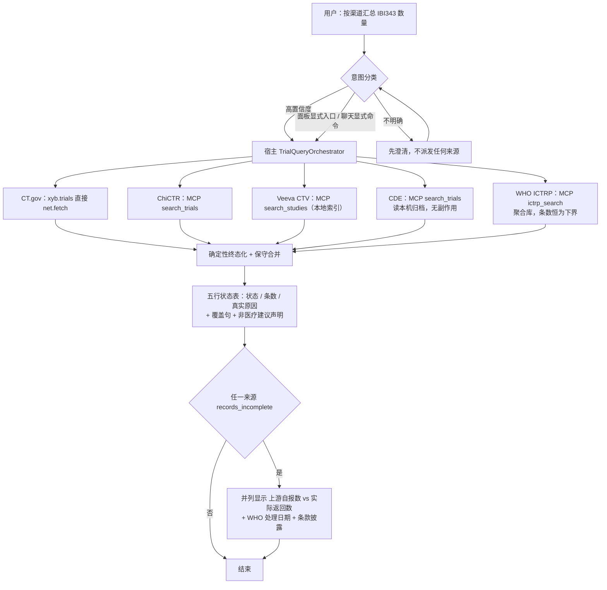

# 统一试验查询：宿主编排实现 SPEC

- [英文源规格](/spec/xyb-unified-trial-host-orchestration)

- 状态：草案，待技术/用户批准；**尚未授权实现**
- 日期：2026-10-04
- 架构依据：ADR 0311（方向已接受）
- 目标分支/工作树：`fix/xyb-records-audit-main`，路径 `/Users/qinxiaoqiang/Downloads/xiaoyibao-pi-desktop-fix-records-audit`

> **⚠️ 本页是摘要 + 提纲，不是完整规格。** 英文版（`/spec/xyb-unified-trial-host-orchestration`）是唯一权威版本。本页已补齐 §4.2–§4.4、§5.2–§5.3、§9–§14、§15.1–§15.12 的要点，并**额外收录** §15.13–§15.16、§15.20–§15.37 的宿主侧实现与十七处真缺口（英文版对应各节的要点，因这些节记录的是本轮实现事实）。缺口编号按**首次记录顺序**连续编号（§15.15 为第 3 处 … §15.36 为第 19 处），与英文版逐节一致；但**仍不含**完整正文：§6.2 描述符完整类型、§6.3 临床细化原则、§6.5 框架缺口、§7 种子分发完整规则、§8 评测语料细节、§10 各组验收条目全文、§13 门禁论证、§14 矩阵逐行、§15.3.5 探测细节与 §15.8 字段陷阱清单。
>
> 涉及实现取值（并发数、期限、原因码、验收条目编号）时，**一律以英文版为准**。中文与英文冲突即为英文版的缺陷，须先修正英文版。

## 1. 目标与非目标

建立一个**由宿主自有**的临床试验查询操作，供聊天与面板显式入口共用。一旦触发，它会按照「权限中介」的宿主路径逐个尝试每个合格来源，为每个合格来源返回结构化结果，隔离局部失败，并让宿主界面准确说明本次到底跑了什么。

自然语言路由本身必然不完备：高置信度可直接路由；意图不明确时必须先澄清；显式查询入口绕开分类。本功能**不承诺**能识别任意说法。

本文是草案。**在用户明确批准本 SPEC 之前，不开始任何宿主实现。** 接受 ADR 只代表同意架构方向，不代表授权改代码。

非目标：重写采集器、对检索列表页做浏览器抓取、绕过验证码或登录、自动执行环境安装/Cookie 获取、给出临床建议、未经授权安装依赖、未经单独授权提交/推送/合并。

## 2. 证据与架构约束

来源为：ClinicalTrials.gov（`xyb.trials`，直接 `net.fetch`）、ChiCTR、Veeva CTV、中国药物临床试验登记平台、WHO ICTRP（后四者是 `xyb.trial-sources` 自有的 MCP 服务器）。

> **修订记录（2026-10-04）：** WHO ICTRP 于 2026-10-04 由用户确定作为第 5 个来源接入，集成方式见 §15。本 SPEC 其余章节中原写为「四来源」的表述，除历史实测证据（§2.1）外，均应理解为「五来源」。

### 2.1 dev app 实测证据（2026-10-03/04，会话 `960381b1`）

同一句请求“查询下ibi343临床试验信息数量，按照渠道-数量输出结果”的两次运行：

- 运行 A（23:16:36–23:17:09）：`Skill` 加载 → 5× `ToolSearch` → CT.gov 成功 880ms → ChiCTR 455ms 失败（`NETWORK_ERROR`：`browserContext.newPage: Target page, context or browser has been closed`）→ Veeva 成功（MCP 254ms / 工具 7318ms）→ `chinadrugtrials_get_collector_status` 成功 → 回合随即结束，状态表写“中国药物临床试验登记平台 NOT_ENABLED — 本工具未在当前上下文就绪；本次未查到”。**`xyb_trials_unify` 从未被调用。**
- 运行 B（23:18:52–23:19:48）：用户追问“这个不是本地有json文件吗”，随后手打 `search_trials`；助手才调用 `get_collector_status`（`ok=true`，305ms）再调用 `search_trials`（`ok=true`，MCP 8606ms / 工具 12060ms），得到 5 条 CTR 记录——这才是正确结果。

由此暴露三个缺陷，各自对应本 SPEC 的改动：

1. **是收尾缺陷，不是取数缺陷。** 所有真正跑过的渠道都返回 `ok=true`；composite 在一个来源 `NOT_ENABLED` 的状态下静默停止，且没有做聚合。用户之所以拿到正确答案，唯一原因是他自己补上了缺失的工具名。§4.1/§5 必须把“所有合格来源都被尝试 + 确定性终态化”变成**宿主操作自身的属性**，而不是指望助手自觉遵守。
2. **`NOT_ENABLED` 与事实不符。** CDE 当时是启用的、可达的，采集器也可用；真实原因是“工具不在当前上下文”（工具发现/目录问题）。因此本 SPEC 要求该类情况必须报 `NOT_QUERIED / TOOL_UNAVAILABLE` 或 `NEEDS_SETUP`，**禁止把“未启用”当作默认标签**。
3. **CDE 并不需要原先担心的交互式准备。** 在用户 environment 已就绪的前提下，`search_trials` 单次调用即成功（8606ms）。每次检索确实会产生本地归档副作用，但实际操作摩擦远低于“重新登录”。原设计据此把 CDE 排除在静默扇出之外、要求每次同意；**该设计已被用户否定**（见 §4.3 修订记录）：写盘不是破坏性操作，且每次同意会重新制造“用户被迫手打工具名”的失败模式。现行为 **CDE 随包带冷启动数据、读本机归档无副作用、与其他三源同等纳入扇出**（§7）。

其他实测证据：

- ChiCTR 在本机间歇性不稳。2026-10-03/04 期间 `chictr/search_trials` 在成功（6.9–11.3s）与失败（24/48/408/437ms，`browserContext.newPage … has been closed`）之间交替。Playwright 缓存目录（`chromium-1243`、`chromium_headless_shell-1243`）当时存在，并于 10-04 06:15 重新下载。宿主记录的 `errorCode` 是 `TOOL_FAILED`，内层 `code` 为 `NETWORK_ERROR`。跨相邻运行的直接重试确实成功（22:36:06 失败 → 22:44:54 运行 → 22:45:13 成功）。这是 §4.4 有界重试策略的具体依据。
- 宿主日志里 CT.gov 结果数为 5，用户看到的表格也是 5，但 `xyb.trials_search` 的 `pageSize`/上限由调用方给出，且 details 里有 `dropped` 字段；在未报告截断的情况下，条数只能算**下界**。§5.3 要求显式 `truncated` 标志。
- Veeva 的 MCP 调用仅 254ms，但工具调用耗时 7318ms；其 2 条命中（`NCT07066098`、`NCT07483554`）与 CT.gov 结果完全重复。Veeva 是本地索引，增加延迟，且本次没有带来新的登记号；§4.3 保留它，但要求按 §5.2 标注本地索引来源与新鲜度。
- ChiCTR 的 `search_trials` 实际以 `{keyword, max_results}` 调用，而 CT.gov 与 Veeva 用 `{condition, terms}`。**跨来源的参数映射不能交给模型**，应由宿主来源注册表负责（§4.1、§5.1）。

### 2.2 宿主与权限约束

- 插件 SDK **没有**跨插件调用 MCP 的能力。面板自定义 bridge 调用只会转发给来源插件自己的 `onPanelInvoke`。
- `apps/desktop/resources/plugins/xyb.trials` 没有跨插件 MCP 调用的能力，其 Electron 主进程注册插件 MCP 路径与此类似。
- 直接调用已注册的 execute 闭包会绕过常规 `tools.execute` 权限判定，因此本 SPEC 要求走中介子派发契约。
- 插件 MCP 的风险语义在 `crates/host-core` 中定义，`risk: "medium"` 代表 Ask 审批模式下需要用户明确同意。

## 3. 总体流程

### 3.1 端到端主流程



## 4. 架构

### 4.1 共用的宿主操作

新建聚焦的宿主自有 `TrialQueryOrchestrator`，以及一个**封闭**的来源标识注册表。编排器不在 5000+ 行的 `plugin-runtime.ts` 内。

### 4.2 子调用分发

每个子调用经 **host-core `tools.execute`** 派发，携带唯一子工具调用 ID 与原始会话/回合；**不得**走 execute 闭包或裸 MCP 客户端捷径。composite 自身的批准**不等于**子调用的用户同意。来源参数映射由框架按 `argShape` 负责，不交给模型猜。

### 4.3 来源纳入条件

- **ChiCTR**：`xyb.trial-sources` 已启用、`mcp.server.local` 与进程启动检查通过、对应 MCP 工具确已注册。
- **Veeva CTV**：同样检查；须标注本地索引来源与新鲜度，区分 `INDEX_EMPTY` / `NEEDS_SETUP`。它是本地索引，不是实时远端查询。
- **中国药物临床试验登记平台（CDE）**：**与前三个来源同等纳入扇出**（用户已否决原同意闸门设计，理由见 ADR 0311 §4 的取代说明）。扇出读本机归档，**无副作用**；归档为空报 `NEEDS_SETUP`。只有联网取数（`search_trials` / `sync_incremental`）涉及写盘，不在扇出内。`setup_environment` / `update_cookie` / `refresh_cookie` **永不隐式调用**。
- **WHO ICTRP**：插件启用 + 四级探测通过 + `ictrp_search` 确已注册时纳入；详见 §15。

### 4.4 并发、期限与重试

并发上限 **4**（原为 3）；单来源期限 CT.gov 20s / ChiCTR 45s / Veeva 15s / CDE 30s / ICTRP 60s；整体期限 **75s**（原为 50s），必须大于单个最长来源期限。ICTRP 不重试；ChiCTR 允许一次有界重试（启动类失败且 <2s）。迟到的结果只进审计，不改写已返回结果。

## 5. 契约

### 5.1 输入

聊天工具 schema 只接受 `terms` 与 `condition`。

### 5.2 各来源结论（v1 为五来源）

结果包含 `clinicaltrials_gov`、`chictr`、`veeva_ctv`、`chinadrugtrials`、`who_ictrp`。每个结论包含状态、原因码、面向用户的安全说明、`attempted`、耗时、条数、已校验记录，以及来源/新鲜度信息。

状态集合：`SUCCESS` / `NO_RESULTS` / `NOT_ENABLED` / `NEEDS_SETUP` / `NOT_QUERIED` / `TIMEOUT` / `CHALLENGE_REQUIRED` / `FAILED`。终态化时每个来源恰好一个终态，且只有 `SUCCESS` 与 `NO_RESULTS` 算作「查过」。

> **`NOT_ENABLED` 的唯一用法（英文 §5.2 为权威）：** 仅当该来源被来源/插件设置**明确**关闭时才用。**MCP 工具未注册 ≠ `NOT_ENABLED`**，应按证据报 `NOT_QUERIED` + `TOOL_UNAVAILABLE`，或 `NEEDS_SETUP`。这是 2026-10-03 实测踩过的坑（已启用且可用的 CDE 被误标 `NOT_ENABLED`，导致用户没拿到本可拿到的结果）。

### 5.3 聚合结果

`TrialQueryResult` 包含 schema 版本、宿主 ID、规范化查询、五个结论、覆盖计数、带来源标记的规范化记录、保守合并候选、开始/耗时/取消字段，以及非医疗建议声明。`complete=true` 仅当五个结论都是 `SUCCESS` 或 `NO_RESULTS`。去重**只**按规范化登记号；标题相似不足以合并。

## 6. 来源扩展框架

由于已有插件的声明式能力已经足够，本 SPEC 采用来源描述符 + 封闭注册表来收敛。

## 7. 随包分发、冷启动数据与更新（Veeva / CDE）

### 7.1 需求

Veeva 与 CDE 均带随包只读种子，安装后首次运行会补齐复制到用户目录。

### 7.2 责任边界

Veeva 种子为 SQLite 库 `<插件>/data/ctv.db`，CDE 种子为结构化 JSON 目录 `<插件>/data/chinadrugtrials/`。

### 7.3 种子生命周期

查询只读本机，自动/手动更新写入用户副本。

### 7.4 种子内容红线

不得包含凭据与站点原始响应留档。

### 7.5 更新路径

包含 24h 一次的增量自动 bootstrap，以及设置页的手动更新。

### 7.6 界面新鲜度与可见性

标注本地索引/归档构建日期。

## 8. 意图路由与评估

不确定样例请求澄清且不派发，避免误触发。评测为带版本的语料（≥40 正例、≥40 反例），要求召回 ≥95%、误触发 ≤5%；不达标则退回澄清 + 显式入口，不得上调阈值掩盖。

## 9–14（提纲，详见英文 §9–§14）

- **§9 改动面与冻结清单**：编排器**不得**塞进 5000+ 行的 `plugin-runtime.ts`。以下四个工作区未提交文件**冻结、不得并入、不得 reset/discard**，直到单独评审确认范围：`apps/desktop/resources/plugins/xyb.trials/lib/unified.js`、`.../xyb.trials/main.js`、`.../xyb.trials/views/trials.html`、`apps/desktop/test/xyb-trials-unified.test.mjs`。
- **§10 验收标准**：分组、组内从 1 重新编号——路由 1–4；权限与执行 1–10；契约、UI 与验证 1–7；随包分发与冷启动数据 1–9（历史别名 22–28 / 24a / 24b）；来源扩展框架 1–3（历史别名 29–31）。引用一律写「§10「组名」第 N 条」，扁平编号无效。**WHO ICTRP 组正文在 §15.9**（组内 1–10，历史别名 32–40 仅覆盖 1–9），§10 只登记其存在。
- **§11 第一刀**：先做一个只读/契约测试，证明 host-core 子分发确实能重入；**若证明不了就停下来修 SPEC**，不继续堆实现。
- **§12 回滚**：composite 可独立禁用；**永不删除** CDE 用户归档。
- **§13 待确认门禁 1–13**：含 ICTRP 三项——(10) 开箱即用边界三选一（`NEEDS_SETUP` + pip 指引 / 随包 Python 运行时 / 证明目标环境已装依赖），**在决定前不开始 vendoring**；(11) vendored 版本的同步权责；(12) 冷缓存 `limit=100` 的耗时是否落在 60s/75s 内；(13) WHO 条款与商业性质的法律/产品定性。
- **§14 追溯矩阵**：每一行缺陷 ↔ 规格章节 ↔ 验收条目，含 ICTRP 的 10 行（KRAS 缺 29.0%、聚合库重叠、Python 运行时不受控、7 工具仅 1 入扇出、WHO 条款、下界语义、缓存写失败非致命、并发取值失效、`MCP_CALL_TIMEOUT_MS=100s` > 60s、`NODE_LAUNCHERS` 缺 `python3`）。

## 15. 第 5 个来源：WHO ICTRP

### 15.1 需求与非目标

成为并列第 5 个通道，随包 vendoring Python 模块实现开箱即用。非目标：6 个本地工具不进扇出；不提供 ICTRP 冷启动种子（缓存是运行时产物）；不动 §9 冻结的四个 `xyb.trials` 文件。

### 15.2 来源性质

CSV 导出静默不完整，条数恒为下界，与 ChiCTR 有系统性重叠。

### 15.3 集成方式

通过 `xyb.trial-sources` 自带 `ictrp` stdio MCP 服务启动，依赖 `mcp`, `httpx`, `pydantic`。

### 15.4 探测与降级

四级探测，逐级给出**唯一**原因码（英文 §15.3.5 为权威）：

| 步骤 | 检查 | 终态 | 原因码 |
| --- | --- | --- | --- |
| 1 | `python3 --version` ≥ 3.10 | `NEEDS_SETUP` | `PYTHON_RUNTIME_MISSING` |
| 2 | `import ictrp_mcp.server`（随包模块） | `NEEDS_SETUP` | `VENDOR_FILES_MISSING` |
| 3 | `import mcp, httpx, pydantic` | `NEEDS_SETUP` | `PYTHON_DEPS_MISSING` |
| 4 | MCP 握手且 `tools/list` 含 `ictrp_search` | `NOT_QUERIED` | `SOURCE_LAUNCH_FAILED` |

`COLLECTOR_NOT_READY` **不用于** ICTRP 探测链（保留给 CDE 归档未就绪场景）。环境探测失败报 `NEEDS_SETUP` 并提供一行复制执行的 `pip install` 命令。

探测在**插件侧**执行，扇出编排与终态化在**宿主侧**；两者的结果传递通道由第一刀契约测试确定，在此之前不得开始实现。

### 15.5–15.12（提纲，详见英文 §15.5–§15.12）
- **§15.5 契约增补**：新增原因码 `UPSTREAM_RESULT_INCOMPLETE`（降级成功，非失败）、`CACHE_WRITE_FAILED`（仍返回结果）、`AGGREGATOR_OVERLAP`（审计信息）；`SourceResultV2` 新增 `upstreamReportedTotal` / `matchedRowsReturned` / `upstreamIncomplete` / `overlapWith`。合并规则：同一登记号 ChiCTR 直连优先于 ICTRP，CT.gov 优先于 ICTRP，ICTRP 独有记录不得丢弃。
- **§15.6 并发与期限**：并发 3 → **4**；ICTRP 单来源 **60s**；整体 50s → **75s**（= 60 + 15 余量），整体期限必须大于单个最长来源期限。ICTRP **不重试**。`defaultLimit` 固定 100。**派发顺序按最长处理时间优先（LPT）**，即 ICTRP 第一个出发（见 §15.13 的排程论证；此结论取代早先「ICTRP 最后」的草案）。
- **§15.7 WHO 条款**：须标「WHO ICTRP」、显示 WHO 处理日期、声明每周同步而非实时、不得暗示排他性、不得使用 WHO 名称/徽标、**禁止营销或商业用途**、声明无隶属关系。
- **§15.8 字段陷阱**：`matched_rows_returned` 键名；`upstream_reported_total` 不得并入总数；`phase_code` 的 `NA`/`OTHER` ≠ 缺失；`recruitment_status` 大小写不一致需用 `recruitment_status_normalized`；`target_size_total` 形态多态；国家名为英文名而非 ISO 码；ChiCTR 的 `results*` 填充率约 0。
- **§15.9 验收标准**：组内 1–10（历史别名 32–40 仅覆盖 1–9）。**注意本组正文在 §15.9，不在 §10**；引用写作「§15.9「WHO ICTRP」第 N 条」。
- **§15.10 改动范围 / §15.11 回滚**：新增 `mcp/ictrp/`、`skills/who-ictrp.md`、测试与校验脚本；改 manifest、插件 `main.js` 探测、宿主描述符与状态机、UI、接入指南。删描述符 `who_ictrp` 条目即回滚，其余四来源行为不变；用户缓存目录回滚不删。
- **§15.12 待确认**：Python 依赖是开箱即用最大风险；vendored 版本同步权责；`ICTRP_TIMEOUT` 冷缓存下是否足够。
  - **已销账（2026-10-05）**：原「未决：用户自行配置 ICTRP MCP 时会绕过编排器，重复计数无去重，下界会变成上界」已由 `detectManualOverlaps()` 处理——手工 MCP 服务**永不进入扇出**，但同源重叠会作为 `overlaps` 随结果返回并由 UI 显著提示（见 §15.14）。

### 15.13 宿主侧扇出实现（2026-10-04，切片 1–2）

来源描述符表 `apps/desktop/electron/main/trial-sources.ts`：五个来源按 §5.2 的固定顺序登记（`clinicaltrials_gov` / `chictr` / `veeva_ctv` / `chinadrugtrials` / `who_ictrp`），每项含 `key` / `label` / agentTool 或 MCP 三元组 / `timeoutMs` / `defaultLimit`。派发顺序由 `dispatchOrder()` 按 `timeoutMs` **降序**导出（LPT：最长处理时间优先），平局按注册表顺序稳定排序，得 `who_ictrp → chictr → chinadrugtrials → clinicaltrials_gov → veeva_ctv`。

**为什么按 LPT 而不是「短任务先跑」**：在并发 4 下模拟两种排程——LPT 墙钟 **60s**（余 15s 余量），最短优先 **75s**（恰好顶到整体期限，零余量）。有无余量只取决于 ICTRP 是否在 t=0 出发，与并发度无关。

**预算**：`crates/host-core/src/tool_budget.rs` 的 `MAX_IN_FLIGHT_PLUGINS` 与 `MAX_IN_FLIGHT_PER_SESSION` 由 4 提到 **6**。理由：复合工具自身占用 1 个 plugin + 1 个 session 许可，剩余 3 个不足以放 5 个子调用；不提升的话第 4、5 个子调用会排队到 30s 后以 `HOST_OVERLOADED` 失败，**掩盖真正的原因**并破坏 75s 整体期限。已加测试 `admits_a_parent_plugin_call_and_its_five_fanout_children` 钉住该数值。

### 15.14 宿主侧扇出实现（切片 3：broker、适配器、UI 与重叠提示）

`apps/desktop/electron/main/trial-fanout.ts` 是薄 broker：`createFanoutBroker()` 负责派发，`runFanout()` 负责调度（并发上限取注册表而非调用方；子调用去重；整体期限只停止**发起**新工作，已开始的报 `TIMEOUT`、未开始的报 `NOT_QUERIED` + `OVERALL_DEADLINE`；晚到的结果不得改写已返回的结论）。`runTrialComposite()` 是复合工具入口。

**子调用必须重入 `tools.execute`**：`apps/desktop/electron/main/runtime/host.ts:278-292` 的 `dispatchChild` 走通用 `h.call("tools.execute", {...})`，因而保留权限提示、会话授权、准入预算与审计记录四项；直接调 `tool.execute` 会跳过全部四项，产生五次用户从未批准的、无法归因的调用。

**归因**：`runtime/host.ts:297-304` 用 `activeToolCallKey()` 把每个子调用登记为**父调用的子项**（`parentToolCallId: q.toolCallId`、`agentName: child.label`），使审批提示能说出「是哪个来源在问」（ADR 0062），而不是一个裸工具名。

**契约分界**：`runFanout` 的返回值是**派发序**，而 `aggregate()` 恢复**注册表序**。两者不同是刻意的——派发序是调度事实，呈现序是用户看到的表。

**`aggregate()` 的完整性**：无论调用方是否产出了结论，每个已登记来源都会在 `statuses` 里占一行；缺失的结论被终态化为「从未被问」（`NOT_QUERIED`），**绝不**变成空结果集。

**手工 MCP 重叠**：`detectManualOverlaps(manualTools)` 以同 `serverId` 为强信号（`normalizeServerId()` 小写化并去除非 `[a-z0-9]`，使 `Veeva-CTV` / `veeva_ctv` / `veeva ctv` / `veevaCtv` 全部命中），工具名撞内建 `toolName` 为弱信号。`apps/desktop/electron/main/runtime/host.ts:265-274` 用 `userMcp.listRecords()` 喂入（那是唯一能拿到「用户配置了哪些 server id」的入口）。**理由**：两条链路不去重，合并计数会静默从下界变成上界——**静默才是失败模式，不是重复**。

**UI**（`apps/desktop/resources/plugins/xyb.trials/views/trials.html`）：双数字下界（两个数字必须分开显示，相差 >0 时补一句「未取到的部分不代表不存在」）、WHO 归因与处理日期（条款 4.b(1) 标来源、4.b(3) 显示 WHO 处理日期，并链到 WHO 条款原文）、手工 MCP 重叠提示。

**面板的诚实边界**：面板只能走本插件自己的通道（`onPanelInvoke`），既拿不到宿主编排器的扇出结果，也没有枚举用户手工 MCP 服务器的 API。因此面板传空 `sourceResults`，五个来源如实报「本次未查询」——**宁可承认自己没查，也不假装查完了五处**。真·五渠道扇出发生在助手回合里（`plugin_xyb_trials_xyb_trials_fanout` → 宿主 broker → 五个子工具），双数字、条款归因与重叠提示都由那条路径产出。

### 15.15 第三个真缺口：字段在两端都「有」，中间没有翻译层

**症状**：UI 的双数字（`upstreamReportedTotal` / `matchedRowsReturned`）与 WHO 处理日期（`processedAt`）**在真实链路上恒为 `undefined`**，无论 ICTRP 服务实际报告了什么。

**为什么三方都「看起来」没问题**：`ictrp_mcp/tools.py` 确实返回 snake_case 的 `upstream_reported_total` / `matched_rows_returned` / `provenance`；`trial-orchestrator.ts` 的 `terminalise()` 确实搬运 camelCase 的 `outcome.upstreamReportedTotal`；`lib/unified.js:237` 确实透传 `processedAt`；`trials.html` 确实渲染这三个值。**缺口在中间**：`trial-fanout.ts` 的 `interpretDispatchResult()` 只读了 `truncated`，从未读过服务真实发出的键，也从未把 WHO 日期写进 `SourceOutcome`（该类型此前根本没有 `processedAt`）。

**为什么既有测试没抓到**：`xyb-trials-ictrp.test.mjs` 与 `xyb-trials-orchestrator.test.mjs` 都是**把 camelCase 字段直接注入 outcome**，验证了 `terminalise` 的算术，却把「谁生产这些字段」整段跳过了——测试与实现共享了同一个未经验证的假设。

**第二层更隐蔽**：`plugin-mcp.ts:586` 的 `callTool()` 返回**原始协议结果** `{content:[{type:"text",text:"<json>"}], isError}`，而插件自注册工具返回结构化对象。两者走同一条 broker 入口，原有 `extractRecords()` 只认顶层键，对 MCP 包装层会抛 `unrecognised envelope`——一个健康的渠道会长着一张空结果的脸。

**处置**：①新增 `unwrapToolContent()` 剥掉 MCP `TextContent` 包装（浅且非破坏性：结构化载荷原样通过；解析不出 JSON 的纯文本**原样保留**，把解析失败洗成空结果等于把「读不懂」伪装成「没有」）；②`lowerBoundEvidence()` 做 snake_case→camelCase 翻译，只对声明的下界来源生效、缺数字留 `undefined` 绝不写 0、WHO 日期原样取自 `provenance` **绝不回退到 `Date.now()`**（那是「我们何时取的」，会显得权威而其实是错的）；③`SourceOutcome` 与 `SourceConclusion` 各增 `processedAt?: string`；④`extractRecords()` 也先过 `unwrapToolContent()`。

**教训（第四条）**：「两端都有这个字段」不等于「它们说的是同一个字段」。契约的断裂点常在中间那层没人测试的翻译代码里；而组件测试若与被测代码共享同一个未验证假设，它验证的只是下半截。新增跨进程/跨语言来源时，必须有一条测试**从服务真实发出的字节开始**（真实的键名、真实的包装层）。**正确的一半 + 正确的另一半 ≠ 正确的整体。**

### 15.17 运行时探测：把「没问到」和「没法问」分开（摘要）

`PYTHON_RUNTIME_MISSING` / `PYTHON_DEPS_MISSING` 此前只存在于合同与测试文本中，没有生产代码发出它们。真实链路是：`python3` 不存在 → MCP 服务器起不来 → 工具从未注册 → 子调用 `NOT_FOUND` → `NOT_QUERIED` + `TOOL_UNAVAILABLE`。这个答案是真的但没用：用户需要听到的是「Python 不在，请运行这一行」。到派发失败那一刻原因已经消失，所以只能**重新探测**——「目录里没有」与「本可以注册但环境不满足」在观测上完全同形。

处置：新增 `apps/desktop/electron/main/trial-runtime.ts`，按 §15.3.5 顺序探测（`python3 --version` ≥ 3.10 → `import mcp, httpx`），**在第一个 `missing` 处停止**；描述符新增 `requiresRuntime`（只有 `who_ictrp`）；broker 新增可注入 `probeRuntime`，**仅在该来源工具缺席时**调用；`SourceOutcome`/`SourceConclusion` 新增 `fixCommand` 供 UI 给出一行可复制修复命令。

三条刻意性质：**`unknown` 绝不提升为 `missing`**（让人安装已装好的东西比什么都不说更糟，还会掩盖真病因）；`ok` 不等于「注册失败与运行环境无关」；`VENDOR_FILES_MISSING`/`SOURCE_LAUNCH_FAILED` 保持保留状态——本模块不做随包树校验与进程启动，发出没做过对应检查的诊断就是编造病因。

顺带修好宿主能力缺口：第 10 条第一项要求 `ictrp_search` 携带 `callTimeoutMs = 60000`，但 SDK 的 `PluginMcpServerContrib` 根本没有该字段，调用会回落到默认 100s。现已新增字段、校验（拒绝非正整数）、按服务覆盖与清单声明（只给 `who-ictrp`）。

### 15.18 来源标注要写出「经谁收录」（摘要）

`mergeGroup()` 早已输出 `primarySource`/`mergedFrom`，权威序也让 ChiCTR 直连版保留为主记录，但「ICTRP 版本标注为『ChiCTR via WHO ICTRP』」只存在于注释里，没有代码产出。`mergedFrom` 记录的是**哪些**来源贡献了记录，没说它们之间**是什么关系**——而决定「去哪核对更新」需要后者。处置：新增 `sourceAttributionLabel(primarySource, source)` 与 `sourceLabels`，主记录不加 `via`、聚合库收录另一手来源写 `「<一手来源> via <聚合库>」`（名字取自 `SOURCE_OVERLAPS` 而非硬编码，否则每条 NCT 记录都会标错）、无重叠关系不发明 `via`、未知 key 回退原始 key 不返回空串。面板优先渲染 `sourceLabels`。

附带一条测试自身的教训：断言 `sourceAttributionLabel("clinicaltrials_gov","who_ictrp")` 应为「WHO ICTRP」时失败了——**是断言错了，不是代码错了**。失败时先读代码确认哪一侧错，不要为了让测试变绿而改代码。

### 15.19 第四个真缺口：单条记录的夹具让「解信封」与「不解信封」无法区分

**症状**：`apps/desktop/electron/main/trial-fanout.ts` 的 `extractRecords()` 第一行是
`if (Array.isArray(content)) return content;`，而 MCP 工具的返回值本身就是数组
（`{content: [{type: "text", text: "<真正的载荷>"}], isError}`）。于是**每一个** MCP 来源
都在解信封之前就把长度恒为 1 的包装数组当成了记录列表：四来源**无论实际返回多少条，都只上报 1 条**。

**为什么 3422 条测试没抓到**：`xyb-trials-fanout.test.mjs` 的夹具里 `trials` **只有一条**。
当包装数组长度恰等于正确记录数时，错误实现与正确实现**输出相同**，测试对它完全免疫。
这是 §15.15 的同一形状第三次出现，但更隐蔽：**夹具的规模让两条不同代码路径产生相同输出**。

**处置**：先解包再判数组；夹具改为 3 条记录并注明理由；断言从「包含某条」改为断言**数量**；
反向自证（把该行挪回第一行即失败，还原后 47/47）。

**第五条教训**：**只断言「里面有对的元素」，永远抓不到「里面只剩那个元素」。**

### 15.20 第五个真缺口：宿主拦截的是一个「不存在的工具名」

`pluginToolName()` 会把插件 id 里的点换成下划线，所以 `xyb.trials` 的工具在目录里是
`plugin_xyb_trials_xyb_trials_fanout`；而 `TRIAL_COMPOSITE_TOOL` 原先手写成
`plugin_xyb.trials_xyb_trials_unify`（点还在）。两者**永不相等**，于是整个宿主扇出
（状态机、LPT 派发、双数字下界、条款归因、重叠检测）在生产环境**一次都没执行过**，
只有测试在跑——因为测试直接调 `runTrialComposite`，从不问宿主拿哪个字符串比对。

**处置**：常量改为 `pluginToolName(TRIAL_PLUGIN_ID, "xyb_trials_fanout")` 推导；
按用户裁决拆成两个工具名——`xyb_trials_fanout`（宿主扇出入口）与
`xyb_trials_unify`（插件内合并，宿主不拦截）；`normalizeQuery` 补认复数 `keywords`。
新增 6 条测试（名字推导、两名不等、manifest 齐备、六种输入形状、原因码穿透聚合），
并以「改回手写点形即失败」反向自证。
详见英文版 §15.20 与 `apps/desktop/test/xyb-trials-registry.test.mjs`。

### 15.21 对抗审计的另外四项发现

1. `UPSTREAM_RESULT_INCOMPLETE` 原先无产出（`terminalise` 一律 `"OK"`）——
   已在该分支改写，状态仍是 `SUCCESS`（这是降级成功不是失败），只是多了可分支的原因码。
2. `xyb-trials-ictrp.test.mjs:223` 是空洞测试（断言自己的夹具）——已替换为两条真正
   属于合并层的测试；反向自证：让状态由说明关键词推导时，旧测试全绿、新测试如期失败。
3. 第 10 条第三款（10s 握手界）无断言且 `connectTimeoutMs` 不可由 manifest 配置：
   实测 0.36s 回复、行为无问题，**据实登记为未建**，不虚报。
4. 面板路径永不填充双数字块与条款块：这是**诚实边界**而非缺陷，已在面板注释写清。

### 15.22 第六个真缺口：记录级归属在宿主路径上从未发生

面板的记录卡片写好了三级来源标注，插件合并器的 `sourceAttributionLabel()`
也能算出「ChiCTR via WHO ICTRP」，但**走宿主扇出路径时两个都拿不到值**，
卡片会渲染成「来源：undefined」。

因果链与前四个缺口同源——**两端都有，中间没有**：宿主的 `aggregate()` 只做了
`statuses.flatMap((s) => s.records)`，既不合并不打标签；而各后端的原始行
**根本没有 `source` 字段**（真实 ICTRP 载荷以 `trial_id` 为主键，
`'source' in trial` 为 false）。`sourceLabels` 只由 `unified.js` 的合并器产出，
扇出路径从不经过合并器。于是 §15.16 修好的记录级归属、以及 WHO 条款 4.b(1)
要求的「ChiCTR via WHO ICTRP」（§15.9 第 6 条），在真正会跑的路径上
**一次都没显示过**。

**为什么测试没抓到**：`xyb-trials-ictrp.test.mjs` 直接调那个纯函数，
验证「算得对」；`xyb-trials-orchestrator.test.mjs` 只看 `statuses` 终态，
不看 `records` 形状。两边全绿，中间「谁给记录打标签」没有任何断言。

**处置**（`electron/main/trial-orchestrator.ts`）：新增 `tagRecords()` 逐条打
`source` / `sourceLabel`（原始字段保留不覆盖）；新增宿主侧 `SOURCE_OVERLAPS`
与 `firstHandKey()` / `normalizeRegistryName()`，寄存器名折叠成只留字母数字
再比对，否则 `"ClinicalTrials.gov"` 永远匹配不上键 `clinicaltrials_gov`。
**未建模的登记库保持安静**——真实快照横跨 JPRN/EU CTIS/ANZCTR 等十几个库，
给它们编「via WHO ICTRP」会暗示一条本应用并不具备的一手通道。
宿主副本与插件副本必然可能漂移，故加了一条对照两者的测试。

**端到端验证（真实服务信封）**：状态 `SUCCESS`、原因码
`UPSTREAM_RESULT_INCOMPLETE`、两个数字分开（300 vs 6952）、WHO 处理日期
`"10/04/2026 15:26:10"` 原样存活、300 条中 209 条标
「ChiCTR（中国临床试验注册中心） via WHO ICTRP」、91 条标「WHO ICTRP」。

**第八条教训**：**一个正确的纯函数不等于一个被正确接线的功能。**
判别方法是问「谁在运行时给它喂数据，那个调用点有没有测试」。

### 15.23 WHO 条款披露入口

SPEC §15.7 要求 UI 的 ICTRP 结果区含一个**可折叠的条款披露入口**，内容是
六条义务本身，并附条款原文的**逐字摘录**（转述会丢
「independent of format and method of acquisition」这类关键措辞）。
核对发现此前**不存在**：面板只渲染一行归因 + 一个外链，六条义务仅写在
model-facing 的 `skills/unified-trial-query.md`。

已在 `views/trials.html` 的 `ictrp.state === "SUCCESS"` 分支内新增
`<details class="terms">`：标题「使用条款与义务（WHO ICTRP）」，
逐字引用上述措辞与「in effect as long as the user retains any of the data」
（**卸载不终止义务**，用户自行留存的数据仍受约束），六条按条款号
（4.b(1)/4.b(3)/4.b(2)/4.c/4.e/4.d）逐条列出，并声明与 WHO 无隶属关系。
新增 CSS 只使用本面板真实声明过的变量（`--ink/--body/--soft/--line/--muted`）——
CSS 自定义属性未声明不会报错，只会静默失效（§15.16 的教训）。
UI 契约测试断言：必须用 `<details>`、必须逐字引用两处原文、六条条款号齐备、
每个新 CSS 类都有规则。

### 15.24 第七个真缺口：宿主聚合器零去重，同一试验被计两次

§15.5 合并规则 1–2 与 §5.3 的 `overlapWith` 此前**只登记在 SPEC 里**：
`aggregate()` 对记录只做 `flatMap`，**没有任何去重**。实测同一条 ChiCTR 试验经
「ChiCTR 直连」与「ICTRP（`source_register = "ChiCTR"`）」两条通道到达时返回
**两条记录**、`totalRecords: 2`。

**这不是美观问题**：§5.3 第 4 条禁止把任何两个数字合并成一个，而重复计数正是
那条禁令所针对的坍缩，只是方向相反——它**虚增**。偏高数字看起来比偏低更权威、
更不易被怀疑。而 ICTRP 与 ChiCTR 的**系统性重叠**让这条路径必然被走到。

**为什么测试没抓到**：ICTRP 测试测的是 `unified.js` 的**插件**合并器（它确实
实现了合并），宿主聚合器是**另一份实现**，从没写过合并。两个模块同名同责、
不共享代码，而测试只覆盖了有的那份。

**处置**：新增宿主侧 `SOURCE_AUTHORITY` / `compareSourceAuthority()`（规则 1–2
从此是表里的数字而非 `localeCompare` 的巧合）、`normalizeRegistryId()`（**只折叠
大小写与分隔符，绝不模糊匹配**——把两个不同试验合并成一个比重复更糟）、
`registryIdOf()`（候选字段含 `trial_id`，那是 WHO ICTRP 的主键，漏掉它会让每条
ICTRP 记录都因「无登记号」而不参与合并）、`mergeRecords()` / `mergeGroup()`
（落选版本进 `perSource` 不丢弃；缺登记号的记录一律不合并）。

**端到端实测（真实种子）**：真实 ChiCTR 种子前 40 条 + 真实 ICTRP 快照前 300 条
同时喂入：340 条原始到达 → 合并后 **304 条，去重 36 条**，`countsAreLowerBounds`
仍为 true。

**第九条教训**：**同名同责的两个模块，测了一个不等于测了另一个。**
只要出现「两份实现」，就必须问：这两份的实现程度一样吗？本例中一份完整、
一份为零，而门禁全绿——因为测试认的是那份完整的。

### 15.25 第八个真缺口：记录上的链接与日期，一列都没被认出来

面板的记录卡片有「查看原始登记信息」与「信息更新于 …」两行，但走宿主扇出路径时
**恒为空**。实测真实种子共 40 条记录：可打开的链接 **0/40**、有日期 **0/40**。

因果链与前几个缺口同形——**名字对不上**：面板读 `sourceUrl`/`fetchedAt`，
插件 `normalizeRecord()` 找 `sourceUrl`/`url`/`link`，而真实载荷用的是各来源
自己的字段名：WHO ICTRP 快照用 **`web_address`（6262/6262 行）**，随包 ChiCTR
归档用 **`detail_url`（468/468 行）**，日期分别是 `last_refreshed_date` 与
`updated_at`。三个名字一个都不在候选表里，于是全部 `undefined`。

**这不是美观问题**：条款 4.b(1) 要求归因，而归因的前提是用户**能找到被归因的
那份数据**。给出一条打不开的「原始登记信息」，等于把核对责任交还用户却不给路。
**无法核验的引用不是引用。**

**处置**（`trial-orchestrator.ts` 的 `tagRecords()`）：新增 `RECORD_URL_CANDIDATES`
与 `RECORD_DATE_CANDIDATES`，在宿主侧把各来源字段折到面板读的名字上（让面板学会
五套 schema 就是把同一个问题复制五份）；已有值不被别名覆盖；**日期绝不回落到今天**——
在试验旁打印今天的日期等于断言它今天刷新过，与 §15.15 拒绝用 `Date.now()` 顶替
WHO 处理日期同理。实测修正为 **40/40** 链接与日期，样本日期是
`"2020-01-13"`（该记录真实的最后刷新日），而非今天。

**第十条教训**：**在写字段解析代码之前，先打印一行真实载荷的键名。**
上一轮与本轮的五个缺口全是同一件事的变体：两端都「有这个概念」，中间那层猜错了
字段名——而**猜错不会报错，只会静默变成 `undefined`**。

### 15.26 第九个真缺口：给一个没试过的来源编造超时原因

`aggregate()` 对所有登记来源建表，未出现在 `conclusions` 里的来源会被填上兜底结论。
原实现是 `terminalise(source, { toolRegistered: true, overallDeadline: true })`，
于是这些来源的 `reasonCode` 是 `OVERALL_DEADLINE`、文案是「整体检索时间已到，
{来源} 还没开始，本次没有查询。」——**对一个根本没人尝试派发的来源，断言了一个具体
的、从未被观察到的原因。**

生产环境不会触发（`fanout()` 对每个来源都产出结论，兜底只在调用方传残缺数组时可达），
但代码注释写的是「never asked」（从未被问过），产出的却是一个**关于为什么没问的断言**；
注释与行为不一致，且行为那一侧违反 §15.15 的同一条规则：**没人确立过的原因不得被陈述。**

**处置**：`SourceOutcome` 新增 `notAttempted?: boolean`（与 `overallDeadline` 并列并注明
区别）；`terminalise()` 新增分支产出 `NOT_QUERIED` / `NOT_ATTEMPTED` / 「{来源} 本次没有
产生结果，原因未报告。」，放在 `overallDeadline` 之前且**不再传 `toolRegistered: true`**
（那是替调用方声明了一件事，而调用方什么都没声明）；`aggregate()` 兜底改为
`{ notAttempted: true }`。反向自证：还原兜底 → 如期 `not ok 14`；还原后 42/42。
新测试同时断言 `reasonCode` 与「`explanation` 不得匹配 `/时间已到|deadline/i`」，
使「不许编造原因」本身可回归。

**第五条教训的镜像**：**「默认未上报」≠「上报为否」** 的另一面是
**「未尝试」≠「超时未及」**——两者都是把一个缺失的输入当成具体的负面事实来陈述。

### 15.27 第十个真缺口：合并规则是对的，但拿不到输入

宿主合并（§15.24）实现并测试完成后，用**真实随包种子**验证发现**一条重复都合并不了**：
ChiCTR 种子 468 条、ICTRP 中标 `source_register=ChiCTR` 的 579 条，到达 1047 → 结果 1047，
去重 **0**。我最初把 `0` 记成「这批数据恰好不重叠」——**这个解释是错的**，而且它恰好是
最危险的那种错：一个看起来合理的理由，把缺陷留在原地。

真因：随包 ChiCTR 归档把登记号放在 **`registration_number`**（实测 **468/468** 行，
形如 `ChiCTR-DCC-14004957`），而 `registryId`/`registry_id`/`nctId`/`id` **一个都没有**；
候选表里没有这个名字（宿主与插件都没有），于是每条 ChiCTR 记录都是「无登记号」，
按 §15.24 的规则**永不参与合并**。同理 WHO ICTRP 快照主键是 `trial_id`（6262/6262 行）——
宿主侧已含该名，**插件侧没有**：两份同名同责实现各漏一个不同的名字。

**为什么这是最隐蔽的一类缺陷**：合并代码本身完全正确且有测试，但测试喂的是手写的
`{id: "ChiCTR1"}`，字段名恰好命中候选表，所以全绿；真实数据用另一个名字，功能静默失效——
**没有报错、没有空值、没有警告，只是「没发生」**。这也修正了 §15.24 的验证结论：
当时报告的「去重 36 条」用的是**构造的**重叠样本，不是真实种子。
**构造样本能证明机制可运行，不能证明它被接上了。**

**处置**：两侧候选表都补 `registration_number`/`registrationNumber`，插件另补 `trial_id`；
新增**跨实现一致性测试**（直接读两份源文件，断言真实载荷会用到的每个字段名在宿主与插件
两侧都存在），让两份实现的人工同步漂移变成构建期失败；一条旧测试被**替换而非保留**——
`aggregate counts records across sources without deduplicating here` 断言的正是 §15.24
判定为缺陷的行为，它在当时能通过只是因为两个登记号字段都还没被识别，
**它在测试那个缺口，而不是测试契约**。

实测修正：到达 1047 → 结果 609，**去重 438 条**，`countsAreLowerBounds` 仍 `true`。
反向自证：删掉 `registration_number` → 3 条测试如期失败；还原后 44/44。

**第十一条教训**：**一个正确的函数配上一个不喂给它的调用点，等于没有这个函数；
一个正确的字段候选表配上一个真实载荷不用的名字，等于没有这张表。**
判别方法不是「有没有测试」，而是**「测试的输入是从哪来的」**——
凡是手写的夹具，都在替真实数据做一个没人验证过的假设。

### 15.28 第十一个真缺口：把 §15.27 的教训用在其它候选表上

§15.27 留下一个可执行的判别方法：**逐张候选表对着真实载荷点一遍**。照着做，立刻又抓到两张。

**标题**：WHO ICTRP 快照**没有** `title`/`brief_title`/`name`（**6262 行全空**），
用的是 **`scientific_title`（6221 行）** 与 **`public_title`（6260 行）**；宿主与插件的候选表都没有这两个名字。
**招募状态**：快照**没有** `status`/`overall_status`/`sourceStatusRaw`（**6262 行全空**），
用的是 **`recruitment_status`（6233 行）**；随包 ChiCTR 归档同样 468/468 行走它、一个 `status` 都没有。

实测影响（真实种子前 50 条经 `aggregate`）：修复前 **有标题 0/50、有状态 0/50**；
修复后 **有标题 50/50、有状态 48/50**。面板上就是 **50 张空白卡片**——
列表里每一条都没有名字，用户无法分辨任何两条。**「一张没有标题的试验列表，不是一张试验列表。」**

处置：宿主新增 `RECORD_TITLE_CANDIDATES`（`title` → `briefTitle` → `scientific_title` → `publicTitle` → `name`）
与 `RECORD_STATUS_CANDIDATES`（`recruitment_status` → `overallStatus` → `status` → `sourceStatusRaw` → `state`），
插件 `normalizeRecord` 同步；**别名是回退不是覆盖**（ChiCTR 自带真 `title`，不得被别的列顶掉），
且只在该字段仍为空时写入。跨实现一致性测试的字段表扩充至八个名字。

与 §15.27 是同一个缺陷：候选表写的是想象中的字段名，不是载荷里的字段名。区别只在发现顺序——
§15.27 是合并功能整个失效（有功能性症状），本节只是内容空白（看起来像「这批数据没有标题」）。
**后者更容易被当成数据问题而放过**，这正是单独记一节的理由。

反向自证：删掉新别名 → 3 条测试如期失败；还原后 48/48。

**第十二条教训**：**空白比报错更像数据。** 当界面上出现一整列空值时，第一反应往往是「上游没给」，
而真正常见的原因是**我们把它的名字拼错了**——是我们在找 `title`，而数据叫 `scientific_title`。

### 15.29 第十二个真缺口：登记号与地点——同一次清点，又两张表

把「逐张候选表对着真实载荷点一遍」做到底，剩下两张也倒了。

**登记号（`id`）**：面板每张卡片用 `it.id` 渲染登记号标签（`trials.html:215`），标题回退也是
`it.title || it.id`（`:212`）。宿主**算出过**这个值——`registryIdOf(bag)` 就是为了按登记号分组去重——
但**从不写回记录**；插件把登记号放进 `registryId`，面板读的是 `id`。
实测：**40/40 条记录都有登记号，一条都显示不出来。**

**地点**：面板渲染 `地点：` 一行读 `record.locations`（`:242`），而真实载荷里 `locations`
**一条都没有**（ICTRP 0/6262、ChiCTR 0/468）。真实用的是 ICTRP 的 **`countries`（5845/6262 行）**
与 ChiCTR 的 **`institution`（468/468 行）**。实测：**0/40 条记录渲染出地点**。

处置：宿主新增 `RECORD_LOCATION_CANDIDATES`（`locations` → `countries` → `country` → `institution`
→ `sites` → `facilities`）与 `firstList()`/`locationText()`（同时接受字符串数组与对象数组）；
已算出的 `registryId` 写回 `tagged.id`。插件输出 `id: registryId`，`normalizeLocations` 增加第二参数
接收来源特有列（**通用列表有值时它是权威，只在通用列表什么都没产出时才用补充值**），
`sourceUrl`/`fetchedAt` 同步补 `web_address`/`detail_url` 与 `updated_at`/`last_refreshed_date`，
并**删掉 `fetchedAt` 的 `new Date()` 兜底**——那正是 §15.25 拒绝过的「在试验旁打印今天」。
没有地点时返回 `[]` 而不是占位符：**未知地点不是「未知地点」这个值**。

实测修正：宿主扇出 **id 40/40、地点 39/40**；插件路径 **id / 地点 / 链接 / 日期 / 标题 全部 40/40**。
反向自证：删掉写回与地点解析 → 2 条测试如期失败；还原后 52/52。

**第十三条教训**：**算出来不等于交付出去。** 登记号被正确解析、正确用于分组、正确选了主记录——
然后没有写进结果。这是「正确的纯函数 ≠ 被正确接线的功能」（§15.22）的近亲，区别在于：
那一次是没人调用它，这一次是**调用了、用对了、但没把答案带回来**。
判别方法：把「谁需要这个值」和「这个值最后出现在哪里」分开各查一遍——只查前半截会得到「功能正常」的结论。

### 15.30 第十三个真缺口：三个调用点，两种参数形状

字段名清点完之后，把同一方法用在**参数**上，又抓到一处，而且这一处会产生用户可见的硬失败。

`lib/unified.js:596` 的签名是 `buildResult({ query, sourceResults })`，读 `query.keywords` /
`query.condition`（:654-656）。三个调用点里：**面板** `doCoverage()`（`views/trials.html:504`）
发 `{ query: { keywords, condition } }`（正常）；**助手工具** `xyb_trials_unify`（`main.js:305`）
发顶层 `{ condition, keywords }`（正常，`query` 为 `undefined`，两个字段读成空串）；
而 **扇出工具** 走宿主 `normalizeQuery()`（`trial-fanout.ts:596`），它只读顶层的
`keyword`/`keywords`/`q`/`condition`/`terms`，**没有嵌套分支**——按面板写法调用扇出会被直接拒绝，
错误是「试验检索需要一个关键词」，而检索工具吐这句最容易被读成「没有结果」。

实测（同一个 `buildResult`，两种形状）：面板形状 → `query={"keywords":"胰腺癌","condition":"pancreatic cancer"}`；
工具形状 → `query={"keywords":"","condition":""}`。第二行不产生故障（`query` 只回显、无下游消费者），
但它说明**两个调用点从来不是靠同一份契约工作的**——各自恰好能用，因为恰好都读到了自己要读的分支。

处置：`normalizeQuery()` 增加嵌套分支，读 `raw.query` 下的同一组拼写，优先级与顶层一致
（`keywords` 先于 `condition`）。空调用仍然抛错——**「形状不认识」不能退化成「空查询」**，
那会让五次空搜索变成五条「0 条结果」。反向自证：删掉嵌套分支 → 测试如期失败；还原后 48/48。

**第十四条教训**：**字段名要对，参数的嵌套层级也要对。**「我们两边都有这个字段」再一次不够——
这次连**字段在哪一层**都不一样。三个调用点各自恰好能用，是**巧合而不是契约**；
判别方法与前一条相同：把每个调用点**实际发出去的那行代码**贴到被测函数上跑一遍，
而不是读文档里的参数表。

### 15.31 第十四个真缺口：门禁自己的「真实 schema」是手抄的

把 §15.30 的方法（把每个调用点实际发出的东西贴到真实契约上跑）用在**测试**上，发现守卫本身有洞。

`apps/desktop/test/xyb-trials-registry.test.mjs` 的 `never emits a parameter the target tool does not declare`
注释写着「Each shape is checked against the real schema fragment」，但四组集合是**手抄的字面量**。逐个比对真实声明：
veeva 漏 `start_date_from`/`start_date_to`/`updated_since`；CDE 漏 `appliers`/`drugs_name`/`drugs_type`/`case_no`/
`communities`/`researchers`/`agencies`；ICTRP **错误放行 `filters`**——它由 `ictrp_filter` 声明，
`ictrp_search` 实测只声明 `descending/fields/keyword/limit/offset/refresh/sort_by`。

**当时无害纯属侥幸**：`mapArgs` 只发两三个参数，而这些在两侧都正确。但守卫的价值**全部**在于
「下一个人改 `mapArgs` 时它会不会响」，而它只认得别人告诉过它的名字——漏掉的七个 CDE 参数意味着
**任何新写的 CDE 参数映射都可能悄悄溜过这道守卫**。

处置：新增 `every parameter the fan-out sends is declared by the tool that receives it`，**从随包源码读**声明集
（CDE 与 ICTRP 直接解析随包文件；veeva 与 ChiCTR 按版本号钉住并写明来源），并断言集合非平凡，否则守卫会**空转通过**；
同时删掉旧测试 ICTRP 行的 `filters` 并改写注释。反向自证：让 `mapArgs` 多发 `filters` → **3 条测试如期失败**；还原后 28/28、全套 3457/3457。

**第十五条教训**：**守卫如果用抄来的常量描述「真实」，那它描述的是抄写时的记忆，不是真实。**
凡是「必须与另一处保持一致」的集合——字段名、参数名、状态词表、工具清单——都要么从那一处**读出来**，
要么在测试里**钉住版本号并写明出处**。一份手抄的 allowlist 只能发现它已经被更新过的那类错误。

### 15.32 第十五个真缺口：空列表替数据断言了一个它没有的原因

面板 `doCoverage()` 只能走本插件通道、传空 `sourceResults`，五个来源全部 `NOT_ENABLED`、记录数为 0，
此时渲染的是「没有找到符合条件的公开试验。可以换关键词再试。」。**零条记录的原因不是「没有匹配」，
而是「一处都没问」**——而这句话就印在覆盖面板下方，覆盖面板同一屏里正写着「本次只覆盖 0/5 处来源……**未覆盖不等于没有结果**」。
两句话互相否认，用户会相信更像结论的那句（「没有找到」），因为它读起来像一个答案。

这与 §15.26 是同一条规则的不同表面：那一次给没派发的来源编造「整体检索时间已到」，这一次给没查询的列表编造
「没有符合条件的试验」。**不知道原因时，就说不知道原因。**

处置：`render(items, note, queried)` 增加第三参数；`queried === 0` 时空态改为「本次没有查询任何来源，
所以这里没有结果——这不是「没有找到符合条件的试验」。覆盖面板列出了每一处来源的本次状态。」
`queried` 取自聚合器的 `res.sourcesQueried`，**不在面板里重数一遍**。直连 CT.gov 路径传 `1`。
反向自证：改回无条件断言 → 测试如期失败；还原后 11/11。

**一条测试自身的教训：** 新测试第一版用 `html.indexOf("没有找到符合条件的公开试验")` 定位句子，
**命中的是上方文档注释里的引用**，于是「必须落在已查询分支」永远成立——**守卫读到了注释，而不是代码**。
改成匹配字符串字面量后才是真的在查代码。**守卫必须锚在会被执行的东西上，不能锚在描述它的东西上。**

### 15.33 第十六个真缺口：三件披露里，只有一件没有句子

逐项问「助手的回合里，用户会看到这一件吗」：覆盖率有 `coverage.sentence`、下界说明有
`completeness.sentence`、双数字有 `statuses[].matchedRowsReturned`/`upstreamReportedTotal`，
都能被逐字转述；**手工 MCP 重叠只有 `overlaps: ManualOverlap[]` 裸数组**，不能。
文案只存在于面板的 `renderOverlap()`，技能文档却写着「返回体里已经有……手工 MCP 重叠提示」，
于是助手要么自己编一句，要么整条不提——而这条提示的内容是「合并后的条数不再是下界」，
正是 §5.3 禁止静默丢掉的那类结论。

处置：宿主新增 `overlapSentence(overlaps)`，`aggregate()` 返回值新增 `overlapsSentence`
（无重叠时为空串）；面板 `renderOverlap(overlaps, sentence)` 改为**渲染宿主的句子**，
不再自己拼一份（两处各写一份 → 用户读到的那份宿主并不背书，与 §15.31 是同一条规则用在**文案**上）；
技能文档同步写明「非空时必须原样呈现」。反向自证：删掉字段并让面板改回自拼 → 2 条测试如期失败；还原后 54/54 与 12/12。

**第十六条教训**：**「返回体里有这个信息」与「调用方能把这个信息交给用户」是两件事。**
一个裸数组对代码是完整的，对**转述**是空的——而助手做的事就是转述。
判别方法：对每一件披露，问**「模型会引用哪一行字」**；若答案是「它得自己编」，
那这件披露在对话路径上就等于不存在。


### 15.34 第十七个真缺口：`attempted` 的注释写的是它并不满足的那个等价

`apps/desktop/electron/main/trial-orchestrator.ts` 的 `terminalise` 上写着
「`attempted=true` 当且仅当派发已经开始」，测试标题是
`attempted is true exactly when dispatch started`——**「当且仅当 / exactly when」是一个等价断言**。
把 broker 能报的全部 outcome 交叉跑一遍 8 个终态，实测关系是：

| `attempted` | 状态 | 含义 |
| --- | --- | --- |
| `false` | `SUCCESS` / `NO_RESULTS` | 问到了答案 |
| `false` | `NOT_QUERIED` / `NOT_ENABLED` / `NEEDS_SETUP` | 没有派发：我们没问 / 用户关了 / 环境没就绪 |
| `true` | `TIMEOUT` / `CHALLENGE_REQUIRED` / `FAILED` | 派发了但没拿到答案 |

代码是对的（`NOT_ENABLED`/`NEEDS_SETUP` 报 `false` 符合 §5.2「只有 SUCCESS 与 NO_RESULTS 算作查过」），
**错的是文档与测试标题对它的描述**。两个后果：①把 `false` 读成「没问」在
`NEEDS_SETUP`/`NOT_ENABLED` 上偏离原意；②把 `true` 读成「有数据」在三个失败态上偏离原意。
「当且仅当」这种措辞恰恰让人相信反方向也成立。

**处置**：代码注释与 SPEC 都改写为上面这张表，并写清
「`isQueried(state)` 蕴含 `attempted`，反之不成立」；测试从**逐条枚举**改成
**在 8 个终态上的等价断言**，并加一条**空转保护**：若某个终态在本用例的 outcome 空间里
不可达就失败——否则「对全部终态的等价性」可以在只覆盖一半的情况下全绿。
逐条枚举正是漏掉 `NOT_ENABLED`/`NEEDS_SETUP` 两行的原因。

**两次反向自证都写明，因为第一次是无效的**：把 `NEEDS_SETUP` 分支包一层 `dispatched(...)`
**没有让任何测试失败**——因为 `dispatched = (extra) => ({ attempted: true, ..., ...extra })`
把 `extra` 展开在 `attempted: true` **之后**，内层对象的 `attempted: false` 又把它盖回去了。
换成直接改共享 `base` 的 `attempted` 才如期让 **5 条测试失败**。**「改了代码而测试没红」有两种可能：
契约没被覆盖，或者你的修改根本没生效——先确认改动真的生效，再下结论。**

**第十七条教训**：**「当且仅当」是最容易被写错的一种契约措辞。**
凡是写下它的地方，都要能指出**两个方向各自的证据**；只有一个方向有证据时，
就该写成单向蕴含。而测试若只逐条枚举分支，它证明的是「我列的都成立」，
不是「它们恰好是全部」——**等价性必须在整个状态空间上断言，并且要有空转保护。**

### 15.35 第十八个真缺口：扇出对「永不返回的子调用」没有截止时间


**症状**：`runFanout` 的注释保证「期限一到，已在跑的来源报 `TIMEOUT`；没起跑的报 `NOT_QUERIED`」，
但等待循环是一句没有定时器的 `Promise.race([...inflight.values()])`。
**没有定时器的 race，只在「别的东西 settle」时才 settle**：一旦占满全部在飞名额的子调用
都永不返回（挂死的 MCP 子进程、被挂起的 sidecar），这个 await 永远停住——
不报超时、不报终态、界面永远转圈，两条保证同时失效。

**边界是实测的**（这条比缺口本身更重要）：

| 挂死子调用 | 并发 | 旧代码 | 新代码 |
| --- | --- | --- | --- |
| 1 / 5 | 4 | 正常终止 | 正常终止 |
| 4 / 5 | 4 | **永不返回** | 正常终止 |
| 5 / 5 | 4 | **永不返回** | 正常终止 |

只要**有一个**子调用正常返回，循环就被唤醒一次并重查截止时间；
所以挂死必须是**占满全部在飞名额**的那些。生产形状（5 来源 / 并发 4）恰在会挂死一侧。

**处置**：加一个真实存在的唤醒源——`FANOUT_WAKEUP_POLL_MS = 250` 的轮询定时器并入 race
（循环时钟是注入的，没有真实墙钟可据以精确定时）；`inflight` 改存 `{ source, promise }`，
因为**唤醒哨兵与子调用结果是两种事件，必须可区分**——原先存裸 promise 时，
「谁 settle 了」只能从 resolve 值里读，而永不返回的子调用恰恰没有值可读；
收尾用 `{ timedOut: true }` 而**不是** `{ overallDeadline: true }`：
整体截止是「我们停止等待」的理由，被违反的是子调用自己的超时预算，
标成 `NOT_QUERIED` 会说出「没问过」——它被问过，只是没答（第五条教训的镜像）。

**实测**：修复后五个来源全部拿到终态。反向自证：去掉 `waitForWakeup()` → 新测试**无法完成**；
还原后逐字节一致。

**我的错误（据实登记）**：我在只跑了「一个挂死 + 其余正常」这一种形状后宣布了该缺陷，
而**这个形状不挂死**。独立复现脚本重跑同一形状正常终止。
**「我复现了」必须附带「在什么条件下复现」**——没有边界的复现记录，下一次运行就会推翻它。

**第十八条教训**：**注释里的「会在 X 时唤醒」不是保证，只有当代码里真的存在那个唤醒源时才是。**
判别方法：把注释里的每个动词变成一个可观察事件，问「哪个对象负责产生它」——
找不出对象的那句，描述的是意图而不是行为。

### 15.36 第十九个真缺口：探测链一次报了两个原因，而它只检查了其中一个

**发现方法**：§15.34 的清扫法留下三处未实测的「exactly / 当且仅当」措辞，本段验证第一处——`trial-runtime.ts:18`「A probe answers **exactly one** question: *is the prerequisite satisfiable right now?*」。

**实测（直接调用真实的 `probeIctrpRuntime`）**：

| 构造的失败 | 修前结果 | 问题 |
| --- | --- | --- |
| 依赖 import 抛 `ImportError: cannot import name 'Client' from 'httpx'`（安装已损坏，不是缺包） | `missing` / `PYTHON_DEPS_MISSING` / `python3 -m pip install mcp httpx` | **用户被告知去重跑刚刚失败的那条命令** |
| `--version` 成功；依赖命令 `ENOENT` | `unknown` | 正确，无需修改 |

**两个缺陷**：

1. **`probePythonDeps` 把「命令失败」一律读成「依赖缺失」。** 语法错误、损坏的 wheel、ABI 不匹配、包内部抛出的 traceback 都会让命令非零退出。`missing` 是**关于原因的断言**，而当时只观测到「非零退出」。这违反本仓库已确立的规则（§5.2、§15.15、§15.26）：**只报观测到的，不报推断出的。** 而且它给出的是一条**可复制的命令**——用户会运行它，看到「要求已满足」，然后回到同样的失败上，此时系统已经用完了它的解释能力。

2. **两处「检查了 A、声称了 B」**：
   - 探测命令是 `import mcp, httpx`，而 SPEC §15.9 第 3 步与上游 `pyproject.toml` 都声明**三个**依赖（`mcp>=1.5.0` / `httpx>=0.28.0` / `pydantic>=2.10.0`）。缺 pydantic 时探测会**通过**，随后服务在启动时失败——而那正是探测被造出来要防止的情形。
   - 更微妙的一条：**`--version` 退出码 0 且输出可解析，被当作「这个解释器能干活」的证据。** shim、被 `PATH` 遮蔽的包装器、插件缺失到只剩 `--version` 的解释器都满足它。这里**未改动行为**：把它降级成 `unknown` 会让真实的健康 Python 付出代价，而 `-c` 探测已独立验证了「能导入模块」这件真正要紧的事。**据实登记为已知的乐观假设，不声称已解决。**

**处置**：探测命令改为三个模块；从输出抽取 `ModuleNotFoundError: No module named 'X'` / `ImportError: No module named X` 的模块名并**逐个保真**；修复行由**实际缺失的模块**拼出（不再多装已就绪的包）；输出里没有任何模块名时 → `unknown` 且**不给 `fixCommand`**——**没有可执行修复时不得给出可复制的命令**。测试 15 → 17 条，含「从实际发出的命令行解析导入模块」与「非导入类失败必须 `unknown` 且无修复命令」。**反向自证**：还原成「非零退出即 `missing`」→ `not ok 16`；byte-identical 还原后 17/17。

**一条测试夹具被修正而非保留**：原用裸串 `ModuleNotFoundError`（不带模块名），真实 Python 不会这样输出。它不是捕到了缺陷，而是**用它自己的不真实换来了一个更宽松的解析器**（§15.27 同源）。

**第十九条教训**：**一个探测能证明的，只有它实际运行的那条命令。** 判别方法：把探测的**声明**（文档、`pyproject.toml`、修复行）与它**真正执行的那一行**并排抄下来逐项对齐；凡是声明里存在而命令行里不存在的名字，都是没被检查的东西。

**第二十处教训（簿记）**：**一份自己编号的文档，需要一条能检查编号的规则。** 本轮把 §15.36 追加进两份 SPEC 时，我自己造出了四处簿记缺陷——中英两侧各有一处重号（§15.19/§15.20 都写「第四个」、英文 §15.35 抄成「第十一个」）、英文两处的方言与同文件其余十七处不一致、中文本 §15.36 的标题被追加脚本插到了 §15.35 正文之前（使 §15.35 的正文挂在 §15.36 的标题下）。**这四处没有一处影响契约，因此没有任何测试会失败**——它们只会让下一个读文档的人按错误的编号去找东西，或在同一份文件里看到两种叫法而怀疑自己读错了版本。处置：编号统一为**首次记录顺序**的连续序号（§15.15 = 第 3 处 … §15.36 = 第 19 处），中英两侧逐节一致（17 处标注，严格递增、无重号、无跳号），方言统一。**教训：追加一大段结构化内容之后，要有一句可执行的检查去读回它的形状，而不是相信追加成功了**——这与「门禁从注册代码读工具清单」（§15.3.3）、「从随包源码读 schema」（§15.31）是同一条规则用在文档上。
### 15.37 中英镜像一致性门禁（本轮补建，第二十处教训的自动化）

§15.10 自登记「**无门禁覆盖中英镜像一致性**」以来，这是本 SPEC 里**唯一登记在案、没有自动化守护**的缺口。本轮销掉。

**为什么需要它**：上一轮一次造出四处簿记缺陷（§15.19/§15.20 都标「第四个」、英文 §15.35 与 §15.29 序数冲突、方言不一致、中文 §15.36 标题插到 §15.35 正文之前），以及**英文权威版整个 §15.23 缺失而中文镜像里有**。四处都不影响契约，因此**没有任何测试会失败**——它们只让交叉引用指向不存在的地方，而读者会以为自己读错了。人工同步的失败模式不是「写错内容」，是「结构悄悄不再对应」。

**新增 `scripts/check-spec-mirror-parity.mjs`**（`pnpm check:spec-mirror`），校验四条**结构**不变量：

1. **镜像里每个编号小节都必须存在于英文权威版**——只存在于镜像的小节既不能被引用也不能被修正。
2. **两份文件编号唯一；缺口序数严格递增、不重用、不跳号；同一编号两侧序数一致。**
3. **英文权威版里每条 `§X.Y` 交叉引用都必须能解析到本文件的小节**（跨文档引用除外，作用域按 **bullet** 而非距离——真实引用行在文件名与 `§3.5.6` 之间隔了 756 个字符）。
4. **代码围栏配平。**

**它刻意不做什么**：不比较译文质量。没有机器能判断一段中文是否仍在说英文那段的意思，而声称能做的门禁比没有门禁更糟——它给出「已验证」的假象。它只捕捉**结构性漂移**。

**测试** 12 条（`apps/desktop/test/xyb-spec-mirror-parity.test.mjs`），含「干净的一对必须通过」的对照用例与五类缺陷夹具的反向自证。**对照用例是必须的：只有红结果的探针证明不了任何东西。**

**一次探针自身的错误**：脚本第一版要求标题正好三个 `#`，而本 SPEC 子节用 `####`（`§15.3.5`、`§7.9.1`），于是**健康的真实文件被报出 11 条悬空引用**。**门禁报红时先怀疑门禁，再怀疑被它检查的东西——先确认工具在测量你想测量的东西。**

**第二十条教训的落地**：结构不变量必须由代码检查，因为它们的特点是**不违反任何契约、不触发任何测试、只让文档之间不再对应**。
### 15.38 宿主扇出端到端验收（四项 UI 交付同时在真实数据上成立）

本轮做了一次**在真实随包种子与真实 broker 形状上**的端到端回放，而不是逐个组件验证——「每个组件都对」和「整条链路对」是两件事（§15.27）。按 `host.ts:278-292` 实际发出的 `DispatchResult` 形状（`{ ok, durationMs, content }`）与 `plugin-mcp.ts` 实际返回的 MCP `TextContent` 包装喂入。

**结果（120 条 ICTRP + 40 条 ChiCTR 真实种子）**：

| 项 | 观测值 |
| --- | --- |
| 五源终态 | `clinicaltrials_gov / chictr / veeva_ctv / chinadrugtrials / who_ictrp` 全部 `SUCCESS` |
| `totalRecords` | 140（到达 140、去重 0——该切片恰好不重叠） |
| ICTRP 双数字 | `120` vs `upstreamReportedTotal=6952` |
| WHO 处理日期 | `10/04/2026 15:26:10`（取自 `provenance.ictrp_export_date`） |
| `countsAreLowerBounds` | `true` |
| 记录级 `source` / `sourceLabel` | 140/140、140/140 |
| 「via WHO ICTRP」 | 9 条（其余 111 条为 ChiCTR 一手来源，不带 via 后缀） |
| 链接 / 日期 | 140 / 140（修复前 0 / 0，见 §15.25） |
| 去重合并 | 40 条 `merged === true` |
| 重叠提示句 | 非空，命名 `mcp_chictr` 与内置 `chictr` |

**四项 UI 交付因此在一条真实结果上同时成立**：双数字下界、条款披露入口、记录级归属（含 "via WHO ICTRP"）、手工 MCP 重叠提示。

**探针自身连续踩了三个坑（都是探针的错）**：①传了不存在的 `sources` 参数（`runTrialComposite` 不接收来源覆盖，注册表在模块内）；②只传裸载荷没包 `{ ok:true, content }`（`result.ok !== true` 即判失败，五源全 `FAILED / TOOL_FAILED`——**正确行为**）；③在 `dispatchChild` 里解构 `{ source }`，而 `ChildCall` **没有 `source` 字段**、只有 `toolName`（真实报错 `Cannot read properties of undefined (reading 'key')` 被如实转成 `FAILED / SOURCE_UPSTREAM_ERROR`）。三次都靠**「先打印模块实际收到了什么」**定位——**探针里每一个「我以为它在哪儿」的字段都必须先打印确认**。
### 15.39 第二十处真缺口：技能文档许诺了合并路径拿不到的字段

本轮把 §15.37 的「先打印、再断言」用在**技能文档与真实返回值**之间，抓到一处真缺陷。

**症状**：`apps/desktop/resources/plugins/xyb.trials/skills/unified-trial-query.md` 两处写着扇出（以及 `xyb_trials_unify`）会返回**两句话**，并把 `overlapsSentence` 列入「必须原样呈现」。但**合并路径根本不产出该字段**——实测键集：只在扇出的有 `schemaVersion` `host` `startedAt` `elapsedMs` `cancelled` `overlaps` **`overlapsSentence`**；只在合并的有 `fetchedAt` `mergeCandidates`；共有 `query` `statuses` `coverage` `completeness` `sourcesQueried` `sourcesUnavailable` `totalRecords` `records` `disclaimer`。

根因是**能力边界**：宿主扇出能调用 `userMcp.listRecords()` 枚举用户配置的 MCP 服务器（§15.14），插件 API 面没有这个能力，故 `lib/unified.js` 的 `buildResult` 无法做重叠检测（`grep -c "overlaps"` → **0**）。

**为什么危险**：技能文档是给模型的契约。模型走路径 B 时去找一个不存在的字段，找不到就**什么也不说**——而沉默在这里等于「没有重叠」，即「条数仍是下界」。**缺失被读成了结论。**

**处置**：①文档改为如实陈述两句话两条路径都有、`overlapsSentence` **只有扇出有**，并明写「**不要因为路径 B 没返回它，就以为没有重叠**」；②路径 A 段落补一句限定。

**新测试** 3 条（`apps/desktop/test/xyb-trials-skill-contract.test.mjs`）：实测两路径键集并钉住不对称；文档不得再称两条路径都返回两句话；逐字段核对文档点名的字段真实存在。**反向自证**：还原缺陷版 → `not ok 2`；`diff -q` 还原后 3/3。

**第二十一条教训：给模型的文档也在契约之内，也必须被测量。** 许诺一个不存在的字段，模型不会报错，它会**安静地略过**，而安静在这里等于断言。
### 15.40 第二十一条教训的全库应用（技能文档字段承诺清点）

§15.39 只修了被抓到的那一处。教训若不推广到全库就只是一次修补。本轮把「文档里每个『你会收到 X』的句子都要真的跑出来看一眼」应用到**全部技能文档**。

**清点结果**：扫出三份技能文档的结果字段承诺共 5 条，对两条路径实测：

| 字段 | 扇出 | 合并 |
| --- | --- | --- |
| `coverage.sentence` / `completeness.sentence` / `completeness.countsAreLowerBounds` / `coverage.complete` | ✓ | ✓ |
| `overlapsSentence` | ✓ | **✗** |

唯一的缺口就是 §15.39 已修的那条；`who-ictrp.md` 与 `china-trials.md` 没有结果字段承诺。**清点是零发现的，但这本身是结论**——它把「还有没有同类缺陷」从「不知道」变成「测过了，没有」。

**一处曾被怀疑、实测后确认不是缺陷**：`overlaps` 为空数组时 `overlapsSentence` 也是空串，「没配手工 MCP」与「配了但不重叠」下游看起来一样。检查后契约是完整的：`trial-orchestrator.ts:859-861` 明写 `overlaps: manualOverlaps`，**数组始终存在且反映真实重叠数**，空串含义被限定为「没有要说的」；调用方读 `overlaps.length` 即可区分三种情况（实测三种输入下分别为 `[]` / `[]` / 长度 1）。据实登记为「检查过、不是缺口」。

**顺带确认的宿主接线**（`runtime/host.ts:254-300`）：`manualTools` 来自 `userMcp.listRecords()`；`dispatchChild` 走 `h.call("tools.execute", …)`，五个子调用各自保留权限提示、会话授权、准入预算与审计记录——这正是 §4.1/§4.2 要求 re-enter 的原因。
### 15.41 第二十二处教训：写文件时不要在同一个表达式里先截断再读

本轮把 §15.40 追加进中文镜像时，脚本末尾两行是：

```python
d = "docs/spec/xyb-unified-trial-host-orchestration.md"
open(d, "w").write(open(d).read().rstrip("\n") + "\n")   # ← 英文权威版被清成 1 行
```

**`open(d, "w")` 先执行，把文件截断为 0 字节；被截断的正是随后要读的那个 `open(d)`。** 结果英文 SPEC（当时 2168 行、唯一权威版本）变成单个换行符。全部门禁里只有 `check-spec-mirror-parity` 报出异常（`sections=0`），其余全部通过——**因为被删掉的是一份 Markdown 文档，没有任何代码依赖它**。

**恢复**：①`/tmp/parity/*/en.md` 残留着本轮反向自证时的快照（2144 行，含到 §15.36）；②中文镜像完好（782 行，已含 §15.37–§15.40 要点）。以 ① 为基底恢复英文，再据中文镜像把 §15.37–§15.40 的英文正文写回。**四节内容没有丢失**，因为要点在损坏前已同步进中文镜像。

**第二十二处教训：`open(path, "w")` 是一个析构动作，不要把它和读取同一个路径放进同一个表达式。** 三条具体规则：①写同一文件前先把内容读进变量；②顺序敏感的多文件脚本，**先做完所有读，再开始写**；③**备份不是可选项**——本轮能恢复纯属反向自证恰好留下了一份 `/tmp` 快照，这不是设计是运气。凡程序化改写长篇权威文档，先 `cp` 一份并在同一次调用里验证副本行数。

**与 §15.20「宿主拦截的是一个不存在的工具名」是同一形状**：一个动作打在一个**不是你想打的目标**上（那里是工具名不匹配、这里是路径相同而求值顺序不同），而且**没有任何检查会失败**。
### 15.42 第 10 条第三款（10s 握手界）已建：由测量成立的条款要留下断言

§15.10 第 3 项登记过「第 10 条第三款无断言」，理由是**真的**：`connectTimeoutMs` 是运行时选项而非 manifest 键（`packages/plugin-sdk/src/mcp-config.ts:78-86` 只校验 `callTimeoutMs`；`apps/desktop/electron/main/plugin-runtime.ts:393-397` 将其列为注入项），所以「写进 manifest」这条路走不通，没有可断言的声明面。

**改为测量真实链路**：真实客户端连真实随包服务（`McpServerClient` + `python3 -m ictrp_mcp.server` + 随包 ICTRP 快照），冷启动三次分别 **1.27s / 1.28s / 1.33s**，对 10s 默认界约 **7 倍余量**，目录 9 个工具、含 `ictrp_search`。

**新增断言**（`apps/desktop/test/xyb-trials-ictrp-timeout.test.mjs` 第 4 条）：用 `MCP_CONNECT_TIMEOUT_MS` 原值（**不额外放宽**）完成一次真实握手，断言成功、9 个工具、含 `ictrp_search`、耗时小于该界；解释器缺失以 skip 报告（环境事实），其余错误照常失败。**反向自证**：把该常量临时改为 1 → `not ok 4`；还原后逐字节一致、8/8。

**两处口径更正**：①先前记的「0.36s」是单次 `initialize` 回复时间，不是整条握手（`initialize` + `notifications/initialized` + `tools/list`）；②**把「测过一次」当成「不会变」是把观测放大成结论的又一种形态**——所以这次留下的是断言，不是记忆。
