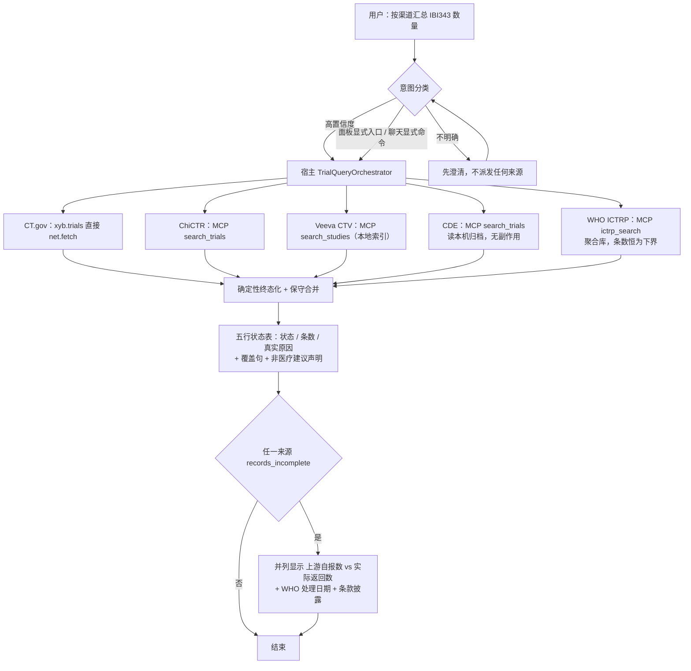

# 统一试验查询：宿主编排实现 SPEC

- [英文源规格](/spec/xyb-unified-trial-host-orchestration)

- 状态：草案，待技术/用户批准；**尚未授权实现**
- 日期：2026-10-04
- 架构依据：ADR 0311（方向已接受）
- 目标分支/工作树：`fix/xyb-records-audit-main`，路径 `/Users/qinxiaoqiang/Downloads/xiaoyibao-pi-desktop-fix-records-audit`

> **⚠️ 本页是摘要 + 提纲，不是完整规格。** 英文版（`/spec/xyb-unified-trial-host-orchestration`）是唯一权威版本。本页已补齐 §4.2–§4.4、§5.2–§5.3、§9–§14、§15.1–§15.12 的要点，但**仍不含**完整正文：§6.2 描述符完整类型、§6.3 临床细化原则、§6.5 框架缺口、§7 种子分发完整规则、§8 评测语料细节、§10 各组验收条目全文、§13 门禁论证、§14 矩阵逐行、§15.3.5 探测细节与 §15.8 字段陷阱清单。
>
> 涉及实现取值（并发数、期限、原因码、验收条目编号）时，**一律以英文版为准**。中文与英文冲突即为英文版的缺陷，须先修正英文版。

## 1. 目标与非目标

建立一个**由宿主自有**的临床试验查询操作，供聊天与面板显式入口共用。一旦触发，它会按照「权限中介」的宿主路径逐个尝试每个合格来源，为每个合格来源返回结构化结果，隔离局部失败，并让宿主界面准确说明本次到底跑了什么。

自然语言路由本身必然不完备：高置信度可直接路由；意图不明确时必须先澄清；显式查询入口绕开分类。本功能**不承诺**能识别任意说法。

本文是草案。**在用户明确批准本 SPEC 之前，不开始任何宿主实现。** 接受 ADR 只代表同意架构方向，不代表授权改代码。

非目标：重写采集器、对检索列表页做浏览器抓取、绕过验证码或登录、自动执行环境安装/Cookie 获取、给出临床建议、未经授权安装依赖、未经单独授权提交/推送/合并。

## 2. 证据与架构约束

来源为：ClinicalTrials.gov（`xyb.trials`，直接 `net.fetch`）、ChiCTR、Veeva CTV、中国药物临床试验登记平台、WHO ICTRP（后四者是 `xyb.trial-sources` 自有的 MCP 服务器）。

> **修订记录（2026-10-04）：** WHO ICTRP 于 2026-10-04 由用户确定作为第 5 个来源接入，集成方式见 §15。本 SPEC 其余章节中原写为「四来源」的表述，除历史实测证据（§2.1）外，均应理解为「五来源」。

### 2.1 dev app 实测证据（2026-10-03/04，会话 `960381b1`）

同一句请求“查询下ibi343临床试验信息数量，按照渠道-数量输出结果”的两次运行：

- 运行 A（23:16:36–23:17:09）：`Skill` 加载 → 5× `ToolSearch` → CT.gov 成功 880ms → ChiCTR 455ms 失败（`NETWORK_ERROR`：`browserContext.newPage: Target page, context or browser has been closed`）→ Veeva 成功（MCP 254ms / 工具 7318ms）→ `chinadrugtrials_get_collector_status` 成功 → 回合随即结束，状态表写“中国药物临床试验登记平台 NOT_ENABLED — 本工具未在当前上下文就绪；本次未查到”。**`xyb_trials_unify` 从未被调用。**
- 运行 B（23:18:52–23:19:48）：用户追问“这个不是本地有json文件吗”，随后手打 `search_trials`；助手才调用 `get_collector_status`（`ok=true`，305ms）再调用 `search_trials`（`ok=true`，MCP 8606ms / 工具 12060ms），得到 5 条 CTR 记录——这才是正确结果。

由此暴露三个缺陷，各自对应本 SPEC 的改动：

1. **是收尾缺陷，不是取数缺陷。** 所有真正跑过的渠道都返回 `ok=true`；composite 在一个来源 `NOT_ENABLED` 的状态下静默停止，且没有做聚合。用户之所以拿到正确答案，唯一原因是他自己补上了缺失的工具名。§4.1/§5 必须把“所有合格来源都被尝试 + 确定性终态化”变成**宿主操作自身的属性**，而不是指望助手自觉遵守。
2. **`NOT_ENABLED` 与事实不符。** CDE 当时是启用的、可达的，采集器也可用；真实原因是“工具不在当前上下文”（工具发现/目录问题）。因此本 SPEC 要求该类情况必须报 `NOT_QUERIED / TOOL_UNAVAILABLE` 或 `NEEDS_SETUP`，**禁止把“未启用”当作默认标签**。
3. **CDE 并不需要原先担心的交互式准备。** 在用户 environment 已就绪的前提下，`search_trials` 单次调用即成功（8606ms）。每次检索确实会产生本地归档副作用，但实际操作摩擦远低于“重新登录”。原设计据此把 CDE 排除在静默扇出之外、要求每次同意；**该设计已被用户否定**（见 §4.3 修订记录）：写盘不是破坏性操作，且每次同意会重新制造“用户被迫手打工具名”的失败模式。现行为 **CDE 随包带冷启动数据、读本机归档无副作用、与其他三源同等纳入扇出**（§7）。

其他实测证据：

- ChiCTR 在本机间歇性不稳。2026-10-03/04 期间 `chictr/search_trials` 在成功（6.9–11.3s）与失败（24/48/408/437ms，`browserContext.newPage … has been closed`）之间交替。Playwright 缓存目录（`chromium-1243`、`chromium_headless_shell-1243`）当时存在，并于 10-04 06:15 重新下载。宿主记录的 `errorCode` 是 `TOOL_FAILED`，内层 `code` 为 `NETWORK_ERROR`。跨相邻运行的直接重试确实成功（22:36:06 失败 → 22:44:54 运行 → 22:45:13 成功）。这是 §4.4 有界重试策略的具体依据。
- 宿主日志里 CT.gov 结果数为 5，用户看到的表格也是 5，但 `xyb.trials_search` 的 `pageSize`/上限由调用方给出，且 details 里有 `dropped` 字段；在未报告截断的情况下，条数只能算**下界**。§5.3 要求显式 `truncated` 标志。
- Veeva 的 MCP 调用仅 254ms，但工具调用耗时 7318ms；其 2 条命中（`NCT07066098`、`NCT07483554`）与 CT.gov 结果完全重复。Veeva 是本地索引，增加延迟，且本次没有带来新的登记号；§4.3 保留它，但要求按 §5.2 标注本地索引来源与新鲜度。
- ChiCTR 的 `search_trials` 实际以 `{keyword, max_results}` 调用，而 CT.gov 与 Veeva 用 `{condition, terms}`。**跨来源的参数映射不能交给模型**，应由宿主来源注册表负责（§4.1、§5.1）。

### 2.2 宿主与权限约束

- 插件 SDK **没有**跨插件调用 MCP 的能力。面板自定义 bridge 调用只会转发给来源插件自己的 `onPanelInvoke`。
- `apps/desktop/resources/plugins/xyb.trials` 没有跨插件 MCP 调用的能力，其 Electron 主进程注册插件 MCP 路径与此类似。
- 直接调用已注册的 execute 闭包会绕过常规 `tools.execute` 权限判定，因此本 SPEC 要求走中介子派发契约。
- 插件 MCP 的风险语义在 `crates/host-core` 中定义，`risk: "medium"` 代表 Ask 审批模式下需要用户明确同意。

## 3. 总体流程

### 3.1 端到端主流程

## 4. 架构

### 4.1 共用的宿主操作

新建聚焦的宿主自有 `TrialQueryOrchestrator`，以及一个**封闭**的来源标识注册表。编排器不在 5000+ 行的 `plugin-runtime.ts` 内。

### 4.2 子调用分发

每个子调用经 **host-core `tools.execute`** 派发，携带唯一子工具调用 ID 与原始会话/回合；**不得**走 execute 闭包或裸 MCP 客户端捷径。composite 自身的批准**不等于**子调用的用户同意。来源参数映射由框架按 `argShape` 负责，不交给模型猜。

### 4.3 来源纳入条件

- **ChiCTR**：`xyb.trial-sources` 已启用、`mcp.server.local` 与进程启动检查通过、对应 MCP 工具确已注册。
- **Veeva CTV**：同样检查；须标注本地索引来源与新鲜度，区分 `INDEX_EMPTY` / `NEEDS_SETUP`。它是本地索引，不是实时远端查询。
- **中国药物临床试验登记平台（CDE）**：**与前三个来源同等纳入扇出**（用户已否决原同意闸门设计，理由见 ADR 0311 §4 的取代说明）。扇出读本机归档，**无副作用**；归档为空报 `NEEDS_SETUP`。只有联网取数（`search_trials` / `sync_incremental`）涉及写盘，不在扇出内。`setup_environment` / `update_cookie` / `refresh_cookie` **永不隐式调用**。
- **WHO ICTRP**：插件启用 + 四级探测通过 + `ictrp_search` 确已注册时纳入；详见 §15。

### 4.4 并发、期限与重试

并发上限 **4**（原为 3）；单来源期限 CT.gov 20s / ChiCTR 45s / Veeva 15s / CDE 30s / ICTRP 60s；整体期限 **75s**（原为 50s），必须大于单个最长来源期限。ICTRP 不重试；ChiCTR 允许一次有界重试（启动类失败且 <2s）。迟到的结果只进审计，不改写已返回结果。

## 5. 契约

### 5.1 输入

聊天工具 schema 只接受 `terms` 与 `condition`。

### 5.2 各来源结论（v1 为五来源）

结果包含 `clinicaltrials_gov`、`chictr`、`veeva_ctv`、`chinadrugtrials`、`who_ictrp`。每个结论包含状态、原因码、面向用户的安全说明、`attempted`、耗时、条数、已校验记录，以及来源/新鲜度信息。

状态集合：`SUCCESS` / `NO_RESULTS` / `NOT_ENABLED` / `NEEDS_SETUP` / `NOT_QUERIED` / `TIMEOUT` / `CHALLENGE_REQUIRED` / `FAILED`。终态化时每个来源恰好一个终态，且只有 `SUCCESS` 与 `NO_RESULTS` 算作「查过」。

> **`NOT_ENABLED` 的唯一用法（英文 §5.2 为权威）：** 仅当该来源被来源/插件设置**明确**关闭时才用。**MCP 工具未注册 ≠ `NOT_ENABLED`**，应按证据报 `NOT_QUERIED` + `TOOL_UNAVAILABLE`，或 `NEEDS_SETUP`。这是 2026-10-03 实测踩过的坑（已启用且可用的 CDE 被误标 `NOT_ENABLED`，导致用户没拿到本可拿到的结果）。

### 5.3 聚合结果

`TrialQueryResult` 包含 schema 版本、宿主 ID、规范化查询、五个结论、覆盖计数、带来源标记的规范化记录、保守合并候选、开始/耗时/取消字段，以及非医疗建议声明。`complete=true` 仅当五个结论都是 `SUCCESS` 或 `NO_RESULTS`。去重**只**按规范化登记号；标题相似不足以合并。

## 6. 来源扩展框架

由于已有插件的声明式能力已经足够，本 SPEC 采用来源描述符 + 封闭注册表来收敛。

## 7. 随包分发、冷启动数据与更新（Veeva / CDE）

### 7.1 需求

Veeva 与 CDE 均带随包只读种子，安装后首次运行会补齐复制到用户目录。

### 7.2 责任边界

Veeva 种子为 SQLite 库 `<插件>/data/ctv.db`，CDE 种子为结构化 JSON 目录 `<插件>/data/chinadrugtrials/`。

### 7.3 种子生命周期

查询只读本机，自动/手动更新写入用户副本。

### 7.4 种子内容红线

不得包含凭据与站点原始响应留档。

### 7.5 更新路径

包含 24h 一次的增量自动 bootstrap，以及设置页的手动更新。

### 7.6 界面新鲜度与可见性

标注本地索引/归档构建日期。

## 8. 意图路由与评估

不确定样例请求澄清且不派发，避免误触发。评测为带版本的语料（≥40 正例、≥40 反例），要求召回 ≥95%、误触发 ≤5%；不达标则退回澄清 + 显式入口，不得上调阈值掩盖。

## 9–14（提纲，详见英文 §9–§14）

- **§9 改动面与冻结清单**：编排器**不得**塞进 5000+ 行的 `plugin-runtime.ts`。以下四个工作区未提交文件**冻结、不得并入、不得 reset/discard**，直到单独评审确认范围：`apps/desktop/resources/plugins/xyb.trials/lib/unified.js`、`.../xyb.trials/main.js`、`.../xyb.trials/views/trials.html`、`apps/desktop/test/xyb-trials-unified.test.mjs`。
- **§10 验收标准**：分组、组内从 1 重新编号——路由 1–4；权限与执行 1–10；契约、UI 与验证 1–7；随包分发与冷启动数据 1–9（历史别名 22–28 / 24a / 24b）；来源扩展框架 1–3（历史别名 29–31）。引用一律写「§10「组名」第 N 条」，扁平编号无效。**WHO ICTRP 组正文在 §15.9**（组内 1–10，历史别名 32–40 仅覆盖 1–9），§10 只登记其存在。
- **§11 第一刀**：先做一个只读/契约测试，证明 host-core 子分发确实能重入；**若证明不了就停下来修 SPEC**，不继续堆实现。
- **§12 回滚**：composite 可独立禁用；**永不删除** CDE 用户归档。
- **§13 待确认门禁 1–13**：含 ICTRP 三项——(10) 开箱即用边界三选一（`NEEDS_SETUP` + pip 指引 / 随包 Python 运行时 / 证明目标环境已装依赖），**在决定前不开始 vendoring**；(11) vendored 版本的同步权责；(12) 冷缓存 `limit=100` 的耗时是否落在 60s/75s 内；(13) WHO 条款与商业性质的法律/产品定性。
- **§14 追溯矩阵**：每一行缺陷 ↔ 规格章节 ↔ 验收条目，含 ICTRP 的 10 行（KRAS 缺 29.0%、聚合库重叠、Python 运行时不受控、7 工具仅 1 入扇出、WHO 条款、下界语义、缓存写失败非致命、并发取值失效、`MCP_CALL_TIMEOUT_MS=100s` > 60s、`NODE_LAUNCHERS` 缺 `python3`）。

## 15. 第 5 个来源：WHO ICTRP

### 15.1 需求与非目标

成为并列第 5 个通道，随包 vendoring Python 模块实现开箱即用。非目标：6 个本地工具不进扇出；不提供 ICTRP 冷启动种子（缓存是运行时产物）；不动 §9 冻结的四个 `xyb.trials` 文件。

### 15.2 来源性质

CSV 导出静默不完整，条数恒为下界，与 ChiCTR 有系统性重叠。

### 15.3 集成方式

通过 `xyb.trial-sources` 自带 `ictrp` stdio MCP 服务启动，依赖 `mcp`, `httpx`, `pydantic`。

### 15.4 探测与降级

四级探测，逐级给出**唯一**原因码（英文 §15.3.5 为权威）：

| 步骤 | 检查 | 终态 | 原因码 |
| --- | --- | --- | --- |
| 1 | `python3 --version` ≥ 3.10 | `NEEDS_SETUP` | `PYTHON_RUNTIME_MISSING` |
| 2 | `import ictrp_mcp.server`（随包模块） | `NEEDS_SETUP` | `VENDOR_FILES_MISSING` |
| 3 | `import mcp, httpx, pydantic` | `NEEDS_SETUP` | `PYTHON_DEPS_MISSING` |
| 4 | MCP 握手且 `tools/list` 含 `ictrp_search` | `NOT_QUERIED` | `SOURCE_LAUNCH_FAILED` |

`COLLECTOR_NOT_READY` **不用于** ICTRP 探测链（保留给 CDE 归档未就绪场景）。环境探测失败报 `NEEDS_SETUP` 并提供一行复制执行的 `pip install` 命令。

探测在**插件侧**执行，扇出编排与终态化在**宿主侧**；两者的结果传递通道由第一刀契约测试确定，在此之前不得开始实现。

### 15.5–15.12（提纲，详见英文 §15.5–§15.12）

- **§15.5 契约增补**：新增原因码 `UPSTREAM_RESULT_INCOMPLETE`（降级成功，非失败）、`CACHE_WRITE_FAILED`（仍返回结果）、`AGGREGATOR_OVERLAP`（审计信息）；`SourceResultV2` 新增 `upstreamReportedTotal` / `matchedRowsReturned` / `upstreamIncomplete` / `overlapWith`。合并规则：同一登记号 ChiCTR 直连优先于 ICTRP，CT.gov 优先于 ICTRP，ICTRP 独有记录不得丢弃。
- **§15.6 并发与期限**：并发 3 → **4**；ICTRP 单来源 **60s**；整体 50s → **75s**（= 60 + 15 余量），整体期限必须大于单个最长来源期限。ICTRP **不重试**。`defaultLimit` 固定 100。
- **§15.7 WHO 条款**：须标「WHO ICTRP」、显示 WHO 处理日期、声明每周同步而非实时、不得暗示排他性、不得使用 WHO 名称/徽标、**禁止营销或商业用途**、声明无隶属关系。
- **§15.8 字段陷阱**：`matched_rows_returned` 键名；`upstream_reported_total` 不得并入总数；`phase_code` 的 `NA`/`OTHER` ≠ 缺失；`recruitment_status` 大小写不一致需用 `recruitment_status_normalized`；`target_size_total` 形态多态；国家名为英文名而非 ISO 码；ChiCTR 的 `results*` 填充率约 0。
- **§15.9 验收标准**：组内 1–10（历史别名 32–40 仅覆盖 1–9）。**注意本组正文在 §15.9，不在 §10**；引用写作「§15.9「WHO ICTRP」第 N 条」。
- **§15.10 改动范围 / §15.11 回滚**：新增 `mcp/ictrp/`、`skills/who-ictrp.md`、测试与校验脚本；改 manifest、插件 `main.js` 探测、宿主描述符与状态机、UI、接入指南。删描述符 `who_ictrp` 条目即回滚，其余四来源行为不变；用户缓存目录回滚不删。
- **§15.12 待确认**：Python 依赖是开箱即用最大风险；vendored 版本同步权责；`ICTRP_TIMEOUT` 冷缓存下是否足够；**未决**：用户自行配置 ICTRP MCP 时会绕过编排器，重复计数无去重，下界会变成上界。
